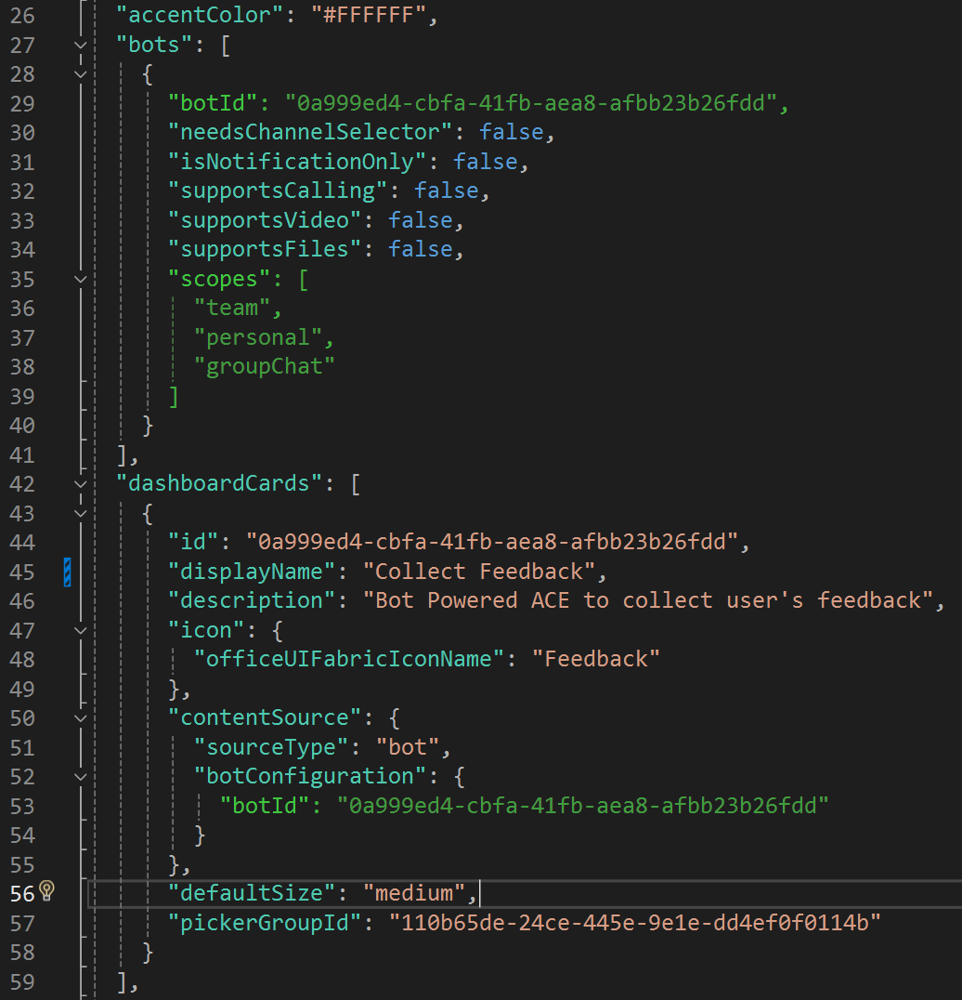

# Publishing Bot Powered Adaptive Card Extensions to the market place

Bot Powered Adaptive Card Extensions (ACEs) for Microsoft Viva Connections can be used to build custom experiences for the Microsoft Viva Connections Dashboard using the Bot development model. Bot Powered ACEs are an addition to the already existing Viva Connections extensibility model, which is based on SharePoint Framework (SPFx) components.

Objective of the Bot Powered ACEs is to enable existing Microsoft Teams developers, with existing bot implementations, extend their bot implementations to be available in the Viva Connections. Bot Powered ACEs are packaged using the Microsoft Teams solution model, enabling the same bot to be used in both Microsoft Teams and in Microsoft Viva Connections.

Because Bot Powered ACEs are packaged using the Microsoft Teams solution model they have to be submitted as Microsoft Teams solutions to the market place following the [market place guidance for Teams solutions](https://learn.microsoft.com/microsoftteams/platform/concepts/deploy-and-publish/appsource/publish). There are however some differences related to how Bot Powered ACEs deployed using the Teams solution model will show up in Viva Connections and how they can be governed. Also, currently, not all possible Bot Powered ACE Teams solutions are accepted by the market place.

## Market place acceptance criteria for Bot Powered Adaptive Card Extensions

Bot Powered ACEs enable existing Microsoft Teams developers, with existing bot implementations, extend their bot implementations to be available in the Viva Connections and this approach is what we support for the market place today. You can also develop stand-alone Bot Powered ACEs which have no other functional Teams component, these however will be allowed for market place submission in a later phase. So, currently, market place will only accept a Teams applications which already contains a bot implementation that's being used by the Teams application. So if your Teams application was already on the market place and you've extended your application to also offer Bot Powered ACEs then you're simply submitting an update to your existing application. Both updated and new Teams applications need to follow the [market place guidance for Teams solutions](https://learn.microsoft.com/microsoftteams/platform/concepts/deploy-and-publish/appsource/publish).

> [!Note]
>
> - Bot Powered ACEs require the [Teams app manifest version](https://learn.microsoft.com/microsoftteams/platform/resources/schema/manifest-schema) 1.17 or higher.
> - We're working on support for bringing "stand-alone" Bot Powered ACEs to the market place and will update this guidance whenever that change happens.

Market place acceptance criteria overview:

- Follow the [market place guidance for Teams solutions](https://learn.microsoft.com/microsoftteams/platform/concepts/deploy-and-publish/appsource/publish)
- Use [Teams manifest version](https://learn.microsoft.com/microsoftteams/platform/resources/schema/manifest-schema) 1.17 or higher
- Have a valid Teams bot implementation (see lines 27-39) that's used as Bot Powered ACE (see line 53)

## Making your Bot Powered ACEs available in Viva Connections

Bot Powered ACEs that are added as part of a Teams application in market place will become automatically available as cards for adding to the Viva Connections dashboard, there's **no explicit install required** of the Teams application containing the Bot Powered ACEs. So, by default, once your Teams application containing Bot Powered ACEs is published in the market place all Viva Connection dashboard admins for all tenants will see your ACEs appearing in the card picker when they configure their Viva Connection dashboards. The Teams admin can however control ACE visibility via policies controlling app availability in Teams, this will be explained in next chapter.

## Bot Powered ACEs governance

Bot Powered ACEs will become automatically available as mentioned earlier, but the Teams admin does have an option to control visibility. ACEs will only show up if their Teams application has not been blocked by the Teams admin, so [allowing or blocking applications](https://learn.microsoft.com/microsoftteams/manage-apps#allow-or-block-apps) is the approach that Teams admins can use to govern ACE visibility. When a Teams application gets blocked for all users or for the user loading the Viva Connections dashboard, and ACEs were not yet used then they'll not show up in the card picker anymore and cannot be added to the dashboard. If the ACEs were already added to a Viva Connections dashboard then at runtime the respective cards simply will not show up, at design time an "error card" will be showing indicating that the card might have been removed/blocked by the Teams administrator.

> [!Note]
> Blocking and unblocking a Teams app will not immediately see effect on the Viva Connections dashboards using the cards, it can take several hours before the impact is visible.

