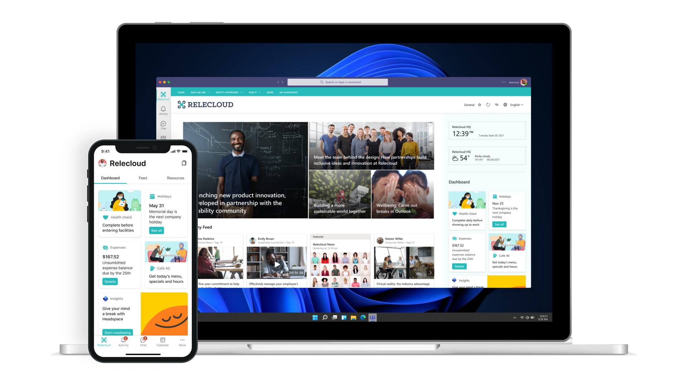

# Design guidance for Viva Connections cards

Developers can extend [Microsoft Viva Connections](https://www.microsoft.com/microsoft-viva) for building engaging experiences with the widely adopted SharePoint Framework (SPFx). Viva Connections is your gateway to a modern employee experience where you can build and integrate apps that shape culture and foster connections to help employees thrive. With SPFx, you have multiple ways to extend – using the same out-of-the-box or custom SPFx web parts, SPFx extensions (for example header, footer), and specific components for optimized mobile experiences.

> [!IMPORTANT]
> For the Viva Connections Desktop design guidance, please see [Designing great SharePoint experiences](/sharepoint/dev/design/design-guidance-overview).

## Overview

### Intro

Use this toolkit to help you design custom cards for your dashboard. You'll learn the structure of cards, how users can interact with them, and the design principles to help you make them attractive and engaging for mobile and desktop use.

To learn more about how to create custom cards, see [Getting Started - Adaptive Cards](/adaptive-cards/authoring-cards/getting-started).

### What is a Dashboard?

The Viva Connections Dashboard is the digital toolset for your employees. You can create a curated experience using dashboard cards to give your employees access to their most critical content and tools.

The cards, called Adaptive Card Extensions (ACEs) are designed to enable quick task completion by interacting with a card directly (the Card View) or by opening a Quick View from the Card View.

## Types of cards

ACEs are implemented using two types of cards: the Card View and an optional Quick View card(s).

### Card View

The Card View is the primary view for an ACE. The Card View is defined using Adaptive Cards and is rendered on the Viva Connections experience.

### Quick View

The Quick View card is displayed when a user performs an action, such as selecting a button on the Card View. The Quick View enables users to take action or view additional information about the content shown in a Card View.

Quick View cards can be implemented using Adaptive Cards or using HTML.

## Resources

- [Sample Adaptive Cards for Viva Connections](https://aka.ms/adaptivecards/samples)
- [Fluent UI](https://developer.microsoft.com/fluentui#/)
- [Fluent Theme designer](https://fluentuipr.z22.web.core.windows.net/heads/master/theming-designer/index.html)
- [AC Designer](https://adaptivecards.io/designer/)
