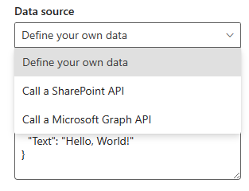
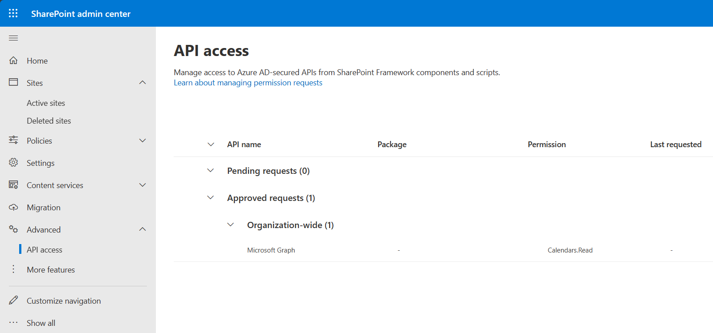
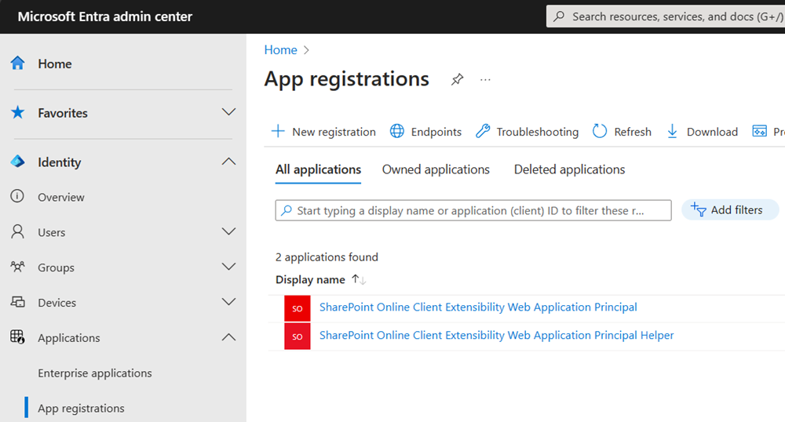
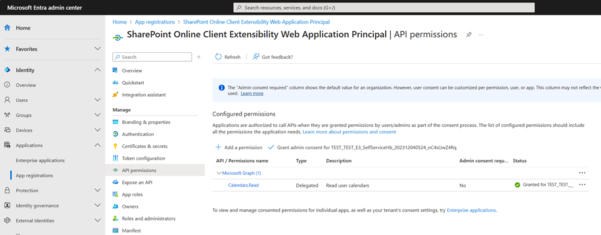
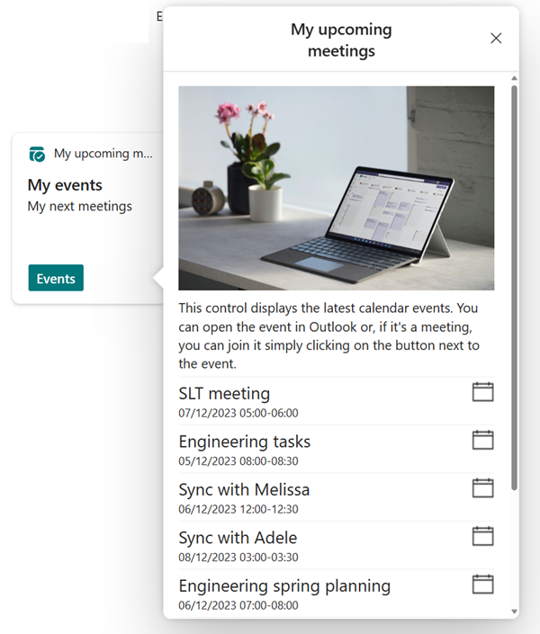

# Overview of Viva Connections Card Designer advance API features

Advance API features for the Viva Connections Card Designer enable the dashboard editors to create API powered Quick View experiences without actual code. This new option is supported with all the different form factors or Viva Connections dashboard - mobile, tablet and desktop.

> [!IMPORTANT]
> First version of this feature is rolling out worldwide by end of the 2023 calendar year. User interface for Card designer will be further evolved within early 2024 for a better end user experience with the advance API features.

## Enabling feature in the tenant

By default this feature isn't currently available in the tenants and it has to be enabled by using SharePoint Online Management Shell with following command.

```powershell
Set-SPOTenant -IsDataAccessInCardDesignerEnabled $true
```

> [!IMPORTANT]
> You'll need to use [SharePoint Online PowerShell](https://www.powershellgallery.com/packages/Microsoft.Online.SharePoint.PowerShell/16.0.24322.12000) version 16.0.24308.12000 or newer to have this option available in the `Set-SPOTenant` cmdlet.

If this setting isn't enabled in the tenant, you see following message in the Card Designer property pane: `Advance features have not been enabled by an administrator`.

When the feature is enabled, you see new options visible as a Data source in the **Data source** selection as shown in following image.



## Managing available API permissions

To be able to use the API features, you'll need to grant the available API permissions in the Entra app management. Card designer feature uses the same app registration as the [SharePoint Framework (SPFx) solutions](https://aka.ms/spfx), so any API that is approved for the SharePoint Framework solutions, will be also available to be used in the Card Designer.

If you try to use the API features in the Card Designer, you'll see following exception in the property pane: `Cannot make any requests to Microsoft Graph as the SharePoint Online Client Extensibility Web Application Principal is not configured or consented to.`

Needed permissions can be also granted directly to the SharePoint Framework extensibility app registration in the Entry Applications with following steps.

1. Move to the API management page in the SharePoint administration - first time you access this page, the needed app registrations are automatically created to the tenant.

    

1. Move the Microsoft Entra admin center to confirm that the needed app registrations are available.

    

1. Move to the **SharePoint Online Client Extensibility Web Application Principal** registration and include the needed permissions, which you'd like to be available for the dashboard editors when they use Card Designer feature.

    

Notice that after you granted the permissions in the Microsoft Entra admin center, the matching permissions are also visible in the API management page in the SharePoint admin center.

## Using dynamic API data in the Card Designer

When the needed API permissions are available, dashboard designer can use the API features to get dynamic content based on the user identity. As an example, you could use the following Microsoft Graph endpoint to get the following events for the particular user.

```text
https://graph.microsoft.com/v1.0/me/events?$take=5&$select=id,webLink,subject,start,end,location
```

Combining that API call with a custom adaptive card presentation, you could, for example,  present the user's upcoming meetings with following Quick View rendering.



> [!TIP]
> You can use the [Microsoft Graph Explorer](https://developer.microsoft.com/graph/graph-explorer) to see the different available APIs from Microsoft Graph and their output in JSON. Using that output with [Adaptive Card Designer](https://adaptivecards.io/designer/), you can easily create powerful experiences with the Card Designer advance API features.

## References

- [YouTube - Introduction to new advance API features in Viva Connections Card Designer](https://www.youtube.com/watch?v=NjZj1F6D6jw)
- [Viva Connections Card designer](/viva/connections/create-dashboard#design-your-own-card-with-a-quick-view)
- [Microsoft Graph Explorer](https://developer.microsoft.com/graph/graph-explorer)
- [Adaptive Card Designer](https://www.adaptivecards.io/designer/)
- [SharePoint Online Management Shell](/powershell/sharepoint/sharepoint-online/connect-sharepoint-online)
