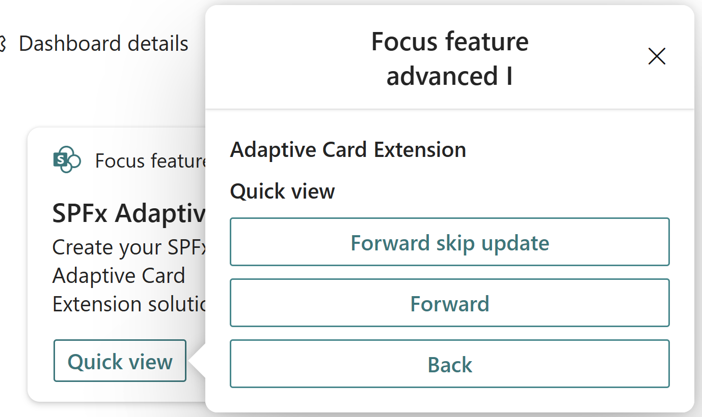
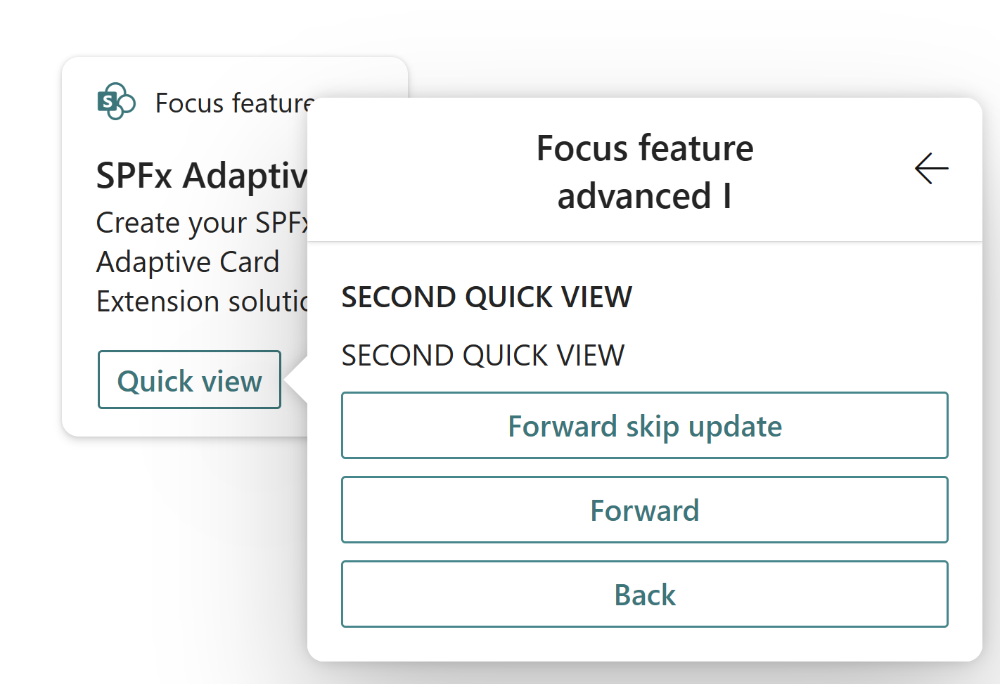
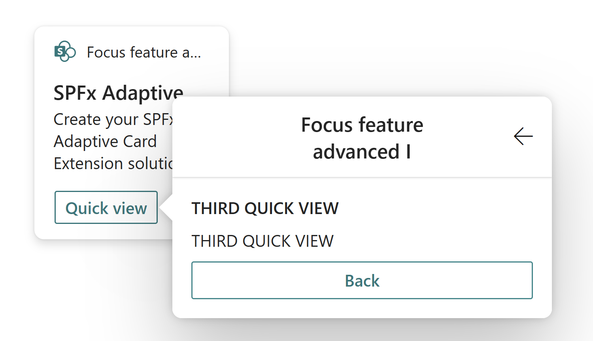

# Create an Adaptive Card Extension with focus feature

## Scaffold an Adaptive Card Extension project

Create a new project directory for your project and change your current folder to that directory.

Create a new project by running the Yeoman SharePoint Generator from within the new directory you created:

```console
yo @microsoft/sharepoint
```

When prompted, enter the following values (select the default option for all prompts omitted below):

- **What is your solution name?** HelloWorld
- **Which type of client-side component to create?** Adaptive Card Extension
- **Which template do you want to use?** Primary Text Template
- **What is your Adaptive Card Extension name?** HelloWorld

At this point, Yeoman installs the required dependencies and scaffolds the solution files. This process might take few minutes.

Before moving forward, update the title and description fields of your ACE to give it a personal touch.

```json
{
  "$schema": "https://developer.microsoft.com/json-schemas/spfx/adaptive-card-extension-manifest.schema.json",
  "id": "53b7c8c0-00cc-4d20-a0a7-529aa6dff29f",
  "alias": "HelloWorldAdaptiveCardExtension",
  "componentType": "AdaptiveCardExtension",

  // The "*" signifies that the version should be taken from the package.json
  "version": "*",
  "manifestVersion": 2,

  // If true, the component can only be installed on sites where Custom Script is allowed.
  // Components that allow authors to embed arbitrary script code should set this to true.
  // https://support.office.com/en-us/article/Turn-scripting-capabilities-on-or-off-1f2c515f-5d7e-448a-9fd7-835da935584f
  "requiresCustomScript": false,
  "supportedHosts": ["Dashboard"],
  "preconfiguredEntries": [{
    "groupId": "bd067b1e-3ad5-4d5d-a5fe-505f07d7f59c", // Dashboard
    "group": { "default": "Dashboard" },
    "title": { "default": "Focus feature advanced I" },
    "description": { "default": "Focus feature advanced I" },
    "officeFabricIconFontName": "SharePointLogo",
    "properties": {
      "title": "Focus feature advanced I"
    },
    "cardSize": "Medium"
  }]
}
```

## Update your project's hosted workbench URL

When you use the gulp task **serve**, by default it will launch a browser with the specified hosted workbench URL specified in your project. The default URL for the hosted workbench in a new project points to an invalid URL.

- Locate and open the file **./config/serve.json** in your project.
- Locate the property `initialPage`:

    ```json
    {
      "$schema": "https://developer.microsoft.com/json-schemas/core-build/serve.schema.json",
      "port": 4321,
      "https": true,
      "initialPage": "https://enter-your-SharePoint-site/_layouts/workbench.aspx"
    }
    ```

- Change the `enter-your-SharePoint-site` domain to the URL of your SharePoint tenant and site you want to use for testing. For example: `https://contoso.sharepoint.com/sites/devsite/_layouts/workbench.aspx`.

At this point, if you do `gulp serve`, then you'll see the `FocusFeature` card:


## Add focus feature to your Adaptive Card Extension Quick View

At this point, we have out of the box Adaptive Card Extension code. Now it's time to flare things up with focusing on elements in the Quick view.

In the Quick View, we will introduce buttons for two actions:

- Move to the next quick view
- Move to the previous quick view

We will first define the template of the Quick View. For this, locate and open the following file in your project: **./src/adaptiveCardExtensions/focusFeature/quickView/template/QuickViewTemplate.json**

Replace the content of this file with the following:

```json
{
  "schema": "http://adaptivecards.io/schemas/adaptive-card.json",
  "type": "AdaptiveCard",
  "version": "1.2",
  "body": [
    {
      "type": "TextBlock",
      "weight": "Bolder",
      "text": "${title}",
      "id": "quick-view-title"
    },
    {
      "type": "ColumnSet",
      "columns": [
        {
          "type": "Column",
          "items": [
            {
              "type": "TextBlock",
              "weight": "Bolder",
              "text": "${subTitle}",
              "id": "quick-view-sub-title",
              "wrap": true
            }
          ]
        }
      ]
    },
    {
      "type": "ActionSet",
      "actions": [
        {
          "type": "Action.Submit",
          "title": "Forward skip update",
          "data": {
            "id": "forward-skip"
          }
        },
        {
          "type": "Action.Submit",
          "title": "Forward",
          "data": {
            "id": "forward"
          }
        },
        {
          "type": "Action.Submit",
          "title": "Back",
          "data": {
            "id": "back"
          }
        }
      ]
    }
  ]
}
```

Next let's implement the logic that will allow us to navigate to the next quick view. We will leverage the QuickViewNavigator to manipulate the view stack.

```typescript
public onAction(action: IActionArguments): void {
  if (action.type === 'Submit') {
      const { id } = action.data;
      if (id === 'back') {
          this.quickViewNavigator.pop();
      } else if (id === 'forward-skip') {
          this.quickViewNavigator.push(QUICK_VIEW_REGISTRY_ID_2, true);
      } else {
          this.quickViewNavigator.push(QUICK_VIEW_REGISTRY_ID_2, false);
      }
  }
}
```

Create a new template file for the second quick view: **./src/adaptiveCardExtensions/focusFeature/quickView/template/QuickViewTemplate2.json**

```json
{
   "schema":"http://adaptivecards.io/schemas/adaptive-card.json",
   "type":"AdaptiveCard",
   "version":"1.2",
   "body":[
      {
         "type":"TextBlock",
         "weight":"Bolder",
         "text":"${title}",
         "id": "quick-view-title"
      },
      {
         "type":"TextBlock",
         "text":"${subTitle}",
         "id": "quick-view-sub-title",
         "wrap":true
      },
      {
         "type":"ActionSet",
         "actions":[
            {
               "type":"Action.Submit",
               "title":"Forward skip update",
               "data":{
                  "id":"forward-skip"
               }
            },
            {
               "type":"Action.Submit",
               "title":"Forward",
               "data":{
                  "id":"forward"
               }
            },
            {
               "type":"Action.Submit",
               "title":"Back",
               "data":{
                  "id":"back"
               }
            }
         ]
      }
   ]
}
```

Create a new file for the second quick view: **./src/adaptiveCardExtensions/focusFeature/quickView/QuickView2.ts**
We will add the following **onAction** function.

```typescript
public onAction(action: IActionArguments): void {
  if (action.type === 'Submit') {
      const { id } = action.data;
      if (id === 'back') {
          this.quickViewNavigator.pop();
      } else if (id === 'forward-skip') {
          this.quickViewNavigator.push(QUICK_VIEW_REGISTRY_ID_3, true);
      } else {
          this.quickViewNavigator.push(QUICK_VIEW_REGISTRY_ID_3, false);
      }
  }
}
```

Create a new template file for the third quick view: **./src/adaptiveCardExtensions/focusFeature/quickView/template/QuickViewTemplate3.json**

```json
{
  "schema":"http://adaptivecards.io/schemas/adaptive-card.json",
  "type":"AdaptiveCard",
  "version":"1.2",
  "body":[
     {
        "type":"TextBlock",
        "weight":"Bolder",
        "text":"${title}",
        "id":"quick-view-title"
     },
     {
        "type":"TextBlock",
        "text":"${subTitle}",
        "id":"quick-view-sub-title",
        "wrap":true
     },
     {
        "type":"ActionSet",
        "actions":[
           {
              "type":"Action.Submit",
              "title":"Back",
              "data":{
                 "id":"back"
              }
           }
        ]
     }
  ]
}
```

Create a new file for the third quick view: **./src/adaptiveCardExtensions/focusFeature/quickView/QuickView3.ts**
We will add the following **onAction** function.

```typescript
public onAction(action: IActionArguments): void {
  if (action.type === 'Submit') {
      const { id } = action.data;
      if (id === 'back') {
          this.quickViewNavigator.pop();
      }
  }
}
```

After adding these changes, your Quick Views will look like:





### Implement the focusParameters function

So far we have modified our quick views to have a simple title, subtitle, and respective buttons to navigate to other quick views. Now we can finally implement the `focusParameters` function, which gives the ability to the Third Party Developer to decide what they wish to set focus on in the quick view.

For this, open each respective QuickView file (**./src/adaptiveCardExtensions/focusFeature/quickView/QuickView.ts**) and import the `IFocusParameters` interface, as follows:

```typescript
import { IFocusParameters } from '@microsoft/sp-adaptive-card-extension-base';
```

Finally, introduce the following `focusParameters` function in the QuickView class so that we set focus on an element. Each QuickView should look as follows:

```typescript
public get focusParameters(): IFocusParameters {
  return {
    focusTarget: 'quick-view-sub-title',
    ariaLive: 'polite'
  }
}
```

At this point, you can run **gulp serve** again and see how all the changes you made so far came together.

This is it! Congratulations on successfully creating you Adaptive Card Extension with the focus feature.


## Notes with screen readers

When loading your card for the first time, you will notice that the contents of the first quick view are read in their entirety. This is the default behaviour when a screen reader sees a dialog as it treats it as navigation. Subsequent loads of the quick view stack will not run into this. As you navigate back and forth threw quick views, you will notice that the element target is focused and will be the only thing to be read.

## See Also

- [Microsoft Learning: Create Adaptive Card Extensions (ACE) for Microsoft Viva Connections](/training/modules/sharepoint-spfx-adaptive-card-extension-card-types)