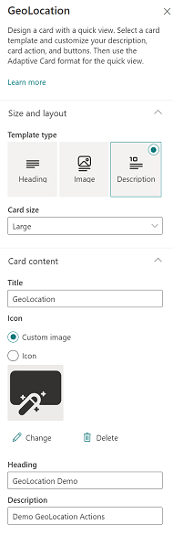
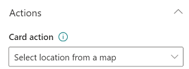
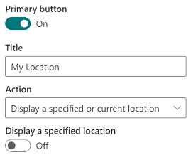
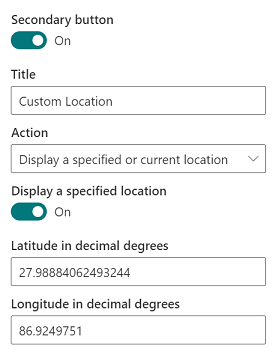
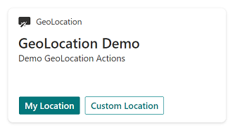

# Explore Geolocation capability via property pane of card-desinger card in Adaptive Card Extension

In this tutorial we will see how we can use the card-designer card's property pane to explore geolocation actions.
We will:
* Update the card strings
* Introduce geolocation actions on the Card View, Primary button and Secondary button

First, figure out the domain to the URL of your SharePoint tenant and site you want to use for testing and access the `workbench.aspx` page. For example: `https://contoso.sharepoint.com/sites/devsite/_layouts/workbench.aspx`.

Here, click on the '+' icon in the middle of the page, and add the `card-designer` card on the canvas.  
Next, click the pencil icon adjacent to this card to open the property pane. 
### Update the card strings
Here, first set the `card size` to `Large`.
To provide descriptive labels, change `Title` to `GeoLocation`, `Heading` to `GeoLocation Demo` and `description` to `Demo GeoLocation Actions`. 

### Adding action on Card View
Under `Actions`, click the drop-down menu of `card action` and select `Select location from a map` option.

### Adding action on Primary button
Next, for the `Primary Button`, set the `Title` to `My Location` and from its action drop-down menu, select `Display a specified or current location`.

### Adding action on Secondary button
Finally, for the `Secondary Button`, set the `Title` to `Custom Location` and from its action drop-down menu, select `Display a specified or current location`.  
Next, turn on the `Display a specified location` toggle button.  
This will bring up two text boxes for location coordinates.  
Here you may provide any location coordinates of your choice. 
For our example, we are putting in `27.98884062493244` as the value for the text-box labeled `latitude` and `86.9249751` for the text-box labeled `longitude`. These are the coordinates of Mount Everest.

### Try the geolocation actions
Now close the property pane and click `Preview` from the top right hand corner of the page.  

You can now check out the three geolocation actions that you introduced via the property pane. 

 

> [!NOTE]
> This property-pane experience doesn't allow you to introduce onAction callback, and hence the action `Select location from a map` is actually a no-op.
