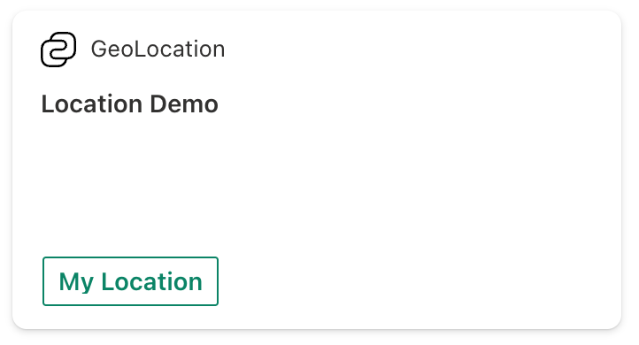
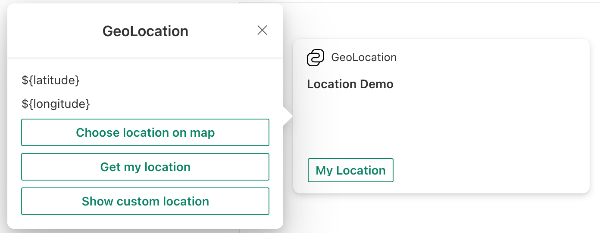

# Create an Adaptive Card Extension with geolocation action

> [!NOTE]
> This tutorial assumes that you have installed the SPFx v1.18
>
> For more information on installing the SPFx v1.18, see [SharePoint Framework v1.18 release notes](../../../../release-1.18.md).

## Scaffold an Adaptive Card Extension project

Create a new project directory for your project and change your current folder to that directory.

Create a new project by running the Yeoman SharePoint Generator from within the new directory you created:

```console
yo @microsoft/sharepoint
```

When prompted, enter the following values (select the default option for all prompts omitted below):

- **What is your solution name?** geolocation-tutorial
- **Which type of client-side component to create?** Adaptive Card Extension
- **Which template do you want to use?** Generic Card Template
- **What is your Adaptive Card Extension name?** GeoLocation

At this point, Yeoman installs the required dependencies and scaffolds the solution files. This process might take few minutes.

Next, run **gulp serve** from the command line in the root of the project. When the hosted workbench loads, you'll see the **GeoLocation** card:


## Add geolocation actions to your Adaptive Card Extension

At this point we have got the out of the box scaffolded code. Now, let us try adding geolocation actions to the Card View and Quick View experiences.

We will create a card which will have a Card View and a Quick View. On the Card View, we will provide a button, which will show the user their current location and clicking the Card View itself will open a Quick View.

In the Quick View, we will provide three buttons which will perform the following actions:

- Get user's current location
- Let user choose a location from the map
- Show a specific location on the map

### Update the labels that will show up on the card

Before we start adding the actions, let us first update the strings that you will see on the card.

For this, locate and open the following file in your project: **./src/adaptiveCardExtensions/geoLocation/loc/en-us.js**

Replace the content of this file with:

```javascript
define([], function() {
  return {
    "PropertyPaneDescription": "Tutorial on geolocation action in ACE.",
    "TitleFieldLabel": "Geolocation",
    "Title": "GeoLocation",
    "SubTitle": "GeoLocation Actions",
    "PrimaryText": "Location Demo",
    "Description": "Demonstrating GeoLocation Capabilities",
    "ShowCurrentLocation": "My Location"
  }
});
```

Next, locate and open the following file in your project: **./src/adaptiveCardExtensions/geoLocation/loc/mystring.d.ts**

Add the following:

```typescript
ShowCurrentLocation: string;
```

to the `IGeoLocationAdaptiveCardExtensionStrings` interface.

### Add actions on the Card View

As mentioned earlier, on the Card View, we will add a button, which will show user their current location and on clicking the Card View, we will show the Quick View experience.

We will first add the functionality for the button on the Card View. For this, locate and open the following file in your project: **./src/adaptiveCardExtensions/geoLocation/cardView/CardView.ts**

Here, replace the definition of `footer` in `cardViewParameters` getter with the following:

```typescript
public get cardViewParameters(): ComponentsCardViewParameters {
  return return PrimaryTextCardView({
    // ...
    footer: {
      componentName: 'cardButton',
      title: strings.ShowCurrentLocation,
      action: {
        type: 'VivaAction.ShowLocation'
      }
    }
  });
}
```

With this change, we have configured a button with label **My Location** and on click action is `VivaAction.ShowLocation`, which will show user their current location.

Next, replace the content of `onCardSelection()` function with the following:

```typescript
public get onCardSelection(): IQuickViewCardAction | IExternalLinkCardAction | undefined {
  return {
      type: 'QuickView',
      parameters: {
        view: QUICK_VIEW_REGISTRY_ID
      }
  };
}
```

This change implies that when a user clicks the Card View, then it should open a Quick View for them.

With the changes made so far, your Card View would look like:



### Add actions on the Quick View

In the Quick View, we will introduce buttons for 3 actions:

- Get user's current location
- Let user choose a location from the map
- Show a specific location on the map (for our example we will show Mount Everest)

In addition to these, we will have two text blocks for showing **Latitude** and **Longitude**, which will show the respective coordinates when the `VivaAction.GetLocation` action is executed (more on this later).

We will first define the template of the Quick View. For this, locate and open the following file in your project: **./src/adaptiveCardExtensions/geoLocation/quickView/template/QuickViewTemplate.json**

Replace the content of this file with the following:

```json
{
  "schema": "http://adaptivecards.io/schemas/adaptive-card.json",
  "type": "AdaptiveCard",
  "version": "1.5",
  "body": [
    {
      "type": "TextBlock",
      "text": "${latitude}"
    },
    {
      "type": "TextBlock",
      "text": "${longitude}"
    }
  ],
  "actions": [
    {
      "title": "Choose location on map",
      "type": "VivaAction.GetLocation",
      "parameters": {
        "chooseLocationOnMap": true
      }
    },
    {
      "title": "Get my location",
      "type": "VivaAction.GetLocation"
    },
    {
      "title": "Show custom location",
      "type": "VivaAction.ShowLocation",
      "parameters": {
        "locationCoordinates": {
          "latitude": 27.98884062493244,
          "longitude": 86.9249751
        }
      }
    }
  ]
}
```

With this, we are providing two text-blocks to show the **Latitude** and **Longitude** of the location we get via `VivaAction.GetLocation`. In addition to these, we described three geolocation actions.

After adding these actions, your Quick View would look like:



### Set up the state for our Adaptive Card Extension

So far we have created our Card View and Quick View. If you do a **gulp serve** at this point, then you will be able to perform the actions that were described above.

But now, let us take it a notch higher.

We now wish to show the coordinates of user's current location or user's chosen location on the Quick View when the respective actions are executed.

For this, we will leverage the two text-blocks that we had introduced earlier in the **QuickViewTemplate.json** file

In order to do this, we will first introduce new states. First locate and open the following file in your project: **./src/adaptiveCardExtensions/geoLocation/GeoLocationAdaptiveCardExtension.ts**

Here, add the following states to the `IGeoLocationAdaptiveCardExtensionState` interface:

```typescript
latitude: string;
longitude: string;
```

Next, in the `onInit()` function, change `this.state={}` to

```typescript
this.state = {
  latitude: 'TBD',
  longitude: 'TBD'
};
```

We will now make similar changes in Quick View as well.

Locate and open the following file in your project: **./src/adaptiveCardExtensions/geoLocation/quickView/QuickView.ts**

Add the following properties to the `IQuickViewData` interface:

```typescript
latitude: string;
longitude: string;
```

and then add the following two lines in the returned object of `data` getter:

```typescript
latitude: "Latitude: " + this.state.latitude,
longitude: "Longitude: " + this.state.longitude
```

### Implement the onAction function

So far we have created defined our geolocation actions and wired in our states. Now we can finally implement the `onAction` function, which gives the ability to the third-party developer to decide what they wish to do with the location coordinates that the user has shared with them.

For this, open the **QuickView.ts** file (**./src/adaptiveCardExtensions/geoLocation/quickView/QuickView.ts**) and import the `IGetLocationActionArguments` interface, as follows:

```typescript
import {IGetLocationActionArguments} from '@microsoft/sp-adaptive-card-extension-base';
```

Finally, introduce the following `onAction()` function in the QuickView class:

```typescript
public onAction(action: IGetLocationActionArguments): void {
  if (action.type === 'VivaAction.GetLocation') {
    this.setState({
      latitude: action.location.latitude.toString(),
      longitude: action.location.longitude.toString()
    });
  }
}
```

After clicking on the `Get my location` button, the `onAction` function will be triggered and the Quick View will display the coordinates of the user's current location:


So now, whenever the `VivaAction.GetLocation` action is triggered from your Quick View, then depending on the parameters that were passed, the Adaptive Card Extension framework will either pass user's current coordinates or user's chosen coordinates to the `onAction` callback. In the implementation shared above, we check if the `action` type is of type `VivaAction.GetLocation`, and if it is, then we re-render the Quick View by doing a `setState`, in which we update the `latitude` and `longitude` text-blocks.

At this point, you can run **gulp serve** again and see how all the changes you made so far came together.

This is it! Congratulations on successfully creating you Adaptive Card Extension with geolocation actions.

## See Also

- [Microsoft Learning: Create Adaptive Card Extensions (ACE) for Microsoft Viva Connections](/training/modules/sharepoint-spfx-adaptive-card-extension-card-types)
