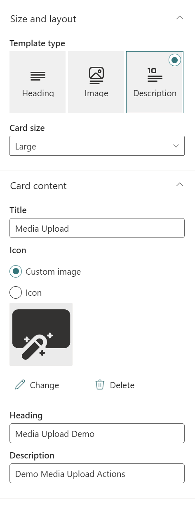
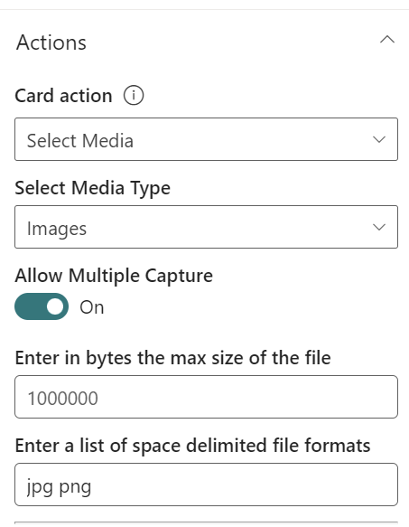
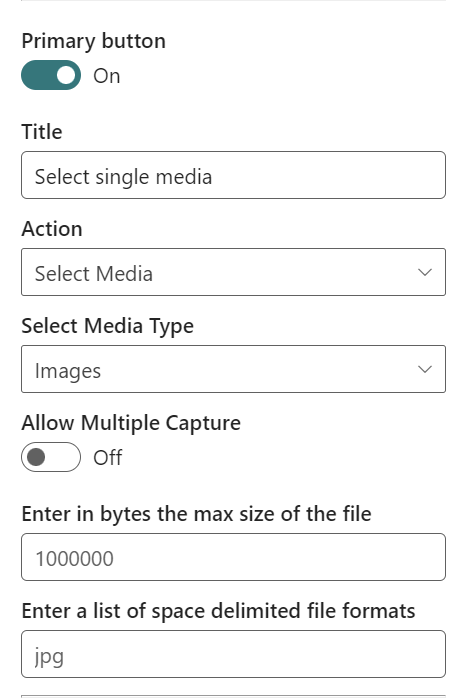
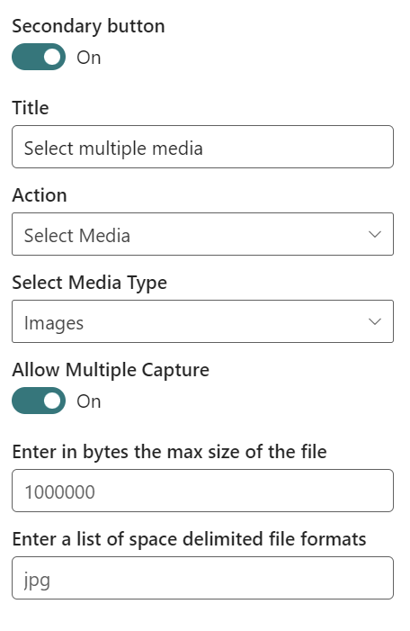

# Explore Media Upload capability via property pane of card-designer card in Adaptive Card Extension

In this tutorial we'll see how we can explore this capability via the property pane of the card-designer card.

- Update the card strings
- Introduce media upload actions on the Card View, primary button, and secondary button.

First, figure out the domain to the URL of your SharePoint tenant and site you want to use for testing and access the `workbench.aspx` page. For example: `https://contoso.sharepoint.com/sites/devsite/_layouts/workbench.aspx`.

Here, click on the '+' icon in the middle of the page, and add the `card-designer` card on the canvas.

Next, click the pencil icon adjacent to this card to open the property pane.

## Update the card strings

Here, first set the `Card size` to `Large`.

To provide descriptive labels, change `Title` to `Media Upload`, `Heading` to `Media Upload Demo` and `description` to `Demo Media Upload Actions`.

## Adding action on Card View

Under `Actions`, click the drop-down menu of `Card action` and select `Select media` option. By default **Images** is the only media type to be captured.

Set the expected file formats as **png** and **jpg**.

## Adding action on Primary button

Next, for the `Primary Button`, set the `Title` to `Select single media` and from its action drop-down menu, select `Select Media`.

Ensure that `Allow Multiple Capture` is toggled off.

## Adding action on Secondary button

Change the size of the card from Medium to Large.

Ensure that `Allow Multiple Capture` is toggled on.

Finally, for the `Secondary Button`, set the `Title` to `Select multiple media` and from its action drop-down menu, select `Select Media`.

## Try the Select Media action

Now close the property pane and click `Preview` from the top right hand corner of the page:

- Click on the card to open up media upload and exit
- Clicking `Select single media` will pull open the same modal
- Clicking `Select multiple media` will open up the same modal but will allow the user to upload several files at once

## See Also

- [Microsoft Learning: Create Adaptive Card Extensions (ACE) for Microsoft Viva Connections](/training/modules/sharepoint-spfx-adaptive-card-extension-card-types)
