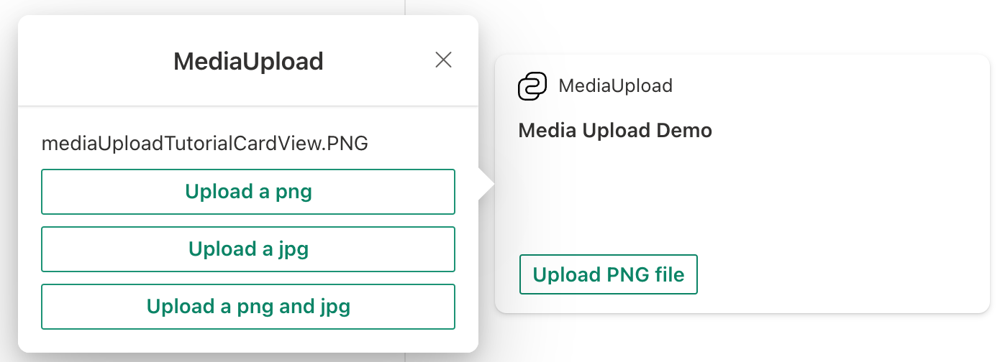

# Create an Adaptive Card Extension with select media action

## Scaffold an Adaptive Card Extension project

Create a new project directory for your project and change your current folder to that directory.

Create a new project by running the Yeoman SharePoint Generator from within the new directory you created:

```console
yo @microsoft/sharepoint
```

When prompted, enter the following values (select the default option for all prompts omitted below):

- **What is your solution name?** media-upload-tutorial
- **Which type of client-side component to create?** Adaptive Card Extension
- **Which template do you want to use?** Generic Card Template
- **What is your Adaptive Card Extension name?** MediaUpload

At this point, Yeoman installs the required dependencies and scaffolds the solution files. This process might take few minutes.

Next, run **gulp serve** from the command line in the root of the project. When the hosted workbench loads, you'll see the **MediaUpload** card:


## Add media upload action to your Adaptive Card Extension

At this point, we have out of the box Adaptive Card Extension code. Now it's time to flare things up with selecting media from the Card and Quick Views.

In the Card View, we'll provide a button that will perform the following actions: **Upload an image file**

### Update the labels that will show up on the card

Before we start adding the actions, let us first update the strings that you'll see on the card.

For this, locate and open the following file in your project: **./src/adaptiveCardExtensions/mediaUpload/loc/en-us.js**

Replace the content of this file with:

```javascript
define([], function() {
  return {
    "PropertyPaneDescription": "Tutorial on media upload action in ACE.",
    "TitleFieldLabel": "MediaUpload",
    "Title": "Media Upload",
    "SubTitle": "Media Upload Actions",
    "PrimaryText": "Media Upload Demo",
    "Description": "Demonstrating Media Upload Capabilities",
    "UploadPNG": "Upload PNG file"
  }
});
```

Next, locate and open the following file in your project: **./src/adaptiveCardExtensions/mediaUpload/loc/mystring.d.ts**

Add the following:

```typescript
UploadPNG: string;
```

to the `IMediaUploadAdaptiveCardExtensionStrings` interface.

### Add actions on the Card View

As mentioned earlier, on the Card View, we'll add a button, which will allow the user to upload a png file when clicking the Card View.

Locate and open the following file in your project: **./src/adaptiveCardExtensions/mediaUpload/cardView/CardView.ts**

Here, replace the definition of `footer` in `cardViewParameters` getter with the following:

```typescript
public get cardViewParameters(): ComponentsCardViewParameters {
  return return PrimaryTextCardView({
    // ...
    footer: {
      componentName: 'cardButton',
      title: strings.UploadPNG,
      action: {
        type: 'VivaAction.SelectMedia',
        parameters: {
            mediaType: MediaType.Image
        }
      }
    }
  });
}
```
You will also need to import `MediaType` from `@microsoft/sp-adaptive-card-extensions-base`:

With this change, we have configured a button with label **Upload PNG file** and on click action is `VivaAction.SelectMedia`, which load the file uploader modal.

Next, replace the content of `onCardSelection()` function with the following:

```typescript
public get onCardSelection(): IQuickViewCardAction | IExternalLinkCardAction | undefined {
  return {
      type: 'QuickView',
      parameters: {
        view: QUICK_VIEW_REGISTRY_ID
      }
  };
}
```

This change implies that when a user clicks the Card View, then it should open a Quick View for them.

With the changes made so far, your Card View would look like:


### Add actions on the Quick View

In the Quick View, we will introduce buttons for three actions:

- Upload a png file
- Upload a jpg file
- Upload both a png and jpg file

We will first define the template of the Quick View. For this, locate and open the following file in your project: **./src/adaptiveCardExtensions/mediaUpload/quickView/template/QuickViewTemplate.json**

Replace the content of this file with the following:

```json
{
  "schema": "http://adaptivecards.io/schemas/adaptive-card.json",
  "type": "AdaptiveCard",
  "version": "1.5",
  "body": [
    {
      "type": "TextBlock",
      "text": "${filesUploaded}"
    }
  ],
  "actions": [
    {
      "title": "Upload a png",
      "type": "VivaAction.SelectMedia",
      "parameters": {
        "mediaType": "MediaType.Image",
        "allowMultipleCapture": false,
        "supportedFileFormats": "png"
      }
    },
    {
      "title": "Upload a jpg",
      "type": "VivaAction.SelectMedia",
      "parameters": {
        "mediaType": "MediaType.Image",
        "allowMultipleCapture": false,
        "supportedFileFormats": "jpg"
      }
    },
    {
      "title": "Upload a png and jpg",
      "type": "VivaAction.SelectMedia",
      "parameters": {
        "mediaType": "MediaType.Image",
        "allowMultipleCapture": true,
        "supportedFileFormats": "png jpg"
      }
    }
  ]
}
```

After adding these actions, your Quick View would look like:


### Set up the state for our Adaptive Card Extension

So far we have created our Card View and Quick View. If you do a **gulp serve** at this point, then you'll be able to perform the actions that were described above.

But now, let us take it a notch higher.

We now wish to show all files uploaded on the Quick View when the respective actions are executed.

We'll need to make a few quick changes will first introduce new states. First locate and open the following file in your project: **./src/adaptiveCardExtensions/mediaUpload/MediaUploadAdaptiveCardExtension.ts**

Here, add the following `states` to the `IMediaUploadAdaptiveCardExtensionState` interface:

```typescript
filesUploaded: string;
```

Next, in the `onInit()` function, change `this.state={}` to

```typescript
this.state = {
  filesUploaded: ''
};
```

We will now make similar changes in Quick View as well.

Locate and open the following file in your project: **./src/adaptiveCardExtensions/mediaUpload/quickView/QuickView.ts**

Add the following properties to the `IQuickViewData` interface:

```typescript
filesUploaded: string;
```

and then add the following line in the returned object of `data` getter:

```typescript
filesUploaded: this.state.filesUploaded
```

### Implement the onAction function

So far we have created defined our media upload action and wired in our states. Now we can finally implement the `onAction` function, which gives the ability to the third party developer to decide what they wish to do with the media information uploaded.

For this, open the **QuickView.ts** file (**./src/adaptiveCardExtensions/mediaUpload/quickView/QuickView.ts**) and import the `ISelectMediaActionArguments` interface, as follows:

```typescript
import {ISelectMediaActionArguments} from '@microsoft/sp-adaptive-card-extension-base';
```

Finally, introduce the following `onAction` function in the QuickView class so that we can attain a list of our files:

```typescript
public onAction(action: ISelectMediaActionArguments): void {
  if (action.type === 'VivaAction.SelectMedia') {
    // media is an array of attachment objects which contain the content and filename
    this.setState({
        filesUploaded: action.media.map(attachment => attachment.fileName).join(',')
    });
  }
}
```

So now, whenever the `VivaAction.SelectMedia` action is triggered from your Quick View, depending on the parameters that were passed, the Adaptive Card Extension framework will pass a media attachment to the `onAction` callback. In the implementation shared above, we check if the `action` type is of type `VivaAction.SelectMedia`, and if it is, then we re-render the Quick View by doing a `setState`, in which we update the `filesUploaded` text-block.

At this point, you can run **gulp serve** again and see how all the changes you made so far came together.

This is it! Congratulations on successfully creating you Adaptive Card Extension with media upload action.



## See Also

- [Microsoft Learning: Create Adaptive Card Extensions (ACE) for Microsoft Viva Connections](/training/modules/sharepoint-spfx-adaptive-card-extension-card-types)
