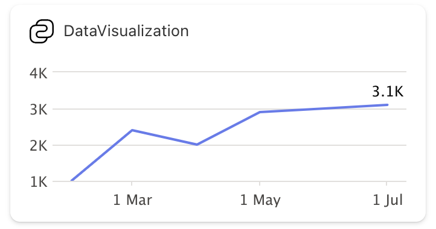

# Create a Data Visualization Adaptive Card Extension

The [SharePoint Framework v1.19](../../release-1.19.md) introduces a new Data Visualization Template that can be used to implement charts. This tutorial provides step-by-step guidance on implementing Data Visualization with Adaptive Card Extensions (ACEs).

> [!NOTE]
> Before you start, complete the procedures in the following articles to ensure that you understand the basic flow of creating a custom Adaptive Card Extension: [Build your first SharePoint Adaptive Card Extension](./build-first-sharepoint-adaptive-card-extension.md)

> [!IMPORTANT]
> Line chart data visualization type was released as part of the [SPFx 1.19 release](../../release-1.19.md). Other data visualization types, such as the bar chart, donut chart, and pie charts, were introduced in the [SPFx 1.20 release](../../release-1.20.md).

## Scaffold an Adaptive Card Extension project

Create a new project directory for your project and change your current folder to that directory.

Create a new project by running the Yeoman SharePoint Generator from within the new directory you created:

```console
yo @microsoft/sharepoint
```

When prompted, enter the following values (select the default option for all other prompts):

- **What is your solution name?** dataVisualization-tutorial
- **Which type of client-side component to create?** Adaptive Card Extension
- **Which template do you want to use?** Data Visualization Card Template
- **What is your Adaptive Card Extension name?** DataVisualization

At this point, Yeoman installs the required dependencies and scaffolds the solution files. This process might take few minutes.

Next, run **gulp serve** from the command line in the root of the project. Select the **add** icon in the hosted workbench to open the toolbox, you see the **Data Visualization** card:


Select the **DataVisualization** component to add it to the workbench. The default rendering renders the line chart using mock data:



## Explore the scaffolded code

### Explore the Card View

Locate and open the following file: **./src/adaptiveCardExtensions/dataVisualization/cardView/CardView.ts**. The Card View implements the `BaseComponentsCardView` base class `cardViewParameters` getter to specify the card configuration:

```typescript
const seriesData : IDataPoint<Date>[] = [
  ... // omitted for brevity
];

export class CardView extends BaseComponentsCardView<..> {
  public get cardViewParameters(): IDataVisualizationCardViewParameters {
    return LineChartCardView({
      cardBar: {
        componentName: 'cardBar',
        title: this.properties.title
      },
      body: {
        componentName: 'dataVisualization',
        dataVisualizationKind: 'line',
        series: [{
          data: seriesData,
          lastDataPointLabel: '3.1K'
        }]
      }
    });
  }
}
```

Notice how the `body` section of the Card View specifies the `dataVisualization` component.

### Explore possible layouts

Based on the configuration in Card View, a chart can be rendered in two layouts:

#### Regular

Adding zero or one component along with a `dataVisualization` component in the body:


#### Right side

Adding more than one component in the Card View along with `dataVisualization` component in the body renders the chart on the right side of the card. For example: Header and Footer along with `dataVisualization` component in body.

Locate & replace the `cardViewParameters()` getter with the following code to add a `header` and `footer` to the card:

```typescript
public get cardViewParameters(): IDataVisualizationCardViewParameters {
  return LineChartCardView({
    cardBar: {
      componentName: 'cardBar',
      title: this.properties.title
    },
    header: {
      componentName: 'text',
      text: 'Sales Projection'
    },
    body: {
      componentName: 'dataVisualization',
      dataVisualizationKind: 'line',
      series: [{
          data: seriesData,
          lastDataPointLabel: '3.1K'
      }]
    },
    footer: {
      componentName: 'cardButton',
      title: 'View Details',
      action: {
        type: 'QuickView',
        parameters: {
          view: QUICK_VIEW_REGISTRY_ID
        }
      }
    }
  });
}
```


### Explore the Quick Views

The ACE class is located in the following file: **./src/adaptiveCardExtensions/dataVisualization/quickView/QuickView.ts** and mostly has the same code as [Generic Card View](./build-first-sharepoint-adaptive-card-extension.md).

### Explore the ACE class

The ACE class is located in the following file: **./src/adaptiveCardExtensions/dataVisualization/dataVisualizationAdaptiveCardExtension.ts** and mostly has the same code as [Generic Card View](./build-first-sharepoint-adaptive-card-extension.md).

## Support for multiple data series in the chart

The ACE `dataVisualization` component supports multiple series lines in the chart. To add multiple lines to the chart, add other entries to the `body.series` array on the `LineChartCardView` object in the Card View.

For example, consider the following data series:

```typescript
// Sample Data
const seriesData : IDataPoint<Date>[] = [
  { x: new Date(2024, 1, 1), y: 1000 },
  { x: new Date(2024, 2, 1), y: 2400 },
  { x: new Date(2024, 3, 1), y: 2000 },
  { x: new Date(2024, 4, 1), y: 2900 },
  { x: new Date(2024, 5, 1), y: 3000 },
  { x: new Date(2024, 6, 1), y: 3100 }
];

const seriesData2 : IDataPoint<Date>[] = [
  { x: new Date(2024, 1, 1), y: 600 },
  { x: new Date(2024, 2, 1), y: 1200 },
  { x: new Date(2024, 3, 1), y: 3200 },
  { x: new Date(2024, 4, 1), y: 2800 },
  { x: new Date(2024, 5, 1), y: 3600 },
  { x: new Date(2024, 6, 1), y: 4500 }
];

const seriesData3 : IDataPoint<Date>[] = [
  { x: new Date(2024, 1, 1), y: 5200 },
  { x: new Date(2024, 2, 1), y: 1000 },
  { x: new Date(2024, 3, 1), y: 1800 },
  { x: new Date(2024, 4, 1), y: 2900 },
  { x: new Date(2024, 5, 1), y: 600 },
  { x: new Date(2024, 6, 1), y: 400 }
];
```

Add all three series to the data visualization Card View and optionally set the color of specific series:

```typescript
export class CardView extends BaseComponentsCardView<
  IRecentSalesAdaptiveCardExtensionProps,
  IRecentSalesAdaptiveCardExtensionState,
  IDataVisualizationCardViewParameters
> {
  public get cardViewParameters(): IDataVisualizationCardViewParameters {
    return LineChartCardView({
      cardBar: {
        componentName: 'cardBar',
        title: this.properties.title
      },
      body: {
        componentName: 'dataVisualization',
        dataVisualizationKind: 'line',
        series: [{
          data: seriesData,
          lastDataPointLabel: '3.1K'
        },
        {
          data: seriesData2,
          lastDataPointLabel: '4.5K',
          color: '#800080'
        },
        {
          data: seriesData3,
          lastDataPointLabel: '0.4K',
          color: '#01CBAE'
        }]
      }
    });
  }

  public get onCardSelection(): IQuickViewCardAction | IExternalLinkCardAction | undefined {
    return {
      type: 'QuickView',
      parameters: { view: QUICK_VIEW_REGISTRY_ID }
    };
  }
}
```

This card when in the large mode generates the following rendering:


## Support for more chart types

The [SharePoint Framework v1.20](../../release-1.20.md) introduces support for newer chart types, enabling developers to create visually appealing data visualizations like bar, pie, and donut charts.


### Bar Chart

To render a vertically grouped bar chart, follow this example:

```typescript
// Sample Data
const seriesData: IDataPoint<string>[] = [
  { x: "Jan", y: 12986 },
  { x: "Feb", y: 13424 },
  { x: "Mar", y: 17118 },
  { x: "Apr", y: 14017 },
  { x: "May", y: 11245 }
];

const seriesData2: IDataPoint<string>[] = [
  { x: "Jan", y: 19631},
  { x: "Feb", y: 19905},
  { x: "Mar", y: 17098},
  { x: "Apr", y: 11918},
  { x: "May", y: 10357}
];

const seriesData3: IDataPoint<string>[] = [
  { x: "Jan", y: 19762},
  { x: "Feb", y: 12926},
  { x: "Mar", y: 17670},
  { x: "Apr", y: 19055},
  { x: "May", y: 18142}
];
```

Add all three series to the data visualization Card View and optionally set the name or color of the individual series:

```typescript
export class CardView extends BaseComponentsCardView<
  IDataVisualizationAdaptiveCardExtensionProps,
  IDataVisualizationAdaptiveCardExtensionState,
  IDataVisualizationCardViewParameters
> {
  public get cardViewParameters(): IDataVisualizationCardViewParameters {
    return BarChartCardView({
      cardBar: {
        componentName: 'cardBar',
        title: this.properties.title
      },
      body: {
        componentName: 'dataVisualization',
        dataVisualizationKind: 'bar',
        series: [{
            data: seriesData,
            name: 'Africa'
        }, {
            data: seriesData2,
            name: 'Asia'
        }, {
            data: seriesData3,
            name: 'Europe'
        }]
      }
    });
  }
}
```

The rendered bar chart looks something like this:


### Pie/Donut Charts

Here's an example of the **CardView.ts** file that renders a pie chart with the given data:

```typescript
import {
  BaseComponentsCardView,
  IDataVisualizationCardViewParameters,
  PieChartCardView,
  IPieDataPoint,
} from '@microsoft/sp-adaptive-card-extension-base';
import {
  IDataVisualizationAdaptiveCardExtensionProps,
  IDataVisualizationAdaptiveCardExtensionState,
} from '../DataVisualizationAdaptiveCardExtension';

// Sample Data
const seriesData: IPieDataPoint[] = [
  { x: 'January', y: 50 },
  { x: 'February', y: 25, color: '#eaae32', showLabel: false },
  { x: 'March', y: 40, showLabel: false },
  { x: 'Apr', y: 35 },
  { x: 'May', y: 60 },
  { x: 'Jun', y: 29 }
];

export class CardView extends BaseComponentsCardView<
  IDataVisualizationAdaptiveCardExtensionProps,
  IDataVisualizationAdaptiveCardExtensionState,
  IDataVisualizationCardViewParameters
> {
  public get cardViewParameters(): IDataVisualizationCardViewParameters {
    return PieChartCardView({
      cardBar: {
        componentName: 'cardBar',
        title: this.properties.title
      },
      body: {
        componentName: 'dataVisualization',
        dataVisualizationKind: 'pie',
        isDonut: false,
        series: [{
            data: seriesData,
        }]
      }
    });
  }
}
```

Notice how the `dataVisualizationKind` is set to `pie` and `PieChartCardView` is returned with the required parameters. Upon refreshing the card on the workbench, you see that a pie chart is rendered:


The `isDonut` flag indicates if the pie chart should be rendered as a donut chart, which is `false` by default. When set to true, the donut chart is rendered as follows:


The numeric text in the center displays the sum of all the **y** values in the series.

## See Also

- Video: **[Introducing new Viva Connections chart card layout option](https://www.youtube.com/watch?v=JOIb4KhiWAI)**
- Sample: **[Chart Card - Page Creation](https://github.com/pnp/sp-dev-fx-aces/tree/main/samples/ChartCard-PageCreation)**
- Sample: **[Chart Card - Three Series](https://github.com/pnp/sp-dev-fx-aces/tree/main/samples/ChartCard-ThreeSeries)**
- Sample: **[Chart Card - Data Visualization Options](https://github.com/pnp/sp-dev-fx-aces/tree/main/samples/ChartCard-DataVisualizationOptions)**
