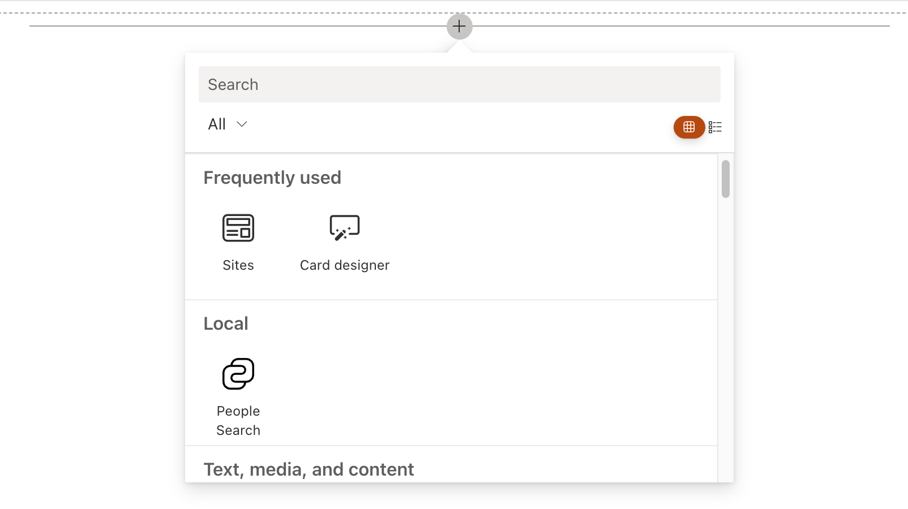

# Create a Data Visualization Adaptive Card Extension

SharePoint Framework 1.19 introduces a new Data Visualization Template that can be used to implement various line chart scenarios.
This tutorial provides step-by-step guidance on implementing Data Visualization with ACEs.

> [!NOTE]
> This tutorial assumes that you have installed the SPFx v1.19
>
> For more information on installing the SPFx v1.19, see [SharePoint Framework v1.14 release notes](../../../../release-1.19.md).
Before you start, complete the procedures in the following articles to ensure that you understand the basic flow of creating a custom Adaptive Card Extension
- [Build your first SharePoint Adaptive Card Extension](./build-first-sharepoint-adaptive-card-extension.md)

## Scaffold an Adaptive Card Extension project

Create a new project directory for your project and change your current folder to that directory.

Create a new project by running the Yeoman SharePoint Generator from within the new directory you created:

```console
yo @microsoft/sharepoint
```

When prompted, enter the following values (select the default option for all prompts omitted below):

- **What is your solution name?** dataVisualization-tutorial
- **Which type of client-side component to create?** Adaptive Card Extension
- **Which template do you want to use?** Data Visualization Template
- **What is your Adaptive Card Extension name?** Data Visualization

At this point, Yeoman installs the required dependencies and scaffolds the solution files. This process might take few minutes.

## Update your project's hosted workbench URL.

When you use the gulp task **serve**, by default it will launch a browser with the specified hosted workbench URL specified in your project. The default URL for the hosted workbench in a new project points to an invalid URL.

- Locate and open the file **./config/serve.json** in your project.
- Locate the property `initialPage`:

    ```json
    {
      "$schema": "https://developer.microsoft.com/json-schemas/core-build/serve.schema.json",
      "port": 4321,
      "https": true,
      "initialPage": "https://{tenantDomain}/ _layouts/workbench.aspx"
    }
    ```

- Change the `{tenantDomain}` domain to the URL of your SharePoint tenant and site you want to use for testing. For example: `https://contoso.sharepoint.com/sites/devsite/_layouts/workbench.aspx`.

At this point, if you do `gulp serve`, then you will see the **Data Visualization** card:



If you add the ACE to the workbench, you will see it already prepared for mock line chart:


## Explore the scaffolded code
### Explore the Card View
Locate and open the following file in your project: **./src/adaptiveCardExtensions/dataVisualization/cardView/CardView.ts**.
The card view implements `BaseComponentsCardView` class and implements `cardViewParameters` getter to specify the card configuration:
```ts
export class CardView extends BaseComponentsCardView<IdataVisualizationAdaptiveCardExtensionProps, IdataVisualizationAdaptiveCardExtensionState, ISearchCardViewParameters> {
  public get cardViewParameters(): ISearchCardViewParameters {
    return SearchCardView({
      cardBar: {
        componentName: 'cardBar',
        title: this.properties.title
      },
      header: {
        componentName: 'text',
        text: strings.PrimaryText
      },
      body: {
        componentName: 'searchBox',
        placeholder: strings.Placeholder,
        id: SEARCH_BOX_ID,
        button: {
          action: {
            type: 'QuickView',
            parameters: {
              view: SEARCH_RESULTS_QUICK_VIEW_REGISTRY_ID
            }
          }
        }
      },
      footer: {
        componentName: 'searchFooter',
        title: strings.Suggested,
        imageInitials: 'MB',
        text: strings.Title,
        secondaryText: strings.SubTitle,
        onSelection: {
          type: 'QuickView',
          parameters: {
            view: ITEM_QUICK_VIEW_REGISTRY_ID
          }
        }
      }
    });
  }

  public get onCardSelection(): IQuickViewCardAction | IExternalLinkCardAction | undefined {
    return undefined;
  }
}
```

The **body** section of the card view specifies the search box. The search button is configured to open the Quick View with the ID `SEARCH_RESULTS_QUICK_VIEW_REGISTRY_ID`. 
The **footer** section of the card view specifies the suggested item. The suggested item is configured to open the Quick View with the ID `ITEM_QUICK_VIEW_REGISTRY_ID`.

### Explore various layouts possible ###
### Explore the Quick Views
The ACE class is located in the following file: **./src/adaptiveCardExtensions/dataVisualization//quickView/QuickView.ts** and mostly has the same code as [Generic Card View](./build-first-sharepoint-adaptive-card-extension.md).

### Explore the ACE class
The ACE class is located in the following file: **./src/adaptiveCardExtensions/dataVisualization/dataVisualizationAdaptiveCardExtension.ts** and mostly has the same code as [Generic Card View](./build-first-sharepoint-adaptive-card-extension.md).

