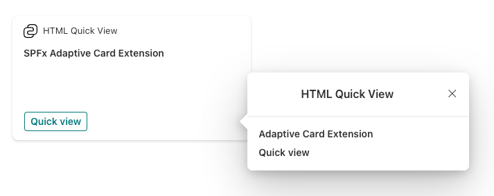
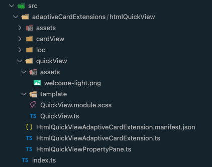
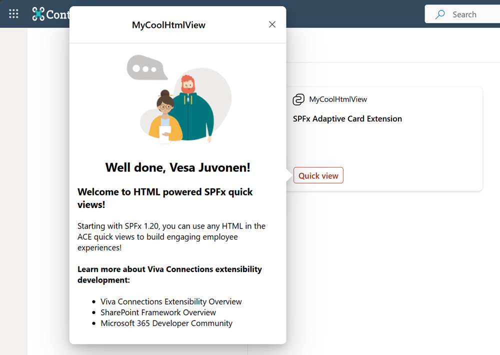

# Build an HTML Quick View SharePoint Framework Adaptive Card Extension

The SharePoint Framework (SPFx) v1.20 release introduced a new option to use HTML to render the Viva Connection Adaptive Card Extension (ACE) Quick Views. This enables more advanced user experiences. You can even use whatever suitable JavaScript web framework you prefer (ie: React etc.) in your Quick View experiences.

You can start using this option by updating your Quick View implementation to be inherited from xxx class, which will be automatically detected by the underlying platform.

> [!IMPORTANT]
> This tutorial assumes you have installed the SPFx v1.20. For more information on installing the SPFx v1.20, see [SharePoint Framework v1.20 release notes](../../release-1.20.md).

## Scaffold an Adaptive Card Extension project

Create a new project directory for your project and change your current folder to that directory.

Create a new project by running the Yeoman SharePoint Generator from within the new directory you created:

```console
yo @microsoft/sharepoint
```

When prompted, enter the following values (*select the default option for all prompts omitted below*):

- **Which type of client-side component to create?** Adaptive Card Extension
- **Which template do you want to use?** Generic Card Template
- **What is your Adaptive Card Extension name?** HTML Quick View

At this point, Yeoman installs the required dependencies and scaffolds the solution files. This process might take few minutes.

## Test the ACE in the hosted workbench

Before digging into the code, run the scaffolded output and see what an Adaptive Card Extension looks like.

The inner development loop with ACEs is similar to SPFx Web Parts. We can serve locally and run the code on the SharePoint Online hosted workbench.

```console
gulp serve
```

Once local web server is running, navigate to the hosted Workbench: `https://{tenant}.sharepoint.com/_layouts/15/workbench.aspx`

Open the **Web Part Toolbox** and select your ACE.

Once added to the page, select the **Preview** link in the top-right area of the workbench to interact with the ACE. Next, select the **Quick View** button. This will open the default Adaptive Card implementation of the Quick View defined in the **src/adaptiveCardExtensions/htmlQuickView/quickView/template/QuickViewTemplate.json** file:



With the ACE project created and working, let's now update to use an HTML rendering instead of using the included Adaptive Card.

## Update the Quick View to use HTML

Start by adding the welcome light image from a default web part project:

1. Create a new folder **assets** within the existing **quickView** folder.
1. Add the **welcome-light.png** file to this folder.

    > [!NOTE]
    > You can use any image in this tutorial, or you can find the image in the sample project accompanying this tutorial: [Sample: HTML Quick View demo](https://github.com/pnp/sp-dev-fx-aces/tree/main/samples/BasicCard-HTML-QuickView).

1. To be sure you won't use the default Adaptive Card template for the Quick View, delete the following file from the project: **./src/adaptiveCardExtensions/htmlQuickView/quickView/template/QuickViewTemplate.json**

### Add a stylesheet to the project

Now you'll make a few changes to the project to add a stylesheet to the project. This will simplify formatting the content in the HTML rendering that you'll add.

1. Install the SPFx Fluent UI core library into the project that we'll use to apply some styles to our project.
    1. From the console, run the following command in the root of the project:

        ```console
        npm install @microsoft/sp-office-ui-fabric-core@{{REPLACE_VERSION}} --save-prod --save-exact
        ```

        > [!IMPORTANT]
        > Before running this command, check the version of the **@microsoft/sp-core-library** package in the project's **package.json** file. Replace the `{{REPLACE_VERSION}}` in the previous command with the version of the **@microsoft/sp-core-library**. This is to ensure you're using the same version of all SPFx libraries in your project.

1. Add a new style sheet to the project, **QuickView.module.scss** in the same folder as the **QuickView.ts** file and add the following code that you'll use in the HTML rendering:

    ```scss
    @import '~@microsoft/sp-office-ui-fabric-core/dist/sass/SPFabricCore.scss';

    .helloWorld {
      overflow: hidden;
      padding: 1em;
      color: "[theme:bodyText, default: #323130]";
      color: var(--bodyText);
      &.teams {
        font-family: $ms-font-family-fallbacks;
      }
    }

    .welcome {
      text-align: center;
    }

    .welcomeImage {
      width: 100%;
      max-width: 420px;
    }

    .links {
      a {
        text-decoration: none;
        color: "[theme:link, default:#03787c]";
        color: var(--link); // note: CSS Custom Properties support is limited to modern browsers only

        &:hover {
          text-decoration: underline;
          color: "[theme:linkHovered, default: #014446]";
          color: var(--linkHovered); // note: CSS Custom Properties support is limited to modern browsers only
        }
      }
    }
    ```

At this point, your ACE component should look similar to the following with the new files added and after removing the default Adaptive Card:



### Update the Quick View to use HTML instead of an Adaptive Card in the rendering

The last step is to update the Quick View component to import the style sheet and use HTML for the rendering instead of the Adaptive Card.

1. Locate and open the **./src/adaptiveCardExtensions/htmlQuickView/quickView/QuickView.ts** file.
1. Update the `import` statement for the ACE base component. Locate the following line at the top of the file:

    ```typescript
    import { ISPFxAdaptiveCard, BaseAdaptiveCardQuickView } from '@microsoft/sp-adaptive-card-extension-base';
    ```

    Replace this line with the following line:

    ```typescript
    import { BaseWebQuickView } from '@microsoft/sp-adaptive-card-extension-base';
    ```

1. Add the following two `import` statements after the existing `import` statements:

    ```typescript
    import { escape } from '@microsoft/sp-lodash-subset';
    import styles from './QuickView.module.scss';
    ```

1. Locate the `QuickView` class declaration and change the base class it extends from the following:

    ```typescript
    export class QuickView extends BaseWebQuickView<
      IHtmlQuickViewAdaptiveCardExtensionProps,
      IHtmlQuickViewAdaptiveCardExtensionState,
      IQuickViewData
    > {
    ```

    ... to the following:

    ```typescript
    export class QuickView extends BaseWebQuickView<
      IHtmlQuickViewAdaptiveCardExtensionProps,
      IHtmlQuickViewAdaptiveCardExtensionState
    > {
    ```

1. Remove the existing `template()` method from the `QuickView` class.
1. Add the following `render()` method to the `QuickView` class to render the Quick View using HTML:

    ```typescript
    render(): void {
      this.domElement.innerHTML = `
        <section class="${styles.helloWorld}">
          <div class="${styles.welcome}">
            
            <h2>Well done, ${escape(this.context.pageContext.user.displayName)}!</h2>
          </div>
          <div>
            <h3>Welcome to HTML powered SPFx Quick Views!</h3>
            <p>
            Starting with SPFx 1.20, you can use any HTML in the ACE Quick Views to build engaging employee experiences!
            </p>
            <h4>Learn more about Viva Connections extensibility development:</h4>
              <ul class="${styles.links}">
                <li><a href="https://aka.ms/spfx" target="_blank">Viva Connections Extensibility Overview</a></li>
                <li><a href="https://aka.ms/spfx" target="_blank">SharePoint Framework Overview</a></li>

                <li><a href="https://aka.ms/m365pnp" target="_blank">Microsoft 365 Developer Community</a></li>
              </ul>
          </div>
        </section>`;
    }
    ```

## Test the new HTML enabled Quick View

With all the changes now applied, retest solution in the hosted workbench to see the new HTML enabled Quick View:



## See Also

- [Build your first SharePoint Adaptive Card Extension](build-first-sharepoint-adaptive-card-extension.md)
- [Advanced Quick View Functionality](advanced-quick-view-functionality.md)
- [Making Quick View compatible with dark mode in mobile devices](making-quickview-compatable-darkmode-mobile.md)
- [Sample: HTML Quick View demo](https://github.com/pnp/sp-dev-fx-aces/tree/main/samples/BasicCard-HTML-QuickView)
