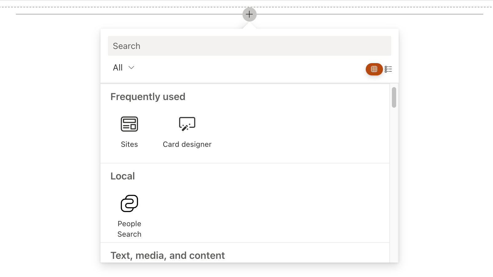
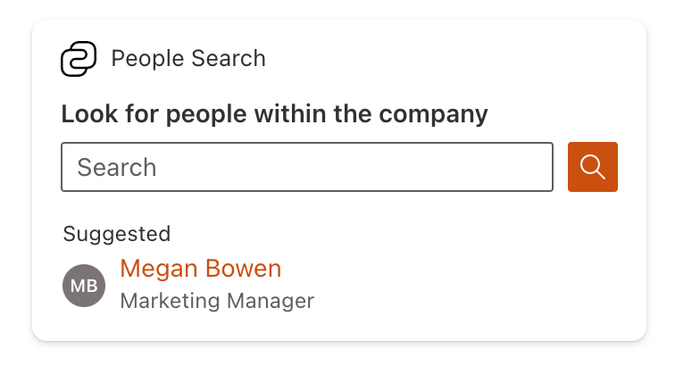
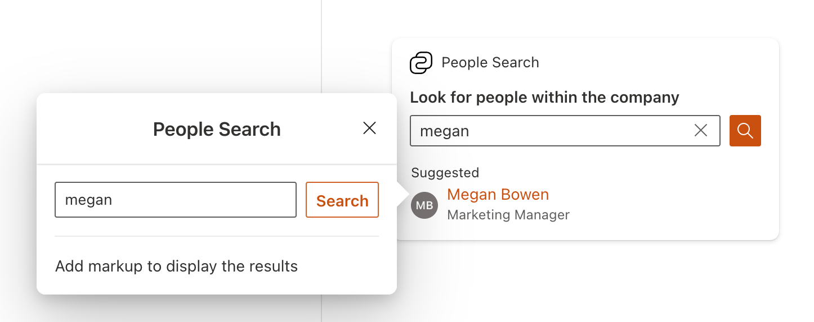
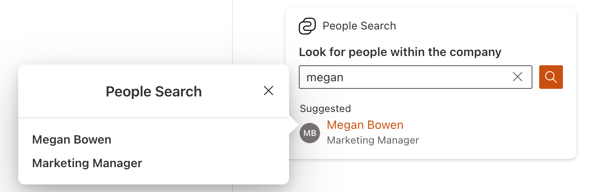
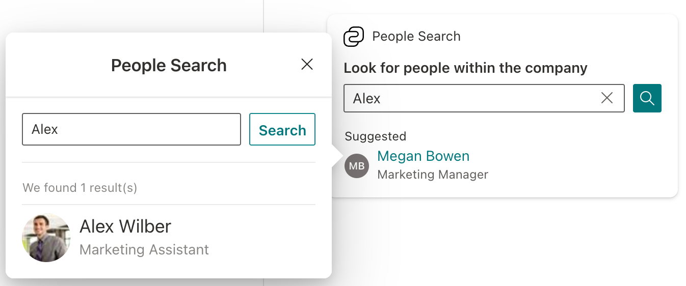
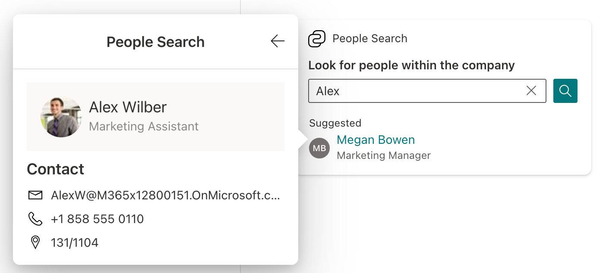
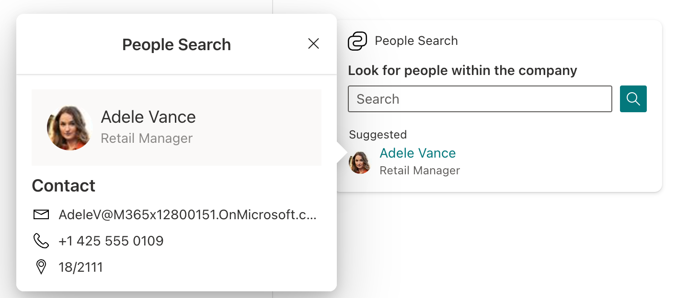

# Create a People Search Adaptive Card Extension

SharePoint Framework (SPFx) v1.18 introduces a new Search Card Template that can be used to implement various search scenarios.

This tutorial provides step-by-step guidance on implementing People Search with ACEs and Microsoft Graph.

> [!NOTE]
> This tutorial assumes that you have installed the SPFx v1.18 preview version.
>
> For more information on installing the SPFx v1.18, see [SharePoint Framework v1.18 release notes](../../release-1.18.md).

Before you start, complete the procedures in the following articles to ensure that you understand the basic flow of creating a custom Adaptive Card Extension and using Microsoft Graph in SharePoint Framework solutions:

- [Build your first SharePoint Adaptive Card Extension](./build-first-sharepoint-adaptive-card-extension.md)
- [Use Microsoft Graph in your solution](../../web-parts/get-started/using-microsoft-graph-apis.md)

## Scaffold an Adaptive Card Extension project

Create a new project directory for your project and change your current folder to that directory.

Create a new project by running the Yeoman SharePoint Generator from within the new directory you created.

```console
yo @microsoft/sharepoint
```

When prompted, enter the following values (select the default option for all questions, which aren't mentioned):

- **What is your solution name?** peoplesearch-tutorial
- **Which type of client-side component to create?** Adaptive Card Extension
- **Which template do you want to use?** Search Card Template
- **What is your Adaptive Card Extension name?** People Search

At this point, Yeoman installs the required dependencies and scaffolds the solution files. This process might take few minutes.

Next, run **gulp serve** from the command line in the root of the project. Once the hosted workbench loads, you'll see the **People Search** card:



If you add the ACE to the workbench, you see it already prepared for mock search scenario.



If you switch to Preview mode of the workbench, you can engage with it:

- type in the search box and select on the search icon to see the results Quick View mockup

  

- Select on the **Suggested** item to see a single item view

  

## Explore the scaffolded code

### Explore the Card View

- Locate and open the following file in your project: **./src/adaptiveCardExtensions/peopleSearch/cardView/CardView.ts**.
- The Card View implements `BaseComponentsCardView` class and implements `cardViewParameters` getter to specify the card configuration

```typescript
export class CardView extends BaseComponentsCardView<IPeopleSearchAdaptiveCardExtensionProps, IPeopleSearchAdaptiveCardExtensionState, ISearchCardViewParameters> {
  public get cardViewParameters(): ISearchCardViewParameters {
    return SearchCardView({
      cardBar: {
        componentName: 'cardBar',
        title: this.properties.title
      },
      header: {
        componentName: 'text',
        text: strings.PrimaryText
      },
      body: {
        componentName: 'searchBox',
        placeholder: strings.Placeholder,
        id: SEARCH_BOX_ID,
        button: {
          action: {
            type: 'QuickView',
            parameters: {
              view: SEARCH_RESULTS_QUICK_VIEW_REGISTRY_ID
            }
          }
        }
      },
      footer: {
        componentName: 'searchFooter',
        title: strings.Suggested,
        imageInitials: 'MB',
        text: strings.Title,
        secondaryText: strings.SubTitle,
        onSelection: {
          type: 'QuickView',
          parameters: {
            view: ITEM_QUICK_VIEW_REGISTRY_ID
          }
        }
      }
    });
  }

  public get onCardSelection(): IQuickViewCardAction | IExternalLinkCardAction | undefined {
    return undefined;
  }
}
```

The **body** section of the Card View specifies the search box. The search button is configured to open the Quick View with the ID `SEARCH_RESULTS_QUICK_VIEW_REGISTRY_ID`.

The **footer** section of the Card View specifies the suggested item. The suggested item is configured to open the Quick View with the ID `ITEM_QUICK_VIEW_REGISTRY_ID`.

### Explore the Quick Views

There are two mock Quick Views in the scaffolded code: `SearchResultsQuickView` and `ItemQuickView`.

The implementation of both is standard and can be found in the following files:
**./src/adaptiveCardExtensions/peopleSearch/quickView/SearchResultsQuickView.ts** and **./src/adaptiveCardExtensions/peopleSearch/quickView/ItemQuickView.ts**.

The important part of the `SearchResultsQuickView` implementation is `data` getter that specifies `queryString` value based on the `state` of the ACE:

```typescript
public get data(): ISearchResultsQuickViewData {
  return {
    // ...
    queryString: this.state.queryString || ''
  };
}
```

This approach allows to "share" the query string between the Card View and the Quick View. Below we show how to set this state's property from the ACE.

### Explore the ACE class

The ACE class is located in the following file: **./src/adaptiveCardExtensions/peopleSearch/PeopleSearchAdaptiveCardExtension.ts** and mostly has the same code as [Generic Card View](./build-first-sharepoint-adaptive-card-extension.md).

However, there's important difference: `PeopleSearchAdaptiveCardExtension` overrides `onBeforeAction` method to set `queryString` state's value before opening a `SearchResultsQuickView`.

```typescript
public onBeforeAction(action: IOnBeforeActionArguments): void {
  if (action.type === 'QuickView') {
    //
    // for the QuickView action we can get search query from the data property.
    // it allows to display the same query string in the Quick View's text input.
    //
    const quickViewActionArguments: IQuickViewActionArguments = action as IQuickViewActionArguments;
    if (quickViewActionArguments.viewId === SEARCH_RESULTS_QUICK_VIEW_REGISTRY_ID) {
      this.setState({
        queryString: quickViewActionArguments.data && quickViewActionArguments.data[SEARCH_BOX_ID]
      });
    }
  }
}
```

With this code in place, the Quick View displays the same query string as the Card View.

## Implement People Search Service

### Request permissions scopes

The next step is to implement the data source for the People Search ACE. The data source is responsible for fetching the data from the Microsoft Graph and returning it to the ACE.

We use the [List people](/graph/api/user-list-people) endpoint to get search results and the [Get a user](/graph/api/user-get) endpoint to display a Suggested item.

For these endpoints we need to request `People.Read` and `User.Read` scopes respectively.
Locate and open the following file in your project: **./src/adaptiveCardExtensions/peopleSearch/config/package-solution.json**.

Add `webApiPermissions` property as follows

```json
{
  "$schema": "https://developer.microsoft.com/json-schemas/spfx-build/package-solution.schema.json",
  "solution": {
    // ...
    "webApiPermissionRequests": [{
      "resource": "Microsoft Graph",
      "scope": "User.Read"
    }, {
      "resource": "Microsoft Graph",
      "scope": "People.Read"
    }]
  }
  // ...
}
```

### Defining Person model

- Navigate to **./src/adaptiveCardExtensions/peopleSearch** and create a new folder called **model** with **IPerson.ts** file in there.

The file contains the "model" or representation of a person/user.

```typescript
export interface IPerson {
  id: string;
  displayName: string;
  jobTitle?: string;
  officeLocation?: string;
  picture?: string;
  emailAddress?: string;
  phone?: string;
}
```

### Implement People Search Service

We use Service Locator pattern to inject the data service into the ACE. The pattern is represented by the [ServiceScope](/javascript/api/sp-core-library/servicescope) class in SPFx.

Navigate to **./src/adaptiveCardExtensions/peopleSearch** and create a new folder called **peopleSearchService** with two files in there: **IPeopleSearchService.ts** and **PeopleSearchService.ts**.

The **IPeopleSearchService.ts** file contains the "contract" for the service.

```typescript
import { IPerson } from '../model/IPerson';

export interface IPeopleSearchService {
  search: (queryString: string) => Promise<IPerson[]>;
  getSuggested: () => Promise<IPerson>;
}
```

**PeopleSearchService.ts** file contains the implementation of the service with `ServiceKey` static field to register the service in the Service Scope.

Before the implementation of the service, install the following dependencies from command line:

```console
npm install @microsoft/sp-http --save --save-exact
```

The implementation of the service is as follows:

```typescript
import { ServiceKey, ServiceScope } from '@microsoft/sp-core-library';
import { MSGraphClientFactory, MSGraphClientV3 } from '@microsoft/sp-http';

import { IPeopleSearchService } from './IPeopleSearchService';
import { IPerson } from '../model/IPerson';
/**
 * type of result returned by the Microsoft Graph /people API
 */
interface IGraphPerson {
  id: string;
  displayName: string;
  jobTitle?: string;
  officeLocation?: string;
  imAddress?: string;
  scoredEmailAddresses?: [{
    address: string;
    relevanceScore: number;
  }];
  phones?: [{
    type: string;
    number: string;
  }];
}

/**
 * type of result returned by the Microsoft Graph /me API
 */
interface IGraphUser {
  id: string;
  displayName: string;
  jobTitle?: string;
  mail: string;
  officeLocation?: string;
  userPrincipalName: string;
  businessPhones?: string[];
}

/**
 * Converts a graph person to a person
 */
const convertGraphPersonToPerson = (graphPerson: IGraphPerson): IPerson => {
  const {
    id,
    displayName,
    jobTitle,
    officeLocation,
    imAddress,
    scoredEmailAddresses,
    phones
  } = graphPerson;

  return {
    id,
    displayName,
    jobTitle: jobTitle || '',
    officeLocation: officeLocation || '',
    picture: `/_layouts/15/userphoto.aspx?size=S&accountname=${imAddress.replace('sip:', '')}`,
    emailAddress: scoredEmailAddresses?.length ? scoredEmailAddresses[0].address : '',
    phone: phones?.length ? phones[0].number : ''
  };
};

/**
 * Converts a graph user to a person
 */
const convertGraphUserToPerson = (graphUser: IGraphUser): IPerson => {
  const {
    id,
    displayName,
    jobTitle,
    mail,
    officeLocation,
    userPrincipalName,
    businessPhones
  } = graphUser;

  return {
    id,
    displayName,
    jobTitle: jobTitle || '',
    officeLocation: officeLocation || '',
    picture: `/_layouts/15/userphoto.aspx?size=S&accountname=${userPrincipalName}`,
    emailAddress: mail,
    phone: businessPhones?.length ? businessPhones[0] : ''
  };
};

export class PeopleSearchService implements IPeopleSearchService {
  // Create a ServiceKey to register in the Service Scope
  public static readonly serviceKey: ServiceKey<IPeopleSearchService> = ServiceKey.create<IPeopleSearchService>('PeopleSearchTutorial:PeopleSearchService', PeopleSearchService);

  private _msGraphClientFactory: MSGraphClientFactory;

  public constructor(serviceScope: ServiceScope) {
    serviceScope.whenFinished(() => {
      // Get the MSGraphClientFactory service instance from the service scope
      this._msGraphClientFactory = serviceScope.consume(MSGraphClientFactory.serviceKey);
    });
  }

  public search(queryString: string): Promise<IPerson[]> {
    return this._msGraphClientFactory.getClient('3')
    .then((client: MSGraphClientV3) => {
      // search for people, order by display name, return persons only (no groups, etc.), return top 25 results
      return client.api(`/me/people?$search="${queryString}"&orderBy=displayName&$filter=personType/class eq 'Person'&$top=25`).version('v1.0').get();
    })
    .then ((results: { value: IGraphPerson[] }) => {
      const people: IGraphPerson[] = results.value;

      return people.map((person: IGraphPerson) => {
        return convertGraphPersonToPerson(person);
      });
    })
    .catch((err) => {
      console.log(err);
      throw new Error('Error searching people');
    });
  }

  public getSuggested(): Promise<IPerson> {
    // we will return the current user as a suggestion for simplicity
    return this._msGraphClientFactory.getClient('3')
    .then((client: MSGraphClientV3) => {
      return client.api('/me').version('beta').get();
    })
    .then((user: IGraphUser) => {
      return convertGraphUserToPerson(user);
    })
    .catch((err) => {
      console.log(err);
      throw new Error('Error getting suggested person');
    });
  }
}
```

### Update ACE's logic to use the service

- Locate and open **./src/adaptiveCardExtensions/peopleSearch/PeopleSearchAdaptiveCardExtension.ts** file.
- Update the `IPeopleSearchAdaptiveCardExtensionState` to add properties for a suggestion and search results.

    ```typescript
    export interface IPeopleSearchAdaptiveCardExtensionState {
      queryString?: string;
      suggested?: IPerson;
      results?: IPerson[];
    }
    ```

- Update `onInit` to request the service from the Service Scope get the suggestion to display on the card.

    ```typescript
    public onInit(): Promise<void> {
      this.state = { };

      // request suggestion
      this.context.serviceScope.whenFinished(() => {
        // get the people search service
        const peopleSearchService: IPeopleSearchService = this.context.serviceScope.consume(PeopleSearchService.serviceKey);
        // request suggestion
        peopleSearchService.getSuggested()
        .then((suggested: IPerson) => {
          this.setState({
            suggested: suggested
          });
        })
        .catch((error: any) => {
          // TODO: handle error
        });
      });
      // ...
    }
    ```

### Update the Search Results Quick View to use the service and display the results

- Locate and open **./src/adaptiveCardExtensions/peopleSearch/quickView/template/SearchResultsQuickViewTemplate.json**. Update it to display search results.

    ```json
    {
      "schema": "http://adaptivecards.io/schemas/adaptive-card.json",
      "type": "AdaptiveCard",
      "version": "1.5",
      "body": [
        {
          "type": "Input.Text",
          "id": "queryString",
          "inlineAction": {
            "type": "Action.Submit",
            "title": "${searchActionTitle}",
            "data": {
              "id": "search"
            }
          },
          "value": "${queryString}",
          "placeholder": "${placeholder}"
        },
        {
          "type": "TextBlock",
          "text": "Loading...",
          "size": "small",
          "separator": true,
          "spacing": "extraLarge",
          "$when": "${isLoading}"
        },
        {
          "type": "TextBlock",
          "text": "We found ${numberOfResults} result(s)",
          "size": "small",
          "isSubtle": true,
          "separator": true,
          "spacing": "extraLarge",
          "$when": "${!isLoading}"
        },
        {
          "type": "Container",
          "$data": "${results}",
          "items": [
            {
              "type": "ColumnSet",
              "columns": [
                {
                  "type": "Column",
                  "items": [
                    {
                      "type": "Image",
                      "style": "Person",
                      "url": "${picture}",
                      "size": "Small",
                      "height": "48px",
                      "width": "48px"
                    }
                  ],
                  "width": "auto"
                },
                {
                  "type": "Column",
                  "items": [
                    {
                      "type": "TextBlock",
                      "text": "${displayName}",
                      "wrap": false,
                      "size": "medium"
                    },
                    {
                      "type": "TextBlock",
                      "spacing": "None",
                      "text": "${if(length(jobTitle)!=0,jobTitle,emailAddress)}",
                      "isSubtle": true,
                      "wrap": false,
                      "size": "default"
                    }
                  ],
                  "width": "stretch"
                }
              ],
              "bleed": true,
              "spacing": "none"
            }
          ],
          "style": "default",
          "separator": true,
          "spacing": "Medium"
        }
      ]
    }
    ```

- Locate and open **./src/adaptiveCardExtensions/peopleSearch/quickView/SearchResultsQuickView.ts**.
- Update the `ISearchResultsQuickViewData` interface to add properties for the search results.

    ```typescript
    export interface ISearchResultsQuickViewData {
      searchActionTitle: string;
      placeholder: string;
      queryString: string;
      /**
       * The number of results returned by the search
       */
      numberOfResults: number;
      /**
       * The results returned by the search
       */
      results: IPerson[];
      /**
       * Indicates if the search is in progress
       */
      isLoading: boolean;
    }
    ```

- Add `_lastQueryString` field to the `SearchResultsQuickView` class to store the last processed query string.

    ```typescript
    private _lastQueryString: string | undefined;
    ```

- Implement `_performSearch` method to request search results from the service.

    ```typescript
    private _performSearch = (queryString: string): void => {
      // initiate search
      this.context.serviceScope.consume(PeopleSearchService.serviceKey).search(queryString)
      .then((results: IPerson[]) => {
        // storing the last processed query string
        this._lastQueryString = queryString;
        this.setState({
          results: results
        });
      })
      .catch(() => {
        // TODO: handle error
      });
    };
    ```

- Update `data` getter to initiate search if needed and return the data to display.

    ```typescript
    public get data(): ISearchResultsQuickViewData {
      const isNewSearch: boolean = this._lastQueryString !== this.state.queryString;
      // initiate search if the query string has changed
      if (isNewSearch) {
        this._performSearch(this.state.queryString);
      }

      const {
        results
      } = this.state;

      return {
        searchActionTitle: strings.SearchAction,
        placeholder: strings.Placeholder,
        queryString: this.state.queryString || '',
        numberOfResults: isNewSearch ? 0 : results?.length,
        results: isNewSearch ? [] : results,
        isLoading: isNewSearch
      };
    }
    ```

- Run **gulp serve** to test the extension. Enter some text in the search box and select search icon button. You should see the following results.



### Perform search for the Search Results Quick View

1. Locate and open **./src/adaptiveCardExtensions/peopleSearch/quickView/SearchResultsQuickView.ts**. Implement `onAction` method to handle `Submit` action with `id` set to `search`:

    ```typescript
    public onAction(action: IActionArguments): void {
      if (action.type !== 'Submit' || !action.data) {
        return;
      }
      const {
        data
      } = action;
      switch (data.id) {
        case 'search':
          // update query string
          this.setState({
            queryString: data.queryString
          });
          break;
      }
    }
    ```

Now if you select on **Search** button in the Search Results Quick View, the results are refreshed.

### Open Person card from the Search Results Quick View

The next step is to open the Person card (`ItemQuickView`) when selecting a search result from the Search Results Quick View.

- Locate and open **./src/adaptiveCardExtensions/peopleSearch/PeopleSearchAdaptiveCardExtension.ts**. Update `IPeopleSearchAdaptiveCardExtensionState` to store the selected person:

    ```typescript
    export interface IPeopleSearchAdaptiveCardExtensionState {
      queryString?: string;
      suggested?: IPerson;
      results?: IPerson[];
      selectedPerson?: IPerson;
    }
    ```

- Locate and open **./src/adaptiveCardExtensions/peopleSearch/quickView/template/SearchResultsQuickViewTemplate.json**.
- Add `selectAction` property to the `ColumnSet` (see comment in the code)

    ```json
    {
      "schema": "http://adaptivecards.io/schemas/adaptive-card.json",
      "type": "AdaptiveCard",
      "version": "1.5",
      "body": [
        {
          "type": "Input.Text",
          "id": "queryString",
          "inlineAction": {
            "type": "Action.Submit",
            "title": "${searchActionTitle}",
            "data": {
              "id": "search"
            }
          },
          "value": "${queryString}",
          "placeholder": "${placeholder}"
        },
        {
          "type": "TextBlock",
          "text": "Loading...",
          "size": "small",
          "separator": true,
          "spacing": "extraLarge",
          "$when": "${isLoading}"
        },
        {
          "type": "TextBlock",
          "text": "We found ${numberOfResults} result(s)",
          "size": "small",
          "isSubtle": true,
          "separator": true,
          "spacing": "extraLarge",
          "$when": "${!isLoading}"
        },
        {
          "type": "Container",
          "$data": "${results}",
          "items": [
            {
              "type": "ColumnSet",
              "columns": [
                {
                  "type": "Column",
                  "items": [
                    {
                      "type": "Image",
                      "style": "Person",
                      "url": "${picture}",
                      "size": "Small",
                      "height": "48px",
                      "width": "48px"
                    }
                  ],
                  "width": "auto"
                },
                {
                  "type": "Column",
                  "items": [
                    {
                      "type": "TextBlock",
                      "text": "${displayName}",
                      "wrap": false,
                      "size": "medium"
                    },
                    {
                      "type": "TextBlock",
                      "spacing": "None",
                      "text": "${if(length(jobTitle)!=0,jobTitle,emailAddress)}",
                      "isSubtle": true,
                      "wrap": false,
                      "size": "default"
                    }
                  ],
                  "width": "stretch"
                }
              ],
              "bleed": true,
              "spacing": "none",
              // added select action
              "selectAction": {
                "type": "Action.Submit",
                "data": {
                  "id": "selectPerson",
                  "personId": "${id}"
                }
              }
            }
          ],
          "style": "default",
          "separator": true,
          "spacing": "Medium"
        }
      ]
    }
    ```

- Locate and open **./src/adaptiveCardExtensions/peopleSearch/quickView/SearchResultsQuickView.ts**.
- Update `onAction` method to handle `selectPerson` event: set `selectedPerson` state's property and open the Person card as follows:

    ```typescript
    public onAction(action: IActionArguments): void {
      if (action.type !== 'Submit' || !action.data) {
        return;
      }
      const {
        data
      } = action;
      switch (data.id) {
        case 'search':
          // update query string
          this.setState({
            queryString: data.queryString
          });
          break;
        case 'selectPerson': {
          // set selected person and open the item Quick View
          const person: IPerson = this.state.results.filter(p => p.id === data.personId)[0];
          this.setState({
            selectedPerson: person
          });
          this.quickViewNavigator.push(ITEM_QUICK_VIEW_REGISTRY_ID);
          break;
        }
      }
    }
    ```

- Locate and open **./src/adaptiveCardExtensions/peopleSearch/quickView/template/ItemQuickViewTemplate.json**
- Update the markup to display selected person's information as follows

    ```json
    {
      "type": "AdaptiveCard",
      "$schema": "http://adaptivecards.io/schemas/adaptive-card.json",
      "version": "1.5",
      "$data": "${$root.person}",
      "body": [
        {
          "type": "Container",
          "style": "emphasis",
          "items": [
            {
              "type": "ColumnSet",
              "columns": [
                {
                  "type": "Column",
                  "items": [
                    {
                      "type": "Image",
                      "style": "Person",
                      "url": "${picture}",
                      "size": "Small",
                      "height": "48px",
                      "width": "48px"
                    }
                  ],
                  "width": "auto"
                },
                {
                  "type": "Column",
                  "items": [
                    {
                      "type": "TextBlock",
                      "text": "${displayName}",
                      "wrap": false,
                      "size": "medium"
                    },
                    {
                      "type": "TextBlock",
                      "spacing": "None",
                      "text": "${if(length(jobTitle)!=0,jobTitle,emailAddress)}",
                      "isSubtle": true,
                      "wrap": false,
                      "size": "default"
                    }
                  ],
                  "width": "stretch"
                }
              ],
              "bleed": true,
              "spacing": "none"
            }
          ]
        },
        {
          "type": "TextBlock",
          "size": "Medium",
          "weight": "Bolder",
          "text": "Contact"
        },
        {
          "type": "Table",
          "gridStyle": "default",
          "firstRowAsHeader": false,
          "showGridLines": false,
          "verticalCellContentAlignment": "center",
          "columns": [
            {
              "width": "20px",
              "horizontalCellContentAlignment": "center",
              "verticalCellContentAlignment": "center"
            },
            {
              "width": 1
            }
          ],
          "rows": [
            {
              "type": "TableRow",
              "cells": [
                {
                  "type": "TableCell",
                  "items": [
                    {
                      "type": "Image",
                      "url": "data:image/svg+xml;base64,PHN2ZyB4bWxucz0iaHR0cDovL3d3dy53My5vcmcvMjAwMC9zdmciIHZpZXdCb3g9IjAgMCAyMDQ4IDIwNDgiIGNsYXNzPSJzdmdfZGQ3OTBlZTMiIGZvY3VzYWJsZT0iZmFsc2UiPjxwYXRoIGQ9Ik0yMDQ4IDM4NHYxMjgwSDBWMzg0aDIwNDh6TTE0MyA1MTJsODgxIDQ0MSA4ODEtNDQxSDE0M3ptMTc3NyAxMDI0VjY0OGwtODk2IDQ0Ny04OTYtNDQ3djg4OGgxNzkyeiI+PC9wYXRoPjwvc3ZnPg==",
                      "size": "Small",
                      "width": "16px",
                      "height": "16px"
                    }
                  ]
                },
                {
                  "type": "TableCell",
                  "items": [
                    {
                      "type": "TextBlock",
                      "text": "${emailAddress}",
                      "weight": "default",
                      "wrap": false
                    }
                  ]
                }
              ],
              "style": "default"
            },
            {
              "type": "TableRow",
              "cells": [
                {
                  "type": "TableCell",
                  "items": [
                    {
                      "type": "Image",
                      "url": "data:image/svg+xml;base64,PHN2ZyB4bWxucz0iaHR0cDovL3d3dy53My5vcmcvMjAwMC9zdmciIHZpZXdCb3g9IjAgMCAyMDQ4IDIwNDgiIGNsYXNzPSJzdmdfZGQ3OTBlZTMiIGZvY3VzYWJsZT0iZmFsc2UiPjxwYXRoIGQ9Ik0xNjA3IDEyMTNxNDQgMCA4NCAxNnQ3MiA0OGwyMjAgMjIwcTMxIDMxIDQ3IDcxdDE3IDg1cTAgNDQtMTYgODR0LTQ4IDcybC0xNCAxNHEtNTQgNTQtOTkgOTZ0LTk0IDcwLTEwOSA0NC0xNDMgMTVxLTEyNSAwLTI1Ny0zOXQtMjYyLTEwOC0yNTYtMTY0LTIzNy0yMDctMjA2LTIzOC0xNjItMjU2VDM4IDc3NSAwIDUyM3EwLTgzIDE0LTE0MnQ0My0xMDggNzAtOTMgOTYtOTlsMTYtMTZxMzEtMzEgNzEtNDh0ODUtMTdxNDQgMCA4NCAxN3Q3MiA0OGwyMjAgMjIwcTMxIDMxIDQ3IDcxdDE3IDg1cTAgNDQtMTUgNzh0LTM3IDYzLTQ4IDUxLTQ5IDQ1LTM3IDQ0LTE1IDQ5cTAgMzggMjcgNjVsNTUxIDU1MXEyNyAyNyA2NSAyNyAyNiAwIDQ4LTE1dDQ1LTM3IDQ1LTQ4IDUxLTQ5IDYyLTM3IDc5LTE1em0tODMgNzA3cTcyIDAgMTIwLTEzdDg4LTM5IDc2LTY0IDg1LTg2cTI3LTI3IDI3LTY1IDAtMTgtMTQtNDJ0LTM4LTUyLTUxLTU1LTU2LTU0LTUxLTQ3LTM3LTM1cS0yNy0yNy02Ni0yNy0yNiAwLTQ4IDE1dC00NCAzNy00NSA0OC01MiA0OS02MiAzNy03OSAxNXEtNDQgMC04NC0xNnQtNzItNDhMNTcwIDkyN3EtMzEtMzEtNDctNzF0LTE3LTg1cTAtNDQgMTUtNzh0MzctNjMgNDgtNTEgNDktNDYgMzctNDQgMTUtNDhxMC0zOS0yNy02Ni0xMy0xMy0zNC0zNnQtNDctNTEtNTQtNTYtNTYtNTItNTEtMzctNDMtMTVxLTM4IDAtNjUgMjdsLTg1IDg1cS0zNyAzNy02NCA3NnQtNDAgODctMTQgMTIwcTAgMTEyIDM2IDIzMXQxMDEgMjM4IDE1MyAyMzQgMTkyIDIxOSAyMTkgMTkwIDIzNCAxNTAgMjM2IDk5IDIyNiAzNnoiPjwvcGF0aD48L3N2Zz4=",
                      "size": "Small",
                      "width": "16px",
                      "height": "16px"
                    }
                  ]
                },
                {
                  "type": "TableCell",
                  "items": [
                    {
                      "type": "TextBlock",
                      "text": "${phone}",
                      "wrap": false
                    }
                  ]
                }
              ],
              "style": "default"
            },
            {
              "type": "TableRow",
              "cells": [
                {
                  "type": "TableCell",
                  "items": [
                    {
                      "type": "Image",
                      "url": "data:image/svg+xml;base64,PHN2ZyB4bWxucz0iaHR0cDovL3d3dy53My5vcmcvMjAwMC9zdmciIHZpZXdCb3g9IjAgMCAyMDQ4IDIwNDgiIGNsYXNzPSJzdmdfZGQ3OTBlZTMiIGZvY3VzYWJsZT0iZmFsc2UiPjxwYXRoIGQ9Ik0xMDI0IDBxODggMCAxNzAgMjN0MTUzIDY0IDEyOSAxMDAgMTAwIDEzMCA2NSAxNTMgMjMgMTcwcTAgNjktMTYgMTMxdC00OCAxMjVsLTU3NiAxMTUyTDQ0OCA4OTZxLTMxLTYyLTQ3LTEyNHQtMTctMTMycTAtODggMjMtMTcwdDY0LTE1MyAxMDAtMTI5VDcwMSA4OHQxNTMtNjUgMTcwLTIzem00NzYgODQ2di0xbDEtMXEyNS00NyAzOC05OXQxMy0xMDVxMC0xMDktNDEtMjA1dC0xMTQtMTY4LTE2OC0xMTMtMjA1LTQycS0xMDkgMC0yMDUgNDFUNjUxIDI2NyA1MzggNDM1dC00MiAyMDVxMCA1MyAxMyAxMDV0MzggOTl2MWwxIDEgNDc2IDk1MiA0NzYtOTUyem0tNDc2LTU4MnE3OCAwIDE0NiAyOXQxMjAgODEgODAgMTE5IDMwIDE0N3EwIDc4LTI5IDE0NnQtODEgMTIwLTExOSA4MC0xNDcgMzBxLTc4IDAtMTQ2LTI5dC0xMjAtODEtODAtMTE5LTMwLTE0N3EwLTc4IDI5LTE0NnQ4MS0xMjAgMTE5LTgwIDE0Ny0zMHptMCA2NDBxNTUgMCAxMDMtMjB0ODQtNTcgNTYtODQgMjEtMTAzcTAtNTUtMjAtMTAzdC01Ny04NC04NC01Ni0xMDMtMjFxLTU1IDAtMTAzIDIwdC04NCA1Ny01NiA4NC0yMSAxMDNxMCA1NSAyMCAxMDN0NTcgODQgODQgNTYgMTAzIDIxeiI+PC9wYXRoPjwvc3ZnPg==",
                      "size": "Small",
                      "width": "16px",
                      "height": "16px"
                    }
                  ]
                },
                {
                  "type": "TableCell",
                  "items": [
                    {
                      "type": "TextBlock",
                      "text": "${officeLocation}",
                      "wrap": false
                    }
                  ]
                }
              ],
              "style": "default"
            }
          ]
        }
      ]
    }
    ```

- Locate and open **./src/adaptiveCards/peopleSearch/quickView/ItemQuickView.ts**
- Update `IItemQuickViewData` as follows

    ```typescript
    export interface IItemQuickViewData {
      person: IPerson;
    }
    ```

- Update `data` getter to get `selectedPerson` from the state as follows

    ```typescript
      public get data(): IItemQuickViewData {
        return {
          person: this.state.selectedPerson || this.state.suggested // we can open either selected Person or suggested Person
        };
      }
    ```

Now if you select on a person in the list, you should see a Quick View of the person's details:



## Display Suggested person in the Card View

- Locate and open **./src/adaptiveCards/peopleSearch/cardView/CardView.ts**
- Update `cardViewParameters` getter to use `suggested` value from the state as follows

    ```typescript
    public get cardViewParameters(): ISearchCardViewParameters {
    // default value for the footer
    const footer: ICardSearchFooterConfiguration = {
      componentName: 'searchFooter',
      title: strings.Suggested,
      text: 'No suggestions found',
      imageInitials: 'NA'
    };

    // if there is a suggested person, update the footer
    const { suggested } = this.state;
    if (suggested) {
      footer.text = suggested.displayName;
      footer.secondaryText = suggested.jobTitle || suggested.emailAddress;
      footer.imageUrl = suggested.picture;
      footer.imageInitials = `${suggested.givenName.charAt(0)}${suggested.surname.charAt(0)}`;
      footer.onSelection = {
        type: 'QuickView',
        parameters: {
          view: ITEM_QUICK_VIEW_REGISTRY_ID
        }
      };
    }

    return SearchCardView({
      cardBar: {
        componentName: 'cardBar',
        title: this.properties.title
      },
      header: {
        componentName: 'text',
        text: strings.PrimaryText
      },
      body: {
        componentName: 'searchBox',
        placeholder: strings.Placeholder,
        id: SEARCH_BOX_ID,
        button: {
          action: {
            type: 'QuickView',
            parameters: {
              view: SEARCH_RESULTS_QUICK_VIEW_REGISTRY_ID
            }
          }
        }
      },
      footer: footer
    });
    ```

Now you see the current user in the Suggested section of the Card View. If you select on the user information, you see the Quick View of the person's details.


