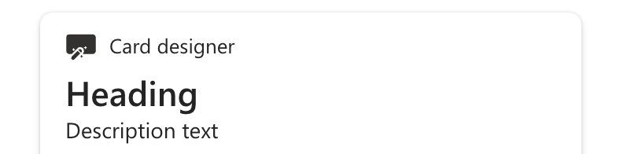
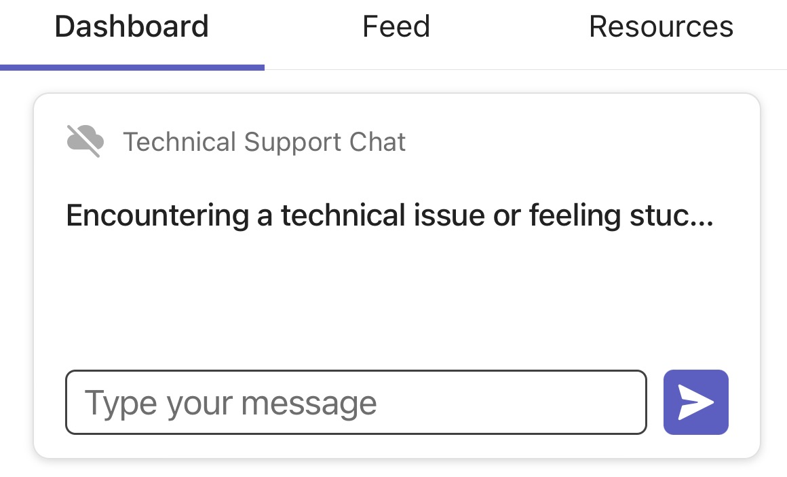
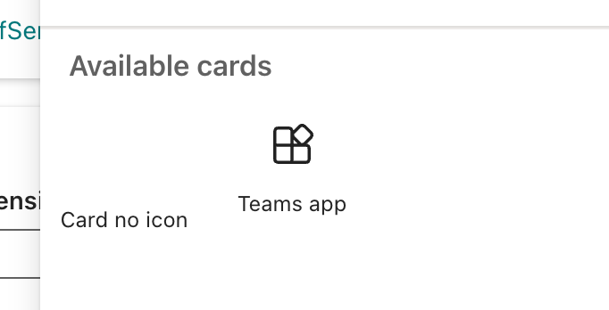
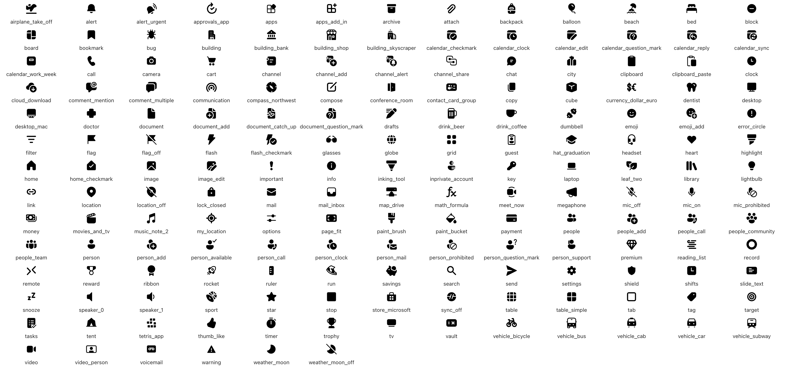

# Adaptive Card Extensions Iconography Limitations

Some existing limitations exist for using Fluent UI Iconography in Adaptive Card Extensions.

Currently, ACEs support the "Card Designer" set of icons listed in this article. This set of icons is a subset of [Fluent 2 (Fluent UI v9) iconography](https://github.com/microsoft/fluentui-system-icons/blobl/main/icons_filled.md). It means using ["Fluent 1" (Fluent UI v8 and mentioned) icons](https://developer.microsoft.com/fluentui#/styles/web/icons) is limited.

## Manifests value officeFabricIconFontName is partially supported

The `officeFabricIconFontName` manifest's property allows developers to use the Fluent icon displayed for the ACE in the Toolbox during an operator's editing session. By default (if not overridden in the code), the same icon is used in the card bar:

There are two limitations to this property:

1. Viva Connections for Mobile doesn't support arbitrary Fluent UI icons. Therefore, the icon could be missing in the card bar on mobile.

1. The toolbox doesn't support the "Card Designer" icons. Therefore, the icon could be missing in the toolbox.

The workaround is to override the [card bar's icon](/javascript/api/sp-adaptive-card-extension-base/icardbarparameters#@microsoft-sp-adaptive-card-extension-base-icardbarparameters-icon-member) property in the code.

## "Fluent 1" icons aren't supported for Text Input

In the SharePoint Framework (SPFx) v1.18, we introduced the ability to add a "text input" component to the Card View. This component allows developers to specify iconBefore, iconAfter, and button icons.

All these icons (names) should be either from the "Card Designer" set or a URL to a custom image (preferably an \*.svg).

## "Card Designer" Icons' Set

Here's the set of icons that ACEs fully support. This is a subset of [Fluent 2 iconography](https://github.com/microsoft/fluentui-system-icons/blob/main/icons_filled.md).

| Icon Name |
| --- |
| airplane_take_off |
| alert |
| alert_urgent |
| approvals_app |
| apps |
| apps_add_in |
| archive |
| attach |
| backpack |
| balloon |
| beach |
| bed |
| block |
| board |
| bookmark |
| bug |
| building |
| building_bank |
| building_shop |
| building_skyscraper |
| calendar_checkmark |
| calendar_clock |
| calendar_edit |
| calendar_question_mark |
| calendar_reply |
| calendar_sync |
| calendar_work_week |
| call |
| camera |
| cart |
| channel |
| channel_add |
| channel_alert |
| channel_share |
| chat |
| city |
| clipboard |
| clipboard_paste |
| clock |
| cloud_download |
| comment_mention |
| comment_multiple |
| communication |
| compass_northwest |
| compose |
| conference_room |
| contact_card_group |
| copy |
| cube |
| currency_dollar_euro |
| dentist |
| desktop |
| desktop_mac |
| doctor |
| document |
| document_add |
| document_catch_up |
| document_question_mark |
| drafts |
| drink_beer |
| drink_coffee |
| dumbbell |
| emoji |
| emoji_add |
| error_circle |
| filter |
| flag |
| flag_off |
| flash |
| flash_checkmark |
| glasses |
| globe |
| grid |
| guest |
| hat_graduation |
| headset |
| heart |
| highlight |
| home |
| home_checkmark |
| image |
| image_edit |
| important |
| info |
| inking_tool |
| inprivate_account |
| key |
| laptop |
| leaf_two |
| library |
| lightbulb |
| link |
| location |
| location_off |
| lock_closed |
| mail |
| mail_inbox |
| map_drive |
| math_formula |
| meet_now |
| megaphone |
| mic_off |
| mic_on |
| mic_prohibited |
| money |
| movies_and_tv |
| music_note_2 |
| my_location |
| options |
| page_fit |
| paint_brush |
| paint_bucket |
| payment |
| people |
| people_add |
| people_call |
| people_community |
| people_team |
| person |
| person_add |
| person_available |
| person_call |
| person_clock |
| person_mail |
| person_prohibited |
| person_question_mark |
| person_support |
| premium |
| reading_list |
| record |
| remote |
| reward |
| ribbon |
| rocket |
| ruler |
| run |
| savings |
| search |
| send |
| settings |
| shield |
| shifts |
| slide_text |
| snooze |
| speaker_0 |
| speaker_1 |
| sport |
| star |
| stop |
| store_microsoft |
| sync_off |
| table |
| table_simple |
| tab |
| tag |
| target |
| tasks |
| tent |
| tetris_app |
| thumb_like |
| timer |
| trophy |
| tv |
| vault |
| vehicle_bicycle |
| vehicle_bus |
| vehicle_cab |
| vehicle_car |
| vehicle_subway |
| video |
| video_person |
| voicemail |
| warning |
| weather_moon |
| weather_moon_off |
