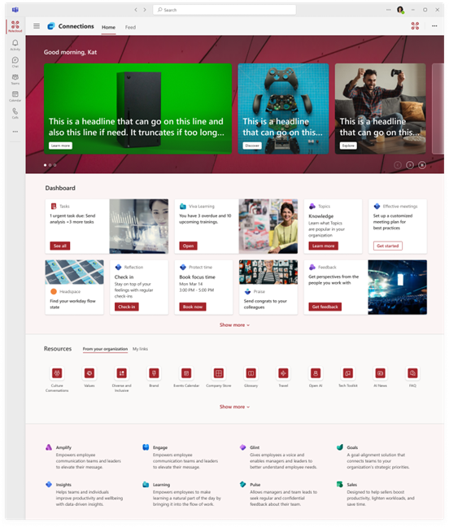
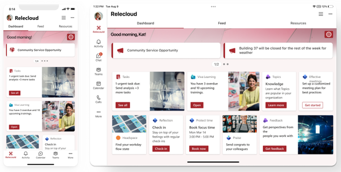

# Overview of Viva Connections Extensibility

[Microsoft Viva Connections](https://www.microsoft.com/microsoft-viva) is available as a desktop via the installable Microsoft Teams client, tablet and as mobile app in Microsoft Teams. All of these experiences, desktop & mobile, use the **SharePoint Framework (SPFx) or bots for all customizations and extensibility opportunities**.

Viva Connections has a set of out of the box cards that are exposed through the dashboard feature. This dashboard **can be adjusted and configured based on the company requirements**. You can introduce new cards and experiences based on your business requirements.

Viva Connections dashboard is available in the desktop, tablet and mobile experiences. It enables end users to easily access the most relevant information and applications directly for their role in the dashboard. You can personalize or introduce separate dashboards based on audiences, which can be created using your company requirements.

> [!TIP]
> See the [Extend Microsoft Viva Connections learning path](https://aka.ms/m365/dev/learn/connections) for a structured way to learn how you can extend Viva Connections, what tools you need, and how to get started.

## Extensibility opportunities

Viva Connections personalization and extensibility model is based on the **Adaptive Card Extensions (ACEs)** which can be created using the widely adopted SharePoint Framework (SPFx) as client-side extensibility or by using server-side implementations using a bot.

To learn more about customizing modern pages in SharePoint with SPFx, see [Overview of SPFx client-side web parts](../web-parts/overview-client-side-web-parts.md) & [Overview of SPFx Extensions](../extensions/overview-extensions.md).

### Viva Connections desktop experience

The Viva Connections desktop experience can be extended and customized using Adaptive Card Extensions (ACEs). Developers can use both SPFx and the bot powered option to introduce new Viva Connections Adaptive Card extensions to customize the dashboard based on the business requirements.

### Viva Connections mobile & tablet experience

The Viva Connections mobile experience is aligned with the desktop experience and is exposing by default the same ACEs as configured for the desktop area, optimized for the mobile experiences.

## Choosing the right model

Here are the considerations on choosing the right extensibility model for your deployment:

- SPFx created ACEs pattern is suitable for you when
  - Your team is familiar with client-side web stack development
  - You've built other extensibility to Microsoft 365 using SPFx - for SharePoint, Microsoft Teams, Office or Outlook
  - You want the extensibility to be automatically hosted in the Microsoft 365 without costs

- Bot powered ACEs is suitable for you when
  - You have an existing bot that is used in the Microsoft Teams - you can easily extend that to be exposed in the Viva Connections as well
  - You've implemented Microsoft 365 extensibility with server-side implementation hosted in Microsoft Azure

## Start building for Microsoft Viva Connections

Here are the resources to get started on creating your first Adaptive Card Extension (ACE) depending on your chosen path:

- [Build your first SharePoint Adaptive Card Extension with SPFx](get-started/build-first-sharepoint-adaptive-card-extension.md)
- [Overview of Bot Powered Adaptive Card Extensions](bot-powered/Overview-Bot-Powered-ACEs.md)
- [Building your first Bot Powered Adaptive Card Extension](bot-powered/Building-Your-First-Bot-Powered-ACE.md)
- [Advanced Card View Functionality](get-started/advanced-card-view-functionality.md)
- [Advanced Quick View Functionality](get-started/advanced-quick-view-functionality.md)
- [Adaptive Card Extensions and Teams Apps](get-started/adaptive-card-extensions-and-teams.md)
- [Microsoft Learning: Create Adaptive Card Extensions (ACE) for Microsoft Viva Connections](/training/modules/sharepoint-spfx-adaptive-card-extension-card-types)
