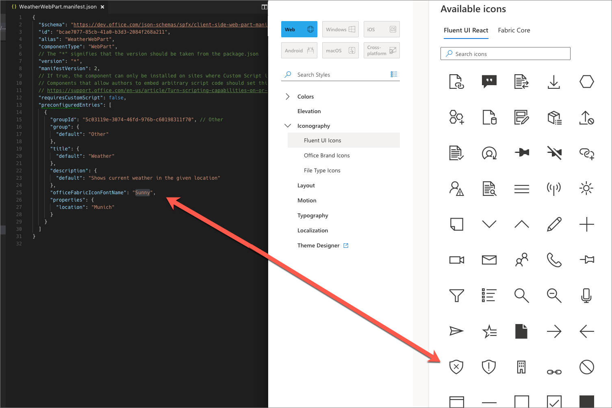
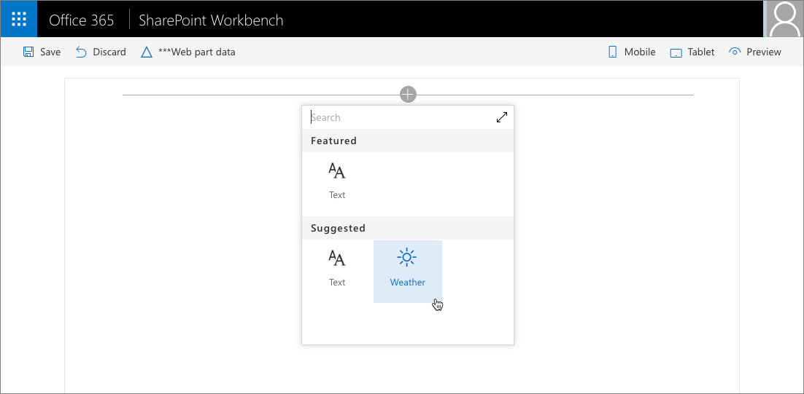
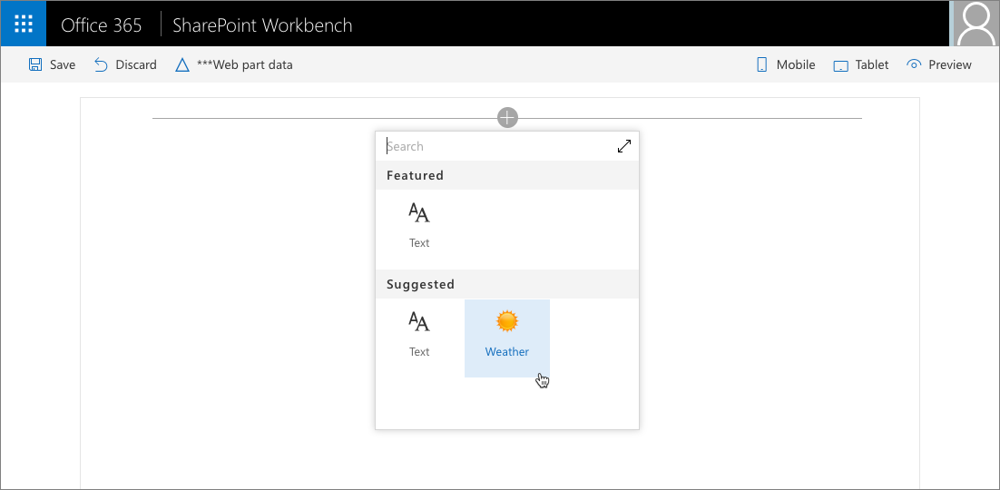

# Configure web part icon

Selecting an icon that illustrates the purpose of your SharePoint client-side web part makes it easier for users to find your web part among other all web parts available in the toolbox. 

## Preconfigure web parts

A web part icon is defined in the web part manifest as part of preconfigured entries. If you have a multipurpose web part that can be configured to meet different needs, each configuration can have a different icon indicating its purpose. 

Using a representative icon helps users find the web part they are looking for. For more information about preconfiguring your web parts, see [Simplify adding web parts with preconfigured entries](../guidance/simplify-adding-web-parts-with-preconfigured-entries.md).

SharePoint Framework offers you a number of ways to define the icon for your web part.

## Use Office UI Fabric icon font

One way to define the icon for your web part is by using the **officeFabricIconFontName** property. This property allows you to choose one of the icons offered as a part of Office UI Fabric.

For a list of available Office UI Fabric icons, see [Icons](https://developer.microsoft.com/en-us/fabric#/styles/icons).

### To use a specific icon

1. On the Office UI Fabric icons overview page, copy its name, and paste it as the value of the **officeFabricIconFontName** property in the manifest of your web part.

  

  ```json
  {
    "$schema": "https://dev.office.com/json-schemas/spfx/client-side-web-part-manifest.schema.json",
    "id": "bcae7077-85cb-41a0-b3d3-2084f268a211",
    "alias": "WeatherWebPart",
    "componentType": "WebPart",
    // The "*" signifies that the version should be taken from the package.json
    "version": "*",
    "manifestVersion": 2,
    // If true, the component can only be installed on sites where Custom Script is allowed.
    // Components that allow authors to embed arbitrary script code should set this to true.
    // https://support.office.com/en-us/article/Turn-scripting-capabilities-on-or-off-1f2c515f-5d7e-448a-9fd7-835da935584f
    "requiresCustomScript": false,
    "preconfiguredEntries": [
      {
        "groupId": "5c03119e-3074-46fd-976b-c60198311f70", // Other
        "group": {
          "default": "Other"
        },
        "title": {
          "default": "Weather"
        },
        "description": {
          "default": "Shows current weather in the given location"
        },
        "officeFabricIconFontName": "Sunny",
        "properties": {
          "location": "Munich"
        }
      }
    ]
  }
  ```

2. When adding your web part to the page, the selected icon is displayed in the toolbox.

  

The big benefit of this approach is that you don't need to deploy the icon image file along with your web part assets. Additionally, on computers using different DPI or other accessibility settings, the icon automatically adapts to these settings without losing quality.

## Use an external icon image

Although Office UI Fabric offers many images, when building web parts you might want to use something specific to your organization to clearly separate your web parts from other first- and third-party web parts visible in the toolbox.

In addition to using Office UI Fabric icons, SharePoint Framework also allows you to use images. 

### To use an image as a web part icon

1. Specify the image's absolute URL in the **iconImageUrl** property in the web part manifest.

  ```json
  {
    "$schema": "https://dev.office.com/json-schemas/spfx/client-side-web-part-manifest.schema.json",
    "id": "bcae7077-85cb-41a0-b3d3-2084f268a211",
    "alias": "WeatherWebPart",
    "componentType": "WebPart",
    // The "*" signifies that the version should be taken from the package.json
    "version": "*",
    "manifestVersion": 2,
    // If true, the component can only be installed on sites where Custom Script is allowed.
    // Components that allow authors to embed arbitrary script code should set this to true.
    // https://support.office.com/en-us/article/Turn-scripting-capabilities-on-or-off-1f2c515f-5d7e-448a-9fd7-835da935584f
    "requiresCustomScript": false,
    "preconfiguredEntries": [
      {
        "groupId": "5c03119e-3074-46fd-976b-c60198311f70", // Other
        "group": {
          "default": "Other"
        },
        "title": {
          "default": "Weather"
        },
        "description": {
          "default": "Shows current weather in the given location"
        },
        "iconImageUrl": "https://assets.contoso.com/weather.png",
        "properties": {
          "location": "Munich"
        }
      }
    ]
  }
  ```

2. The web part icon image displayed in the toolbox is 40x28px. If your image is bigger, it is sized proportionally to match these dimensions.

  

While using custom images gives you more flexibility to choose an icon for your web part, it requires you to deploy them along with your other web part assets. Additionally, your image might lose quality when displayed in higher DPI or specific accessibility settings. To avoid quality loss, you can use vector-based SVG images, which are also supported by the SharePoint Framework.

## Use a base64-encoded image

When using a custom image, rather than specifying an absolute URL to the image file hosted together with other web part assets, you can have your image base64-encoded and use the base64 string instead of the URL.

A number of services are available online that you can use to base64-encode your image; for more information, see [Convert your images to Base64](https://www.base64-image.de).

### To use a base64-encoded image

1. Encode the image.

2. Copy the base64 string and use it as the value for the **iconImageUrl** property in the web part manifest.

  ```json
  {
    "$schema": "https://dev.office.com/json-schemas/spfx/client-side-web-part-manifest.schema.json",
    "id": "bcae7077-85cb-41a0-b3d3-2084f268a211",
    "alias": "WeatherWebPart",
    "componentType": "WebPart",
    // The "*" signifies that the version should be taken from the package.json
    "version": "*",
    "manifestVersion": 2,
    // If true, the component can only be installed on sites where Custom Script is allowed.
    // Components that allow authors to embed arbitrary script code should set this to true.
    // https://support.office.com/en-us/article/Turn-scripting-capabilities-on-or-off-1f2c515f-5d7e-448a-9fd7-835da935584f
    "requiresCustomScript": false,
    "preconfiguredEntries": [
      {
        "groupId": "5c03119e-3074-46fd-976b-c60198311f70", // Other
        "group": {
          "default": "Other"
        },
        "title": {
          "default": "Weather"
        },
        "description": {
          "default": "Shows current weather in the given location"
        },
        "iconImageUrl": "data:image/svg+xml;base64,PD94bWwgdmVyc2lvbj0iMS4wIiBlbmNvZGluZz0iVVRGLTgiPz4KPHN2ZyB3aWR0aD0iMTAyMiIgaGVpZ2h0PSI5NzgiIHhtbG5zPSJodHRwOi8vd3d3LnczLm9yZy8yMDAwL3N2ZyIgeG1sbnM6c3ZnPSJodHRwOi8vd3d3LnczLm9yZy8yMDAwL3N2ZyI+CiA8Zz4KICA8dGl0bGU+TGF5ZXIgMTwvdGl...",
        "properties": {
          "location": "Munich"
        }
      }
    ]
  }
  ```

<br/>

Base64 encoding works for both bitmap images, such as PNG, as well as vector SVG images. The big benefit of using base64-encoded images is that you don't need to deploy the web part icon image separately.


## Additional considerations

Each web part must have an icon. If you specify the web part icon by using both the **officeFabricIconFontName** and the **iconImageUrl** properties, the icon specified in the **officeFabricIconFontName** is used. 

If you choose not to use an Office UI Fabric icon, you have to specify a URL in the **iconImageUrl** property.

## See also

- [SharePoint Framework Overview](../../sharepoint-framework-overview.md)