# Design considerations for SharePoint client-side web parts

To get started designing web parts, you need to be familiar with [Office UI Fabric](https://developer.microsoft.com/en-us/fabric). All of the styles from [Fabric Core](https://github.com/OfficeDev/office-ui-fabric-core), including icons, typography, color usage, animation, and the responsive grid, are loaded by default and available to your web part. 

Do not import a copy of Fabric for your web part because this may conflict with the global copy. These classes provide a foundation to your web part's styling, which you can always depart from if you require different visuals to match your company's brand.

## Office UI Fabric React components

Along with Office UI Fabric, you can use Office UI Fabric React components to build your web parts. Fabric React is a responsive, mobile-first collection of components designed to make it quick and simple for you to create web experiences by using the Office Design Language.

The following To Do list example uses Fabric components in the property pane that lets the page author configure a web part.

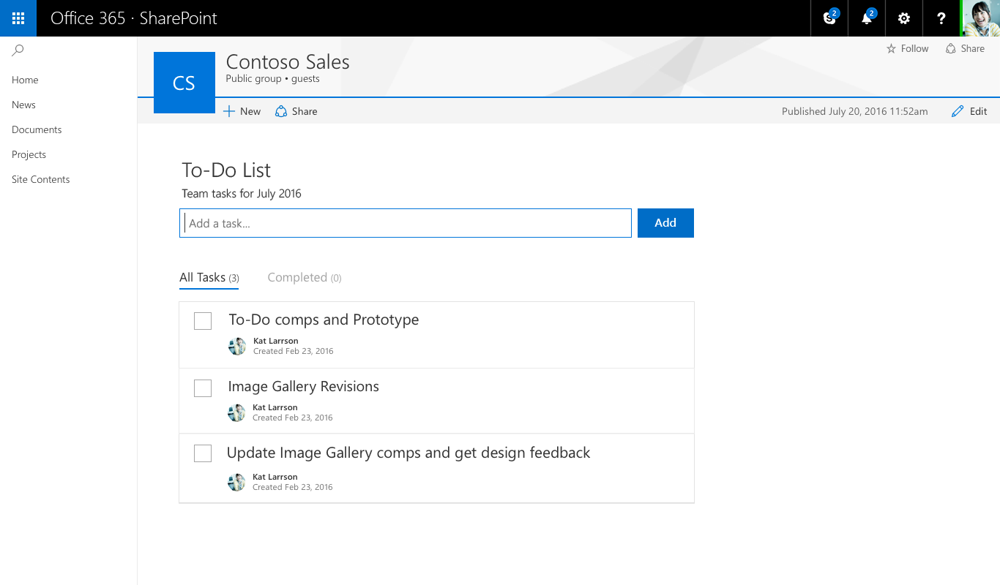

You can find a complete list of the Office UI Fabric styles, typography, color, icons, and animations at [Office UI Fabric styles](https://developer.microsoft.com/en-us/fabric#/styles).

## Responsive behavior

Pages in the new SharePoint authoring experience use the Office UI Fabric responsive grid to help ensure that each page looks great. 

### Maximum width

We recommend that all web parts use a 100% maximum width to ensure that they re-flow and function properly on any page. The page and column widths are defined by the page template but can be modified by the author. If a maximum pixel value is set in the web part, there could be unexpected results in both functionality and layout when the page is seen at different widths.

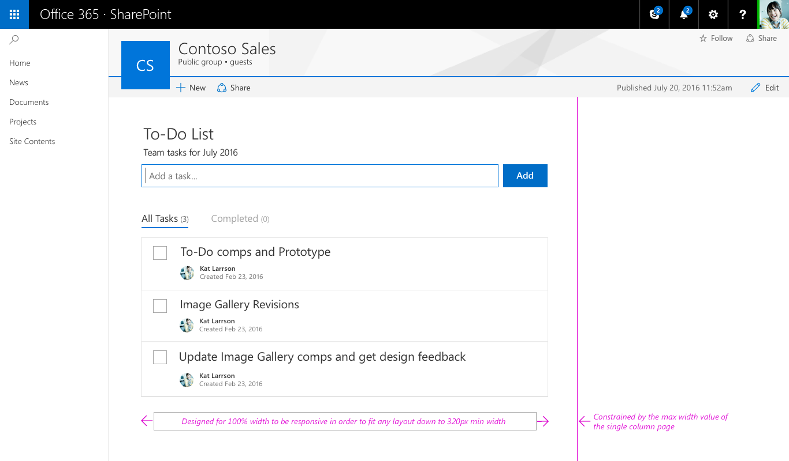

### Minimum width

All web parts should be designed to reflow as the page/column width gets smaller down to a minimum width of 320 px.

 

## Web part Edit mode

The new SharePoint page authoring experience has two modes:

* **Published mode**, which allows your team or audience to view content and interact with web parts.
* **Edit mode**, which allows page authors to add and configure web parts to add content to a page.

The following sections describe Edit mode.

### Add hint and Toolbox

The add hint is a horizontal line with a plus icon that is visible when a web part is selected and on hover to indicate where page authors can add new web parts to their page. The toolbox opens when a user selects the plus icon. The toolbox contains all the web parts that can be added to a page.

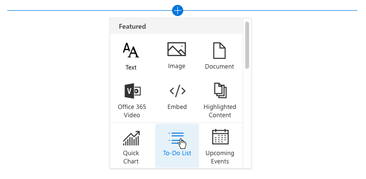

### Toolbar

A vertical toolbar and bounding box is part of the framework for every web part and provided by the page. Each web part has an edit and delete action in the toolbar.

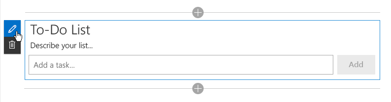

### Contextual edits

A WYSIWYG experience should be designed for web parts to fill in information or add content that is displayed to the user when published. Entering this content should be done on the page so that the user understands how the viewer sees the content. For example, titles and descriptions should be filled out where the text displays, or new tasks should be added and modified in context of the page.

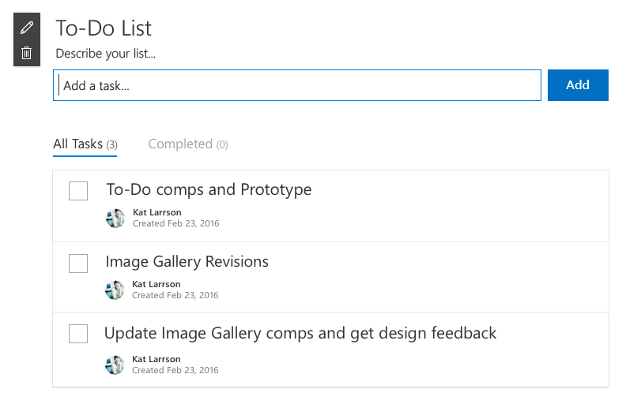

### Item-level edits

UI can change within the web part; for example, turning text into a text field to fill out links or when displaying UI to reorder items or to check tasks in a web part.

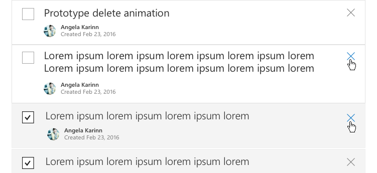

## Property panes

Property panes are invoked via the edit action icon on the toolbar. Panes should primarily contain configuration settings that enable/disable features that either show on the page or that make a call to a service to display content.

There are three types of property panes to enable you to design and develop web parts that fit your business or customer needs.

### Single pane

A single pane is used for simple web parts that only have a small number of properties to configure.

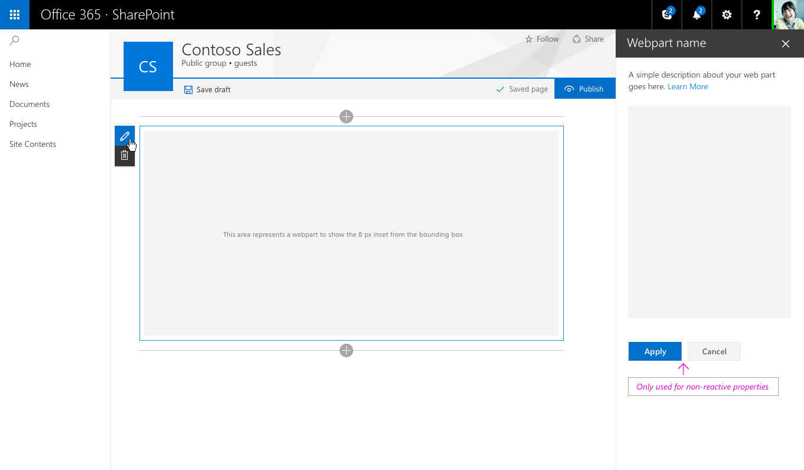

### Accordion pane

An accordion pane is used for containing a group or groups of properties with many options and where the groups would result in a long scrolling list of options. For example, you might have three groups named Properties, Appearance, and Layout, each with ten components.

#### Accordion - One group open

#### Accordion - Two groups open and scrolled

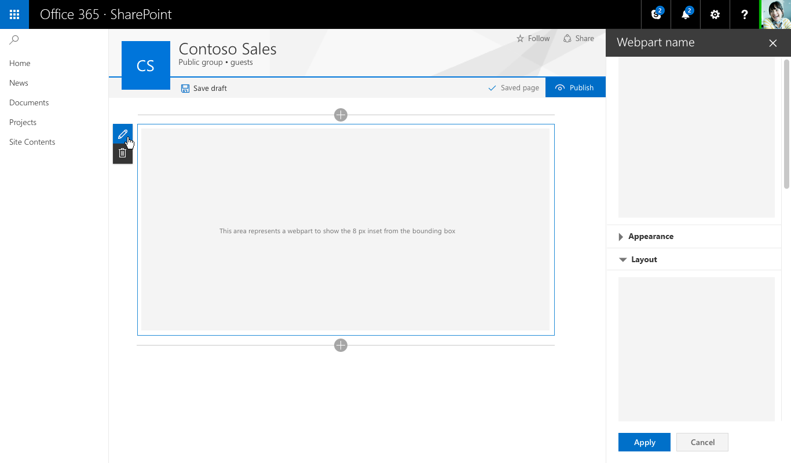

### Property pane steps/pages

A steps pane is used for grouping properties in multiple steps or pages when you need the web part to be configured in a linear order, or when choices made on the first step affect options that display on the second step.

#### Step 1 of 3

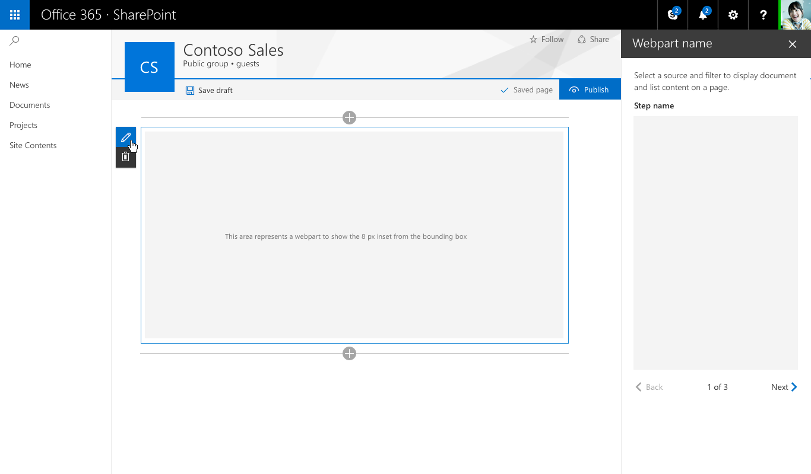

#### Step 2 of 3

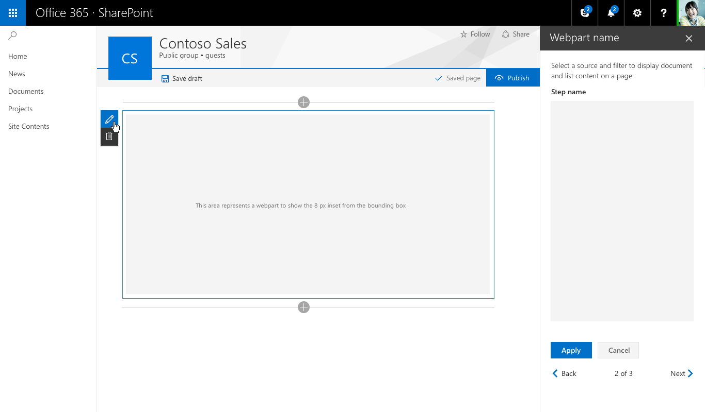

#### Step 3 of 3

## Reactive vs non-reactive web parts

**Reactive web parts** are designed to be full client-side web parts, which means that each component that is configured in the properties pane reflects the change made within the web part on the page. For the To-Do List web part, unchecking “Completed Tasks” hides this view in the web part.

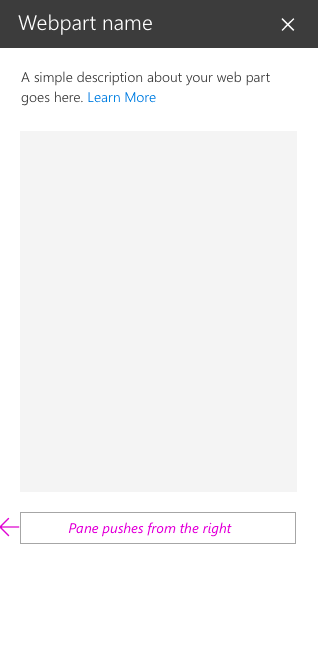

**Non-reactive web parts** are not fully client-side, and generally one or more properties need to make a call to set/pull or store data on a server. In this case, you should enable the Apply and Cancel buttons at the bottom of the properties pane.

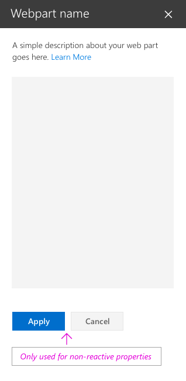

## Constructing the To-Do List property pane

The To-Do List example uses the single pane and is a reactive web part. The following diagrams show each Fabric React component and the resulting design.

#### Adding a description for To-Do List

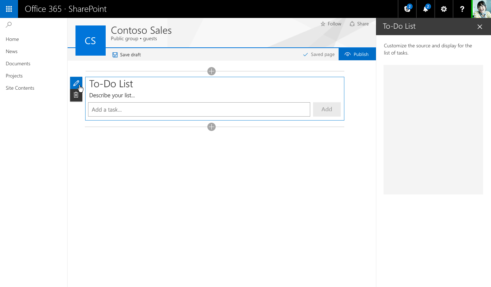

#### Dropdown – to select tasks from an existing list

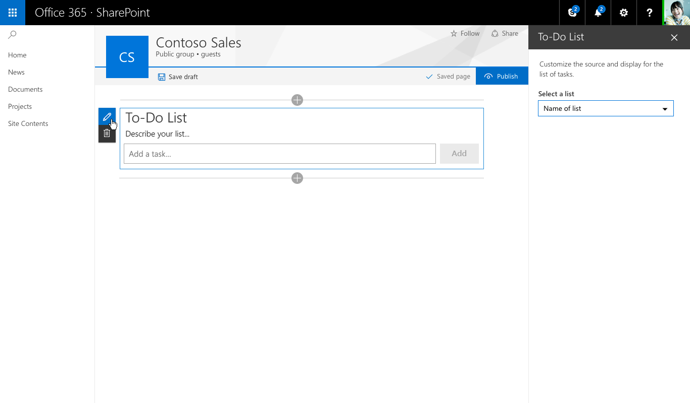

#### Check box – to allow authors to show or hide different views

#### Slider – to set the number of tasks visible

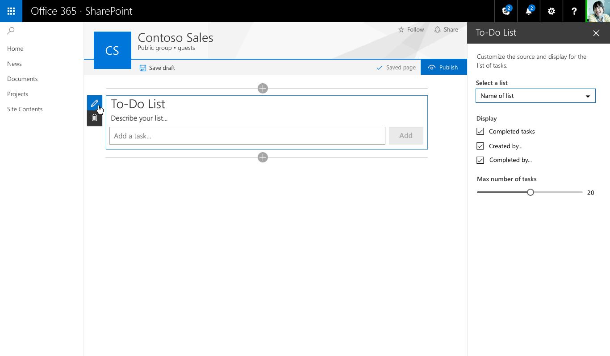

#### After selecting a list from the dropdown, the web part shows an indicator of items loading onto the page

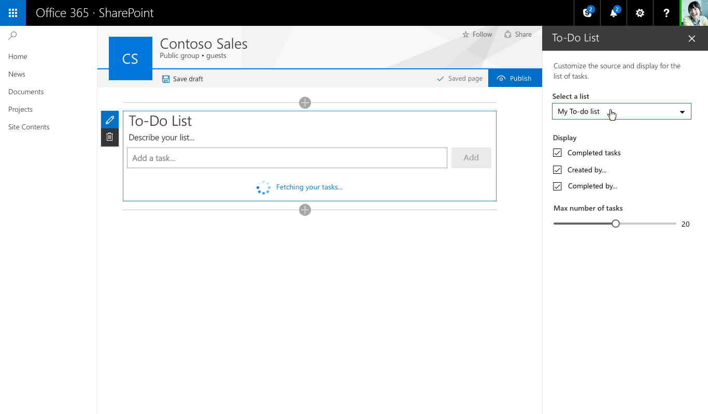

#### When the new tasks are loaded, they fade into view by using animation styles from Office UI Fabric

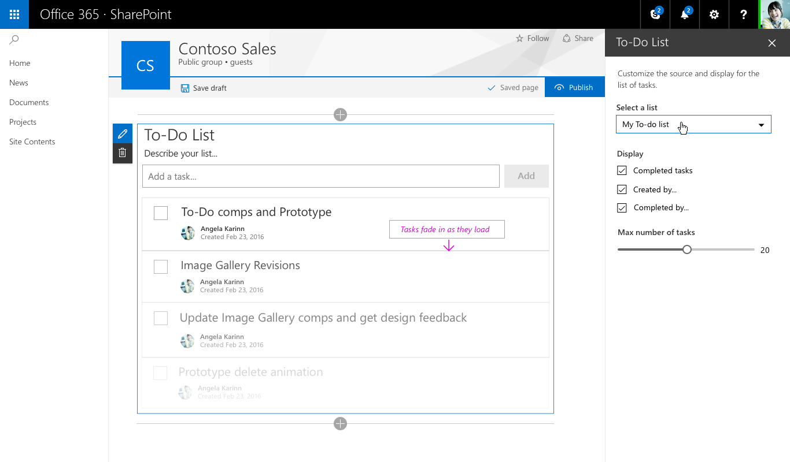

## See also

- [Designing a SharePoint web part](../../../design/design-a-web-part.md)
- [Designing great SharePoint experiences](../../../design/design-guidance-overview.md)
