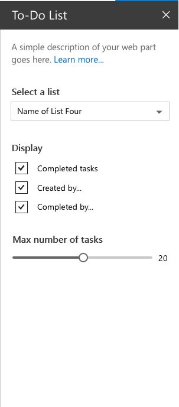

# Integrate your SharePoint client-side web part with the property pane

The property pane allows end users to configure the web part with a bunch of properties. The article [Build your first web part](../get-started/build-a-hello-world-web-part) describes how the property pane is defined in the **HelloWorldWebPart** class. The property pane properties are defined in  **propertyPaneSettings**.

The following figure shows an example of a property pane in SharePoint.



The property pane has three key metadata:

* Pages
* Header
* Groups

Pages provide you the flexibility to separate complex interactions and put them into one or more pages. Pages then contain Header and Groups.

Header allows you to define the title of the property pane and Groups let you define the various sections for the property pane through which you want to group your field sets. 

A property pane should contain a page, an optional header, and at least one group.

Property fields are then defined inside a group. 

## Using the property pane

The following code example initializes and configures the property pane in your web part. You create a method of type **IPropertyPaneSettings** and return a collection of property pane page(s).

```ts
protected get propertyPaneSettings(): IPropertyPaneSettings {
  return {
    pages: [
      {
        header: {
          description: strings.PropertyPaneDescription
        },
        groups: [
          {
            groupName: strings.BasicGroupName,
            groupFields: [
              PropertyPaneTextField('description', {
                label: strings.DescriptionFieldLabel
              })
            ]
          }
        ]
      }
    ]
  };
}
```

### Property pane fields

The following field types are supported:

* Label
* Textbox
* Multi-line Textbox
* Checkbox
* Dropdown
* Link
* Slider
* Toggle
* Custom

The field types are available as modules in **sp-client-platform**. They require an import before you can use them in your code:

```ts
import {
  PropertyPaneTextField,
  PropertyPaneCheckbox,
  PropertyPaneLabel,
  PropertyPaneLink,
  PropertyPaneSlider,
  PropertyPaneToggle,
  PropertyPaneDropdown
} from '@microsoft/sp-client-preview';
```

Every field type constructor is defined as follows, taking **PropertyPaneTextField** as an example:

```ts
PropertyPaneTextField('targetProperty',{
  //field properties are defined here
})
```

**targetProperty** defines the associated object for that field type and is also defined in the props interface in your web part.

To assign types to these properties, define an interface in your web part class that includes one or more target properties.

```ts
export interface IHelloWorldWebPartProps {
    targetProperty: string
}
```

This is then available in your web part using **this.properties.targetProperty**.

```ts
<p class="ms-font-l ms-fontColor-white">${this.properties.description}</p>
```

When the properties are defined, you can access them in your web part using the **this.properties.<property-value>**. For details, see [**render** method of the **HelloWorldWebPart**](../get-started/build-a-hello-world-web-part#web-part-render-method):

## Handling field changes

The property pane has two interaction modes:

* Reactive
* Non-reactive

In reactive mode, on every change, a change event is triggered. Reactive behavior automatically updates the web part with the new values.

While reactive mode is sufficient for many scenarios, at times you will need non-reactive behavior. Non-reactive does not update the web part automatically unless the user confirms the changes.

## Custom field example

Add the following field definition in a **groupFields** array.

```ts
{
  type: IPropertyPaneFieldType.Custom,
  targetProperty: 'custom',
  properties: {
    onRender: this._customFieldRender.bind(this),
    value: undefined,
    context: undefined
  }
}
```

Add the following types to the **@microsoft/sp-client-platform** imports.

```ts
IPropertyPaneFieldType,
IOnCustomPropertyFieldChanged
```

Add the following private method to render the custom field.

```ts
private _customFieldRender(elem: HTMLElement, context: any, onChanged?: IOnCustomPropertyFieldChanged): void {
    elem.innerHTML = '<input id="password" type="password" name="password" class="ms-TextField-field">';
}
```
