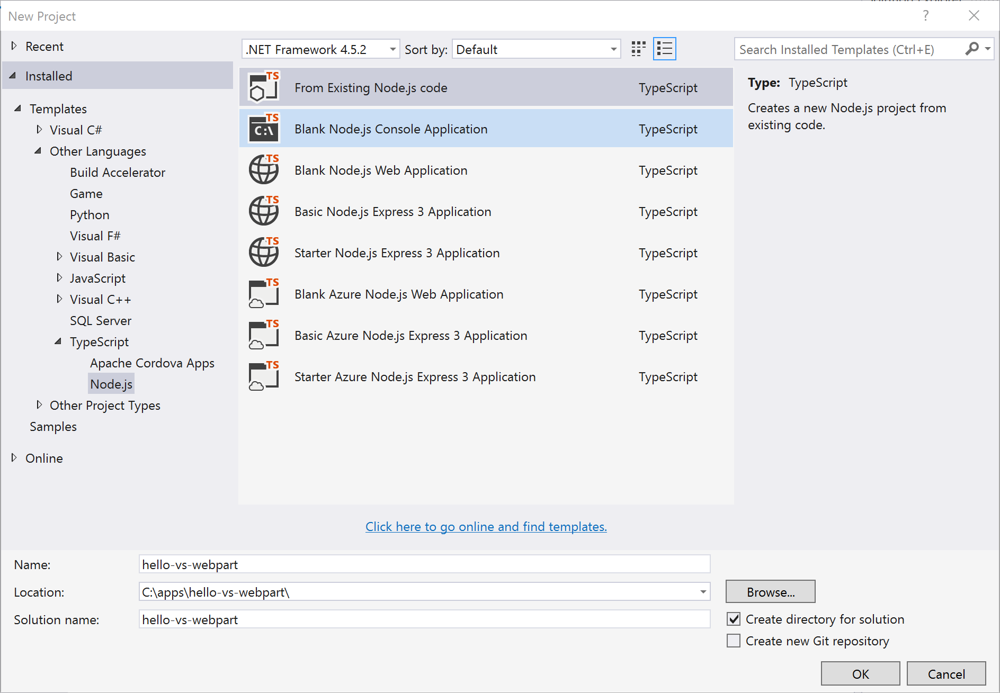
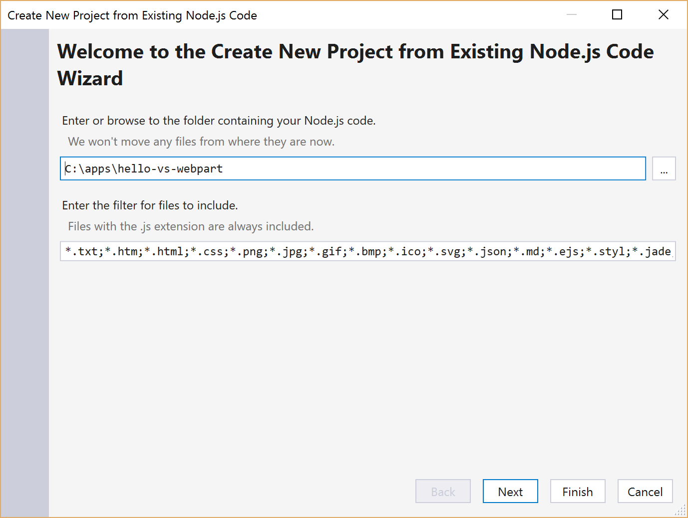
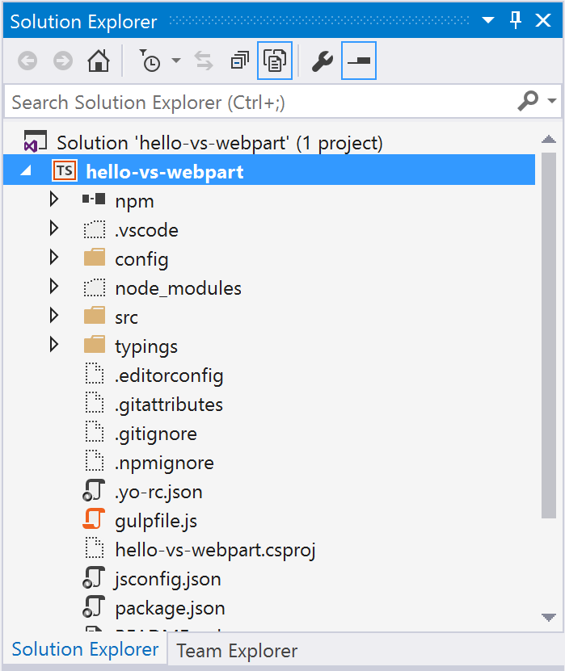
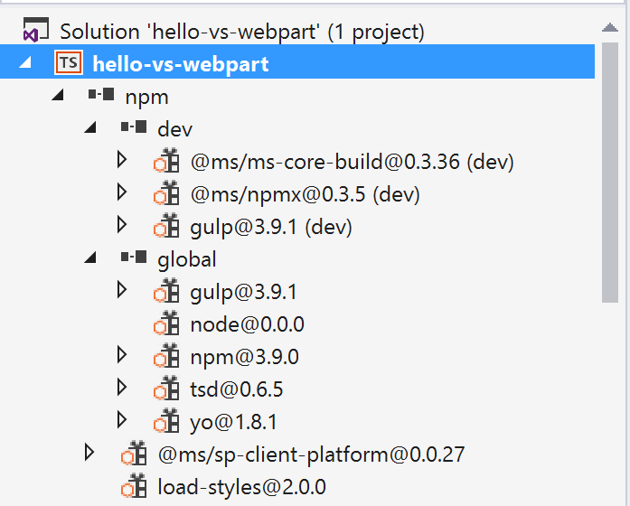

# Use Visual Studio to develop SharePoint client-side web parts

>**Note:** The SharePoint Framework is currently in preview and is subject to change. SharePoint Framework client-side web parts are not supported for use in production environments.

The SharePoint Framework is client-side driven and uses a variety of open source tools to enable SharePoint development. The framework relies on node and npm to provide you with a local and debug runtime environment and a robust package ecosystem. Tools like gulp and webpack  depend on the availability of node runtime environment.

## Node.js Tools for Visual Studio

With the help of [Node.js Tools for Visual Studio](https://www.visualstudio.com/en-us/features/node-js-vs.aspx), you can use Visual Studio as your primary IDE for building client-side web parts and applications. Node.js Tools for Visual Studio is a free, open source plugin that turns Visual Studio into a Node.js IDE. It is designed, developed, and supported by Microsoft and the community, just like the SharePoint Framework.

## Install Visual Studio tools

To use Visual Studio, install the following:

* [Visual Studio 2015](https://go.microsoft.com/fwlink/?LinkId=691978&clcid=0x409)
* [Visual Studio Update 3 or later](https://www.visualstudio.com/en-us/news/releasenotes/vs2015-update3-vs)
* [Node.js Tools for Visual Studio](https://aka.ms/getntvs)

## Load a SharePoint client-side project in Visual Studio

With little effort, you can load your SharePoint client-side project into Visual Studio by using the following steps.

>**Note:** This content applies to the SharePoint Framework Developer Preview. Integration with Visual Studio will improve in later releases.

### Yo SharePoint

The first step is to create the SharePoint client-side project. Use the Yeoman SharePoint Generator to create the project.

1. Create a new project directory in your favorite location:
	
	   ```
	   md hello-vs-webpart
	   ```

2. Go to the project directory:

	   ```
	   cd hello-vs-webpart
   ```

3. Create a new client-side web part project by running the Yeoman SharePoint Generator:

	   ```
	   yo @microsoft/sharepoint
	   ```

### Import your project into Visual Studio

There are two ways to open your client-side project in Visual Studio. Use the steps that work best for you.

If opening the **.njsproj** doesn't work for you, you can try importing the client-side solution project into Visual Studio. 

#### Open Visual Studio and create a new project

1. In the **New Project** dialog box, select the **Templates > Other languages > TypeScript >Node.js** and then **From Existing Node.js code** project template.
Name the project the same name as your SharePoint client-side project, that is, *hello-vs-webpart*. Choose the location of the client-side project for the location, and choose **OK**.

   	

2. In the project wizard, choose the client-side project folder, and choose **Next** to continue.

  	

3. Choose **Next** to continue.

4. Verify the save location for your project. Visual Studio should show the same client-side project folder as the location to save your Node.js project file.

5. Choose **Finish** to import the client-side project into Visual Studio.

   

## Explore the project

Now that Visual Studio has imported your client-side project, take a moment to explore the project in Visual Studio.



Notice how you got an npm package explorer as well (found by extending npm node in the project):



### Modify gulpfile.js

Open gulpfile.js in the root of the project and change the initial declaration of the variables from *let* to *var*.

```
  var gulp = require('gulp');
  var build = require('@microsoft/sp-build-web');
```

> **Note:** This is a temporary workaround because Visual Studio does not support ES6 yet.

### Set up the project startup File

In the project properties, change the following properties to their corresponding values as shown to launch the project from within Visual Studio (F5).

* **Script (startup file)**: node_modules\gulp\bin\gulp.js
* **Script arguments**: serve


### Build and debug the project

Your client-side project is now set up to work with Visual Studio. Press F5 to build and debug your project in your favorite browser.

#### Notes on debugging

JavaScript client-side development has relied on browser developer tools that provide a robust environment to debug web applications. While Visual Studio provides the key integration into SharePoint client-side projects, browser developer tools are still the primary tool to debug your client-side projects. 

All major browsers have developer tools:

* Chrome - [Chrome developer tools](https://developer.chrome.com/devtools)
* Internet Explorer - [IE developer tools](https://msdn.microsoft.com/en-us/library/gg589507(v=vs.85).aspx)
* Microsoft Edge - [Microsoft Edge developer tools](https://developer.microsoft.com/en-us/microsoft-edge/platform/documentation/f12-devtools-guide/)
* Firefox - [Firefox developer tools](https://developer.mozilla.org/en-US/docs/Tools)


#### Task runner explorer - executing other tasks

The SharePoint Framework comes with a set of gulp tasks to simplify packaging your client-side solution and uploading your assets to CDN. You can use the following commands to access them:

```
gulp package-solution
gulp deploy-azure-storage
```

You will use Visual Studio's Task Runner to explore and execute the available commands within the client-side project. To open the Task Runner window, either:

* Choose **Ctrl+Alt+BkSpace**.
* Go to the following menu item: **View** > **Other Windows **> **Task Runner Explorer**


Task Runner Explorer makes is easier to view available gulp commands and run them when needed. Just right-click on a gulp command to reveal the context menu to run a specific command. 

