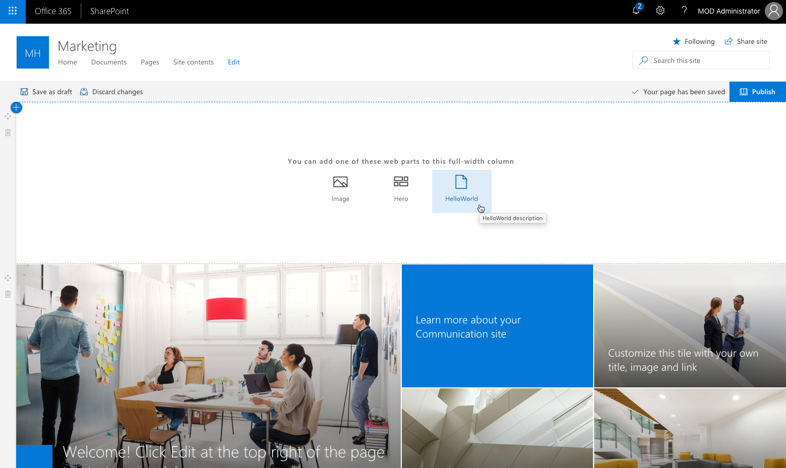

# Use SPFx web parts with the full-width column

Modern SharePoint pages support layouts that allow users to organize the information they present on their pages. Users can choose from a number of different section layouts such as two columns, three columns, or one-third column. Modern pages in communication sites offer an additional section layout named **Full-width column**. This layout spans the full width of the page without any horizontal margin or padding. SharePoint Framework web parts can be placed in any layout, but due to extra requirements, web parts must explicitly enable support for the full-width column.

## Layout requirements for the full-width column

One thing that regular layouts in modern SharePoint pages share, is the maximum width. To guarantee the ease of readability and usability, the body of a modern page doesn't expand beyond a certain width. When building web parts that will be used in regular layouts, you test your web part's width against the known maximum and minimum width constraints to ensure that they are displayed properly.

When working with the full-width column layout, however, things become a bit more complicated as that layout expands to the full width of the page. When displayed on an ultra-wide monitor, the full-width column can even become a few thousand pixels wide. This introduces additional testing requirements that you should take into account when building web parts that can be used in the full-width column.

## Enable support for the full-width column

By default, SharePoint Framework client-side web parts cannot be placed in full-width column layouts. To allow users to add your web part to full-width columns, in the web part manifest (*the `*.manifest.json` file adjacent to the web part `*.ts` file*) set the `supportsFullBleed` property to `true`.

```json
{
  "$schema": "https://dev.office.com/json-schemas/spfx/client-side-web-part-manifest.schema.json",
  "id": "34f6d7f2-262f-460a-8b65-152d784127cb",
  "alias": "HelloWorldWebPart",
  "componentType": "WebPart",

  // The "*" signifies that the version should be taken from the package.json
  "version": "*",
  "manifestVersion": 2,

  // If true, the component can only be installed on sites where Custom Script is allowed.
  // Components that allow authors to embed arbitrary script code should set this to true.
  // https://support.office.com/en-us/article/Turn-scripting-capabilities-on-or-off-1f2c515f-5d7e-448a-9fd7-835da935584f
  "requiresCustomScript": false,
  "supportsFullBleed": true,

  "preconfiguredEntries": [{
    "groupId": "5c03119e-3074-46fd-976b-c60198311f70", // Other
    "group": { "default": "Other" },
    "title": { "default": "HelloWorld" },
    "description": { "default": "HelloWorld description" },
    "officeFabricIconFontName": "Page",
    "properties": {
      "description": "HelloWorld"
    }
  }]
}
```

With this setting enabled, when you edit a page with a full-width column layout, your web part will be displayed among the web parts that can be added to the column.



>At this time, the SharePoint Workbench doesn't support testing web parts in the full-width column layout. Instead, you will have to deploy your web part to a developer tenant, create a communication site, and test your web part there.
