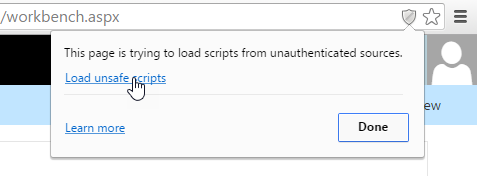

# Connect your client-side web part to SharePoint

>The SharePoint Framework is currently in Preview, and is subject to change based on customer feedback.  While we’re in preview, SharePoint Framework web parts are not supported for use in production environments.

## Tutorial 2 Overview
In this tutorial, we will continue with the web part project we created in the previous tutorial [HelloWorld Web Part](https://github.com/SharePoint/sp-dev-docs/wiki/HelloWorld-WebPart)

Each step below will build on the previous so you will need to go through each step one by one to successfully complete this tutorial.

## Step 1: Project directory
You should still have the `gulp serve` command running in your console.

If not, make sure you are still in the `helloworld-webpart` project directory. If not, navigate to that directory in the console, and run `gulp serve`:

```
cd helloworld-webpart
gulp serve
```

## Step 2: Getting access to page context
When the workbench is hosted locally, you do not have the SharePoint page context. This enables you to test your web part in many different ways. For example, you can concentrate on building the web part's UX and use mock data to simulate SharePoint interaction when you don't have the SharePoint context.

However, when the workbench is hosted in SharePoint, you get access to the page context which provides various key properties, such as:
* Web title
* Web absolute URL
* Web server-relative URL
* User login name

You can get access to the page context using the following variable in your web part class:

```ts
this.context.pageContext
```

Switch to Visual Studio code and open `src\webparts\helloWorld\HelloWorldWebPart.ts`

Inside the `render` method, replace the `innerHTML` code block with the following:

```ts
    this.domElement.innerHTML = `
      <div class='${styles.helloWorld}'>
        <div class='${styles.container}'>
          <div class='ms-Grid-row ms-bgColor-themeDark ms-fontColor-white ${styles.row}'>
            <div class='ms-Grid-col ms-u-lg10 ms-u-xl8 ms-u-xlPush2 ms-u-lgPush1'>
              <span class='ms-font-xl ms-fontColor-white'>Welcome to SharePoint!</span>
              <p class='ms-font-l ms-fontColor-white'>Customize SharePoint experiences using Web Parts.</p>
              <p class='ms-font-l ms-fontColor-white'>${this.properties.description}</p>
              <p class='ms-font-l ms-fontColor-white'>Loading from ${this.context.pageContext.web.title}</p>
              <a href='https://github.com/SharePoint/sp-dev-docs/wiki' class='ms-Button ${styles.button}'>
                <span class='ms-Button-label'>Learn more</span>
              </a>
            </div>
          </div>
      </div>
    </div>`;
```

Notice how we are using `${ }` to output the variable's value in the HTML block.

We have added an extra HTML `p` tag to display `this.context.pageContext.web.title`.

Since we are loading from local environment, the title will be `Local Workbench`.

Save the file. The `gulp serve` running in your console will detect this save operation and:
* Build and bundle the updated code automatically
* Refresh your local workbench page (as the web part code needs to be reloaded)

> Keep the console window and VS Code side by side to see gulp automatically compile as you save the file in the VS Code.

In your browser, navigate to the `workbench.html` running locally. If you have already closed the tab, the URL is:

```
http://localhost:4321/temp/workbench.html
```

You should see the following in the web part:


Now navigate to `workbench.aspx` hosted in SharePoint, which should be:

```
https://your-sharepoint-site-url/Shared%20Documents/workbench.aspx
```

By default, your browser is configured to not load scripts from localhost. Workbench will notify you if that is the case:

 

In order to execute local scripts, in the Chrome browser, click the grey shield in the right side of the address bar to load unsafe scripts. This is due to loading scripts over HTTP while connected to a page via HTTPS.



You should now see your SharePoint site URL in the web part as page context is available to you:


## Step 3: Define list model
Lets define our models before proceeding. As we will retrieve the lists, we need two models. 

Switch to Visual Studio Code and navigate to `src\webparts\helloWorld\HelloWorldWebPart.ts`

Define the following `interface` models just above `HelloWorldWebPart' class:

```ts
export interface ISPLists {
  value: ISPList[];
}

export interface ISPList {
  Title: string;
  Id: string;
}
```

The `ISPList` holds the SharePoint list info we are connecting to. 

## Step 4: Retrieve lists from mock store
We should make sure the local workbench also works. So, we can build a mock that returns mock data.

### Build the MockHttpClient
Create a new file inside `src\webparts\helloWorld` folder called `MockHttpClient.ts`

Copy the following code into `MockHttpClient.ts`

```ts
import { ISPList } from './HelloWorldWebPart';

export default class MockHttpClient {

    private static _items: ISPList[] = [{ Title: 'Mock List', Id: '1' }];

    public static get(restUrl: string, options?: any): Promise<ISPList[]> {
      return new Promise<ISPList[]>((resolve) => {
            resolve(MockHttpClient._items);
        });
    }
}
```

Save the file.

Things to note in the code above:
* Notice the `import` statement. As there are multiple `exports` in the `HelloWorldWebPart.ts`, we specify which one to import using `{ }`. In this case, we are interested only with the data model `ISPList`.
* You do not need to type the file extension when importing from the default module which in our case is the `HelloWorldWebPart`. 
* We export the `MockHttpClient` class as a default module which will enable us to import in other files.
* We build the initial `ISPList` mock array and return.

### Method to retrieve mock data
We can now use the `MockHttpClient` class we defined above in our `HelloWorldWebPart` class.

To do so, we first need to import the `MockHttpClient` module.

Switch to `HelloWorldWebPart.ts` file.

Copy the following code just below `import { IHelloWorldWebPartProps } from './IHelloWorldWebPartProps';`

```ts
import MockHttpClient from './MockHttpClient';
```
 
Add the following private method to mock list retrieval inside the `HelloWorldWebPart` class:

```ts
private _getMockListData(): Promise<ISPLists> {
    return MockHttpClient.get(this.context.pageContext.web.absoluteUrl).then(() => {
        const listData: ISPLists = {
            value:
            [
                { Title: 'Mock List One', Id: '1' },
                { Title: 'Mock List Two', Id: '2' },
                { Title: 'Mock List Three', Id: '3' }
            ]
            };

        return listData;
    }) as Promise<ISPLists>;
}
```

Save the file.

## Step 5: Retrieve lists from SharePoint site
Lets now write the code to retrieve lists from the current site. We will use SharePoint REST APIs to retrieve the lists from the site, which is:

```
https://yourtenantprefix.sharepoint.com/_api/web/lists
```

### Method to retrieve lists from SharePoint
Lets now add the following private method to retrieve lists from SharePoint:

Add the following private method to retrieve lists from SharePoint inside the `HelloWorldWebPart` class:

```ts
private _getListData(): Promise<ISPLists> {
return this.context.httpClient.get(this.context.pageContext.web.absoluteUrl + `/_api/web/lists?$filter=Hidden eq false`)
    .then((response: Response) => {
    return response.json();
    });
}
```

In the method above, we are using a helper class `httpClient` available in the SharePoint client-side platform to execute the REST API. Notice we use the `ISPLists` model and that we are also applying a *filter to not retrieve hidden lists*.

Save the file. 

Switch to console running `gulp serve` and check to see if you have any errors. If you have, you should see gulp reporting them in the console.

## Step 6: Add new styles
SharePoint Framework uses [Sass](http://sass-lang.com/) as the CSS pre-processor and specifically uses the [SCSS syntax](http://sass-lang.com/documentation/file.SCSS_FOR_SASS_USERS.html) which is fully complaint with normal CSS syntax. Sass extends CSS language and allows you to use features like variables, nested rules, inline imports in to organize and create efficient style sheets for your web parts. The SharePoint Framework already comes with a SCSS compiler that converts your Sass files to normal CSS files and also provides a typed version to use it in during development.

To add new styles, open `HelloWorld.module.scss`. This is the SCSS file where you will define your styles.

By default, the styles are scoped to your web part. You can see that as the styles are defined under `.helloWorld`.

Add the following styles after the `.button` style:

```css
.list {
  color: #333333;
  font-family: 'Segoe UI Regular WestEuropean', 'Segoe UI', Tahoma, Arial, sans-serif;
  font-size: 14px;
  font-weight: normal;
  box-sizing: border-box;
  margin: 10;
  padding: 10;
  line-height: 50px;
  list-style-type: none;
  box-shadow: 0 4px 4px 0 rgba(0, 0, 0, 0.2), 0 25px 50px 0 rgba(0, 0, 0, 0.1);
}

.listItem {
  color: #333333;
  vertical-align: center;
  font-family: 'Segoe UI Regular WestEuropean', 'Segoe UI', Tahoma, Arial, sans-serif;
  font-size: 14px;
  font-weight: normal;
  box-sizing: border-box;
  margin: 0;
  padding: 0;
  box-shadow: none;
  *zoom: 1;
  padding: 9px 28px 3px;
  position: relative;
}
``` 

Save the file.

You should see gulp rebuild the code in the console as soon as you save the file. This will generate the corresponding typings in the `HelloWorld.module.scss.ts` file. Once compiled to typescript, you can then import and reference these styles in your web part code. 

You can see that in the `render` method of the web part:

```html
<div class="${styles.container}">
```

## Step 7: Method to render lists information
Switch back to `HelloWorldWebPart` class in Visual Studio Code.

### EnvironmentType module
SharePoint Workbench gives you the flexibility to test web parts in your local environment and from a SharePoint site. SharePoint Framework aids this capability by helping you understand which environment your web part is running from using the `EnvironmentType` module. 

To use the module, you first need to import `EnvironmentType` module from `@microsoft/sp-client-base` bundle. Add it to the `import` section at the top as shown below:

```ts
import { EnvironmentType } from '@microsoft/sp-client-base';
```

Add the following private method inside the `HelloWorldWebPart` class to call the respective methods to retrieve list data:

```ts
private _renderListAsync(): void {
  // Local environment
  if (this.context.environment.type === EnvironmentType.Local) {
    this._getMockListData().then((response) => {
      this._renderList(response.value);
    }); }
    else {
    this._getListData()
      .then((response) => {
        this._renderList(response.value);
      });
  }
}
```

Things to note in the `_renderListAsync` method:

* hostType
  * The `this.context.environment.type` property will help you check if you are in a local or SharePoint environment.
  * Depending on where your workbench is hosted, we call the respective methods.

Save the file.

### renderList method
Now its time to render the list data with the value fetched from the REST API.

Add the following private method inside the `HelloWorldWebPart` class:

```ts
private _renderList(items: ISPList[]): void {
  let html: string = '';
  items.forEach((item: ISPList) => {
    html += `
    <ul class="${styles.list}">
        <li class="${styles.listItem}">
            <span class="ms-font-l">${item.Title}</span>
        </li>
    </ul>`;
  });

  const listContainer: Element = this.domElement.querySelector('#spListContainer');
  listContainer.innerHTML = html;
}
```

As you can see in the code above, we reference the new CSS styles we added in Step 6 using the `styles` variable. 

Save the file.

## Step 7: Retrieve list data
Navigate to the `render` method and replace the code inside the method with the one below:

```ts
this.domElement.innerHTML = `
<div class="${styles.helloWorld}">
  <div class="${styles.container}">
    <div class="ms-Grid-row ms-bgColor-themeDark ms-fontColor-white ${styles.row}">
      <div class="ms-Grid-col ms-u-lg10 ms-u-xl8 ms-u-xlPush2 ms-u-lgPush1">
        <span class="ms-font-xl ms-fontColor-white">Welcome to SharePoint!</span>
        <p class="ms-font-l ms-fontColor-white">Customize SharePoint experiences using Web Parts.</p>
        <p class="ms-font-l ms-fontColor-white">${this.properties.description}</p>
        <p class="ms-font-l ms-fontColor-white">${this.properties.test2}</p>
        <p class='ms-font-l ms-fontColor-white'>Loading from ${this.context.pageContext.web.title}</p>
        <a href="https://github.com/SharePoint/sp-dev-docs/wiki" class="ms-Button ${styles.button}">
          <span class="ms-Button-label">Learn more</span>
        </a>
      </div>
    </div>
    <div id="spListContainer" />
  </div>
</div>`;

this._renderListAsync();
```

Save the file.

Notice in the `gulp serve` console window that it rebuilds the code. Make sure you don't see any errors.

Switch to your local workbench and add the HelloWorld web part.

You should see the mock data returned:


Switch to workbench hosted in SharePoint, refresh the page and add the HelloWorld web part.

You should see lists returned from the current site:


## Next steps

Switch to the console and stop `gulp serve`. Just press `Ctrl+C` to terminate the gulp task.

In the next [tutorial](./HelloWorld,-Serving-in-SharePoint-Page), we will deploy and preview the `HelloWorld` web part in a Classic SharePoint server-side page.