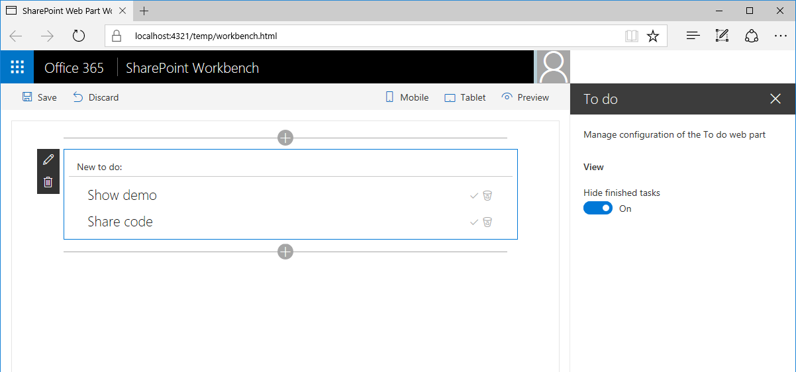
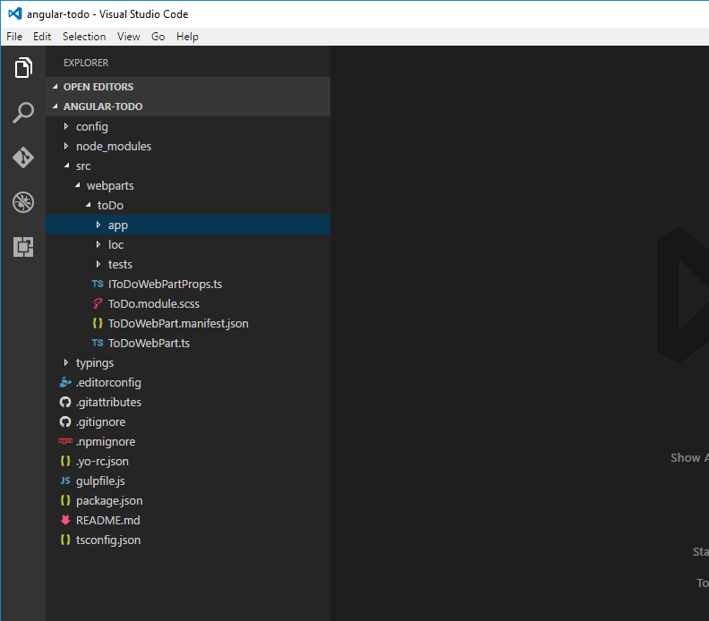
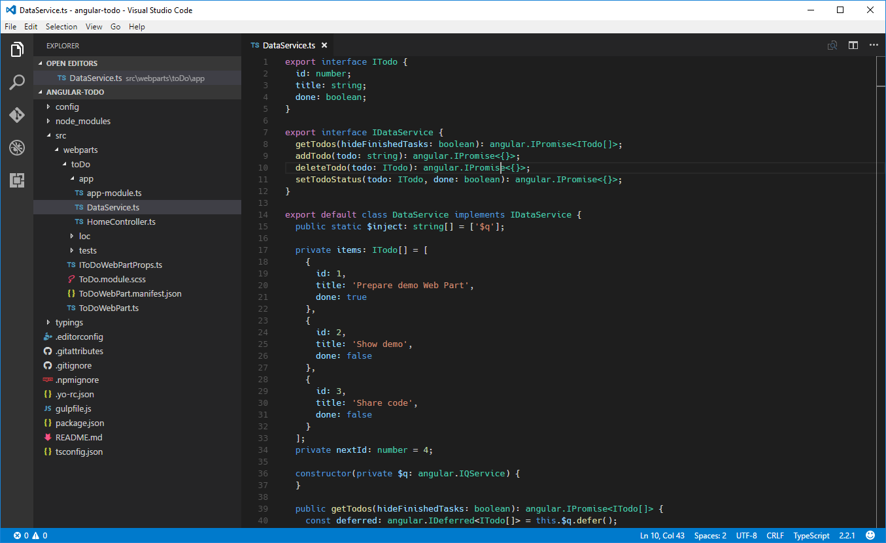
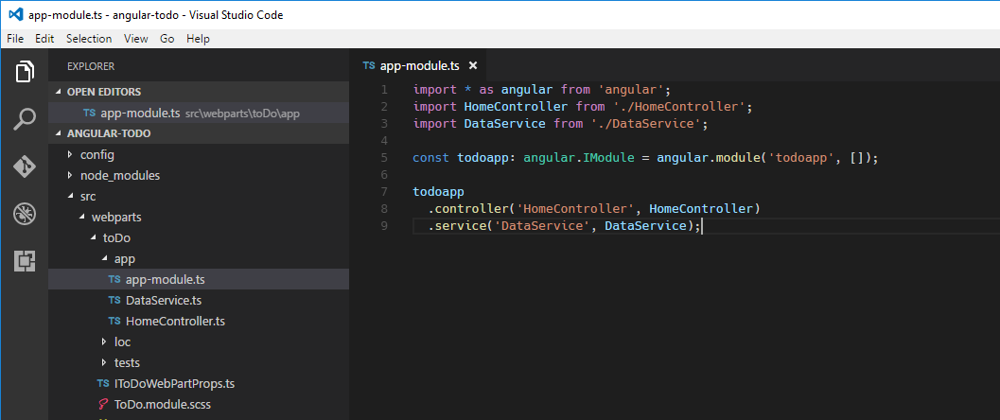
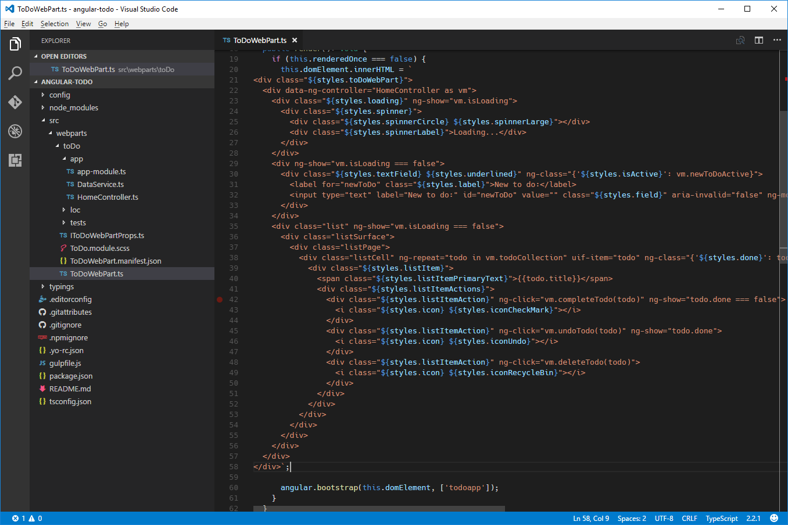
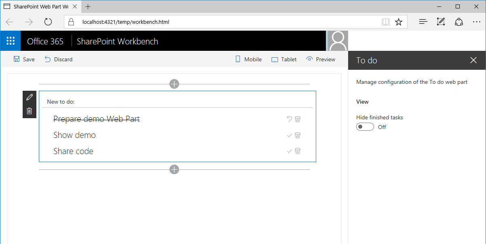
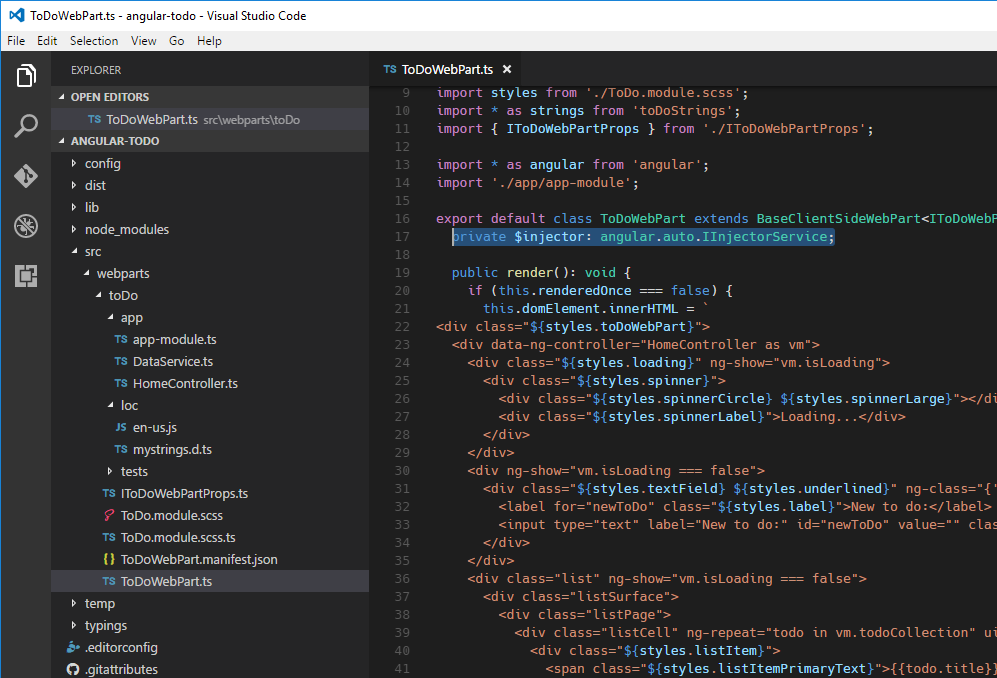

# Building SharePoint Framework Client-Side Web Parts with Angular v1.x

> **Note:** The SharePoint Framework is currently in preview and is subject to change. SharePoint Framework client-side web parts are not currently supported for use in production environments.

> **Note:** Before following the steps in this article, be sure to [set up your development environment](https://github.com/SharePoint/sp-dev-docs/blob/staging/docs/spfx/set-up-your-development-environment) for building SharePoint Framework solutions.

Angular is one of the most popular and widely adopted frameworks for building client-side solutions. Thanks to its modularity it can be used for anything ranging from complex multi-view Single Page Applications to smaller components such as Web Parts. Many organizations have been using Angular for building SharePoint solutions in the past. The following tutorial shows how to use Angular v1.x to build a SharePoint Framework Client-Side Web Part and have it styled using [ngOfficeUIFabric](http://ngofficeuifabric.com) - Angular directives for Office UI Fabric. During this tutorial we will build a simple Web Part allowing you to manage to do items.



The source of the working Web Part is available on GitHub at [https://github.com/SharePoint/sp-dev-fx-webparts/tree/master/samples/angular-ngofficeuifabric-todo](https://github.com/SharePoint/sp-dev-fx-webparts/tree/master/samples/angular-ngofficeuifabric-todo).

## Create new project

Start by creating a new folder for your project:

```sh
md angular-todo
```

Go to the project folder:

```sh
cd angular-todo
```

In the project folder execute the SharePoint Framework Yeoman generator to scaffold a new SharePoint Framework project:

```sh
yo @microsoft/sharepoint
```

When prompted accept the default values:
- **angular-todo** as your solution name
- **Use the current folder** for the location to place the files
- **To do** as your webpart name
- **Simple management of to do tasks** as your web part description
- **No javascript web framework** as the starting point to build the Web Part


Once the scaffolding completes, open your project folder in your code editor. In this tutorial, we will use Visual Studio Code.


## Add Angular and ngOfficeUIFabric

In this tutorial we will load both Angular and ngOfficeUIFabric from CDN. To do that, in the code editor, open the **config/config.json** file and in the **externals** array add the following lines:

```json
"angular": {
  "path": "https://cdnjs.cloudflare.com/ajax/libs/angular.js/1.5.8/angular.min.js",
  "globalName": "angular"
},
"ng-office-ui-fabric": "https://cdnjs.cloudflare.com/ajax/libs/ngOfficeUiFabric/0.12.3/ngOfficeUiFabric.js"
```


## Add Angular typings for TypeScript

Because we will be referencing Angular in our Web Part's code, we also need Angular typings for TypeScript. To install them run in the command line:

```sh
tsd install angular --save
```

## Implement Angular application

With all prerequisites in place let's start implementing the sample Angular application. Because it will consist of a few files, let's create a separate folder for it called **app**.



### Implement to do data service

In the newly created **app** folder, create a new file called **DataService.ts**. In the file paste the following code:

```ts
export interface ITodo {
  id: number;
  title: string;
  done: boolean;
}

export interface IDataService {
  getTodos(hideFinishedTasks: boolean): ng.IPromise<ITodo[]>;
  addTodo(todo: string): ng.IPromise<{}>;
  deleteTodo(todo: ITodo): ng.IPromise<{}>;
  setTodoStatus(todo: ITodo, done: boolean): ng.IPromise<{}>;
}

export default class DataService implements IDataService {
  public static $inject: string[] = ['$q'];

  private items: ITodo[] = [
    {
      id: 1,
      title: 'Prepare demo Web Part',
      done: true
    },
    {
      id: 2,
      title: 'Show demo',
      done: false
    },
    {
      id: 3,
      title: 'Share code',
      done: false
    }
  ];
  private nextId: number = 4;

  constructor(private $q: ng.IQService) {
  }

  public getTodos(hideFinishedTasks: boolean): ng.IPromise<ITodo[]> {
    const deferred: ng.IDeferred<ITodo[]> = this.$q.defer();

    const todos: ITodo[] = [];
    for (let i: number = 0; i < this.items.length; i++) {
      if (hideFinishedTasks && this.items[i].done) {
        continue;
      }

      todos.push(this.items[i]);
    }

    deferred.resolve(todos);

    return deferred.promise;
  }

  public addTodo(todo: string): ng.IPromise<{}> {
    const deferred: ng.IDeferred<{}> = this.$q.defer();

    this.items.push({
      id: this.nextId++,
      title: todo,
      done: false
    });

    deferred.resolve();

    return deferred.promise;
  }

  public deleteTodo(todo: ITodo): ng.IPromise<{}> {
    const deferred: ng.IDeferred<{}> = this.$q.defer();

    let pos: number = -1;
    for (let i: number = 0; i < this.items.length; i++) {
      if (this.items[i].id === todo.id) {
        pos = i;
        break;
      }
    }

    if (pos > -1) {
      this.items.splice(pos, 1);
      deferred.resolve();
    }
    else {
      deferred.reject();
    }

    return deferred.promise;
  }

  public setTodoStatus(todo: ITodo, done: boolean): ng.IPromise<{}> {
    const deferred: ng.IDeferred<{}> = this.$q.defer();

    for (let i: number = 0; i < this.items.length; i++) {
      if (this.items[i].id === todo.id) {
        this.items[i].done = done;
      }
    }

    deferred.resolve();

    return deferred.promise;
  }
}
```



In the code snippet above we implement three types: the **ITodo** interface which represents a to do item in our application, the **IDataService** interface which defines the signature of our data service and the **DataService** class which is responsible for retrieving and manipulating to do items. The data service implements simple methods for adding and modifying to do items. Even though the operations are instantanenous, for consistency each CRUD function returns a promise. 

Note, that in this tutorial to do items are stored in memory. You could however easily extend the solution to store items in a SharePoint List and use the data service to communicate with SharePoint using its REST API.

### Implement the controller

Next, implement the controller that will facilitate communication between the view and the data service. In the **app** folder create a new file called **HomeController.ts** and past the following code:

```ts
import { IDataService, ITodo } from './DataService';

export default class HomeController {
  public isLoading: boolean = false;
  public newItem: string = null;
  public todoCollection: any[] = [];
  private hideFinishedTasks: boolean = false;

  public static $inject: string[] = ['DataService', '$window', '$rootScope'];

  constructor(private dataService: IDataService, private $window: ng.IWindowService, private $rootScope: ng.IRootScopeService) {
    const vm: HomeController = this;
    this.init();
  }

  private init(hideFinishedTasks?: boolean): void {
    this.hideFinishedTasks = hideFinishedTasks;
    this.loadTodos();
  }

  private loadTodos(): void {
    const vm: HomeController = this;
    this.isLoading = true;
    this.dataService.getTodos(vm.hideFinishedTasks)
      .then((todos: ITodo[]): void => {
        vm.todoCollection = todos;
      })
      .finally((): void => {
        vm.isLoading = false;
      });
  }

  public todoKeyDown($event: any): void {
    if ($event.keyCode === 13 && this.newItem.length > 0) {
      $event.preventDefault();

      this.todoCollection.unshift({ id: -1, title: this.newItem, done: false });
      const vm: HomeController = this;

      this.dataService.addTodo(this.newItem)
        .then((): void => {
          this.newItem = null;
          this.dataService.getTodos(vm.hideFinishedTasks)
            .then((todos: any[]): void => {
              this.todoCollection = todos;
            });
        });
    }
  }

  public deleteTodo(todo: ITodo): void {
    if (this.$window.confirm('Are you sure you want to delete this todo item?')) {
      let index: number = -1;
      for (let i: number = 0; i < this.todoCollection.length; i++) {
        if (this.todoCollection[i].id === todo.id) {
          index = i;
          break;
        }
      }

      if (index > -1) {
        this.todoCollection.splice(index, 1);
      }

      const vm: HomeController = this;

      this.dataService.deleteTodo(todo)
        .then((): void => {
          this.dataService.getTodos(vm.hideFinishedTasks)
            .then((todos: any[]): void => {
              this.todoCollection = todos;
            });
        });
    }
  }

  public completeTodo(todo: ITodo): void {
    todo.done = true;

    const vm: HomeController = this;

    this.dataService.setTodoStatus(todo, true)
      .then((): void => {
        this.dataService.getTodos(vm.hideFinishedTasks)
          .then((todos: any[]): void => {
            this.todoCollection = todos;
          });
      });
  }

  public undoTodo(todo: ITodo): void {
    todo.done = false;

    const vm: HomeController = this;

    this.dataService.setTodoStatus(todo, false)
      .then((): void => {
        this.dataService.getTodos(vm.hideFinishedTasks)
          .then((todos: any[]): void => {
            this.todoCollection = todos;
          });
      });
  }
}
```


We start by loading the previously implemented data service. The controller needs it in order to get the list of items and modify items as requested by the user. Using Angular's dependency injection the service is injected into the controller. The controller implements a number of functions that are exposed to the view model and are will be called from the template. Using these functions users will be able to add new items, mark items as finished/to do or delete items.

### Implement the main module

With the data service and the controller ready, let's define the main module of our application and register the data service and controller with it. In the **app** folder create a new file called **app-module.ts** and paste the following contents:

```ts
import * as angular from 'angular';
import 'ng-office-ui-fabric';
import HomeController from './HomeController';
import DataService from './DataService';

const todoapp: ng.IModule = angular.module('todoapp', [
  'officeuifabric.core',
  'officeuifabric.components'
]);

todoapp
  .controller('HomeController', HomeController)
  .service('DataService', DataService);
```



We start by referencing Angular and ngOfficeUIFabric and by loading previously implemented controller and data service. Next, we define the module for our application and load the **officeuifabric.core** and **officeuifabric.components** modules as depedencies for our application. That way we will be able to use ngOfficeUIFabric directives in our template. Finally, we register the controller and data service with our application.

This concludes implementing the Angular application behind the Web Part. In the following steps we will register the Angular application with the Web Part and make it configurable using Web Part properties.

## Register Angular application with Web Part

With the Angular application implemented the next step is to reference it in the Web Part. In the code editor open the **ToDoWebPart.ts** file.

Just before the class declaration, add the following lines:

```ts
import * as angular from 'angular';
import './app/app-module';
```


This allows us to load a reference to Angular and our previously implemented application, both of which we need to bootstrap our Angular application.

Change the Web Part's **render** function to:

```ts
public render(): void {
  if (this.renderedOnce === false) {
    this.domElement.innerHTML = `
<div class="${styles.toDo}">
  <div data-ng-controller="HomeController as vm">
    <div class="${styles.loading}" ng-show="vm.isLoading">
      <uif-spinner>Loading...</uif-spinner>
    </div>
    <div id="entryform" ng-show="vm.isLoading === false">
      <uif-textfield uif-label="New to do:" uif-underlined ng-model="vm.newItem" ng-keydown="vm.todoKeyDown($event)"></uif-textfield>
    </div>
    <uif-list id="items" ng-show="vm.isLoading === false" >
      <uif-list-item ng-repeat="todo in vm.todoCollection" uif-item="todo" ng-class="{'${styles.done}': todo.done}">
        <uif-list-item-primary-text>{{todo.title}}</uif-list-item-primary-text>
        <uif-list-item-actions>
          <uif-list-item-action ng-click="vm.completeTodo(todo)" ng-show="todo.done === false">
            <uif-icon uif-type="check"></uif-icon>
          </uif-list-item-action>
          <uif-list-item-action ng-click="vm.undoTodo(todo)" ng-show="todo.done">
            <uif-icon uif-type="reactivate"></uif-icon>
          </uif-list-item-action>
          <uif-list-item-action ng-click="vm.deleteTodo(todo)">
            <uif-icon uif-type="trash"></uif-icon>
          </uif-list-item-action>
        </uif-list-item-actions>
      </uif-list-item>
    </uif-list>
  </div>
</div>`;

    angular.bootstrap(this.domElement, ['todoapp']);
  }
}
```



We start by assigning the template of our application directly to the Web Part's DOM element. On the root element we specify the name of our controller that will handle events and data binding in the template. Then, we bootstrap our application using the **todoapp** name we used previously when declaring the main module. Using the **renderedOnce** Web Part property we ensure that our Angular application is bootstrapped only once. Without it, if we changed one of the Web Part's properties, the **render** function would be invoked again bootstrapping the Angular application again, which would lead to an error.

We also need to implement CSS styles that we are using the template. In the code editor open the **ToDo.module.scss** file and replace its contents with:

```css
.toDo {
  .loading {
    margin: 0 auto;
    width: 6em;
  }

  .done [class=ms-ListItem-primaryText] {
    text-decoration: line-through;
  }
}
```


## Load newer version of Office UI Fabric

Let's confirm that everything is working as expected by running in the command line:

```sh
gulp serve
```

In the browser we should see our To do Web Part showing to do items.


Looking closely you can notice a bullet sign rendered in front of each item. This has to do with the fact that ngOfficeUIFabric uses a newer version of Office UI Fabric than the version available in the SharePoint Workbench. We can fix this issue, by loading a newer version of Office UI Fabric in our Web Part.

If you haven't stopped the **serve** task yet, go to the command line and press `CTRL+C` to stop the **gulp serve** task.

In the code editor open the **ToDoWebPart.ts** file. Before the `import styles` statement, add the following line:

```ts
import ModuleLoader from '@microsoft/sp-module-loader';
```


Next, change the Web Part's constructor to the following:

```ts
public constructor(context: IWebPartContext) {
  super(context);

  ModuleLoader.loadCss('https://appsforoffice.microsoft.com/fabric/2.6.1/fabric.min.css');
  ModuleLoader.loadCss('https://appsforoffice.microsoft.com/fabric/2.6.1/fabric.components.min.css');
}
```


Before we can preview our Web Part we have to install additional TypeScript typings required by the **ModuleLoader** class. In the command line run:

```sh
tsd install combokeys --save
```

Now that we are ready to preview our changes, in the command line:

```sh
gulp serve
```

You should now see the Web Part rendered correctly.


## Make Web Part configurable

At this point the To do Web Part shows a fixed list of to do items. Let's extend it with a configuration option allowing users to choose whether they want to see items that are marked as done or not.

### Add property in the Web Part manifest

Let's start by adding configuration property in the Web Part manifest. In the code editor open the **ToDoWebPart.manifest.json** file. In the **preconfiguredEntries** section, navigate to the **properties** array and replace the existing **description** property with the following line:

```json
"hideFinishedTasks": false
```


### Update the signature of the Web Part properties interface

Next, let's update the signature of the Web Part properties interface.

In the code editor open the **IToDoWebPartProps.ts** file and replace its contents with the following:

```ts
export interface IToDoWebPartProps {
  hideFinishedTasks: boolean;
}
```


### Add the property to the Web Part property pane

To allow users to configure the value of our newly added property, we have to expose it through the Web Part Property Pane.

In the code editor open the **ToDoWebPart.ts** file. In the first `import` statement replace  `PropertyPaneTextField` with `PropertyPaneToggle`:

```ts
import {
  BaseClientSideWebPart,
  IPropertyPaneSettings,
  IWebPartContext,
  PropertyPaneToggle
} from '@microsoft/sp-client-preview';
```


Change the implementation of the `propertyPaneSettings` function to:

```ts
protected get propertyPaneSettings(): IPropertyPaneSettings {
  return {
    pages: [
      {
        header: {
          description: strings.PropertyPaneDescription
        },
        groups: [
          {
            groupName: strings.ViewGroupName,
            groupFields: [
              PropertyPaneToggle('hideFinishedTasks', {
                label: strings.HideFinishedTasksFieldLabel
              })
            ]
          }
        ]
      }
    ]
  };
}
```

To fix the missing string references we first need to change the signature of our strings. In the code editor open the **loc/mystrings.d.ts** file and change its contents to:

```ts
declare interface IToDoStrings {
  PropertyPaneDescription: string;
  ViewGroupName: string;
  HideFinishedTasksFieldLabel: string;
}

declare module 'toDoStrings' {
  const strings: IToDoStrings;
  export = strings;
}
```


Next, we need to provide the actual values for the newly defined strings. In the code editor open the **loc/en-us.js** file and change its contents to:

```js
define([], function() {
  return {
    "PropertyPaneDescription": "Manage configuration of the To do Web Part",
    "ViewGroupName": "View",
    "HideFinishedTasksFieldLabel": "Hide finished tasks"
  }
});
```


To confirm that everything is working as expected, in the command line run:

```sh
gulp serve
```

In the Web Part Property Pane you should see a toggle button for our newly defined property.



At this point clicking the toggle button doesn't have any effect on our Web Part as it hasn't been connected to Angular. We will do that in the next step.

### Making the Angular application configurable using Web Part properties

In the previous step we defined a Web Part property that allows users to choose whether to show completed tasks or not. In this step we will pass the value selected by the user into the Angular application so that it can load items accordingly.

#### Broadcast Angular event on Web Part property change

In the code editor open the **ToDoWebPart.ts** file. Right before Web Part's constructor add the following line:

```ts
private $injector: ng.auto.IInjectorService;
```



Next, change the Web Part's **render** function to the following:

```ts
public render(): void {
  if (this.renderedOnce === false) {
    this.domElement.innerHTML = `
<div class="${styles.toDo}">
  <div data-ng-controller="HomeController as vm">
    <div class="${styles.loading}" ng-show="vm.isLoading">
      <uif-spinner>Loading...</uif-spinner>
    </div>
    <div id="entryform" ng-show="vm.isLoading === false">
      <uif-textfield uif-label="New to do:" uif-underlined ng-model="vm.newItem" ng-keydown="vm.todoKeyDown($event)"></uif-textfield>
    </div>
    <uif-list id="items" ng-show="vm.isLoading === false" >
      <uif-list-item ng-repeat="todo in vm.todoCollection" uif-item="todo" ng-class="{'${styles.done}': todo.done}">
        <uif-list-item-primary-text>{{todo.title}}</uif-list-item-primary-text>
        <uif-list-item-actions>
          <uif-list-item-action ng-click="vm.completeTodo(todo)" ng-show="todo.done === false">
            <uif-icon uif-type="check"></uif-icon>
          </uif-list-item-action>
          <uif-list-item-action ng-click="vm.undoTodo(todo)" ng-show="todo.done">
            <uif-icon uif-type="reactivate"></uif-icon>
          </uif-list-item-action>
          <uif-list-item-action ng-click="vm.deleteTodo(todo)">
            <uif-icon uif-type="trash"></uif-icon>
          </uif-list-item-action>
        </uif-list-item-actions>
      </uif-list-item>
    </uif-list>
  </div>
</div>`;

    this.$injector = angular.bootstrap(this.domElement, ['todoapp']);
  }

  this.$injector.get('$rootScope').$broadcast('configurationChanged', {
    hideFinishedTasks: this.properties.hideFinishedTasks
  });
}
```

In the above code sample, every time the Web Part property is changed, it will fire an Angular event to which the Angular application will subscribe and handle it accordingly.

#### Subscribe to Web Part property change event in Angular

In the code editor open the **app/HomeController.ts** file. Extend the constructor as follows:

```ts
constructor(private dataService: IDataService, private $window: ng.IWindowService, private $rootScope: ng.IRootScopeService) {
  const vm: HomeController = this;
  this.init();

  $rootScope.$on('configurationChanged', (event: ng.IAngularEvent, args: { hideFinishedTasks: boolean }): void => {
    vm.init(args.hideFinishedTasks);
  });
}
```


To verify that the Angular application is working as expected and correctly responds to property changed, in the command line run:

```sh
gulp serve
```

If you click the toggle button and change the value of the **Hide finished tasks** property, Web Part should show or hide finished tasks accordingly.

