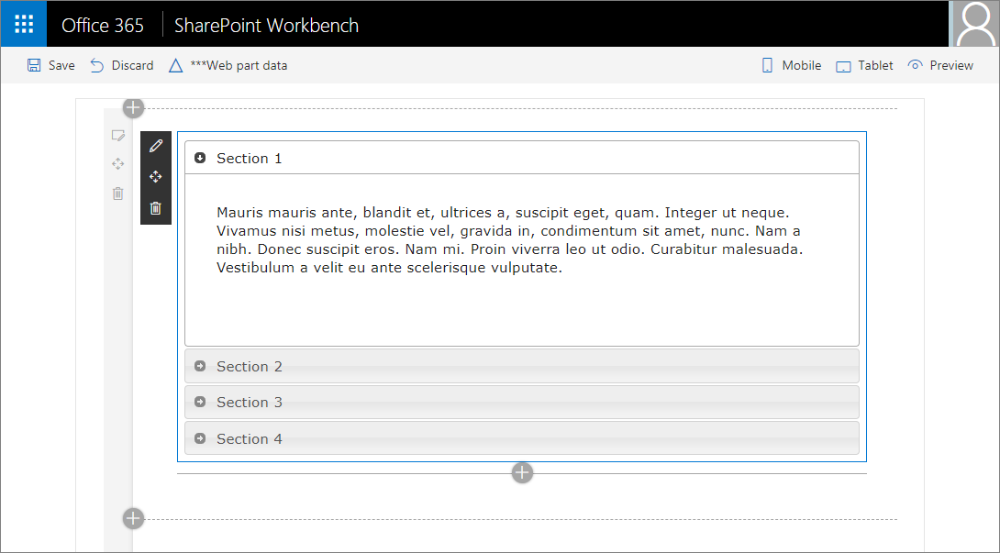

# Add jQueryUI Accordion to your SharePoint client-side web part

Adding the jQueryUI Accordion to your web part project involves creating a new web part, as shown in the following image. 



Ensure that you've completed the following steps before you start:

* [Build your first web part](build-a-hello-world-web-part.md)
* [Connect your web part to SharePoint](connect-to-sharepoint.md)

You can also follow these steps by watching this video on the SharePoint PnP YouTube Channel:

<br/>

> [!Video https://www.youtube.com/embed/7UOxTbMMPrQ]

<br/>

The developer toolchain uses Webpack, SystemJS, and CommonJS to bundle your web parts. This includes loading any external dependencies such as jQuery or jQueryUI. To load external dependencies, at a high level, you need to:

* Acquire the external library, either via npm or download from the vendor.
* If available, install the respective framework's [TypeScript type definitions](http://definitelytyped.org/).
* If required, update your solution config to not include the external dependency in your web part bundle by default.

## Create a new web part project

1. Create a new project directory in your favorite location:

  ```
  md jquery-webpart
  ```
      
  > [!WARNING] 
  > Make sure to create this directory in a new folder, not as a subdirectory of `helloworld-webpart`.

2. Go to the project directory:

  ```
  cd jquery-webpart
  ```
    
3. Create a new jQuery web part by running the Yeoman SharePoint Generator:

  ```
  yo @microsoft/sharepoint
  ```

4. When prompted:

  * Accept the default **jquery-webpart** as your solution name. and select Enter.
  * Select **SharePoint Online only (latest)**, and select Enter.
  * Select **Use the current folder** for where to place the files.
  * Select **N** to require the extension to be installed on each site explicitly when it's being used. 
  * Select **WebPart** as the client-side component type to be created. 

5. The next set of prompts ask for specific information about your web part:

  * Enter **jQuery** for the web part name, and select Enter.
  * Enter **jQuery Web Part** as the description of the web part, and select Enter. 
  * Accept the default **No JavaScript framework** option for the framework, and select Enter to continue.

  At this point, Yeoman installs the required dependencies and scaffolds the solution files. This might take a few minutes. Yeoman scaffolds the project to include your **jQueryWebPart** as well.

6. After the scaffolding completes, lock down the version of the project dependencies by running the following command:

  ```sh
  npm shrinkwrap
  ```

7. Enter the following to open the web part project in Visual Studio Code:

  ```
  code .
  ```


## Install jQuery and jQuery UI NPM Packages

1. In the console, enter the following to install the jQuery npm package:

  ```
  npm install --save jquery@2
  ```

2. Now enter the following to install the jQueryUI npm package:

  ```
  npm install --save jqueryui
  ```

  Next, we need to install the typings for our project. Starting from TypeScript 2.0, we can use npm to install needed typings.

3. Open your console and install the needed types:

  ```
  npm install --save @types/jquery@2
  npm install --save @types/jqueryui
  ```

### To unbundle external dependencies from web part bundle

By default, any dependencies you add are bundled into the web part bundle. In some cases, this is not ideal. You can choose to unbundle these dependencies from the web part bundle.

1. In Visual Studio Code, open the file **config\config.json**.

  This file contains information about your bundle(s) and any external dependencies. 

  The `bundles` region contains the default bundle information; in this case, the jQuery web part bundle. When you add more web parts to your solution, you see one entry per web part.

  ```json
    "bundles": {
      "j-query-web-part": {
        "components": [
          {
            "entrypoint": "./lib/webparts/jQuery/JQueryWebPart.js",
            "manifest": "./src/webparts/jQuery/JQueryWebPart.manifest.json"
          }
        ]
      }
    },
  ```

2. The `externals` section contains the libraries that are not bundled with the default bundle. 

  ```json
    "externals": {},
  ```

3. To exclude `jQuery` and `jQueryUI` from the default bundle, add the modules to the `externals` section:

  ```json
  "jquery":"node_modules/jquery/dist/jquery.min.js",
  "jqueryui":"node_modules/jqueryui/jquery-ui.min.js"
  ```

Now when you build your project, `jQuery` and `jQueryUI` are not bundled into your default web part bundle.

The full content of the config.json file is currently as follows:

```json
{
  "$schema": "https://dev.office.com/json-schemas/spfx-build/config.2.0.schema.json",
  "version": "2.0",
  "bundles": {
    "j-query-web-part": {
      "components": [
        {
          "entrypoint": "./lib/webparts/jQuery/JQueryWebPart.js",
          "manifest": "./src/webparts/jQuery/JQueryWebPart.manifest.json"
        }
      ]
    }
  },
  "externals": {
    "jquery":"node_modules/jquery/dist/jquery.min.js",
    "jqueryui":"node_modules/jqueryui/jquery-ui.min.js"
  },
  "localizedResources": {
    "JQueryWebPartStrings": "lib/webparts/jQuery/loc/{locale}.js"
  }
}
```


## Build the Accordion

Open the project folder **jquery-webpart** in Visual Studio Code. Your project should have the jQuery web part that you added earlier under the `/src/webparts/jQuery` folder.

### To add the Accordion HTML

1. Add a new file in the `src/webparts/jQuery` folder called **MyAccordionTemplate.ts**.

2. Create and export (as a module) a class `MyAccordionTemplate` that holds the HTML code for the accordion.

  ```HTML
  export default class MyAccordionTemplate {
      public static templateHtml: string =  `
        <div class="accordion">
          <h3>Section 1</h3>
          <div>
              <p>
              Mauris mauris ante, blandit et, ultrices a, suscipit eget, quam. Integer
              ut neque. Vivamus nisi metus, molestie vel, gravida in, condimentum sit
              amet, nunc. Nam a nibh. Donec suscipit eros. Nam mi. Proin viverra leo ut
              odio. Curabitur malesuada. Vestibulum a velit eu ante scelerisque vulputate.
              </p>
          </div>
          <h3>Section 2</h3>
          <div>
              <p>
              Sed non urna. Donec et ante. Phasellus eu ligula. Vestibulum sit amet
              purus. Vivamus hendrerit, dolor at aliquet laoreet, mauris turpis porttitor
              velit, faucibus interdum tellus libero ac justo. Vivamus non quam. In
              suscipit faucibus urna.
              </p>
          </div>
          <h3>Section 3</h3>
          <div>
              <p>
              Nam enim risus, molestie et, porta ac, aliquam ac, risus. Quisque lobortis.
              Phasellus pellentesque purus in massa. Aenean in pede. Phasellus ac libero
              ac tellus pellentesque semper. Sed ac felis. Sed commodo, magna quis
              lacinia ornare, quam ante aliquam nisi, eu iaculis leo purus venenatis dui.
              </p>
              <ul>
              <li>List item one</li>
              <li>List item two</li>
              <li>List item three</li>
              </ul>
          </div>
          <h3>Section 4</h3>
          <div>
              <p>
              Cras dictum. Pellentesque habitant morbi tristique senectus et netus
              et malesuada fames ac turpis egestas. Vestibulum ante ipsum primis in
              faucibus orci luctus et ultrices posuere cubilia Curae; Aenean lacinia
              mauris vel est.
              </p>
              <p>
              Suspendisse eu nisl. Nullam ut libero. Integer dignissim consequat lectus.
              Class aptent taciti sociosqu ad litora torquent per conubia nostra, per
              inceptos himenaeos.
              </p>
          </div>
      </div>`;
  }
  ```

3. Save the file.

### To import the Accordion HTML

1. In Visual Studio Code, open **src\webparts\jQuery\JQueryWebPart.ts**.

2. At the top of the file, where you can find other imports, add the following import:

  ```typescript
  import MyAccordionTemplate from './MyAccordionTemplate';
  ```

### To import jQuery and jQueryUI

1. You can import jQuery to your web part in the same way that you imported MyAccordionTemplate. At the top of the file, where you can find other imports, add the following imports:

  ```typescript
  import * as jQuery from 'jquery';
  import 'jqueryui';
  ```

2. Load some external CSS files by using the module loader. Add the following import:

  ```typescript
  import { SPComponentLoader } from '@microsoft/sp-loader';
  ```

3. Load the jQueryUI styles in the `JQueryWebPart` web part class by adding a constructor and using the newly imported SPComponentLoader. Add the following constructor to your web part: 

  ```typescript
    public constructor() {
      super();

      SPComponentLoader.loadCss('//code.jquery.com/ui/1.11.4/themes/smoothness/jquery-ui.css');
    }
  ```

  This code does the following:

  * Calls the parent constructor with the context to initialize the web part.
  * Loads the accordion styles from a CDN asynchronously.


### To render Accordion

1. In the `jQueryWebPart.ts`, go to the `render` method.

2. Set the web part's inner HTML to render the accordion HTML:

  ```typescript
  this.domElement.innerHTML = MyAccordionTemplate.templateHtml;
  ```

3. jQueryUI Accordion has a few options that you can set to customize the accordion. Define a few options for your accordion just under `this.domElement.innerHTML = MyAccordionTemplate.templateHtml;`:

  ```typescript
  const accordionOptions: JQueryUI.AccordionOptions = {
    animate: true,
    collapsible: false,
    icons: {
      header: 'ui-icon-circle-arrow-e',
      activeHeader: 'ui-icon-circle-arrow-s'
    }
  };
  ```

  As you can see, the jQueryUI typed definition allows you to create a typed variable called `JQueryUI.AccordionOptions` and specify the supported properties. 

  If you play around with the IntelliSense, you notice that you get full support for available methods under `JQueryUI.` as well as the method parameters.

4. Finally, initialize the accordion:

  ```typescript
  jQuery('.accordion', this.domElement).accordion(accordionOptions);
  ```

  As you can see, you use the variable `jQuery` that you used to import the `jquery` module. You then initialize the accordion.

  The complete `render` method looks like this:

  ```typescript
  public render(): void {
    this.domElement.innerHTML = MyAccordionTemplate.templateHtml;

    const accordionOptions: JQueryUI.AccordionOptions = {
      animate: true,
      collapsible: false,
      icons: {
        header: 'ui-icon-circle-arrow-e',
        activeHeader: 'ui-icon-circle-arrow-s'
      }
    };

    jQuery('.accordion', this.domElement).accordion(accordionOptions);
  }
  ```

5. Save the file.


## Preview the web part

1. In your console, ensure that you are still in the jquery-webpart folder, and enter the following to build and preview your web part:

  ```
  gulp serve
  ```

  > [!NOTE]
  > Visual Studio Code provides built-in support for gulp and other task runners. You can select Ctrl+Shift+B in Windows or Cmd+Shift+B on a Mac to debug and preview your web part.

  Gulp executes the tasks and opens the local SharePoint web part Workbench.

2. In the page canvas, select the **+** (plus sign) to show the list of web parts, and add the jQuery web part. You should now see the jQueryUI Accordion!

  

3. In the console where you have `gulp serve` running, select Ctrl+C to terminate the task.

> [!NOTE]
> If you find an issue in the documentation or in the SharePoint Framework, report that to SharePoint engineering by using the [issue list at the sp-dev-docs repository](https://github.com/SharePoint/sp-dev-docs/issues). Thanks for your input in advance.

