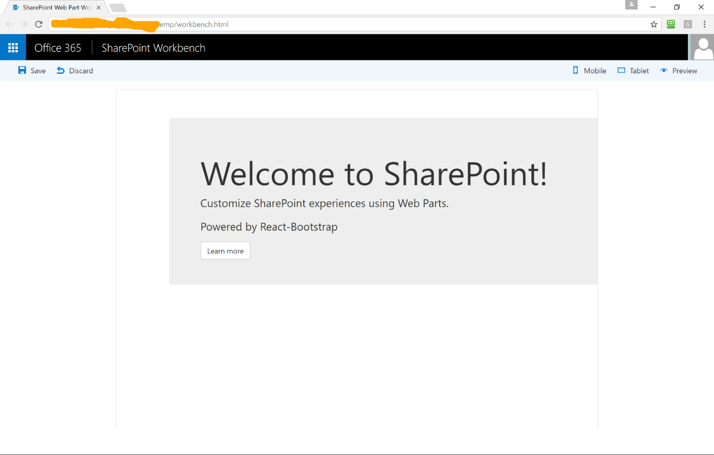
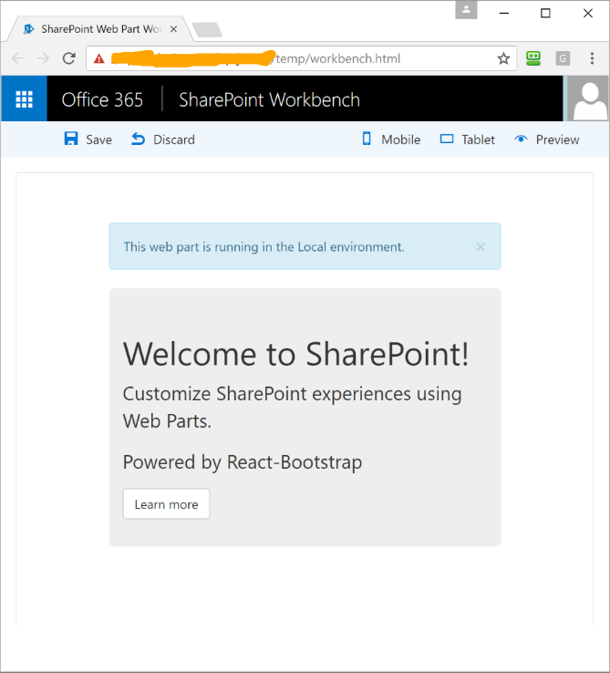

# Add the React Bootstrap Framework to your SharePoint client-side web part

>**Note:** The SharePoint Framework is currently in preview and is subject to change. SharePoint Framework client-side web parts are not currently supported for use in production environments.

This article describes how to add the React Bootstrap framework to your web part project. 
This involves creating a new web part, as shown in the following image. 



## Prerequisites
Complete the following steps before you start:

* [Build your first web part](build-a-hello-world-web-part.md)
* [Connect to SharePoint](connect-to-sharepoint.md) 

The developer toolchain uses Webpack, SystemJS and CommonJS to bundle your web parts. This includes loading any external dependencies such as the Bootstrap.css. 
To load external dependencies, at a high level, you will need to:

* Acquire the external library, either via npm or download from the vendor.
* If available, install the respective framework's [TypeScript type definitions](http://definitelytyped.org/).
* If required, update your solution config to not include the external dependency in your web part bundle by default.

## Create a new web part project

Create a new project directory in your favorite location:

```
md bootstrap-webpart
```
    
> **Warning:** Make sure to create this directory in a new folder, not as a subdirectory of `bootstrap-webpart`.

Go to the project directory:

```
cd bootstrap-webpart
```
    
Create a new SharePoint web part by running the Yeoman SharePoint Generator:

```
yo @microsoft/sharepoint
```

When prompted:

* Accept the default **bootstrap-webpart** as your solution name and choose **Enter**.
* Select **Use the current folder** as the location for the files.

The next set of prompts will ask for specific information about your web part:

* Type **Bootstrap** for the web part name and choose **Enter**.
* Enter **Bootstrap Web Part** as the description of the web part and choose **Enter**.
* Select **React** option for the framework and choose **Enter** to continue.

At this point, Yeoman will install the required dependencies and scaffold the solution files. 
This might take a few minutes. 
Yeoman will scaffold the project to include your **BootstrapWebPart** web part as well.

In the console, type the following to open the web part project in Visual Studio Code:

```
code .
```

## Install React Boostrap NPM Package

In the console, type the following to install React-Bootstrap npm package:

```
npm install react-bootstrap --save
```

Rather than use TypeScript Definition Manager (TSD) to install type definitions for your project we will use Typings instead as it has superseeded it.

Because the web part project is primarily a TypeScript project, the TypeScript compiler has to be able to understand the respective types. It also helps to provide the IntelliSense required in the code editor.

To do that, first install [Typings](https://github.com/typings/typings).

Open your console and run the commands:

```
npm i -g typings
```

Now install the React-Bootstrap type definitions:

```
typings install dt~react-bootstrap --save --global
```

Typings will install the type definitions into the **/typings** folder. This folder also includes other typings that were scaffolded by the Yeoman generator.

Go to **/typings/globals/react-bootstrap** to find the type definitions for React-Bootstrap.

Include one other typing:

```
typings install dt~combokeys --save --global
```

### Unbundle external dependencies from web part bundle
By default, any dependencies you add are bundled into the web part bundle. In some cases, this is not ideal. You can choose to unbundle these dependencies from the web part bundle.

In Visual Studio Code, open the file config\config.json.

This file contains information about your bundle(s) and any external dependencies. 

The `entries` region contains the default bundle information - in this case, the jQuery web part bundle. When you add more web parts to your solution, you will see one entry per web part.

```json
"entries": [
  {
    "entry": "./lib/webparts/jQuery/jQueryWebPart.js",
    "manifest": "./src/webparts/jQuery/jQueryWebPart.manifest.json",
    "outputPath": "./dist/j-query.bundle.js",
  }
]
```

The `externals` section contains the libraries that are not bundled with the default bundle. 

```json
  "externals": {
    "@microsoft/sp-client-base": "node_modules/@microsoft/sp-client-base/dist/sp-client-base.js",
    "@microsoft/sp-client-preview": "node_modules/@microsoft/sp-client-preview/dist/sp-client-preview.js",
    "@microsoft/sp-lodash-subset": "node_modules/@microsoft/sp-lodash-subset/dist/sp-lodash-subset.js",
    "office-ui-fabric-react": "node_modules/office-ui-fabric-react/dist/office-ui-fabric-react.js",
    "react": "node_modules/react/dist/react.min.js",
    "react-dom": "node_modules/react-dom/dist/react-dom.min.js",
    "react-dom/server": "node_modules/react-dom/dist/react-dom-server.min.js"
  },
```

To exclude `React Bootstrap` from the default bundle, add the modules to the `externals` section:

```json
"react-bootstrap": "node_modules/react-bootstrap/dist/react-bootstrap.min.js"
```

Now when you build your project, `React-Bootstrap` will not be bundled into your default web part bundle.

### Import Bootstrap css
Now we have the Bootstrap code (in a React fashion) we need to add the Bootstrap CSS itself.

We'll do this by dynamically loading it from a CDN. To do that, use the module loader. Add the following import:

```ts
import importableModuleLoader from '@microsoft/sp-module-loader';
```

To load the Bootstrap styles, in the `BootstrapWebPart` web part class, add the following line inside the constructor:

```ts
importableModuleLoader.loadCss('https://maxcdn.bootstrapcdn.com/bootstrap/3.3.7/css/bootstrap.min.css');
```

The constructor should look like this now:

```ts
public constructor(context: IWebPartContext){
    super(context);
    
    importableModuleLoader.loadCss('https://maxcdn.bootstrapcdn.com/bootstrap/3.3.7/css/bootstrap.min.css');
}
```

This code does the following:

* Calls the parent constructor with the context to initialize the web part.
* Loads the Bootstrap styles from a CDN asynchronously.

### Render with Bootstrap

In the `BootstrapWebPart.ts`, first we need to say which of the bootstrap-react components we will be using by importing them.

The best guide to what is available is on the React Bootstrap site at the [Compenents page](https://react-bootstrap.github.io/components.html).

At the top of the Bootstrap.ts file add the following imports:

```ts
import { Jumbotron, Button } from 'react-bootstrap';
```

Remove the following imports as we are no longer using them:

```ts
import { css } from 'office-ui-fabric-react';

import styles from '../Bootstrap.module.scss';
```

Go to the `render` method.

Set the web part's inner HTML to render a Jumbotron display inside a Bootstrap container:

```ts
<div className="container" >
  <Jumbotron>
    <h1>Welcome to SharePoint!</h1>
    <p>Customize SharePoint experiences using Web Parts.</p>
    <p>{this.props.description}</p>
    <Button href='https://github.com/SharePoint/sp-dev-docs/wiki' >
      Learn more
    </Button>
  </Jumbotron>
</div>
```

This replaces the following:

```ts
      <div className={styles.bootstrap}>
        <div className={styles.container}>
          <div className={css('ms-Grid-row ms-bgColor-themeDark ms-fontColor-white', styles.row)}>
            <div className='ms-Grid-col ms-u-lg10 ms-u-xl8 ms-u-xlPush2 ms-u-lgPush1'>
              <span className='ms-font-xl ms-fontColor-white'>

              </span>
              <p className='ms-font-l ms-fontColor-white'>
                Customize SharePoint experiences using Web Parts.
              </p>
              <p className='ms-font-l ms-fontColor-white'>
                {this.props.description}
              </p>
              <a
                className={css('ms-Button', styles.button)}
                href='https://github.com/SharePoint/sp-dev-docs/wiki'
              >
                <span className='ms-Button-label'>Learn more</span>
              </a>
            </div>
          </div>
        </div>
      </div>
```

Run your code and you'll see the iconic Bootstrap Jumbotron.


There is an issue with the *viewport* in that at certain resolutions it chops off the right hand side of the Bootstrap display.

This shows we have static Bootstrap components available but doesn't really show the code side of Bootstrap in action.

For this we are going to add an alert that shows where the code is running.

In the BootstrapWebPart.ts, the 'container' bit of the code, we will find out the environment and pass this through to the Boostrap.ts, the 'business' bit of the code so it can display the environment.
This keeps a good seperation between the two concerns.

First we need to enhance the React-Bootstrap components to give us a 'dismissable' alert.  
This will allow the user to interact with the component by dismissing it and also proves to us that the functionality part of Bootstrap is available too.

We will create a new component to handle this for us as we want to bind presentation and functionality into a single reusable package.

In the /src/webparts/bootstrap/components folder create a new React TypeScript file called DismissableAlert.tsx.

Add the following code to it:

```tsx
import * as React from 'react';
import { Alert } from 'react-bootstrap';

export interface IDismissableAlertProps {
  type: string;
  title: string;
}

export default class DismissableAlert extends React.Component<IDismissableAlertProps, {}> {
  public componentWillMount(): void {
    this.handleAlertShow();
  }

  public handleAlertDismiss(): void {
    this.setState({alertVisible: false});
  }

  public handleAlertShow(): void {
    this.setState({alertVisible: true});
  }

  public render(): JSX.Element {
    if (this.state["alertVisible"]) {
      return (
        <Alert bsStyle={this.props.type} onDismiss={this.handleAlertDismiss.bind(this)}>
          {this.props.title}
        </Alert>);
    }

    return(null);
  }
}
```

We need to transport the environment type as a property because that is how React works, its uses one way communication from the top component down via properties and state.
As the value won't change it's not state but a property.

In Bootstrap.ts where the IBootstrapProps interface is defined change it to match the following:

```tsx
export interface IBootstrapProps extends IBootstrapWebPartProps {
  environmentType: string;
}
```

Also amend the react-bootstrap import to include our new dismissable alert class thus:

```tsx
import DismissableAlert from './DismissableAlert';
```

Now we can add the dimissable alert to our display:

Chnage the Bootstrap Component so it is as follows:

```tsx
export default class Bootstrap extends React.Component<IBootstrapProps, {}> {
  public render(): JSX.Element {
    const dismissableAlertTitle: string = `This web part is running in the ${this.props["environmentType"]} environment.`;

    return (
      <div className="container" >
        <DismissableAlert type={"info"} title={dismissableAlertTitle} >
        </DismissableAlert>
        <Jumbotron>
          <h1>Welcome to SharePoint!</h1>
          <p>Customize SharePoint experiences using Web Parts.</p>
          <p>{this.props.description}</p>
          <Button href='https://github.com/SharePoint/sp-dev-docs/wiki' >
            Learn more
          </Button>
        </Jumbotron>
      </div>
    );
  }
}
```

In BootstrapWebPart.ts populate the environment type property but change it to something more human understandable.

```tsx
  public render(): void {
    const element: React.ReactElement<IBootstrapProps> = React.createElement(Bootstrap, {
      description: this.properties.description,
      environmentType: this.GetEnvironmentType(this.context.environment.type)
    });

    private GetEnvironmentType(type: EnvironmentType): string {
    switch (type) {
      case EnvironmentType.ClassicSharePoint:
        return "Classic SharePoint";
      case EnvironmentType.Local:
        return "Local";
      case EnvironmentType.SharePoint:
        return "SharePoint";
      case EnvironmentType.Test:
        return "Test";
      default:
        return "Unknown";
    }
```

Save the files.

## Preview the web part

In your console, make sure you are still in the bootstrap-webpart folder and type the following to build and preview your web part:

```
gulp serve
```

> **Note:** Visual Studio Code provides built-in support for gulp and other task runners. You can choose **Ctrl+Shift+B** in Windows or **Cmd+Shift+B** on a Mac to debug and preview your web part.

Gulp will execute the tasks and open the local SharePoint web part workbench.

In the page canvas, choose the **+** (plus sign) to show the list of web parts, and add the Bootstrap web part. You should now see the Dismissable Alert and the Jumbotron.



In the console where you have `gulp serve` running, choose **Ctrl+C** to terminate the task.
