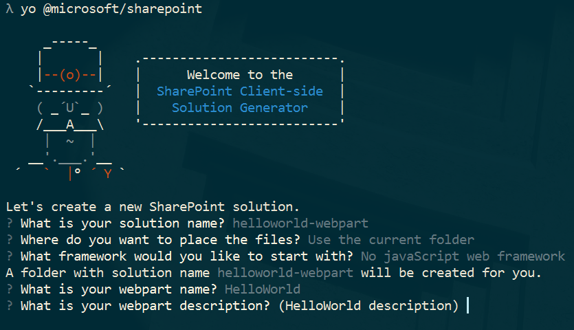
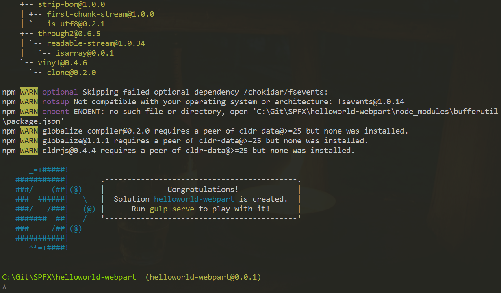
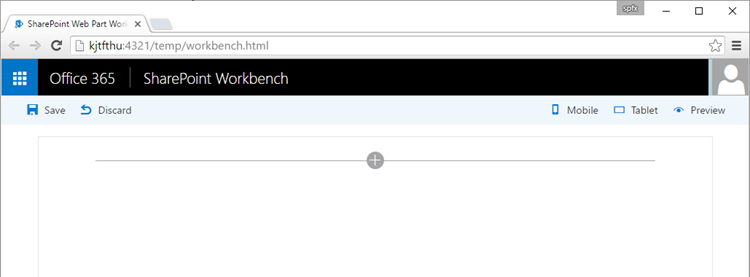
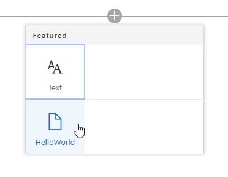
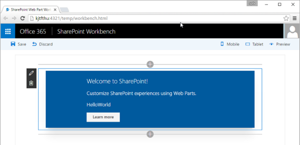
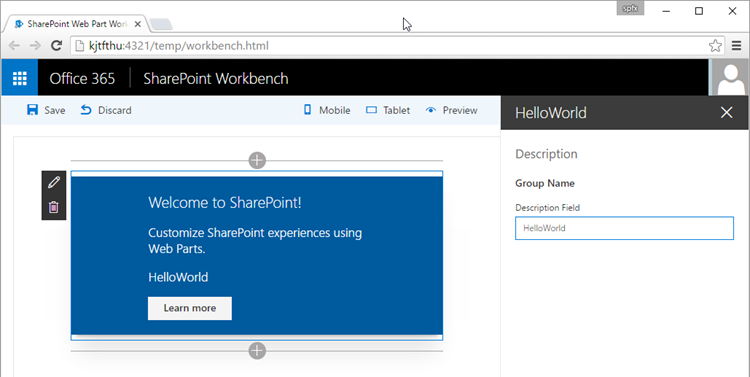
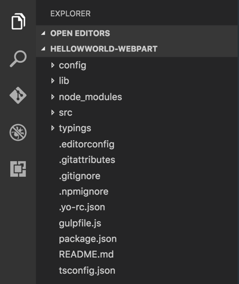
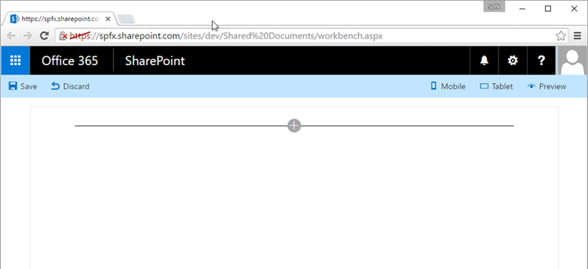
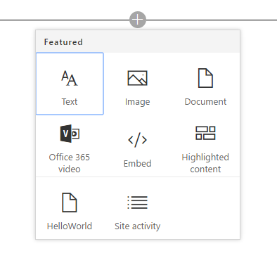
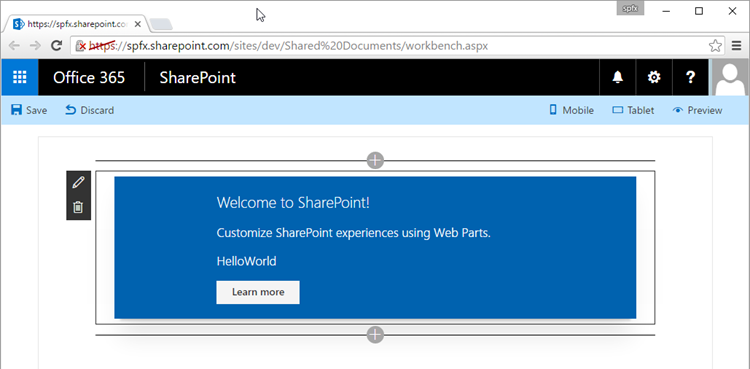

# Build your first SharePoint client-side web part (Hello World part 1)

>**Note:** The SharePoint Framework is currently in preview and is subject to change. SharePoint Framework client-side web parts are not currently supported for use in production environments.

Client-side web parts are client-side components that run inside the context of a SharePoint page. Client-side web parts can be deployed to SharePoint Online, and you can also use modern JavaScript tools and libraries to build them.

Client-side web parts support:

* Building with HTML and JavaScript.
* Both SharePoint online and on-premises environments.

>**Note:** Before following the steps in this article, be sure to [Set up your development environment](../../set-up-your-development-environment).

You can also follow these steps by watching the video on the [SharePoint PnP YouTube Channel](https://www.youtube.com/watch?v=QbDtsMg88Js&list=PLR9nK3mnD-OXvSWvS2zglCzz4iplhVrKq). 

<a href="https://www.youtube.com/watch?v=QbDtsMg88Js&list=PLR9nK3mnD-OXvSWvS2zglCzz4iplhVrKq">

</a>


## Create a new web part project
Create a new project directory in your favorite location.
	
```
md helloworld-webpart
```

Go to the project directory.

```
cd helloworld-webpart
```

Create a new HelloWorld web part by running the Yeoman SharePoint Generator.

```
yo @microsoft/sharepoint
```
    
When prompted:

* Accept the default **helloworld-webpart** as your solution name and choose **Enter**.
* Select **Use the current folder** for where to place the files.

The next set of prompts will ask for specific information about your web part:

* Accept the default **No javascript web framework** as the framework you would like to use and choose **Enter**.
* Accept the default **HelloWorld** as your web part name and choose **Enter**.
* Accept the default **HelloWorld description** as your web part description and choose **Enter**.



At this point, Yeoman will install the required dependencies and scaffold the solution files along with the **HelloWorld** web part. This might take a few minutes. 

When the scaffold is complete, you should see the following message indicating a successful scaffold:



For information about troubleshooting any errors, see [Known issues](../basics/known-issues).

### Using your favorite Code Editor
Because the SharePoint client-side solution is HTML/TypeScript based, you can use any code editor that supports client-side development to build your web part, such as:

* [Visual Studio Code](https://code.visualstudio.com/)
* [Atom](https://atom.io)
* [Webstorm](https://www.jetbrains.com/webstorm)

SharePoint Framework documentation uses Visual Studio code in the steps and examples. Visual Studio Code is a lightweight but powerful source code editor from Microsoft which runs on your desktop and is available for Windows, Mac and Linux. It comes with built-in support for JavaScript, TypeScript and Node.js and has a rich ecosystem of extensions for other languages (such as C++, C#, Python, PHP) and runtimes.. 
   
## Preview the web part
To preview your web part, build and run it on a local web server. The client-side toolchain uses HTTPS endpoint by default. However, since a default certificate is not configured for the local dev environment, your browser will report a certificate error. The SPFx toolchain comes with a developer certificate that you can install for building web parts.

To install the developer certificate for use with SPFx development, switch to your console, make sure you are still in the **helloworld-webpart** directory and enter the following command:

```
gulp trust-dev-cert
```

Now that we have installed the developer certificate, enter the following command in the console to build and preview your web part:

```
gulp serve
```

This command will execute a series of gulp tasks to create a local, Node-based HTTPS server on 'localhost:4321' and launch your default browser to preview web parts from your local dev environment.


SharePoint client-side development tools use [gulp](http://gulpjs.com/) as the task runner to handle build process tasks such as:

* Bundle and minify JavaScript and CSS files.
* Run tools to call the bundling and minification tasks before each build.
* Compile SASS files to CSS.
* Compile TypeScript files to JavaScript.

If you are new to gulp, you can read [Using Gulp](http://docs.asp.net/en/latest/client-side/using-gulp.html) which describes using gulp with Visual Studio in conjunction with building ASP.NET 5 projects.

Visual Studio Code provides built-in support for gulp and other task runners. Choose **Ctrl+Shift+B** on Windows or **Cmd+Shift+B** on Mac to debug and preview your web part. 

### SharePoint Workbench
SharePoint Workbench is a developer design surface that enables you to quickly preview and test web parts without deploying them in SharePoint. SharePoint Workbench includes the client-side page and the client-side canvas in which you can add, delete and test your web parts in development.



To add the HelloWorld web part, choose the **add** button. The add button opens the toolbox where you can see a list of web parts available for you to add. The list will include the **HelloWorld** web part as well other web parts available locally in your development environment.
   

   
Choose **HelloWorld** to add the web part to the page:
   


Congratulations! You have just added your first client-side web part to a client-side page.
   
Now, choose the pencil icon on the far left of the web part to reveal the web part property pane.
   


The property pane is where you can define properties to customize your web part. The property pane is client-side driven and provides a consistent design across SharePoint. 
   
Modify the text in the **Description** text box to **Client-side web parts are awesome!**

Notice how the text in the web part also changes as you type. 

One of the new capabilities available to the property pane is to configure its update behavior, which can be set to reactive or non-reactive. By default the update behavior is reactive and enables you to see the changes as you edit the properties. The changes are saved instantly as when the behavior is reactive.  

## Web part project structure
You can use Visual Studio Code to explore the web part project structure. 

* In the console, go to the **src\webparts\helloWorld** directory. 
* Enter the following command to open the web part project in Visual Studio Code (or use your favorite editor):

```
code .
```



If you get an error, you might need to [install the code command in PATH](https://code.visualstudio.com/docs/editor/setup).

TypeScript is the primary language for building SharePoint client-side web parts. TypeScript is a typed superset of JavaScript that compiles to plain JavaScript. SharePoint client-side development tools are built using TypeScript classes, modules, and interfaces to help developers build robust client-side web parts. 

The following are some key files in the project.

### Web part class
**HelloWorldWebPart.ts** defines the main entry point for the web part. The web part class **HelloWorldWebPart** extends the **BaseClientSideWebPart**. Any client-side web part should extend the **BaseClientSideWebPart** class in order to be defined as a valid web part.

**BaseClientSideWebPart** implements the minimal functionality that is required to build a web part. This class also provides many parameters to validate and access to read-only properties such as **displayMode**, web part properties, web part context, web part **instanceId**, the web part **domElement** and much more.

Notice that the web part class is defined to accept a property type **IHelloWorldWebPartProps**.

The property type is defined as an interface in a separate file **IHelloWorldWebPartProps.ts**.

```ts
export interface IHelloWorldWebPartProps {
    description: string;
}
```

This property definition is used to define custom property types for your web part, which is described in the property pane section later. 

#### Web part render method
The DOM element where the web part should be rendered is available in the **render** method. This method is used to render the web part inside that DOM element. In the **HelloWorld** web part, the DOM element is set to a DIV. The method parameters include the display mode (either Read or Edit) and the configured web part properties if any: 

```ts
  public render(): void {
    this.domElement.innerHTML = `
      <div class="${styles.row}">
        <div class="${styles.column}">
          <span class="${styles.title}">
            Welcome to SharePoint!
          </span>
          <p class="${styles.subtitle}">
            Customize SharePoint experiences using Web Parts.
          </p>
          <p class="${styles.description}">
            ${escape(this.properties.description)}
          </p>
          <a class="ms-Button ${styles.button}" href="https://aka.ms/spfx">
            <span class="ms-Button-label">
              Learn more
            </span>
          </a>
        </div>
      </div>`;
  }
```

This model is flexible enough so that web parts can be built in any JavaScript framework and loaded into the DOM element. 

#### Configure the Web part property pane
The property pane is defined in the **HelloWorldWebPart** class. The **propertyPaneSettings** property is where you need to define the property pane.

When the properties are defined, you can access them in your web part using `this.properties.<property-value>`, as shown in the **render** method:

```ts
<p class="${styles.description}">${escape(this.properties.description)}</p>
```

Notice that we are performing a HTML escape on the property's value to ensure a valid string.

Read the [Integrating property pane with a web part](../basics/integrate-with-property-pane) article to learn more about how to work with the property pane and property pane field types.

Lets now add few more properties - a checkbox, dropdown and a toggle - to the property pane. We first start by importing the respective property pane fields from the framework.

Scroll to the top of the file and add the following to the import section from `@microsoft/sp-webpart-base`:

```ts
PropertyPaneCheckbox,
PropertyPaneDropdown,
PropertyPaneToggle
```

The complete import section will look like the following:

```ts
import {
  BaseClientSideWebPart,
  IPropertyPaneConfiguration,
  PropertyPaneTextField,
  PropertyPaneCheckbox,
  PropertyPaneDropdown,
  PropertyPaneToggle
} from '@microsoft/sp-webpart-base';
```

Save the file.

Next, update the web part properties to include the new properties. This maps the fields to typed objects.

Open **IHelloWorldWebPartProps.ts** and replace the existing code with the following code. 

```ts
export interface IHelloWorldWebPartProps {
    description: string;
    test: string;
    test1: boolean;
    test2: string;
    test3: boolean;
}
```

Save the file.

Switch back to the **HelloWorldWebPart.ts** file.

Replace the **getPropertyPaneConfiguration** method with the code below which adds the new property pane fields and maps them to their respective typed objects.

```ts
protected getPropertyPaneConfiguration(): IPropertyPaneConfiguration {
  return {
    pages: [
      {
        header: {
          description: strings.PropertyPaneDescription
        },
        groups: [
          {
            groupName: strings.BasicGroupName,
            groupFields: [
            PropertyPaneTextField('description', {
              label: 'Description'
            }),
            PropertyPaneTextField('test', {
              label: 'Multi-line Text Field',
              multiline: true
            }),
            PropertyPaneCheckbox('test1', {
              text: 'Checkbox'
            }),
            PropertyPaneDropdown('test2', {
              label: 'Dropdown',
              options: [
                { key: '1', text: 'One' },
                { key: '2', text: 'Two' },
                { key: '3', text: 'Three' },
                { key: '4', text: 'Four' }
              ]}),
            PropertyPaneToggle('test3', {
              label: 'Toggle',
              onText: 'On',
              offText: 'Off'
            })
          ]
          }
        ]
      }
    ]
  };
}
```


After you add your properties to the web part properties, you can now access the properties in the same way you accessed the **description** property earlier:

```ts
<p class="ms-font-l ms-fontColor-white">${escape(this.properties.test)}</p>
```

To set the default value for the properties, you will need to update the web part manifest's **properties** property bag:

Open `HelloWorldWebPart.manifest.json` and modify the `properties` to:

```ts
"properties": {
  "description": "HelloWorld",
  "test": "Multi-line text field",
  "test1": true,
  "test2": "2",
  "test3": true
}
```

The web part property pane will now have these default values for those properties.

### Web part manifest
The **HelloWorldWebPart.manifest.json** file defines the web part metadata such as version, id, display name, icon, and description. Every web part should contain this manifest.

```json
{
  "$schema": "../../../node_modules/@microsoft/sp-module-interfaces/lib/manifestSchemas/jsonSchemas/clientSideComponentManifestSchema.json",

  "id": "922a9623-f92f-4971-8574-185b31554e44",
  "alias": "HelloWorldWebPart",
  "componentType": "WebPart",
  "version": "0.0.1",
  "manifestVersion": 2,

  "preconfiguredEntries": [{
    "groupId": "922a9623-f92f-4971-8574-185b31554e44",
    "group": { "default": "Under Development" },
    "title": { "default": "HelloWorld" },
    "description": { "default": "HelloWorld description" },
    "officeFabricIconFontName": "Page",
    "properties": {
      "description": "HelloWorld",
      "test": "Multi-line text field",
      "test1": true,
      "test2": "2",
      "test3": true
    }
  }]
}
```

Now that we have introduced new properties, make sure that you are again hosting the web part from the local developement environment by executing following command. This will also ensure that the above changes were correctly applied.

```
gulp serve
```

### Preview the web part in SharePoint

SharePoint Workbench is also hosted in SharePoint to preview and test your local web parts in development. The key advantage is that now you are running in SharePoint context and that you will be able to interact with SharePoint data.

Go to the following URL: 'https://your-sharepoint-site/_layouts/workbench.aspx'

>**Note:** If you do not have the SPFx developer certificate installed, then Workbench will notify you that it is configured not to load scripts from localhost. Execute `gulp trust-dev-cert` command in your project directory console to install the developer certificate.



Notice that the SharePoint workbench now has the Office 365 Suite navigation bar.

Choose **add icon** in the canvas to reveal the toolbox. The toolbox now shows the web parts available on the site where the SharePoint workbench is hosted along with your **HelloWorldWebPart**.



Add **HelloWorldWebPart** from the toolbox. Now you're running your web part in a page hosted in SharePoint!



Because you are still developing and testing your web part, there is no need to package and deploy your web part to SharePoint. 

## Next steps
Congratulations on getting your first Hello World web part running! Now that your web part is running, you can continue building out your Hello World web part in the next topic, [Connect to SharePoint](./connect-to-sharepoint). You will use the same Hello World web part project and add the ability to interact with SharePoint List REST APIs. Notice that the `gulp serve` command is still running in your console window (or in Visual Studio Code if you using the editor). You can continue to let it run while you go to the next article.
