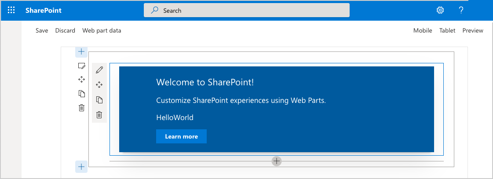

# Build your first SharePoint client-side web part (Hello World part 1)

Client-side web parts are client-side components that run inside the context of a SharePoint page. Client-side web parts can be deployed to SharePoint Online, and you can also use modern JavaScript tools and libraries to build them.

Client-side web parts support:

* Building with HTML and JavaScript.
* Both SharePoint Online and on-premises environments.

> [!NOTE]
> Before following the steps in this article, be sure to [Set up your development environment](../../set-up-your-development-environment.md).

You can also follow these steps by watching this video on the SharePoint PnP YouTube Channel:

<br/>

> [!Video https://www.youtube.com/embed/S3tG2DE8tR8]

<br/>

## Create a new web part project

### To create a new web part project

1. Create a new project directory in your favorite location.
    
  ```
  md helloworld-webpart
  ```

2. Go to the project directory.

  ```
  cd helloworld-webpart
  ```

3. Create a new HelloWorld web part by running the Yeoman SharePoint Generator.

  ```
  yo @microsoft/sharepoint
  ```
    
4. When prompted:

  - Accept the default **helloworld-webpart** as your solution name, and then select Enter.
  - Select **SharePoint Online only (latest)**, and select Enter.
  - Select **Use the current folder** for where to place the files.
  - Select **N** to allow solution to be deployed to all sites immediately.
  - Select **N** on the question if solution contains unique permissions.
  - Select **WebPart** as the client-side component type to be created.

5. The next set of prompts ask for specific information about your web part:

  - Accept the default **HelloWorld** as your web part name, and then select Enter.
  - Accept the default **HelloWorld description** as your web part description, and then select Enter.
  - Accept the default **No javascript web framework** as the framework you would like to use, and then select Enter.

  

At this point, Yeoman installs the required dependencies and scaffolds the solution files along with the **HelloWorld** web part. This might take a few minutes.

When the scaffold is complete, you should see the following message indicating a successful scaffold.


For information about troubleshooting any errors, see [Known issues](../../known-issues-and-common-questions.md).

### Using your favorite Code Editor

Because the SharePoint client-side solution is HTML/TypeScript based, you can use any code editor that supports client-side development to build your web part, such as:

- [Visual Studio Code](https://code.visualstudio.com/)
- [Atom](https://atom.io)
- [Webstorm](https://www.jetbrains.com/webstorm)

SharePoint Framework documentation uses Visual Studio code in the steps and examples. Visual Studio Code is a lightweight but powerful source code editor from Microsoft that runs on your desktop and is available for Windows, Mac, and Linux. It comes with built-in support for JavaScript, TypeScript, and Node.js, and has a rich ecosystem of extensions for other languages (such as C++, C#, Python, PHP) and runtimes.
   
## Preview the web part

To preview your web part, build and run it on a local web server. The client-side toolchain uses HTTPS endpoint by default. This setting can be configured in the **serve.json** file located in the **config** folder, but we do recommend using the default values.

Switch to your console, ensure that you are still in the **helloworld-webpart** directory, and then enter the following command:

> [!NOTE]
> Developer certificate has to be installed **ONLY once in your development environment**, so you can skip this step, if you have already executed that in your environment.
  ```
  gulp trust-dev-cert
  ```

Now that we have installed the developer certificate, enter the following command in the console to build and preview your web part:

  ```
  gulp serve
  ```

This command executes a series of gulp tasks to create a local, node-based HTTPS server on `localhost:4321` and launches your default browser to preview web parts from your local dev environment.

> [!NOTE]
> If you are seeing issues with the certificate in browser, please see details on installing a developer certificate from the [Set up your development environment](../../set-up-your-development-environment.md) article.


SharePoint client-side development tools use [gulp](http://gulpjs.com/) as the task runner to handle build process tasks such as:

- Bundling and minifying JavaScript and CSS files.
- Running tools to call the bundling and minification tasks before each build.
- Compiling SASS files to CSS.
- Compiling TypeScript files to JavaScript.

Visual Studio Code provides built-in support for gulp and other task runners. Select Ctrl+Shift+B on Windows or Cmd+Shift+B on Mac to debug and preview your web part. 

SharePoint Workbench is a developer design surface that enables you to quickly preview and test web parts without deploying them in SharePoint. SharePoint Workbench includes the client-side page and the client-side canvas in which you can add, delete, and test your web parts in development.


### To use SharePoint Workbench to preview and test your web part

1. To add the HelloWorld web part, select the **add** icon (*this icon appears when you mouse hovers over a section as shown in the previous image*). This opens the toolbox where you can see a list of web parts available for you to add. The list includes the **HelloWorld** web part as well other web parts available locally in your development environment.
   
  
   
2. Select **HelloWorld** to add the web part to the page.
   
  

  Congratulations! You have just added your first client-side web part to a client-side page.
   
3. Select the pencil icon on the far left of the web part to reveal the web part property pane.
   
  

  The property pane is where you can define properties to customize your web part. The property pane is client-side driven and provides a consistent design across SharePoint.
   
4. Modify the text in the **Description** text box to **Client-side web parts are awesome!**

  Notice how the text in the web part also changes as you type. 

One of the new capabilities available to the property pane is to configure its update behavior, which can be set to reactive or non-reactive. By default, the update behavior is reactive and enables you to see the changes as you edit the properties. The changes are saved instantly when the behavior is reactive.  

## Web part project structure

### To use Visual Studio Code to explore the web part project structure

1. In the console, break the processing by selecting Ctrl+C (in Windows).

2. Enter the following command to open the web part project in Visual Studio Code (or use your favorite editor):

  ```
  code .
  ```

  

If you get an error, you might need to [install the code command in PATH](https://code.visualstudio.com/docs/editor/setup).

TypeScript is the primary language for building SharePoint client-side web parts. TypeScript is a typed superset of JavaScript that compiles to plain JavaScript. SharePoint client-side development tools are built using TypeScript classes, modules, and interfaces to help developers build robust client-side web parts. 

The following are some key files in the project.

### Web part class

**HelloWorldWebPart.ts** in the **src\webparts\helloworld** folder defines the main entry point for the web part. The web part class **HelloWorldWebPart** extends the **BaseClientSideWebPart**. Any client-side web part should extend the **BaseClientSideWebPart** class to be defined as a valid web part.

**BaseClientSideWebPart** implements the minimal functionality that is required to build a web part. This class also provides many parameters to validate and access read-only properties such as **displayMode**, web part properties, web part context, web part **instanceId**, the web part **domElement**, and much more.

Notice that the web part class is defined to accept a property type **IHelloWorldWebPartProps**.

The property type is defined as an interface before the **HelloWorldWebPart** class in the **HelloWorldWebPart.ts** file.

```typescript
export interface IHelloWorldWebPartProps {
    description: string;
}
```

This property definition is used to define custom property types for your web part, which is described in the property pane section later.

#### Web part render method

The DOM element where the web part should be rendered is available in the **render** method. This method is used to render the web part inside that DOM element. In the **HelloWorld** web part, the DOM element is set to a DIV. The method parameters include the display mode (either Read or Edit) and the configured web part properties if any: 

```typescript
  public render(): void {
    this.domElement.innerHTML = `
      <div class="${ styles.helloWorld }">
        <div class="${ styles.container }">
          <div class="${ styles.row }">
            <div class="${ styles.column }">
              <span class="${ styles.title }">Welcome to SharePoint!</span>
              <p class="${ styles.subTitle }">Customize SharePoint experiences using web parts.</p>
              <p class="${ styles.description }">${escape(this.properties.description)}</p>
              <a href="https://aka.ms/spfx" class="${ styles.button }">
                <span class="${ styles.label }">Learn more</span>
              </a>
            </div>
          </div>
        </div>
      </div>`;
  }
```

This model is flexible enough so that web parts can be built in any JavaScript framework and loaded into the DOM element. 

#### Configure the Web part property pane

The property pane is defined in the **HelloWorldWebPart** class. The **getPropertyPaneConfiguration** property is where you need to define the property pane.

When the properties are defined, you can access them in your web part by using `this.properties.<property-value>`, as shown in the **render** method:

```typescript
<p class="${styles.description}">${escape(this.properties.description)}</p>
```

Notice that we are performing an HTML escape on the property's value to ensure a valid string. To learn more about how to work with the property pane and property pane field types, see [Make your SharePoint client-side web part configurable](../basics/integrate-with-property-pane.md). 

Let's now add a few more properties to the property pane: a check box, a drop-down list, and a toggle. We first start by importing the respective property pane fields from the framework.

1. Scroll to the top of the file and add the following to the import section from `@microsoft/sp-property-pane`:

  ```typescript
  PropertyPaneCheckbox,
  PropertyPaneDropdown,
  PropertyPaneToggle
  ```

  The complete import section looks like the following:

  ```typescript
  import {
    IPropertyPaneConfiguration,
    PropertyPaneTextField,
    PropertyPaneCheckbox,
    PropertyPaneDropdown,
    PropertyPaneToggle
  } from '@microsoft/sp-property-pane';
  ```

2. Update the web part properties to include the new properties. This maps the fields to typed objects.

3. Replace the **IHelloWorldWebPartProps** interface with the following code.

  ```typescript
  export interface IHelloWorldWebPartProps {
      description: string;
      test: string;
      test1: boolean;
      test2: string;
      test3: boolean;
  }
  ```

4. Save the file.

5. Replace the **getPropertyPaneConfiguration** method with the following code, which adds the new property pane fields and maps them to their respective typed objects.

  ```typescript
  protected getPropertyPaneConfiguration(): IPropertyPaneConfiguration {
    return {
      pages: [
        {
          header: {
            description: strings.PropertyPaneDescription
          },
          groups: [
            {
              groupName: strings.BasicGroupName,
              groupFields: [
              PropertyPaneTextField('description', {
                label: 'Description'
              }),
              PropertyPaneTextField('test', {
                label: 'Multi-line Text Field',
                multiline: true
              }),
              PropertyPaneCheckbox('test1', {
                text: 'Checkbox'
              }),
              PropertyPaneDropdown('test2', {
                label: 'Dropdown',
                options: [
                  { key: '1', text: 'One' },
                  { key: '2', text: 'Two' },
                  { key: '3', text: 'Three' },
                  { key: '4', text: 'Four' }
                ]}),
              PropertyPaneToggle('test3', {
                label: 'Toggle',
                onText: 'On',
                offText: 'Off'
              })
            ]
            }
          ]
        }
      ]
    };
  }
  ```

6. After you add your properties to the web part properties, you can now access the properties in the same way you accessed the **description** property earlier:

  ```typescript
  <p class="${ styles.description }">${escape(this.properties.test)}</p>
  ```

  To set the default value for the properties, you need to update the web part manifest's **properties** property bag.

7. Open `HelloWorldWebPart.manifest.json` and modify the `properties` to:

  ```typescript
  "properties": {
    "description": "HelloWorld",
    "test": "Multi-line text field",
    "test1": true,
    "test2": "2",
    "test3": true
  }
  ```

The web part property pane now has these default values for those properties.

### Web part manifest

The **HelloWorldWebPart.manifest.json** file defines the web part metadata such as version, id, display name, icon, and description. Every web part must contain this manifest.

```json
{
  "$schema": "https://developer.microsoft.com/json-schemas/spfx/client-side-web-part-manifest.schema.json",
  "id": "fbcf2c6a-7df9-414c-b3f5-37cab6bb1280",
  "alias": "HelloWorldWebPart",
  "componentType": "WebPart",

  // The "*" signifies that the version should be taken from the package.json
  "version": "*",
  "manifestVersion": 2,

  // If true, the component can only be installed on sites where Custom Script is allowed.
  // Components that allow authors to embed arbitrary script code should set this to true.
  // https://support.office.com/en-us/article/Turn-scripting-capabilities-on-or-off-1f2c515f-5d7e-448a-9fd7-835da935584f
  "requiresCustomScript": false,
  "supportedHosts": ["SharePointWebPart"],

  "preconfiguredEntries": [{
    "groupId": "5c03119e-3074-46fd-976b-c60198311f70", // Other
    "group": { "default": "Other" },
    "title": { "default": "HelloWorld" },
    "description": { "default": "HelloWorld description" },
    "officeFabricIconFontName": "Page",
    "properties": {
      "description": "HelloWorld",
      "test": "Multi-line text field",
      "test1": true,
      "test2": "2",
      "test3": true
    }
  }]
}

```

<br/>

Now that we have introduced new properties, ensure that you are again hosting the web part from the local development environment by executing the following command. This also ensures that the previous changes were correctly applied.

```
gulp serve
```

### Preview the web part in SharePoint

SharePoint Workbench is also hosted in SharePoint to preview and test your local web parts in development. The key advantage is that now you are running in SharePoint context and you are able to interact with SharePoint data.

1. Go to the following URL: `https://your-sharepoint-tenant.sharepoint.com/_layouts/workbench.aspx`

  > [!NOTE]
  > If you do not have the SPFx developer certificate installed, Workbench notifies you that it is configured not to load scripts from localhost. Stop the currently running process in the console window, and execute the `gulp trust-dev-cert` command in your project directory console to install the developer certificate before running the `gulp serve`command again. See details on installing a developer certificate from the [Set up your development environment](../../set-up-your-development-environment.md) article.

  

2. Notice that the SharePoint Workbench now has the Office 365 Suite navigation bar. 

3. Select the **add** icon in the canvas to reveal the toolbox. The toolbox now shows the web parts available on the site where the SharePoint Workbench is hosted along with your **HelloWorldWebPart**.

  

4. Add **HelloWorld** from the toolbox. Now you're running your web part in a page hosted in SharePoint!

  

> [!NOTE]
> The color of the web part depends on the colors of the site. By default, web parts inherit the core colors from the site by dynamically referencing Office UI Fabric Core styles used in the site where the web part is hosted.

Because you are still developing and testing your web part, there is no need to package and deploy your web part to SharePoint. 

## Next steps

Congratulations on getting your first Hello World web part running!

Now that your web part is running, you can continue building out your Hello World web part in the next topic, [Connect your web part to SharePoint](./connect-to-sharepoint.md). You will use the same Hello World web part project and add the ability to interact with SharePoint List REST APIs. Notice that the `gulp serve` command is still running in your console window (or in Visual Studio Code if you are using that as editor). You can continue to let it run while you go to the next article.

> [!NOTE]
> If you find an issue in the documentation or in the SharePoint Framework, please report that to SharePoint engineering by using the [issue list at the sp-dev-docs repository](https://github.com/SharePoint/sp-dev-docs/issues) or by adding a comment to this article. Thanks for your input in advance.
