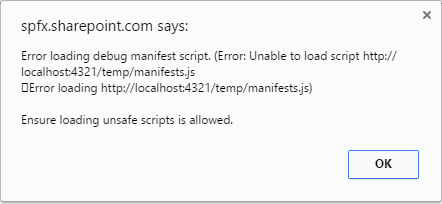

# Build your first SharePoint client-side web part (Hello World part 1)

>**Note:** The SharePoint Framework is currently in preview and is subject to change. SharePoint Framework client-side web parts are not currently supported for use in production enviornments.

Client-side web parts are client-side components that run inside the context of a SharePoint page. Client-side web parts can be deployed to SharePoint Online, and you can also use modern JavaScript tools and libraries to build them.

Client-side web parts support:

* Building with HTML and JavaScript.
* Both SharePoint online and on-premises environments.

>**Note:** Before following the steps in this article, be sure to [Set up your development environment](../set-up-your-development-environment).
    
## Create a new web part project
1. Create a new project directory in your favorite location.
	
	   ```
	   md helloworld-webpart
	   ```

2. Go to the project directory.

	   ```
	   cd helloworld-webpart
	   ```

3. Create a new HelloWorld web part by running the Yeoman SharePoint Generator.

	   ```
	   yo @microsoft/sharepoint
	   ```
    
When prompted:

4. Accept the default **helloworld-webpart** as your solution name and choose **Enter**.
5. Select **Use the current folder** for where to place the files.

The next set of prompts will ask for specific information about your web part:

6.  Accept the default **HelloWorld** as your web part name and choose **Enter**.
7.  Accept the default **HelloWorld description** as your web part description and choose **Enter**.
8.  Accept the default **No javascript web framework** as the framework you would like to use and choose **Enter**.


At this point, Yeoman will install the required dependencies and scaffold the solution files along with the **HelloWorld** web part. This might take a few minutes. 

When the scaffold is complete, you should see the following message indicating a successful scaffold:


For information about troubleshooting any errors, see [Known issues](./known-issues).

### Using your favorite Code Editor/IDE  
Because the SharePoint client-side solution is HTML/TypeScript based, you can use any code editor or IDE that supports client-side development to build your web part, such as:

* [Visual Studio Code](https://code.visualstudio.com/)
* [Sublime](https://www.sublimetext.com/)
* [Atom](https://atom.io)
* [Webstorm](https://www.jetbrains.com/webstorm)

>**Note:** This article uses Visual Studio code in the steps and examples. You can use any IDE that you prefer. 

### Using Visual Studio 2015
Currently, support for SharePoint client-side projects in Visual Studio is available through Node.js Tools for Visual Studio. For more information, see [Use Visual Studio to develop web parts](./use-visual-studio-to-develop-web-parts).
   
## Preview the web part
To preview your web part, build and run it on a local web server. 

* Switch to your console, make sure you are still in the **helloworld-webpart** directory and enter the following command to build and preview your web part:

```
gulp serve
```

This command will execute a series of gulp tasks to create a local, Node-based HTTP server on 'localhost:4321' and launch your default browser to preview web parts from your local dev environment.


>**Note:** If you get the error **cannot find module es6-promise**, run the following command in the project folder to install the es-promise npm module: `npm i es6-promise` and then run `gulp serve` again.

SharePoint client-side development tools use [gulp](http://gulpjs.com/) as the task runner to handle build process tasks such as:

* Bundle and minify JavaScript and CSS files.
* Run tools to call the bundling and minification tasks before each build.
* Compile SASS files to CSS.
* Compile TypeScript files to JavaScript.

If you are new to gulp, you can read [Using Gulp](http://docs.asp.net/en/latest/client-side/using-gulp.html) which describes using gulp with Visual Studio in conjunction with building ASP.NET 5 projects.

Visual Studio Code provides built-in support for gulp and other task runners. Choose **Ctrl+Shift+B** on Windows or **Cmd+Shift+B** on Mac to debug and preview your web part. 

### SharePoint workbench
SharePoint workbench is a developer design surface that enables you to quickly preview and test web parts without deploying them in SharePoint. SharePoint workbench includes the client-side page and the client-side canvas in which you can add, delete and test your web parts in development.


1. To add the HelloWorld web part, choose the **add** button. The add button opens the toolbox where you can see a list of web parts available for you to add. The list will include the **HelloWorld** web part as well other web parts available locally in your development environment.
   
   
   
2. Choose **HelloWorld** to add the web part to the page:
   
   
   
   Congratulations! You have just added your first client-side web part to a client-side page.
   
3. Now, choose the pencil icon on the far left of the web part to reveal the web part property pane.
   
   
   
   The property pane is where you can define properties to customize your web part. The property pane is client-side driven and provides a consistent design across SharePoint. 
   
4. Modify the text in the **Description** text box to **Client-side web parts are awesome!**

   Notice how the text in the web part also changes as you type. 

One of the new capabilities available to the property pane is to configure its update behavior, which can be set to reactive or non-reactive. By default the update behavior is reactive and enables you to see the changes as you edit the properties. The changes are saved instantly as when the behavior is reactive.  

## Web part project structure
You can use Visual Studio Code to explore the web part project structure. 

1. In the console, go to the **src\webparts\helloWorld** directory. 
2. Enter the following command to open the web part project in Visual Studio Code (or use your favorite editor):

   ```
   code .
   ```

   

   If you get an error, you might need to [install the code command in PATH](https://code.visualstudio.com/docs/editor/setup).

TypeScript is the primary language for building SharePoint client-side web parts. TypeScript is a typed superset of JavaScript that compiles to plain JavaScript. SharePoint client-side development tools are built using TypeScript classes, modules, and interfaces to help developers build robust client-side web parts. 

The following are some key files in the project.

### Web part class
**HelloWorldWebPart.ts** defines the main entry point for the web part. The web part class **HelloWorldWebPart** extends the **BaseClientSideWebPart**. Any client-side web part should extend the **BaseClientSideWebPart** class in order to be defined as a valid web part.

```ts
public constructor(context: IWebPartContext) {
    super(context);
}
```

**BaseClientSideWebPart** implements the minimal functionality that is required to build a web part. This class also provides many parameters to validate and access to read-only properties such as **displayMode**, web part properties, web part context, web part **instanceId**, the web part **domElement** and much more.

Notice that the web part class is defined to accept a property type **IHelloWorldWebPartProps**.

The property type is defined as an interface in a separate file **IHelloWorldWebPartProps.ts**.

```ts
export interface IHelloWorldWebPartProps {
    description: string;
}
```

This property definition is used to define custom property types for your web part, which is described in the property pane section later. 

#### Web part render method
The DOM element where the web part should be rendered is available in the **render** method. This method is used to render the web part inside that DOM element. In the **HelloWorld** web part, the DOM element is set to a DIV. The method parameters include the display mode (either Read or Edit) and the configured web part properties if any: 

```ts
public render(): void {
  this.domElement.innerHTML = `
    <div class="${styles.helloWorld}">
      <div class="${styles.container}">
        <div class="ms-Grid-row ms-bgColor-themeDark ms-fontColor-white ${styles.row}">
          <div class="ms-Grid-col ms-u-lg10 ms-u-xl8 ms-u-xlPush2 ms-u-lgPush1">
            <span class="ms-font-xl ms-fontColor-white">Welcome to SharePoint!</span>
            <p class="ms-font-l ms-fontColor-white">Customize SharePoint experiences using Web Parts.</p>
            <p class="ms-font-l ms-fontColor-white">${this.properties.description}</p>
            <a href="https://github.com/SharePoint/sp-dev-docs/wiki" class="ms-Button ${styles.button}">
              <span class="ms-Button-label">Learn more</span>
            </a>
          </div>
        </div>
    </div>
  </div>`;
}
```

This model is flexible enough so that web parts can be built in any JavaScript framework and loaded into the DOM element. The following is an example of how you would load a React component instead of plain HTML.

```ts
render(): void {
    let e = React.createElement(TodoComponent, this.properties);
    ReactDom.render(e, this.domElement);
}
```

>**Note:** The Yeoman SharePoint generator lets you choose **React** as your framework of choice when adding a new web part to the project. 

#### Configure the Web part property pane
The property pane is also defined in the **HelloWorldWebPart** class. The **propertyPaneSettings** property is where you need to define the property pane.

When the properties are defined, you can access them in your web part using `this.properties.<property-value>`, as shown in the **render** method:

```ts
<p class="ms-font-l ms-fontColor-white">${this.properties.description}</p>
```

Read the [Integrating property pane with a web part](./integrate-with-property-pane) article to learn more about how to work with the property pane and property pane field types.

1. Replace the **propertyPaneSettings** method with the code below which shows how to add property types other than TextField. 

   ```ts
   protected get propertyPaneSettings(): IPropertyPaneSettings {
     return {
       pages: [
         {
           header: {
             description: strings.PropertyPaneDescription
           },
           groups: [
             {
               groupName: strings.BasicGroupName,
               groupFields: [
               PropertyPaneTextField('description', {
                 label: 'Description'
               }),
               PropertyPaneTextField('test', {
                 label: 'Multi-line Text Field',
                 multiline: true
               }),
               PropertyPaneCheckbox('test1', {
                 text: 'Checkbox'
               }),
               PropertyPaneDropdown('test2', {
                 label: 'Dropdown',
                 options: [
                   { key: '1', text: 'One' },
                   { key: '2', text: 'Two' },
                   { key: '3', text: 'Three' },
                   { key: '4', text: 'Four' }
                 ]}),
               PropertyPaneToggle('test3', {
                 label: 'Toggle',
                 onText: 'On',
                 offText: 'Off'
               })
             ]
             }
           ]
         }
       ]
     };
   }
   ```

   Since we added new property fields, let's import those from the framework.

2. Scroll to the top of the file and add the following to the import section from `@microsoft/sp-client-preview`:

   ```
   PropertyPaneCheckbox,
   PropertyPaneDropdown,
   PropertyPaneToggle
   ```

   The complete import section will look like the following:

   ```
   import {
     BaseClientSideWebPart,
     IPropertyPaneSettings,
     IWebPartContext,
     PropertyPaneTextField,
     PropertyPaneCheckbox,
     PropertyPaneDropdown,
     PropertyPaneToggle
   } from '@microsoft/sp-client-preview';
   ```

3. Save the file.

   Now add these properties to the **IHelloWorldWebPartProps** interface that map to our fields we just added.

4. Open **IHelloWorldWebPartProps.ts** and replace the existing code with the following code:

   ```ts
   export interface IHelloWorldWebPartProps {
       description: string;
       test: string;
       test1: boolean;
       test2: string;
       test3: boolean;
   }
   ```

5. Save the file.
6. Switch back to the **HelloWorldWebPart.ts** file.

   After you add your properties to the web part properties, you can access the property in the same way you accessed the **description** property earlier:

   ```ts
   <p class="ms-font-l ms-fontColor-white">${this.properties.test2}</p>
   ```

   To set the default value for the property, you will need to update the web part manifest's **properties** property bag:

7. Open `HelloWorldWebPart.manifest.json`
8. Modify the `properties` to:

   ```ts
   "properties": {
     "description": "HelloWorld",
     "test": "Multi-line text field",
     "test1": true,
     "test2": "2",
     "test3": true
   }
   ```

### Web part manifest
The **HelloWorldWebPart.manifest.json** file defines the web part metadata such as version, id, display name, icon, and description. Every web part should contain this manifest.

```ts
{
  "$schema": "../../../node_modules/@microsoft/sp-module-interfaces/lib/manifestSchemas/jsonSchemas/clientSideComponentManifestSchema.json",
  "id": "2f1ef3e2-5f37-4da8-b1ff-52c468a28ae2",
  "componentType": "WebPart",
  "version": "0.0.1",
  "manifestVersion": 2,
  "preconfiguredEntries": [
    {
      "groupId": "2f1ef3e2-5f37-4da8-b1ff-52c468a28ae2",
      "group": {
        "default": "Under Development"
      },
      "title": {
        "default": "HelloWorld"
      },
      "description": {
        "default": "HelloWorld description"
      },
      "officeFabricIconFontName": "Page",
      "properties": {
        "description": "HelloWorld",
        "test": "Multi-line text field",
        "test1": true,
        "test2": "2",
        "test3": true
      }
    }
  ]
}
```
### Preview the web part in SharePoint

SharePoint workbench is also hosted in SharePoint to preview and test your local web parts in development. The key advantage is that now you are running in SharePoint context and that you will be able to interact with SharePoint data.

1. Go to the following URL: 'https://your-sharepoint-site/Shared%20Documents/workbench.aspx'

   By default, your browser is configured not to load scripts from localhost. Workbench will notify you if that is the case.

    

2. In order to execute local scripts, you will need to configure the browser to load scripts from unauthenticated sources. This is due to loading scripts over HTTP while connected to a page via HTTPS. Depending on the browser you use, the options to enable this may vary. For example, in the Chrome browser, you can choose the grey shield in the right side of the address bar to load unsafe scripts. 

   

   After you enable loading scripts, you should see the workbench load. Add the hello world web part to the canvas:

   

   Notice that the SharePoint workbench now has the Office 365 Suite navigation bar.

3. Choose **add icon** in the canvas to reveal the toolbox. The toolbox now shows the web parts available on the site where the SharePoint workbench is hosted along with your **HelloWorldWebPart**.

   

4. Add **HelloWorldWebPart** from the toolbox. Now you're running your web part in a page hosted in SharePoint!

   

Because you are still developing and testing your web part, there is no need to package and deploy your web part to SharePoint. 

## Next steps
Congratulations on getting your first Hello World web part running! Now that your web part is running, you can continue building out your Hello World web part in the next topic, [Connect to SharePoint](./connect-to-sharepoint). You will use the same Hello World web part project and add the ability to interact with SharePoint List REST APIs. Notice that the `gulp serve` command is still running in your console window (or in Visual Studio Code if you using the editor). You can continue to let it run while you go to the next article.
