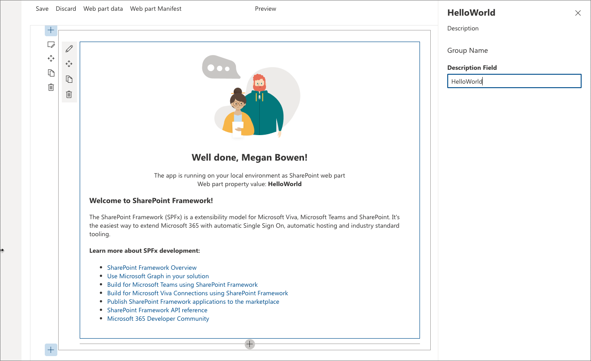

# Build your first SharePoint client-side web part (Hello World part 1)

Client-side web parts are client-side components that run in the context of a SharePoint page. Client-side web parts can be deployed to SharePoint environments that support the SharePoint Framework. You can also use modern JavaScript web frameworks, tools, and libraries to build them.

Client-side web parts support:

- Building with HTML and JavaScript.
- Both SharePoint Online and on-premises environments.

> [!NOTE]
> Before following the steps in this article, be sure to [Set up your development environment](../../set-up-your-development-environment.md).

You can also follow these steps by watching this video on the Microsoft 365 Platform Community (PnP) YouTube Channel:

> [!Video https://www.youtube.com/embed/6WTtjXP5yW4]

## Create a new web part project

Create a new project directory for your project and change your current folder to that directory.

Create a new project by running the Yeoman SharePoint Generator from within the new directory you created:

```console
yo @microsoft/sharepoint
```

The Yeoman SharePoint Generator will prompt you with a series of questions. For all questions, accept the default options except for the following questions:

- **Which type of client-side component to create?**: WebPart
- **What is your Web part name?**: HelloWorld
- **Which template would you like to use?**: No framework

At this point, Yeoman creates the project scaffolding (folders & files) and installs the required dependencies by running `npm install`. This usually takes 1-3 minutes depending on your internet connection.

When the project scaffolding and dependency install process are complete, Yeoman will display a message similar to the following indicating it was successful:

```console
_=+#####!
###########|       .-----------------------------------.
###/    (##|(@)    |          Congratulations!         |
###  ######|   \   |   Solution webpart-1 is created.  |
###/   /###|   (@) |  Run gulp serve to play with it!  |
#######  ##|   /   '-----------------------------------'
###     /##|(@)
###########|
**=+####!
```

> [!IMPORTANT]
> NPM may display warnings and error messages during the installation of dependencies while it runs the `npm install` command. You can safely ignore these log warnings & error messages.
>
> NPM may display a message about running `npm audit` at the end of the process. Don't run this command as it will upgrade packages and nested dependencies that may not have been tested by the SharePoint Framework.

For information about troubleshooting any errors, see [Known issues](../../known-issues-and-common-questions.yml).

### Use your favorite code editor

Because the SharePoint client-side solution is HTML/TypeScript based, you can use any code editor that supports client-side development to build your web part, such as:

- [Visual Studio Code](https://code.visualstudio.com/)
- [Webstorm](https://www.jetbrains.com/webstorm)

The SharePoint Framework documentation uses Visual Studio Code in the steps and examples. Visual Studio Code (VS Code) is a lightweight but powerful source code editor from Microsoft that runs on your desktop. VS Code available for Windows, macOS, and Linux. It comes with built-in support for JavaScript, TypeScript, Node.js, and has a rich ecosystem of extensions for other languages (such as C++, C#, Python, PHP).

## Preview the web part

You can preview and test your client-side web part in the SharePoint hosted workbench without deploying your solution to SharePoint. This is done by starting a local web server the hosted workbench can load files from using the gulp task **serve**.

The client-side toolchain uses HTTPS endpoints by default. Part of the [Set up your development environment](../../set-up-your-development-environment.md) process included trusting the development SSL certificate included in the toolchain on your local environment. This is required so your browser will trust the certificate.

> [!IMPORTANT]
> Trusting the developer certificate is required. This is a one-time process and is only required when you run your first SharePoint Framework project on a new workstation. You don't need to do this for every SharePoint Framework project.
>
> If you didn't trust the dev cert, follow the steps outlined on this page: [Set up your development environment: Trusting the self-signed developer certificate](../../set-up-your-development-environment.md#trusting-the-self-signed-developer-certificate).

### Start the local web server & launch the hosted workbench

Assuming you've installed & trusted developer certificate, execute the following command in the console to build and preview your web part:

```console
gulp serve
```

This command executes a series of gulp tasks to create and start a local webserver hosting the endpoints **localhost:4321** and **localhost:5432**. It will then open your default browser and load the hosted workbench preview web parts from your local dev environment.

```console
gulp serve
Build target: DEBUG
[12:13:24] Using gulpfile d:\pnp\helloworld-webpart\gulpfile.js
[12:13:24] Starting 'serve'...
[12:13:24] Starting gulp
[12:13:24] Starting subtask 'spfx-serve'...
[12:13:24] [spfx-serve] To load your scripts, use this query string: ?debug=true&noredir=true&debugManifestsFile=https://localhost:4321/temp/manifests.js
[12:13:25] Starting server...
[12:13:25] Finished subtask 'spfx-serve' after 1.24 s
[12:13:25] Starting subtask 'pre-copy'...
[12:13:26] Finished subtask 'pre-copy' after 533 ms
[12:13:26] Starting subtask 'copy-static-assets'...
[12:13:26] Starting subtask 'sass'...
[12:13:26] Server started https://localhost:4321
[12:13:26] LiveReload started on port 35729
[12:13:26] Running server
[12:13:26] Opening https://sppnp.sharepoint.com/_layouts/workbench.aspx using the default OS app
```

SharePoint client-side development tools use [gulp](http://gulpjs.com/) as the task runner to handle build process tasks such as:

- Transpile TypeScript files to JavaScript.
- Compile SASS files to CSS.
- Bundle and minify JavaScript and CSS files.

VS Code provides built-in support for gulp and other task runners. Select <kbd>CTRL</kbd>+<kbd>SHIFT</kbd>+<kbd>B</kbd> on Windows or <kbd>CMD</kbd>+<kbd>SHIFT</kbd>+<kbd>B</kbd> on macOS to debug and preview your web part.

The SharePoint Workbench is a developer design surface that enables you to quickly preview and test web parts without deploying them in SharePoint. SharePoint Workbench includes the client-side page and the client-side canvas in which you can add, delete, and test your web parts in development.


### Use SharePoint Workbench to preview and test your web part

1. To add the HelloWorld web part, select the **add** icon (*this icon appears when you mouse hovers over a section as shown in the image above*). This opens the toolbox where you can see a list of web parts available for you to add. The list includes the **HelloWorld** web part as well other web parts available locally in your development environment.

    

1. Select **HelloWorld** to add the web part to the page.

    

    Congratulations! You've just added your first client-side web part to a client-side page.

1. Select the pencil icon on the far left of the web part to reveal the web part property pane.

    

    The property pane is where you can define properties to customize your web part. The property pane is client-side driven and provides a consistent design across SharePoint.

1. Modify the text in the **Description** text box to **Client-side web parts are awesome!**

    Notice how the text in the web part also changes as you type.

One of the capabilities of the property pane is to configure its update behavior, which can be set to *reactive* or *non-reactive*. By default, the update behavior is reactive and enables you to see the changes as you edit the properties. The changes are saved instantly when the behavior is reactive.

## Web part project structure

### Use Visual Studio Code to explore the web part project structure

1. In the console, stop the local web server by terminating the process. Selecting <kbd>CTRL</kbd>+<kbd>C</kbd> on Windows or macOS.
1. Enter the following command to open the web part project in VS Code (or use your favorite editor):

    ```console
    code .
    ```

> [!NOTE]
> If you get an error when executing this command, you might need to [install the code command in PATH](https://code.visualstudio.com/docs/editor/setup).

TypeScript is the primary language for building SharePoint client-side web parts. TypeScript is a typed superset of JavaScript that compiles to plain JavaScript. SharePoint client-side development tools are built using TypeScript classes, modules, and interfaces to help developers build robust client-side web parts.

The following are some key files in the project.

### Web part class

**HelloWorldWebPart.ts** in the **src\webparts\helloworld** folder defines the main entry point for the web part. The web part class **HelloWorldWebPart** extends the `BaseClientSideWebPart`. Any client-side web part should extend the `BaseClientSideWebPart` class to be defined as a valid web part.

`BaseClientSideWebPart` implements the minimal functionality that is required to build a web part. This class also provides many parameters to validate and access read-only properties such as `displayMode`, web part properties, web part context, web part `instanceId`, the web part `domElement`, and much more.

Notice that the web part class is defined to accept a property type `IHelloWorldWebPartProps`.

The property type is defined as an interface before the `HelloWorldWebPart` class in the **HelloWorldWebPart.ts** file.

```typescript
export interface IHelloWorldWebPartProps {
  description: string;
}
```

This property definition is used to define custom property types for your web part, which is described in the property pane section later.

#### Web part render method

The DOM element where the web part should be rendered is available in the `render()` method. This method is used to render the web part inside that DOM element. In the **HelloWorld** web part, the DOM element is set to a DIV.

```typescript
public render(): void {
  this.domElement.innerHTML = `
  <section class="${styles.helloWorld} ${!!this.context.sdks.microsoftTeams ? styles.teams : ''}">
    <div class="${styles.welcome}">
      
      <h2>Well done, ${escape(this.context.pageContext.user.displayName)}!</h2>
      <div>${this._environmentMessage}</div>
      <div>Web part property value: <strong>${escape(this.properties.description)}</strong></div>
    </div>
    <div>
      <h3>Welcome to SharePoint Framework!</h3>
      <p>
      The SharePoint Framework (SPFx) is a extensibility model for Microsoft Viva, Microsoft Teams and SharePoint. It's the easiest way to extend Microsoft 365 with automatic Single Sign On, automatic hosting and industry standard tooling.
      </p>
      <h4>Learn more about SPFx development:</h4>
        <ul class="${styles.links}">
          <li><a href="https://aka.ms/spfx" target="_blank">SharePoint Framework Overview</a></li>
          <li><a href="https://aka.ms/spfx-yeoman-graph" target="_blank">Use Microsoft Graph in your solution</a></li>
          <li><a href="https://aka.ms/spfx-yeoman-teams" target="_blank">Build for Microsoft Teams using SharePoint Framework</a></li>
          <li><a href="https://aka.ms/spfx-yeoman-viva" target="_blank">Build for Microsoft Viva Connections using SharePoint Framework</a></li>
          <li><a href="https://aka.ms/spfx-yeoman-store" target="_blank">Publish SharePoint Framework applications to the marketplace</a></li>
          <li><a href="https://aka.ms/spfx-yeoman-api" target="_blank">SharePoint Framework API reference</a></li>
          <li><a href="https://aka.ms/m365pnp" target="_blank">Microsoft 365 Developer Community</a></li>
        </ul>
    </div>
  </section>`;
}
```

This model is flexible enough so that web parts can be built in any JavaScript framework and loaded into the DOM element.

#### Configure the Web part property pane

The property pane is defined in the `HelloWorldWebPart` class. The `getPropertyPaneConfiguration` property is where you need to define the property pane.

When the properties are defined, you can access them in your web part by using `this.properties.<property-value>`, as shown in the `render()` method:

```typescript
<div>Web part property value: <strong>${escape(this.properties.description)}</strong></div>
```

Notice that we're executing an HTML escape on the property's value to ensure a valid string. To learn more about how to work with the property pane and property pane field types, see [Make your SharePoint client-side web part configurable](../basics/integrate-with-property-pane.md).

Let's now add a few more properties to the property pane: a checkbox, a drop-down list, and a toggle. We first start by importing the respective property pane fields from the framework.

1. Scroll to the top of the file and add the following to the import section from **\@microsoft/sp-property-pane**:

    ```typescript
    PropertyPaneCheckbox,
    PropertyPaneDropdown,
    PropertyPaneToggle
    ```

    The complete import section looks like the following:

    ```typescript
    import {
      IPropertyPaneConfiguration,
      PropertyPaneTextField,
      PropertyPaneCheckbox,
      PropertyPaneDropdown,
      PropertyPaneToggle
    } from '@microsoft/sp-property-pane';
    ```

1. Update the web part properties to include the new properties. This maps the fields to typed objects.
1. Replace the `IHelloWorldWebPartProps` interface with the following code.

    ```typescript
    export interface IHelloWorldWebPartProps {
      description: string;
      test: string;
      test1: boolean;
      test2: string;
      test3: boolean;
    }
    ```

1. Save the file.
1. Replace the `getPropertyPaneConfiguration()` method with the following code, which adds the new property pane fields and maps them to their respective typed objects.

    ```typescript
    protected getPropertyPaneConfiguration(): IPropertyPaneConfiguration {
      return {
        pages: [
          {
            header: {
              description: strings.PropertyPaneDescription
            },
            groups: [
              {
                groupName: strings.BasicGroupName,
                groupFields: [
                PropertyPaneTextField('description', {
                  label: 'Description'
                }),
                PropertyPaneTextField('test', {
                  label: 'Multi-line Text Field',
                  multiline: true
                }),
                PropertyPaneCheckbox('test1', {
                  text: 'Checkbox'
                }),
                PropertyPaneDropdown('test2', {
                  label: 'Dropdown',
                  options: [
                    { key: '1', text: 'One' },
                    { key: '2', text: 'Two' },
                    { key: '3', text: 'Three' },
                    { key: '4', text: 'Four' }
                  ]}),
                PropertyPaneToggle('test3', {
                  label: 'Toggle',
                  onText: 'On',
                  offText: 'Off'
                })
              ]
              }
            ]
          }
        ]
      };
    }
    ```

1. After you add your properties to the web part properties, you can now access the properties in the same way you accessed the `description` property earlier.

    Locate the following line:

    ```html
    <div>Web part property value: <strong>${escape(this.properties.description)}</strong></div>
    ```

    Add the following immediately after the previously mentioned line:

    ```html
    <p>${escape(this.properties.test)}</p>
    <p>${this.properties.test1}</p>
    <p>${escape(this.properties.test2)}</p>
    <p>${this.properties.test3}</p>
    ```

    To set the default value for the properties, you need to update the web part manifest's `properties` property bag.

1. Open **HelloWorldWebPart.manifest.json** and modify the `properties` to:

    ```typescript
    "properties": {
      "description": "HelloWorld",
      "test": "Multi-line text field",
      "test1": true,
      "test2": "2",
      "test3": true
    }
    ```

The web part property pane now has these default values for those properties.

### Web part manifest

The **HelloWorldWebPart.manifest.json** file defines the web part metadata such as version, ID, display name, icon, and description. Every web part must contain this manifest.

```json
{
  "$schema": "https://developer.microsoft.com/json-schemas/spfx/client-side-web-part-manifest.schema.json",
  "id": "fbcf2c6a-7df9-414c-b3f5-37cab6bb1280",
  "alias": "HelloWorldWebPart",
  "componentType": "WebPart",

  // The "*" signifies that the version should be taken from the package.json
  "version": "*",
  "manifestVersion": 2,

  // If true, the component can only be installed on sites where Custom Script is allowed.
  // Components that allow authors to embed arbitrary script code should set this to true.
  // https://support.office.com/article/Turn-scripting-capabilities-on-or-off-1f2c515f-5d7e-448a-9fd7-835da935584f
  "requiresCustomScript": false,
  "supportedHosts": ["SharePointWebPart", "TeamsPersonalApp", "TeamsTab", "SharePointFullPage"],
  "supportsThemeVariants": true,

  "preconfiguredEntries": [{
    "groupId": "5c03119e-3074-46fd-976b-c60198311f70", // Advanced
    "group": { "default": "Advanced" },
    "title": { "default": "HelloWorld" },
    "description": { "default": "HelloWorld description" },
    "officeFabricIconFontName": "Page",
    "properties": {
      "description": "HelloWorld",
      "test": "Multi-line text field",
      "test1": true,
      "test2": "2",
      "test3": true
    }
  }]
}
```

Now that we have introduced new properties, ensure that you're again hosting the web part from the local development environment by executing the following command. This also ensures that the previous changes were correctly applied.

```console
gulp serve
```

## Next steps

Congratulations on getting your first Hello World web part running!

Now that your web part is running, you can continue building out your Hello World web part in the next topic, [Connect your web part to SharePoint](./connect-to-sharepoint.md). You will use the same Hello World web part project and add the ability to interact with SharePoint List REST APIs. Notice that the **gulp serve** command is still running in your console window (or in Visual Studio Code if you're using that as editor). You can continue to let it run while you go to the next article.
