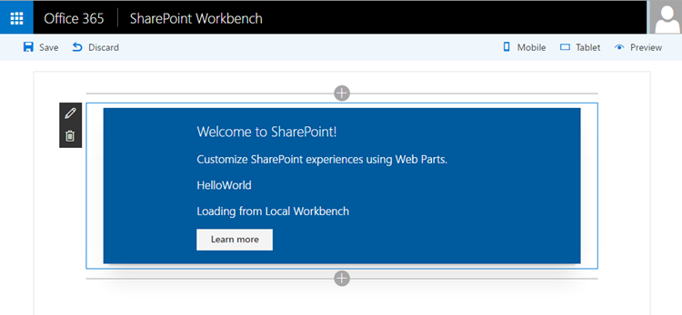
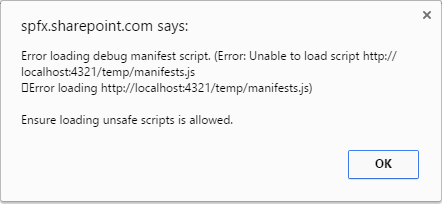
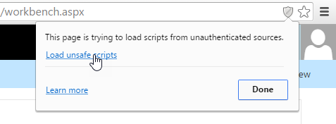
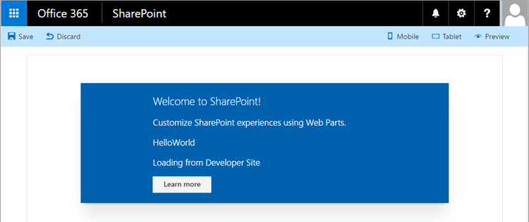
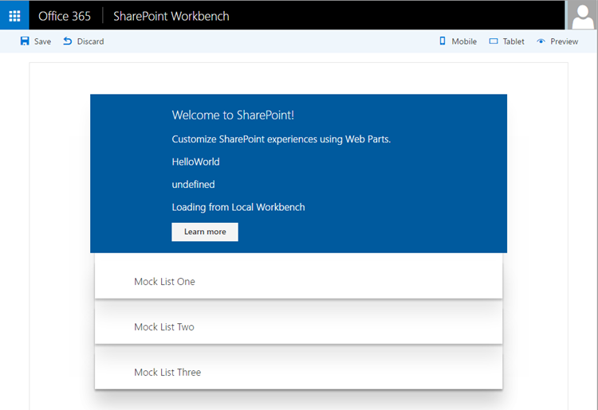
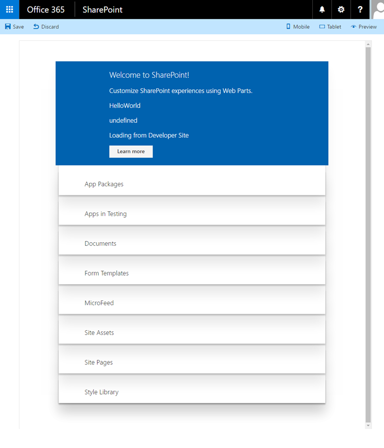

# Connect your client-side web part to SharePoint (Hello world part 2)

>**Note:** The SharePoint Framework is currently in preview and is subject to change. SharePoint Framework client-side web parts are not currently supported for use in production environments.

Connect your web part to SharePoint to access functionality and data in SharePoint and provide a more integrated experience for end users. This article continues building the hello world web part built in the previous article [Build your first web part](./build-a-hello-world-web-part).

You can also follow follow these steps by watching the video on the [SharePoint PnP YouTube Channel](https://www.youtube.com/watch?v=rokWJlXoFWk&list=PLR9nK3mnD-OXvSWvS2zglCzz4iplhVrKq). 

<a href="https://www.youtube.com/watch?v=rokWJlXoFWk&list=PLR9nK3mnD-OXvSWvS2zglCzz4iplhVrKq">

</a>


## Run gulp serve

Make sure you have the `gulp serve` command running. If it is not already running, go to the **helloworld-webpart** project directory and run it using the following commands.

```
cd helloworld-webpart
gulp serve
```

## Get access to page context

When the workbench is hosted locally, you do not have the SharePoint page context. You can still test your web part in many different ways. For example, you can concentrate on building the web part's UX and use mock data to simulate SharePoint interaction when you don't have the SharePoint context.

However, when the workbench is hosted in SharePoint, you get access to the page context which provides various key properties, such as:

* Web title
* Web absolute URL
* Web server-relative URL
* User login name

You can get access to the page context using the following variable in your web part class:

```ts
this.context.pageContext
```

Switch to Visual Studio code (or your preferred IDE) and open **src\webparts\helloWorld\HelloWorldWebPart.ts**.

Inside the **render** method, replace the **innerHTML** code block with the following code:

```ts
this.domElement.innerHTML = `
<div class='${styles.helloWorld}'>
	<div class='${styles.container}'>
		<div class='ms-Grid-row ms-bgColor-themeDark ms-fontColor-white ${styles.row}'>
		<div class='ms-Grid-col ms-u-lg10 ms-u-xl8 ms-u-xlPush2 ms-u-lgPush1'>
			<span class='ms-font-xl ms-fontColor-white'>Welcome to SharePoint!</span>
			<p class='ms-font-l ms-fontColor-white'>Customize SharePoint experiences using Web Parts.</p>
			<p class='ms-font-l ms-fontColor-white'>${this.properties.description}</p>
			<p class='ms-font-l ms-fontColor-white'>Loading from ${this.context.pageContext.web.title}</p>
			<a href='https://github.com/SharePoint/sp-dev-docs/wiki' class='ms-Button ${styles.button}'>
				<span class='ms-Button-label'>Learn more</span>
			</a>
		</div>
		</div>
</div>
</div>`;
```

Notice how `${ }` is used to output the variable's value in the HTML block. An extra HTML `p` is used to display `this.context.pageContext.web.title`. Since this web part loads from the local environment, the title will be **Local Workbench**.

Save the file. The `gulp serve` running in your console will detect this save operation and:

* Build and bundle the updated code automatically.
* Refresh your local workbench page (as the web part code needs to be reloaded).

>**Note:** Keep the console window and VS Code side by side to see gulp automatically compile as you save changes in VS Code.

In your browser, go to **workbench.html** locally. If you have already closed the tab, the URL is http://localhost:4321/temp/workbench.html.

You should see the following in the web part:



Go to **workbench.aspx** hosted in SharePoint. The full URL is https://your-sharepoint-site-url/Shared%20Documents/workbench.aspx.

By default, your browser is configured not to load scripts from localhost. Workbench will notify you if that is the case as shown in the following image. This is due to loading scripts over HTTP while connected to a page via HTTPS.

 

To execute local scripts, in the Chrome browser, click the grey shield in the right side of the address bar to load unsafe scripts. 



You should now see your SharePoint site URL in the web part now that page context is available to the web part.



## Define list model
You need a list model to start working with SharePoint list data. Two models As we will retrieve the lists, we need two models. 

Switch to Visual Studio Code and go to **src\webparts\helloWorld\HelloWorldWebPart.ts**.

Define the following `interface` models just above the **HelloWorldWebPart** class:

```ts
export interface ISPLists {
	value: ISPList[];
}

export interface ISPList {
	Title: string;
	Id: string;
}
```

The **ISPList** interface holds the SharePoint list information we are connecting to. 

## Retrieve lists from mock store

To test in the local workbench you will need a mock store that returns mock data.

Create a new file inside the **src\webparts\helloWorld** folder named **MockHttpClient.ts**.

Copy the following code into **MockHttpClient.ts**:

```ts
import { ISPList } from './HelloWorldWebPart';

export default class MockHttpClient {

	private static _items: ISPList[] = [{ Title: 'Mock List', Id: '1' }];
	
	public static get(restUrl: string, options?: any): Promise<ISPList[]> {
	return new Promise<ISPList[]>((resolve) => {
			resolve(MockHttpClient._items);
		});
	}
}
```

Things to note about the code:

* Because there are multiple exports in **HelloWorldWebPart.ts** the specific one to import is specified using `{ }`. In this case, only the data model `ISPList` is required.
* You do not need to type the file extension when importing from the default module which in this case is **HelloWorldWebPart**. 
* It exports the **MockHttpClient** class as a default module so that it can be imported in other files.
* It builds the initial `ISPList` mock array and returns.

Save the file.

You can now use the **MockHttpClient** class in the **HelloWorldWebPart** class. You first need to import the **MockHttpClient** module.

Open the **HelloWorldWebPart.ts** file.

Copy and paste the following code to just below `import { IHelloWorldWebPartProps } from './IHelloWorldWebPartProps';`.

```ts
import MockHttpClient from './MockHttpClient';
```
 
Add the following private method that mocks the list retrieval inside the **HelloWorldWebPart** class.

```ts
private _getMockListData(): Promise<ISPLists> {
    return MockHttpClient.get(this.context.pageContext.web.absoluteUrl)
	    .then((data: ISPList[]) => {
	         var listData: ISPLists = { value: data };
	         return listData;
	     }) as Promise<ISPLists>;
}
```

Save the file.

## Retrieve lists from SharePoint site

Next you need to retrieve lists from the current site. You will use SharePoint REST APIs to retrieve the lists from the site, which are located at https://yourtenantprefix.sharepoint.com/_api/web/lists.

Add the following private method to retrieve lists from SharePoint inside the **HelloWorldWebPart** class.

```ts
private _getListData(): Promise<ISPLists> {
return this.context.httpClient.get(this.context.pageContext.web.absoluteUrl + `/_api/web/lists?$filter=Hidden eq false`)
		.then((response: Response) => {
		return response.json();
		});
}
```

The previous method uses a helper class **httpClient** that is available in the SharePoint client-side platform to execute the REST API. It uses the **ISPLists** model and also applies a filter to not retrieve hidden lists.

Save the file. 

Switch to the console window that is running `gulp serve` and check if there are any errors. If there are errors, gulp reports them in the console and you will need to fix them before proceeding.

## Add new styles

The SharePoint Framework uses [Sass](http://sass-lang.com/) as the CSS pre-processor and specifically uses the [SCSS syntax](http://sass-lang.com/documentation/file.SCSS_FOR_SASS_USERS.html) which is fully complaint with normal CSS syntax. Sass extends the CSS language and allows you to use features like variables, nested rules, and inline imports to organize and create efficient style sheets for your web parts. The SharePoint Framework already comes with a SCSS compiler that converts your Sass files to normal CSS files and also provides a typed version to use it in during development.

To add new styles, open **HelloWorld.module.scss**. This is the SCSS file where you will define your styles.

By default, the styles are scoped to your web part. You can see that as the styles are defined under **.helloWorld**.

Add the following styles after the `.button` style:

```css
.list {
	color: #333333;
	font-family: 'Segoe UI Regular WestEuropean', 'Segoe UI', Tahoma, Arial, sans-serif;
	font-size: 14px;
	font-weight: normal;
	box-sizing: border-box;
	margin: 10;
	padding: 10;
	line-height: 50px;
	list-style-type: none;
	box-shadow: 0 4px 4px 0 rgba(0, 0, 0, 0.2), 0 25px 50px 0 rgba(0, 0, 0, 0.1);
}

.listItem {
	color: #333333;
	vertical-align: center;
	font-family: 'Segoe UI Regular WestEuropean', 'Segoe UI', Tahoma, Arial, sans-serif;
	font-size: 14px;
	font-weight: normal;
	box-sizing: border-box;
	margin: 0;
	padding: 0;
	box-shadow: none;
	*zoom: 1;
	padding: 9px 28px 3px;
	position: relative;
}
``` 

Save the file.

gulp rebuilds the code in the console as soon as you save the file. This will generate the corresponding typings in the **HelloWorld.module.scss.ts** file. Once compiled to typescript, you can then import and reference these styles in your web part code.

You can see that in the **render** method of the web part:

```html
<div class="${styles.container}">
```

## Method to render lists information

Open the **HelloWorldWebPart** class.

SharePoint workbench gives you the flexibility to test web parts in your local environment and from a SharePoint site. SharePoint Framework aids this capability by helping you understand which environment your web part is running from by using the **EnvironmentType** module. 

To use the module, you first need to import **EnvironmentType** module from the **@microsoft/sp-client-base** bundle. Add it to the **import** section at the top as shown in the following code:

```ts
import { EnvironmentType } from '@microsoft/sp-client-base';
```

Add the following private method inside the **HelloWorldWebPart** class to call the respective methods to retrieve list data:

```ts
private _renderListAsync(): void {
	// Local environment
	if (this.context.environment.type === EnvironmentType.Local) {
		this._getMockListData().then((response) => {
		this._renderList(response.value);
		}); }
		else {
		this._getListData()
		.then((response) => {
			this._renderList(response.value);
		});
	}
}
```

Things to note about hostType in the **_renderListAsync** method:

* The `this.context.environment.type` property will help you check if you are in a local or SharePoint environment.
* The correct method is called depending on where your workbench is hosted.

Save the file.

Now you need to render the list data with the value fetched from the REST API.

Add the following private method inside the **HelloWorldWebPart** class:

```ts
private _renderList(items: ISPList[]): void {
	let html: string = '';
	items.forEach((item: ISPList) => {
		html += `
		<ul class="${styles.list}">
			<li class="${styles.listItem}">
				<span class="ms-font-l">${item.Title}</span>
			</li>
		</ul>`;
	});

	const listContainer: Element = this.domElement.querySelector('#spListContainer');
	listContainer.innerHTML = html;
}
```

The previous method references the new CSS styles added earlier by using the **styles** variable. 

Save the file.

## Retrieve list data

Navigate to the **render** method and replace the code inside the method with the following code:

```ts
this.domElement.innerHTML = `
<div class="${styles.helloWorld}">
	<div class="${styles.container}">
		<div class="ms-Grid-row ms-bgColor-themeDark ms-fontColor-white ${styles.row}">
			<div class="ms-Grid-col ms-u-lg10 ms-u-xl8 ms-u-xlPush2 ms-u-lgPush1">
				<span class="ms-font-xl ms-fontColor-white">Welcome to SharePoint!</span>
				<p class="ms-font-l ms-fontColor-white">Customize SharePoint experiences using Web Parts.</p>
				<p class="ms-font-l ms-fontColor-white">${this.properties.description}</p>
				<p class="ms-font-l ms-fontColor-white">${this.properties.test2}</p>
				<p class='ms-font-l ms-fontColor-white'>Loading from ${this.context.pageContext.web.title}</p>
				<a href="https://github.com/SharePoint/sp-dev-docs/wiki" class="ms-Button ${styles.button}">
					<span class="ms-Button-label">Learn more</span>
				</a>
			</div>
		</div>
	<div id="spListContainer" />
	</div>
</div>`;

this._renderListAsync();
```

Save the file.

Notice in the `gulp serve` console window that it rebuilds the code. Make sure you don't see any errors.

Switch to your local workbench and add the HelloWorld web part.

You should see the mock data returned.



Switch to the workbench hosted in SharePoint. Refresh the page and add the HelloWorld web part.

You should see lists returned from the current site.



Now you can stop the server from running. Switch to the console and stop `gulp serve`. Choose `Ctrl+C` to terminate the gulp task.

## Next steps

Congratulations on connecting your web part to SharePoint list data! You can continue building out your Hello World web part in the next topic [Deploy your web part to a classic SharePoint page](./serve-your-web-part-in-a-sharepoint-page). You will learn how to deploy and preview the Hello World web part in a classic SharePoint server-side page.
