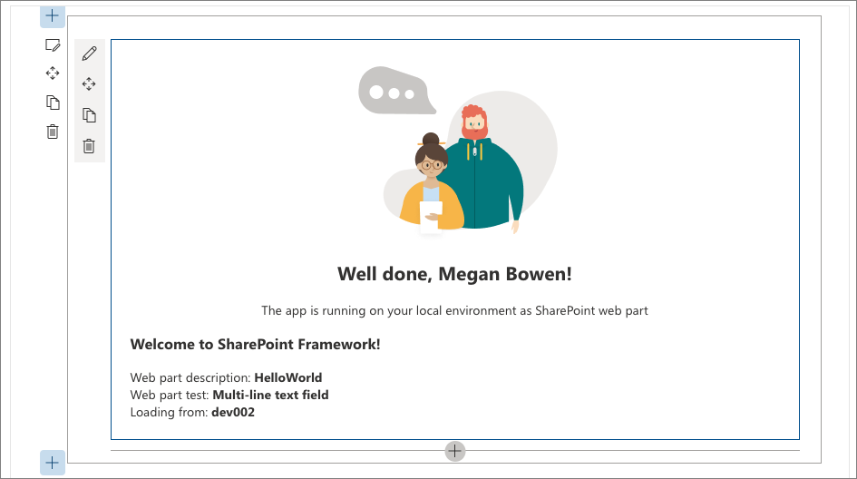
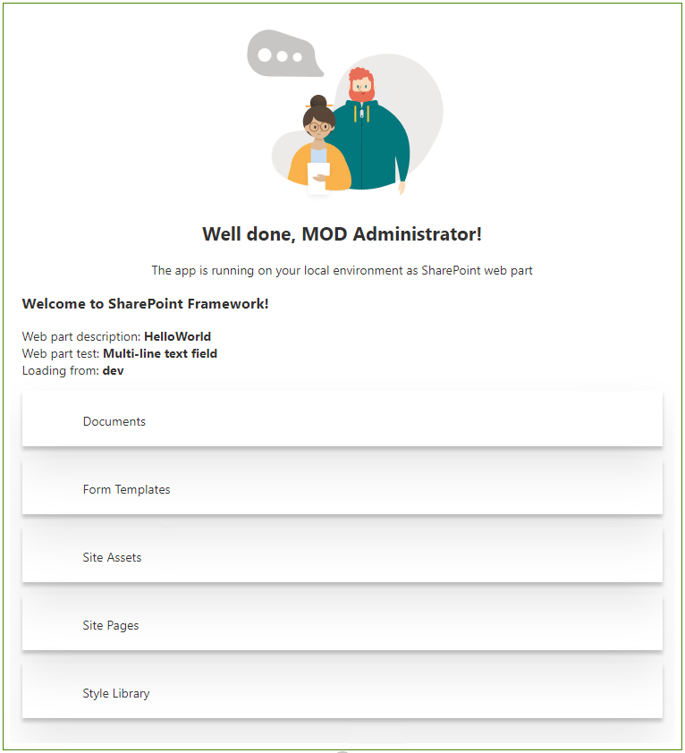

# Connect your client-side web part to SharePoint (Hello World part 2)

Connect your web part to SharePoint to access functionality and data in SharePoint and provide a more integrated experience for end users.

You can also follow these steps by watching this video on the SharePoint PnP YouTube Channel:

> [!Video https://www.youtube.com/embed/5M3zDpgxIMs]

> [!NOTE]
> This article continues building the Hello World web part built in the previous article [Build your first web part](./build-a-hello-world-web-part.md).

## Run gulp serve

Ensure that you have the **gulp serve** command running. If it isn't already running, go to the **helloworld-webpart** project directory and run it by using the following commands.

```console
cd helloworld-webpart
gulp serve
```

## Get access to page context

The hosted workbench in SharePoint enables access to the page context, which exposes the following key properties such as:

- Web title
- Web absolute URL
- Web server-relative URL
- User sign-in name

### To get access to the page context

To access contextual information in your web part, you'll use the following object in your code:

```typescript
this.context.pageContext
```

1. Within Visual Studio Code, locate & open **.\src\webparts\helloWorld\HelloWorldWebPart.ts**.
1. Inside the `render()` method, replace the **innerHTML** code block with the following:

    ```tsx
    this.domElement.innerHTML = `
    <section class="${styles.helloWorld} ${!!this.context.sdks.microsoftTeams ? styles.teams : ''}">
      <div class="${styles.welcome}">
        
        <h2>Well done, ${escape(this.context.pageContext.user.displayName)}!</h2>
        <div>${this._environmentMessage}</div>
      </div>
      <div>
        <h3>Welcome to SharePoint Framework!</h3>
        <div>Web part description: <strong>${escape(this.properties.description)}</strong></div>
        <div>Web part test: <strong>${escape(this.properties.test)}</strong></div>
        <div>Loading from: <strong>${escape(this.context.pageContext.web.title)}</strong></div>        
      </div>
    </section>`;
    ```

1. Notice how `${ }` is used to output the variable's value in the HTML block. An extra HTML `div` is used to display `this.context.pageContext.web.title`.
1. Save the file. The **gulp serve** running in your console detects this save operation and:

    - builds and bundles the updated code automatically

    > [!NOTE]
    > Keep the console window and Visual Studio Code side-by-side to see gulp automatically compile as you save changes in Visual Studio Code.

1. Navigate to your SharePoint site's hosted workbench hosted. The full URL is `https://your-sharepoint-site-url/_layouts/workbench.aspx`. Refresh the hosted workbench to pick up the changes from the rebuilt code bundle.

    You should now see your SharePoint site title in the web part now that page context is available to the web part.

    

## Define list model

You need a list model to start working with SharePoint list data. To retrieve the lists, you need two models.

1. Within Visual Studio Code, locate and open **.\src\webparts\helloWorld\HelloWorldWebPart.ts**.
1. Define the following interfaces immediately before the `HelloWorldWebPart` class declaration:

    ```typescript
    export interface ISPLists {
      value: ISPList[];
    }

    export interface ISPList {
      Title: string;
      Id: string;
    }
    ```

    The **ISPList** interface holds the SharePoint list information that we're connecting to.


## Retrieve lists from SharePoint site

Next you need to retrieve lists from the current site. You'll use SharePoint REST APIs to retrieve the lists from the site, which are located at **https://yourtenantprefix.sharepoint.com/_api/web/lists**.

SharePoint Framework includes a helper class `spHttpClient` to execute REST API requests against SharePoint. It adds default headers, manages the digest needed for writes, and collects telemetry that helps the service to monitor the performance of an application.

### To use this helper class, import them from the @microsoft/sp-http module

1. Scroll to the top of the **HelloWorldWebPart.ts** file.
1. Locate the line `import * as strings from 'HelloWorldWebPartStrings';` and add the following code immediately after it:

    ```typescript
    import {
      SPHttpClient,
      SPHttpClientResponse
    } from '@microsoft/sp-http';
    ```

1. Add the following method to retrieve lists from SharePoint inside the **HelloWorldWebPart** class.

    ```typescript
    private _getListData(): Promise<ISPLists> {
      return this.context.spHttpClient.get(this.context.pageContext.web.absoluteUrl + `/_api/web/lists?$filter=Hidden eq false`, SPHttpClient.configurations.v1)
        .then((response: SPHttpClientResponse) => {
          return response.json();
        });
    }
    ```

    The method uses the `spHttpClient` helper class and issues an HTTP **GET** request. It uses the `ISPLists` interface and also applies a filter to not retrieve hidden lists.

1. Save the file.
1. Switch to the console window that is running **gulp serve** and check if there are any errors. If there are errors, gulp reports them in the console, and you need to fix them before proceeding.

## Add new styles

The SharePoint Framework uses [Sass](http://sass-lang.com/) as the CSS pre-processor, and specifically uses the [SCSS syntax](http://sass-lang.com/documentation/file.SCSS_FOR_SASS_USERS.html), which is fully compliant with normal CSS syntax. Sass extends the CSS language and allows you to use features such as variables, nested rules, and inline imports to organize and create efficient style sheets for your web parts. The SharePoint Framework already comes with a SCSS compiler that converts your Sass files to normal CSS files, and also provides a typed version to use during development.

### To add new styles

1. Open **HelloWorldWebPart.module.scss**. This is the SCSS file where you define your styles.

    By default, the styles are scoped to your web part. You can see that as the styles are defined under `.helloWorld`.

2. Add the following styles after the `.links` style:

    ```css
    .list {
      color: #333333;
      font-family: 'Segoe UI Regular WestEuropean', 'Segoe UI', Tahoma, Arial, sans-serif;
      font-size: 14px;
      font-weight: normal;
      box-sizing: border-box;
      margin: 10;
      padding: 10;
      line-height: 50px;
      list-style-type: none;
      box-shadow: 0 4px 4px 0 rgba(0, 0, 0, 0.2), 0 25px 50px 0 rgba(0, 0, 0, 0.1);
    }

    .listItem {
      color: #333333;
      vertical-align: center;
      font-family: 'Segoe UI Regular WestEuropean', 'Segoe UI', Tahoma, Arial, sans-serif;
      font-size: 14px;
      font-weight: normal;
      box-sizing: border-box;
      margin: 0;
      padding: 0;
      box-shadow: none;
      *zoom: 1;
      padding: 9px 28px 3px;
      position: relative;
    }
    ```

3. Save the file.

    Gulp rebuilds the code in the console as soon as you save the file. This generates the corresponding typings in the **HelloWorldWebPart.module.scss.ts** file. After compiled to TypeScript, you can then import and reference these styles in your web part code.

    > [!TIP]
    > This file is dynamically generated when the project is built. It's hidden from VS Code's Explorer view using the **.vscode/settings.json** file.

    You can see that in the `render()` method of the web part:

    ```html
    <div class="${styles.welcome}">
    ```

## Render lists information

Open the `HelloWorldWebPart` class.

> [!NOTE]
> SharePoint Framework provides you options to detect environment details and host location using the `isServedFromLocalhost` property or with EnvironmentType details. In this case we'll focus on connecting to the data in the site which is hosting the online workbench.

1. Add the following private method inside the `HelloWorldWebPart` class:

    ```typescript
    private _renderList(items: ISPList[]): void {
      let html: string = '';
      items.forEach((item: ISPList) => {
        html += `
      <ul class="${styles.list}">
        <li class="${styles.listItem}">
          <span class="ms-font-l">${item.Title}</span>
        </li>
      </ul>`;
      });

      const listContainer: Element = this.domElement.querySelector('#spListContainer');
      listContainer.innerHTML = html;
    }
    ```

    This method references the new CSS styles added earlier by using the `styles` variable and is used to render list information that will be received from REST API.

2. Save the file.
3. Add the following private method inside the `HelloWorldWebPart` class to call the method to retrieve list data:

    ```typescript
    private _renderListAsync(): void {
      this._getListData()
        .then((response) => {
          this._renderList(response.value);
        });
    }
    ```

4. Save the file.


## Retrieve list data

1. Navigate to the `render()` method, and replace the code inside the method with the following code:

    ```typescript
    this.domElement.innerHTML = `
    <section class="${styles.helloWorld} ${!!this.context.sdks.microsoftTeams ? styles.teams : ''}">
      <div class="${styles.welcome}">
        
        <h2>Well done, ${escape(this.context.pageContext.user.displayName)}!</h2>
        <div>${this._environmentMessage}</div>
      </div>
      <div>
        <h3>Welcome to SharePoint Framework!</h3>
        <div>Web part description: <strong>${escape(this.properties.description)}</strong></div>
        <div>Web part test: <strong>${escape(this.properties.test)}</strong></div>
        <div>Loading from: <strong>${escape(this.context.pageContext.web.title)}</strong></div>
      </div>
      <div id="spListContainer" />
    </section>`;

    this._renderListAsync();
    ```

1. Save the file.

    Notice in the **gulp serve** console window that it rebuilds the code. Make sure you don't see any errors.

1. If you're using the SharePoint Framework v1.12.1 or earlier, for instance if you're on SharePoint Server on-premises, switch to your local workbench and add the HelloWorld web part.

    You should see the list data returned.

    

1. Now you can stop the server from running. Switch to the console and stop **gulp serve**. Select <kbd>CTRL</kbd>+<kbd>C</kbd> to stop the gulp task.

## Next steps

Congratulations on connecting your web part to SharePoint list data!

You can continue building out your Hello World web part in the next topic [Deploy your web part to a SharePoint page](./serve-your-web-part-in-a-sharepoint-page.md). You'll learn how to deploy and preview the Hello World web part in a SharePoint page.
