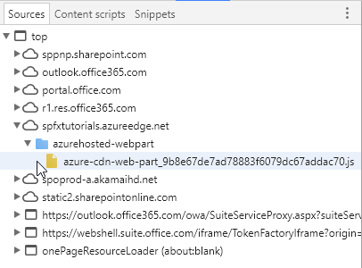

# Deploy your SharePoint client-side web part to Azure CDN

In this article, you will create a new sample web part and deploy it's assets to a Azure CDN instead of using the default Office 365 CDN as the hosting solution. You'll use an Azure Storage account integrated with a CDN to deploy your assets. SharePoint Framework build tools provide out-of-the-box support for deploying to an Azure Storage account; however, you can also manually upload the files to your favorite CDN provider or to SharePoint.

> [!NOTE]
> There are multiple different hosting options for your web part assets. This tutorial concentrates on showing the Azure CDN option, but you could also use the [Office 365 CDN](./hosting-webpart-from-office-365-cdn.md) or simply host your assets from SharePoint library from your tenant. In the latter case, you would not benefit from the CDN performance improvements, but that would also work from the functionality perspective. Any location which end users can access using HTTP would be technically suitable for hosting the assets for end users.

## Configure Azure storage account

Configure an Azure storage account and integrate it with the CDN.

You can follow the instructions in the article [Integrate a Storage Account with CDN](https://azure.microsoft.com/en-us/documentation/articles/cdn-create-a-storage-account-with-cdn/) along with the detailed steps in this article to create an Azure storage account and integrate it with the CDN. You will need the following information.

### Storage account name

This is the name you used to create your storage account, as described in [Step 1: Create a storage account](https://azure.microsoft.com/en-us/documentation/articles/cdn-create-a-storage-account-with-cdn/#step-1-create-a-storage-account).

For example, in the following screenshot, **spfxsamples** is the storage account name.


This will create a new storage account endpoint **spfxsamples.blob.core.windows.net**. 

> [!NOTE]
> You will need to create a unique storage account name for your own SharePoint Framework projects.

### BLOB container name

Create a new Blob service container. This will be available in your storage account dashboard.

Select the **+ Container** and create a new container with the following:

* Name: **azurehosted-webpart**
* Access type: Container


### Storage account access key

In the storage account dashboard, choose **Access Key** in the dashboard and copy one of the access keys.


### CDN profile and endpoint

Create a new CDN profile and associate the CDN endpoint with this BLOB container.

Create a new CDN profile as described in [Step 2: Create a new CDN profile](https://azure.microsoft.com/en-us/documentation/articles/cdn-create-a-storage-account-with-cdn/#step-2-create-a-new-cdn-profile).

For example, in the following screenshot, **spfxwebparts** is the CDN profile name.


Create a CDN endpoint as described in [Step 3: Create a new CDN endpoint](https://azure.microsoft.com/en-us/documentation/articles/cdn-create-a-storage-account-with-cdn/#step-3-create-a-new-cdn-endpoint).

For example, in the following screenshot, **spfxsamples** is the endpoint name, **Storage** is the origin type, and **spfxsamples.blob.core.windows.net** is the storage account.


The CDN endpoint will be created with the following URL: http://spfxsamples.azureedge.net

Because you associated the CDN endpoint with your storage account, you can also access the BLOB container at the following URL:http://spfxsamples.azureedge.net/azurehosted-webpart/

Note, however that you have not yet deployed the files.

## Creating a new Web Part project

Create a new project directory in your preferred location:

```
md azurehosted-webpart
```

Go to the project directory:

```
cd azurehosted-webpart
```

Create a new SharePoint Framework solution by running Yeoman SharePoint Generator:

```
yo @microsoft/sharepoint
```
    
When prompted:

* Accept the default **azurehosted-webpart** as your solution name and choose **Enter**.
* Choose **SharePoint Online only (latest)**, and press **Enter**.
* Select **Use the current folder** for where to place the files.
* Choose **y** to use the tenant-scoped deployment option, which makes web part available across sites immediately when it's deployed. 
* Choose **WebPart** as the client-side component type to be created. 

The next set of prompts will ask for specific information about your web part:

* Use **AzureCDN** for your web part name and choose **Enter**.
* Accept the default **AzureCDN description** as your web part description and choose **Enter**.
* Accept the default **No javascript web framework** as the framework you would like to use and choose **Enter**.


At this point, Yeoman will scaffold the solution files and install the required dependencies. This might take a few minutes. Yeoman will scaffold the project to include your custom web part as well.

Once the scaffolding completes, lock down the version of the project dependencies by running the following command:

```sh
npm shrinkwrap
```

Next, type the following to open the web part project in Visual Studio Code:

```
code .
```

## Configure solution not to use default settings

Open **deploy-azure-storage.json** in the **config** folder.

This is where we control the solution packaging.

Update `includeClientSideAssets` value as **false** so that client-side assets are NOT packaged inside of the sppkg file, which is the default behavior. Since we are hosting assets from external CDN, we do not want them to be included in the solution package. Your configuration should look somewhat following.

``` json
{
  "$schema": "https://dev.office.com/json-schemas/spfx-build/package-solution.schema.json",
  "solution": {
    "name": "azurehosted-webpart-client-side-solution",
    "id": "a4e95ed1-d096-4573-8a57-d0cc3b52da6a",
    "version": "1.0.0.0",
    "includeClientSideAssets": false,
    "skipFeatureDeployment": true
  },
  "paths": {
    "zippedPackage": "solution/azurehosted-webpart.sppkg"
  }
}
```

> [!NOTE]
> `skipFeatureDeployment` setting is here **true** since answer for the tenant-scope deployment option was said to be 'y' in the Yeoman flow. This means that you do NOT need to explicitly install solution to the site before web part is available. Deploying and approving solution package in tenant app catalog is sufficient to make web part available cross all the sites in the given tenant.


## Configure Azure Storage account details

Open **deploy-azure-storage.json** in the **config** folder.

This is the file that contains your Azure Storage account details.

```json
{
  "$schema": "https://dev.office.com/json-schemas/spfx-build/deploy-azure-storage.schema.json",
  "workingDir": "./temp/deploy/",
  "account": "<!-- STORAGE ACCOUNT NAME -->",
  "container": "azurehosted-webpart",
  "accessKey": "<!-- ACCESS KEY -->"
}
```

Replace the **account**, **container**, **accessKey** with your storage account name, BLOB container and storage account access key respectively.

**workingDir** is the directory where the web part assets will be located.

In this example, with the storage account created earlier, this file will look like:

```json
{
  "workingDir": "./temp/deploy/",
  "account": "spfxsamples",
  "container": "azurehosted-webpart",
  "accessKey": "q1UsGWocj+CnlLuv9ZpriOCj46ikgBbDBCaQ0FfE8+qKVbDTVSbRGj41avlG73rynbvKizZpIKK9XpnpA=="
}
```

Save the file.

## Configuring web part to load from CDN

In order for the web part to load from your CDN, you will need to tell it your CDN path.

Switch to Visual Studio Code and open the **write-manifests.json** from the **config** folder.

Enter your CDN base path for the **cdnBasePath** property.

```json
{
  "cdnBasePath": "<!-- PATH TO CDN -->"
}
```

In this example, with the CDN profile created earlier, this file will look like:

```json
{
  "cdnBasePath": "https://spfxsamples.azureedge.net/azurehosted-webpart/"
}
```

> [!NOTE]
> The CDN base path is the CDN endpoint with the BLOB container.

Save the file.


## Prepare web part assets to deploy

Before uploading the assets to CDN, you need to build them.

Switch to the console and execute the following `gulp` task:

```
gulp bundle --ship
```

This will build the minified assets required to upload to the CDN provider. The `--ship` indicates the build tool to build for distribution. You should also notice the output of the build tools indicate the Build Target is SHIP.

```
Build target: SHIP
[21:23:01] Using gulpfile ~/apps/azurehosted-webpart/gulpfile.js
[21:23:01] Starting gulp
[21:23:01] Starting 'default'...
```

The minified assets can be found under the `temp\deploy` directory.

## Deploy assets to Azure Storage

Switch to the console of the **azurehosted-webpart** project directory.

Enter the gulp task to deploy the assets to your storage account:

```
gulp deploy-azure-storage
```

This will deploy the web part bundle along with other assets like JavaScript and CSS files to the CDN.

## Deploy the updated package

### Package the solution

Because you changed the web part bundle, you will need to re-deploy the package to the App Catalog. You used **--ship** to generate minified assets for distribution.

Switch to the console of the **azurehosted-webpart** project directory.

Enter the gulp task to package the client-side solution, this time with the `--ship` flag set. This forces the task to pick up the CDN base path configured in the previous step:

```
gulp package-solution --ship
```

This will create the updated client-side solution package in the **sharepoint\solution** folder.

### Upload to your App Catalog

Upload or drag & drop the client-side solution package to the App Catalog. Notice how the URL is pointing to the Azure CDN URL configured in the previous steps. 

**Click checkbox** on indicating that solution can be deployed automatically available cross all sites in the organization.


Choose **Deploy**.

The App Catalog will now have the client-side solution package where the web part bundle is loaded from the CDN.

## Test the HelloWorld web part

Go to any SharePoint site in your tenant and choose **Add a page** from the *gears* menu.

**Edit** the page and select **AzureCDN** web part from the web part picker to confirm that your deployment has been successful.


Notice that you are not running **gulp serve**, and therefore nothing is served from **localhost**. Content is served from the Azure CDN. You can also double check this by pressing F12 in your browser and confirm that you can see the Azure CDN as one of the sources for the page assets.



## Deploying to other CDNs

In order to deploy the assets to your favorite CDN provider, you can copy the files from **temp\deploy** folder. To generate assets for distribution you will run the following gulp command as we did before with the **--ship** parameter:

```
gulp bundle --ship
```

As long as you are updating the **cdnBasePath** accordingly, your files are being properly loaded.