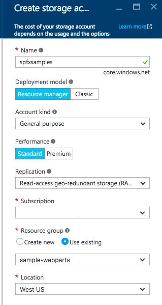
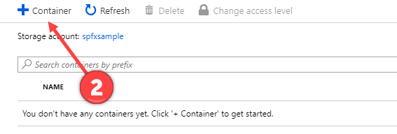
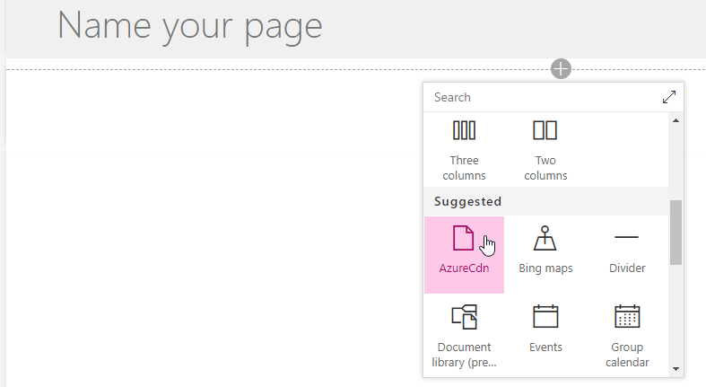

# Deploy your SharePoint client-side web part to Azure CDN

Create a new sample web part and deploy its assets to an Azure Content Delivery Network (CDN) instead of using the default Office 365 CDN as the hosting solution. You'll use an Azure Storage account integrated with a CDN to deploy your assets. SharePoint Framework build tools provide out-of-the-box support for deploying to an Azure Storage account; however, you can also manually upload the files to your favorite CDN provider or to SharePoint.

> [!NOTE]
> There are multiple different hosting options for your web part assets. This tutorial concentrates on showing the Azure CDN option, but you could also use the [Office 365 CDN](./hosting-webpart-from-office-365-cdn.md) or simply host your assets from SharePoint library from your tenant. In the latter case, you would not benefit from the CDN performance improvements, but that would also work from the functionality perspective. Any location that end users can access by using HTTP would be technically suitable for hosting the assets for end users.

## Configure an Azure storage account

To configure an Azure storage account and integrate it with the CDN, follow the instructions at [Integrate an Azure storage account with Azure CDN](https://docs.microsoft.com/en-us/azure/cdn/cdn-create-a-storage-account-with-cdn), along with the detailed steps in this article. 

> [!NOTE]
> As Azure UIs are evolving fast, some of the pictures and steps might be out of date, but high level process is still valid.

### Storage account name

This is the name you used to create your storage account, as described in [Step 1: Create a storage account](https://docs.microsoft.com/en-us/azure/cdn/cdn-create-a-storage-account-with-cdn#step-1-create-a-storage-account).

For example, in the following screenshot, **spfxsamples** is the storage account name.



This creates a new storage account endpoint **spfxsamples.blob.core.windows.net**. 

> [!NOTE]
> You need to create a unique storage account name for your own SharePoint Framework projects.

### BLOB container name

Create a new Blob service container. This is available in your storage account dashboard.

Select the **+ Container** and create a new container with the following:

* Name: **azurehosted-webpart**
* Access type: Container




### Storage account access key

In the storage account dashboard, select **Access Key** in the dashboard, and copy one of the access keys.


### CDN profile and endpoint

Create a new CDN profile and associate the CDN endpoint with this BLOB container.

1. Create a new CDN profile as described in [Step 2: Enable CDN for the storage account](https://docs.microsoft.com/en-us/azure/cdn/cdn-create-a-storage-account-with-cdn#step-2-enable-cdn-for-the-storage-account) (scroll down in Step 2 for **To create a new CDN profile**).

    For example, in the following screenshot, **spfxwebparts** is the CDN profile name.

    

1. Create a CDN endpoint as described in [Step 2: Enable CDN for the storage account](https://docs.microsoft.com/en-us/azure/cdn/cdn-create-a-storage-account-with-cdn#step-2-enable-cdn-for-the-storage-account). The CDN endpoint is created with the following URL: `http://spfxsamples.azureedge.net`

    For example, in the following screenshot, **spfxsamples** is the endpoint name, **Storage** is the origin type, and **spfxsamples.blob.core.windows.net** is the storage account.

    

Because you associated the CDN endpoint with your storage account, you can also access the BLOB container at the following URL: `http://spfxsamples.azureedge.net/azurehosted-webpart/`

Note, however, that you have not yet deployed the files.

## Create a new web part project

1. Create a new project directory in your preferred location:

    ```shell
    md azurehosted-webpart
    ```

1. Go to the project directory:

    ```shell
    cd azurehosted-webpart
    ```

1. Create a new SharePoint Framework solution by running Yeoman SharePoint Generator:

    ```shell 
    yo @microsoft/sharepoint
    ```

1. When prompted:

    * Accept the default **azurehosted-webpart** as your solution name, and select Enter.
    * Select **SharePoint Online only (latest)**, and select Enter.
    * Select **Use the current folder** for where to place the files.
    * Select **y** to use the tenant-scoped deployment option, which makes the web part available across sites immediately when it's deployed. 
    * Select **N** on the question if solution contains unique permissions.  
    * Select **WebPart** as the client-side component type to be created. 

1. The next set of prompts ask for specific information about your web part:

    * Use **AzureCDN** for your web part name, and select Enter.
    * Accept the default **AzureCDN description** as your web part description, and select Enter.
    * Accept the default **No javascript web framework** as the framework you would like to use, and select Enter.

    

    At this point, Yeoman scaffolds the solution files and installs the required dependencies. This might take a few minutes. Yeoman scaffolds the project to include your custom web part as well.

1. Enter the following to open the web part project in Visual Studio Code:

    ```shell
    code .
    ```

## Configure the solution not to use default settings

1. Open **package-solution.json** in the **config** folder.

    This is where we control the solution packaging.

1. Update `includeClientSideAssets` value as **false** so that client-side assets are NOT packaged inside of the sppkg file, which is the default behavior. As we are hosting assets from an external CDN, we do not want them to be included in the solution package. Your configuration should look somewhat like the following.

    ```json
    {
      "$schema": "https://developer.microsoft.com/json-schemas/spfx-build/package-solution.schema.json",
      "solution": {
        "name": "azurehosted-webpart-client-side-solution",
        "id": "a4e95ed1-d096-4573-8a57-d0cc3b52da6a",
        "version": "1.0.0.0",
        "includeClientSideAssets": false,
        "skipFeatureDeployment": true,
        "isDomainIsolated": false
      },
      "paths": {
        "zippedPackage": "solution/azurehosted-webpart.sppkg"
      }
    }
    ```

    > [!NOTE]
    > The `skipFeatureDeployment` setting is here **true** because the answer for the tenant-scope deployment option was said to be 'y' in the Yeoman flow. This means that you do NOT need to explicitly install the solution to the site before the web part is available. Deploying and approving the solution package in the tenant app catalog is sufficient to make the web part available across all the sites in the given tenant.

## Configure Azure Storage account details

1. Open **deploy-azure-storage.json** in the **config** folder.

    This is the file that contains your Azure Storage account details.

    ```json
    {
      "$schema": "https://dev.office.com/json-schemas/spfx-build/deploy-azure-storage.schema.json",
      "workingDir": "./temp/deploy/",
      "account": "<!-- STORAGE ACCOUNT NAME -->",
      "container": "azurehosted-webpart",
      "accessKey": "<!-- ACCESS KEY -->"
    }
    ```

1. Replace the **account**, **container**, **accessKey** with your storage account name, BLOB container, and storage account access key respectively.

    **workingDir** is the directory where the web part assets are located.

    In this example, with the storage account created earlier, this file will look like:

    ```json
    {
      "workingDir": "./temp/deploy/",
      "account": "spfxsamples",
      "container": "azurehosted-webpart",
      "accessKey": "q1UsGWocj+CnlLuv9ZpriOCj46ikgBbDBCaQ0FfE8+qKVbDTVSbRGj41avlG73rynbvKizZpIKK9XpnpA=="
    }
    ```

1. Save the file.

## Configure the web part to load from CDN

For the web part to load from your CDN, you need to tell it your CDN path.

1. Switch to Visual Studio Code and open the **write-manifests.json** from the **config** folder.
1. Enter your CDN base path for the **cdnBasePath** property.

    ```json
    {
      "cdnBasePath": "<!-- PATH TO CDN -->"
    }
    ```

    In this example, with the CDN profile created earlier, this file will look like:

    ```json
    {
      "cdnBasePath": "https://spfxsamples.azureedge.net/azurehosted-webpart/"
    }
    ```

    > [!NOTE]
    > The CDN base path is the CDN endpoint with the BLOB container.

1. Save the file.

## Prepare the web part assets to deploy

Before uploading the assets to CDN, you need to build them.

1. Switch to the console and execute the following `gulp` task:

    ```shell
    gulp bundle --ship
    ```

    This builds the minified assets required to upload to the CDN provider. The `--ship` indicates the build tool to build for distribution. You should also notice that the output of the build tools indicate the Build Target is SHIP.

    ```shell
    Build target: SHIP
    [21:23:01] Using gulpfile ~/apps/azurehosted-webpart/gulpfile.js
    [21:23:01] Starting gulp
    [21:23:01] Starting 'default'...
    ```

    The minified assets can be found under the `temp\deploy` directory.

## Deploy assets to Azure Storage

1. Switch to the console of the **azurehosted-webpart** project directory.
1. Enter the gulp task to deploy the assets to your storage account:

    ```shell
    gulp deploy-azure-storage
    ```

    This deploys the web part bundle along with other assets such as JavaScript and CSS files to the CDN.

## Deploy the updated package

### To package the solution

Because you changed the web part bundle, you need to redeploy the package to the app catalog. You used **--ship** to generate minified assets for distribution.

1. Switch to the console of the **azurehosted-webpart** project directory.
1. Enter the gulp task to package the client-side solution, this time with the `--ship` flag set. This forces the task to pick up the CDN base path configured in the previous step:

    ```shell
    gulp package-solution --ship
    ```

    This creates the updated client-side solution package in the **sharepoint\solution** folder.

### To upload to your app catalog

1. Upload or drag and drop the client-side solution package to the app catalog. Notice how the URL is pointing to the Azure CDN URL configured in the previous steps. 
1. Select the check box to indicate that the solution can be deployed automatically across all sites in the organization.

    

1. Select **Deploy**.

    The app catalog now has the client-side solution package where the web part bundle is loaded from the CDN.

## Test the HelloWorld web part

1. Go to any SharePoint site in your tenant and select **Add a page** from the *gears* menu.
1. **Edit** the page and select **AzureCDN** web part from the web part picker to confirm that your deployment has been successful.

    

1. Notice that you are not running **gulp serve**, and therefore nothing is served from **localhost**. Content is served from the Azure CDN. You can also double-check this by selecting F12 in your browser and confirming that you can see the Azure CDN as one of the sources for the page assets.

    

## Deploy to other CDNs

To deploy the assets to your favorite CDN provider, you can copy the files from **temp\deploy** folder. To generate assets for distribution, run the following gulp command as we did before with the **--ship** parameter:

```shell
gulp bundle --ship
```

As long as you are updating the **cdnBasePath** accordingly, your files are being properly loaded.

> [!NOTE]
> If you find an issue in the documentation or in the SharePoint Framework, please report that to SharePoint engineering by using the [issue list at the sp-dev-docs repository](https://github.com/SharePoint/sp-dev-docs/issues) or by adding a comment to this article. Thanks for your input in advance.

## See also

* [Build your first SharePoint client-side web part](build-a-hello-world-web-part.md)