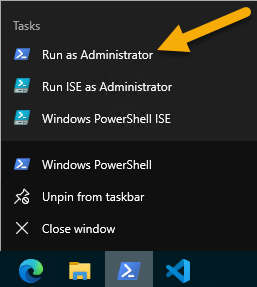

# Host your client-side web part from Microsoft 365 CDN (Hello World part 4)

Microsoft 365 Content Delivery Network (CDN) provides you an easy solution to host your assets directly from your own Microsoft 365 tenant. It can be used for hosting any static assets that are used in SharePoint Online.

> [!NOTE]
> There are multiple different hosting options for your web part assets. This tutorial concentrates on showing the Microsoft 365 CDN option, but you could also use the [Azure CDN](./deploy-web-part-to-cdn.md) or simply host your assets from SharePoint library from your tenant. In the latter case, you would not benefit from the CDN performance improvements, but that would also work from the functionality perspective. Any location that end users can access using HTTP(S) would be technically suitable for hosting the assets for end users.

> [!IMPORTANT]
> This article uses the `includeClientSideAssets` attribute, which was introduced in the SharePoint Framework (SPFx) v1.4. This version is not supported with **SharePoint 2016 Feature Pack 2**.>
> If you're using an on-premises setup, you need to decide the CDN hosting location separately. You can also simply host the JavaScript files from a centralized library in your on-premises SharePoint to which your users have access. Please see additional considerations in the [SharePoint 2016 specific guidance](../../sharepoint-2016-support.md).

Make sure that you've completed the following tasks before you begin:

- [Build your first client-side web part](./build-a-hello-world-web-part.md)
- [Connect your client-side web part to SharePoint](./connect-to-sharepoint.md)
- [Deploy your client-side web part to a SharePoint page](./serve-your-web-part-in-a-sharepoint-page.md)

You can also follow these steps by watching this video on the SharePoint PnP YouTube Channel:

> [!Video https://www.youtube.com/embed/wl2ur1SBp3Q]

## Enable CDN in your Microsoft 365 tenant

1. Ensure that you've the latest version of the SharePoint Online Management Shell by running the PowerShell in Administrator role and executing following PowerShell cmdlet to download latest version of the cmdlets from [PowerShell Gallery](https://www.powershellgallery.com/packages/Microsoft.Online.SharePoint.PowerShell).

    

    ```powershell
    Install-Module -Name Microsoft.Online.SharePoint.PowerShell
    ```

    > [!TIP]
    > If you're using a non-Windows machine, you cannot use the SharePoint Online Management Shell. You can, however, manage these settings by using [Office 365 CLI](https://sharepoint.github.io/office365-cli/).

    > [!NOTE]
    > You can also install SharePoint Online Management Shell using [an installer](https://www.microsoft.com/en-us/download/details.aspx?id=35588) available from the Microsoft download center, but in general PowerShell gallery option is recommended.

1. Confirm module installation if asked in the PowerShell window
1. Connect to your SharePoint Online tenant with a PowerShell session.

    ```powershell
    Connect-SPOService -Url https://contoso-admin.sharepoint.com
    ```

1. Get the current status of public CDN settings from the tenant level by executing the following commands.

    > [!IMPORTANT]
    > Ensure you execute each commend individually and not all at the same time.

    ```powershell
    Get-SPOTenantCdnEnabled -CdnType Public
    Get-SPOTenantCdnOrigins -CdnType Public
    Get-SPOTenantCdnPolicies -CdnType Public
    ```

    SharePoint Framework solutions can automatically benefit from the Microsoft 365 Public CDN as long as it's enabled in your tenant. When CDN is enabled, ***/CLIENTSIDEASSETS** origin is automatically added as a valid origin.

1. Enable public CDN in the tenant.

    ```powershell
    Set-SPOTenantCdnEnabled -CdnType Public
    ```

1. Confirm settings by selecting **Y** and then Enter.

    

    Now the public CDN has been enabled in the tenant by using the default file type configuration allowed. This means that the following file type extensions are supported: CSS, EOT, GIF, ICO, JPEG, JPG, JS, MAP, PNG, SVG, TTF, and WOFF.

    SharePoint Framework solutions can automatically benefit from the Microsoft 365 Public CDN as long as it's enabled in your tenant. When the CDN is enabled, the ***/CLIENTSIDEASSETS** origin is automatically added as a valid origin.

    > [!NOTE]
    > If you've previously enabled Microsoft 365 CDN, you should re-enable the public CDN so that you've the ***/CLIENTSIDEASSETS**entry added as a valid CDN origin for public CDN. If this entry is not present and the public CDN is enabled in your tenant, bundle requests will contain the token hostname **spclientsideassetlibrary** in their URL, causing the requests to fail. You can add this missing entry by using
    >
    > ```powershell
    > Add-SPOTenantCdnOrigin -CdnType Public -OriginUrl */CLIENTSIDEASSETS
    > ```

1. You can double-check the current setup of your end-points. Execute the following command to get the list of CDN origins from your tenant:

    ```powershell
    Get-SPOTenantCdnOrigins -CdnType Public
    ```

    Notice that when you enable the CDN for the first time, the default configuration to enable default origins will take a while (approximately 15 minutes). Configuration is completed when there's no **(configuration pending)** messages when you execute the `Get-SPOTenantCdnOrigins -CdnType Public` command.

    

    > [!NOTE]
    > When the origin is listed without the *(configuration pending)* text, it is ready to be used in your tenant. This is the indication of an on-going configuration between SharePoint Online and the CDN system.

## Finalize solution for deployment

1. Switch to the console and make sure you're still in the project directory that you used to set up your web part project.
1. End the possible **gulp serve** task by selecting <kbd>CTRL</kbd>+<kbd>C</kbd>, and ensure that you're in your project directory:

    ```console
    cd helloworld-webpart
    ```

## Review solution settings

1. Open the **HelloWorldWebPart** web part project in Visual Studio Code or your preferred IDE.
1. Open **package-solution.json** from the **config** folder.

    The **package-solution.json** file defines the package metadata as shown in the following code:

    ```json
    {
      "$schema": "https://developer.microsoft.com/json-schemas/spfx-build/package-solution.schema.json",
      "solution": {
        "name": "helloword-webpart-client-side-solution",
        "id": "3c1af394-bbf0-473c-bb7d-0798f0587cb7",
        "version": "1.0.0.0",
        "includeClientSideAssets": true,
        "isDomainIsolated": false
      },
      "paths": {
        "zippedPackage": "solution/helloword-webpart.sppkg"
      }
    }
    ```

The default value for the `includeClientSideAssets` is `true`, which means that static assets are packaged automatically in the **\*.sppkg** files, and you don't need to separately host your assets from an external system.

Do *not* change this setting for this exercise, so that assets are automatically hosted when solution is deployed to your tenant.

If Microsoft 365 CDN *is enabled*, it's used automatically with default settings. If Microsoft 365 CDN *isn't enabled*, assets are served from the app catalog site collection. This means that if you leave the `includeClientSideAssets` setting `true`, your solution assets are automatically hosted in the tenant.

## Prepare web part assets to deploy

1. Execute the following task to bundle your solution. This executes a release build of your project by using a dynamic label as the host URL for your assets. This URL is automatically updated based on your tenant CDN settings.

    ```console
    gulp bundle --ship
    ```

1. Execute the following task to package your solution. This creates an updated **helloworld-webpart.sppkg** package on the **sharepoint/solution** folder.

    ```console
    gulp package-solution --ship
    ```

    > [!NOTE]
    > If you're interested in what actually got packaged inside of the **\*.sppkg** file, you can look in the content of the **sharepoint/solution/debug** folder.

1. Upload or drag and drop the newly created client-side solution package to the app catalog in your tenant.
1. Because you already deployed the package, you're prompted as to whether to replace the existing package. Select **Replace It**.

    

1. Notice how the **domain** list in the prompt says *SharePoint Online*. This is because the content is either served from the Microsoft 365 CDN or from the app catalog, depending on the tenant settings. Select **Deploy**.

    

1. Open the site where you previously installed the **helloworld-webpart-client-side-solution** or installed the solution to a new site.
1. After the solution has been installed, select **Add a page** from the *gear* menu, and select **HelloWorld** from the modern page web part picker to add your custom web part to page.

    

1. Notice how the web part is rendered even though you're not running the local web server.

    

1. Save changes on the page with the web part.
1. Open your browser's development tools and open the **Sources** tab.
1. Extend **publiccdn.sharepointonline.com** under the source and notice how the **hello-world-web-part** file is loaded from the Public CDN URL pointing dynamically to a library located under the app catalog site collection.

    

> [!NOTE]
> If you would not have CDN enabled in your tenant, and the `includeClientSideAssets` setting would be `true`in the **package-solution.json**, the loading URL for the assets would be dynamically updated and pointing directly to the ClientSideAssets folder located in the app catalog site collection. In this example case, the URL would be **https://sppnp.microsoft.com/sites/apps/ClientSideAssets/**. This change is automatic depending on your tenant settings and it does not require any changes in the actual solution package.

Now you've deployed your custom web part to SharePoint Online and it's being hosted automatically from the Microsoft 365 CDN.

## Next steps

You can load jQuery and jQuery UI and build a jQuery Accordion web part. To continue, see [Add jQueryUI Accordion to your client-side web part](./add-jqueryui-accordion-to-web-part.md).
