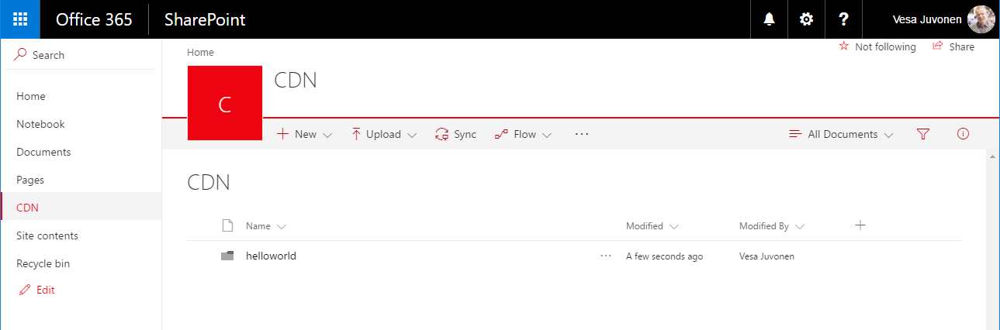
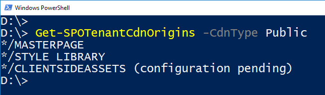
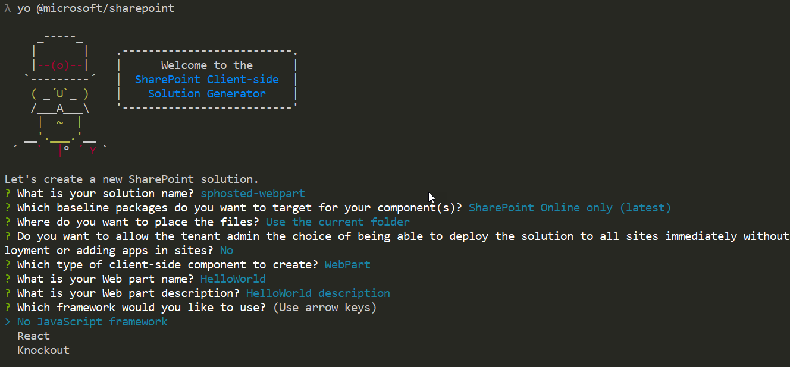
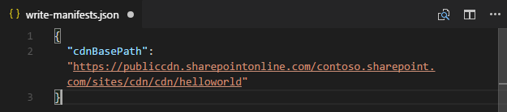
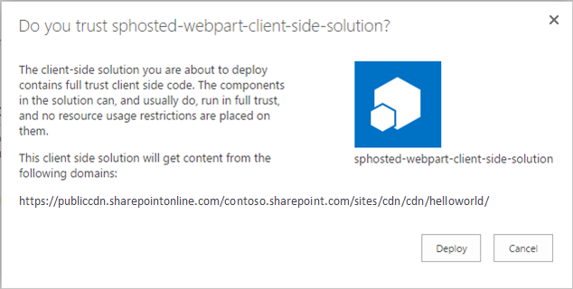
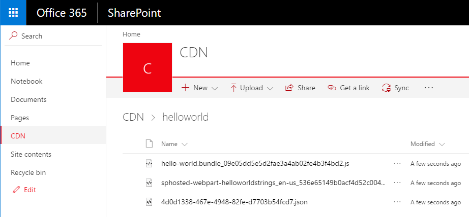
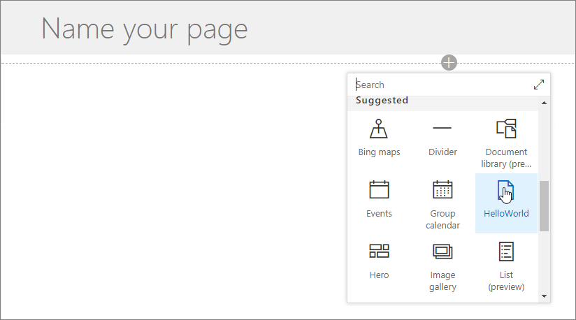
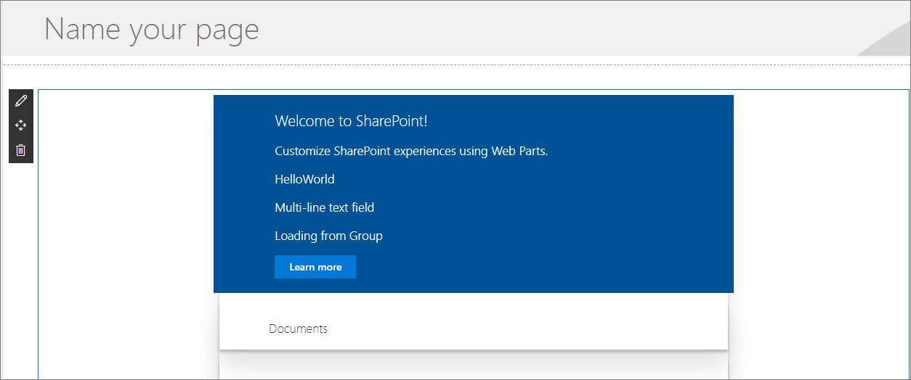
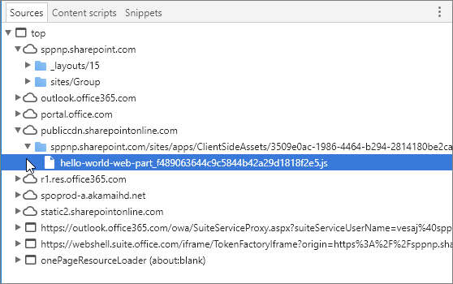

# Hosting client-side web part from Office 365 CDN

This article describes how to host your client-side web part from Office 365 CDN. Office 365 CDN provide you easy solution to host your assets directly from your own Office 365 tenant. It can be used for hosting any static assets, which are used in SharePoint Online. You can find more details around the Office 365 CDN capability from following blog post.

* [General availability of Office 365 CDN](https://dev.office.com/blogs/general-availability-of-office-365-cdn)

## Enable CDN in your Office 365 tenant
Ensure that you have latest version of the SharePoint Online Management Shell by downloading it from [Microsoft Download site](https://www.microsoft.com/en-us/download/details.aspx?id=35588).

Connect to your SharePoint Online tenant with PowerShell session.
```
Connect-SPOService -Url https://contoso-admin.sharepoint.com
```

Get current status of public CDN settings from tenant level by executing following commands one-by-one. 
```
Get-SPOTenantCdnEnabled -CdnType Public
Get-SPOTenantCdnOrigins -CdnType Public
Get-SPOTenantCdnPolicies -CdnType Public
```
Enable public CDN in the tenant
```
Set-SPOTenantCdnEnabled -CdnType Public
```
Now public CDN has been enabled in the tenant using the default file type configuration allowed. This means that the following file type extensions are supported: "CSS,EOT,GIF,ICO,JPEG,JPG,JS,MAP,PNG,SVG,TTF,WOFF".

Open up a browser and move to a site collection where you'd like to host your CDN library. This could be any site collection in your tenant. In this tutorial, we create a specific library to act as your CDN library, but you can also use a specific folder in any existing document library as the CDN endpoint.

Create a new document library on your site collection called **CDN** and add a folder called **helloworld** to it.

 

Move back to your PowerShell console and add a new CDN origin. Update the provided URL below to match your own environment. 
```
Add-SPOTenantCdnOrigin -CdnType Public -OriginUrl sites/cdn/cdn
```
Execute the following command to get the list of CDN origins from your tenant
```
Get-SPOTenantCdnOrigins -CdnType Public
```
Notice that your newly added origin is listed as a valid CDN origin. Final configuration of the origin will take a while (approximately 15 minutes), so we can continue by creating your test web part, which will be hosted from the origin, when the deployment is completed. 



> When origin is listed without the *(configuration pending)* text, it is ready to be used in your tenant. This is the indication of an on-going configuration between SharePoint Online and CDN system. 

## Creating a new Web Part project

Create a new project directory in your preferred location:

```
md sphosted-webpart
```
    
Go to the project directory:

```
cd sphosted-webpart
```

Create a new SharePoint Framework solution by running Yeoman SharePoint Generator:

```
yo @microsoft/sharepoint
```
    
When prompted:

* Accept the default **sphosted-webpart** as your solution name and choose **Enter**.
* Choose **SharePoint Online only (latest)**, and press **Enter**.
* Select **Use the current folder** for where to place the files.
* Choose **N** to require the extension to be installed on each site explicitly when it's being used. 
* Choose **WebPart** as the client-side component type to be created. 
* Accept the default **HelloWorld** as your web part name and choose **Enter**.
* Accept the default **HelloWorld description** as your web part description and choose **Enter**.
* Accept the default **No javascript web framework** as the framework you would like to use and choose **Enter**.



At this point, Yeoman will scaffold the solution files and install the required dependencies. This might take a few minutes. Yeoman will scaffold the project to include your custom web part as well.

Once the scaffolding completes, lock down the version of the project dependencies by running the following command:

```sh
npm shrinkwrap
```

Next, type the following to open the web part project in Visual Studio Code:

```
code .
```
Update the *write-manifests.json* file (under *config* folder) as follow to point to your CDN endpoint. 
- You will need to use the publiccdn.sharepointonline.com as the prefix and then extend the URL with the actual path in your tenant
* Format of the CDN URL is as follows
```
https://publiccdn.sharepointonline.com/<tenant host name>/sites/site/library/folder
```



Save your changes.

Execute the following tasks to bundle your solution
* This will execute a release build of your project using CDN URL specified in the **writer-manifest.json** file. Output of the execution will be located in the **./temp/deploy** folder. These are the files which you will need to upload to the SharePoint folder acting as your CDN endpoint. 

```
gulp bundle --ship
```

Execute the following task to package your solution

```
gulp package-solution --ship
```

This command will create a **sphosted-webpart.sppkg** package on the **sharepoint/solution** folder and also prepare the assets on the **temp/deploy folder** to be deployed to the CDN.

Upload or drag & drop the newly created client-side solution package to the app catalog in your tenant. 



Choose **Deploy**

Move to the site collection where the **CDN** library was created earlier in this tutorial.

Upload all files from **temp/deploy** folder to the **CDN/helloworld** folder in your site collection. 



At this point the web part is ready to be used on a page

Open a site where you want to test the web part and go the **Site contents** page of the site.

Choose **Add – App** from the toolbar and choose the **sphosted-webpart-client-side-solution** app to be installed on the site


After the solution has been installed, chose **Add a page** from the *gear* menu and pick **HelloWorld** from the modern page web part picker



Notice how the web part is rendered even though you are not running the node.js service locally. 



Save changes on the page with web part on it.

Press **F12** to open up developer tools.

Extend **publiccdn.sharepointonline.com** under the source and notice how the **hello-world.bundle** file is loaded from the CDN endpoint which we defined earlier in this tutorial.



Now you have deployed your custom web part to SharePoint Online and it's being hosted from the Office 365 CDN. 

## See also

- [General availability of Office 365 CDN](https://dev.office.com/blogs/general-availability-of-office-365-cdn)
- [Automate publishing of your SharePoint Framework scripts to Office 365 public CDN](https://www.eliostruyf.com/automate-publishing-of-your-sharepoint-framework-scripts-to-office-365-public-cdn)