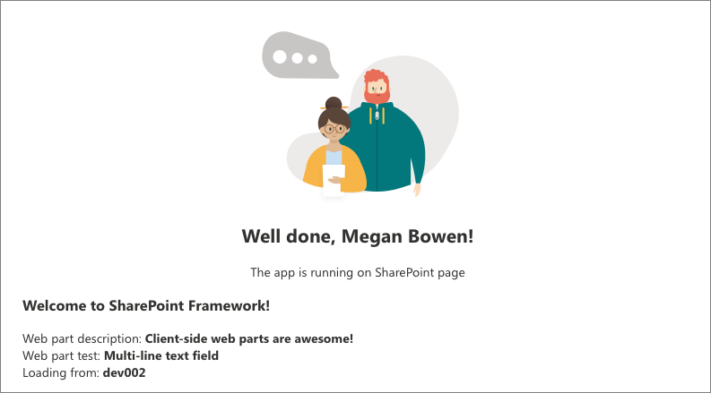

# Host your client-side web part from Office 365 CDN (Hello World part 4)

Office 365 Content Delivery Network (CDN) provides you an easy solution to host your assets directly from your own Office 365 tenant. It can be used for hosting any static assets that are used in SharePoint Online. 

> [!NOTE]
> There are multiple different hosting options for your web part assets. This tutorial concentrates on showing the Office 365 CDN option, but you could also use the [Azure CDN](./deploy-web-part-to-cdn.md) or simply host your assets from SharePoint library from your tenant. In the latter case, you would not benefit from the CDN performance improvements, but that would also work from the functionality perspective. Any location that end users can access using HTTP(S) would be technically suitable for hosting the assets for end users.

> [!IMPORTANT]
> This article uses the `includeClientSideAssets` attribute, which was introduced in the SPFx v1.4. This version is not supported with **SharePoint 2016 Feature Pack 2**. If you are using an on-premises setup, you need to decide the CDN hosting location separately. You can also simply host the JavaScript files from a centralized library in your on-premises SharePoint to which your users have access. Please see additional considerations in the [SharePoint 2016 specific guidance](../../sharepoint-2016-support.md).

## Prerequisites

Make sure that you have completed the following tasks before you begin:

* [Build your first client-side web part](./build-a-hello-world-web-part.md)
* [Connect your client-side web part to SharePoint](./connect-to-sharepoint.md)
* [Deploy your client-side web part to a SharePoint page](./serve-your-web-part-in-a-sharepoint-page.md)


You can also follow these steps by watching this video on the [SharePoint PnP YouTube Channel](https://www.youtube.com/watch?v=MEZMs8VMVQ0&list=PLR9nK3mnD-OXvSWvS2zglCzz4iplhVrKq).

<a href="https://www.youtube.com/watch?v=MEZMs8VMVQ0&list=PLR9nK3mnD-OXvSWvS2zglCzz4iplhVrKq">

</a>

## Enable CDN in your Office 365 tenant

1. Ensure that you have the latest version of the SharePoint Online Management Shell by downloading it from the [Microsoft Download site](https://www.microsoft.com/en-us/download/details.aspx?id=35588).

> [!TIP]
> If you are using a non-Windows machine, you cannot use the SharePoint Online Management Shell. You can, however, manage these settings by using [Office 365 CLI](https://sharepoint.github.io/office365-cli/).

2. Connect to your SharePoint Online tenant with a PowerShell session.

  ```powershell
  Connect-SPOService -Url https://contoso-admin.sharepoint.com
  ```

3. Get the current status of public CDN settings from the tenant level by executing the following commands one-by-one. 

  ```powershell
  Get-SPOTenantCdnEnabled -CdnType Public
  Get-SPOTenantCdnOrigins -CdnType Public
  Get-SPOTenantCdnPolicies -CdnType Public
  ```

4. Enable public CDN in the tenant.

  ```powershell
  Set-SPOTenantCdnEnabled -CdnType Public
  ```

5. Confirm settings by selecting `Y` and then **Enter**.

  

  Now public CDN has been enabled in the tenant by using the default file type configuration allowed. This means that the following file type extensions are supported: CSS, EOT, GIF, ICO, JPEG, JPG, JS, MAP, PNG, SVG, TTF, and WOFF.

  SharePoint Framework solutions can automatically benefit from the Office 365 Public CDN as long as it's enabled in your tenant. When CDN is enabled, the `*/CLIENTSIDEASSETS` origin is automatically added as a valid origin.

  > [!NOTE]
  > If you have previously enabled Office 365 CDN, you should re-enable the public CDN so that you have the `*/CLIENTSIDEASSETS`entry added as a valid CDN origin for public CDN.

6. You can double-check the current setup of your end-points. Execute the following command to get the list of CDN origins from your tenant:

  ```powershell
  Get-SPOTenantCdnOrigins -CdnType Public
  ```

  Notice that your newly added origin is listed as a valid CDN origin. Final configuration of the origin takes a while (approximately 15 minutes), so we can continue by creating your test web part, which will be hosted from the origin when the deployment is completed. 

  

  > [!NOTE]
  > When the origin is listed without the *(configuration pending)* text, it is ready to be used in your tenant. This is the indication of an on-going configuration between SharePoint Online and the CDN system. 


## Project directory

1. Switch to the console and make sure you are still in the project directory that you used to set up your web part project.

2. End the possible `gulp serve` task by selecting Ctrl+C, and ensure that you are in your project directory:

  ```
  cd helloworld-webpart
  ```

## Review solution settings 

1. Open the **HelloWorldWebPart** web part project in Visual Studio Code or your preferred IDE.

2. Open **package-solution.json** from the **config** folder.

  The **package-solution.json** file defines the package metadata as shown in the following code:

  ```json
  {
    "$schema": "https://dev.office.com/json-schemas/spfx-build/package-solution.schema.json",
    "solution": {
      "name": "helloworld-webpart-client-side-solution",
      "id": "4432f33b-5845-4ca0-827e-a8ae68c7b945",
      "version": "1.0.0.0",
      "includeClientSideAssets": true
    },
    "paths": {
      "zippedPackage": "solution/helloworld-webpart.sppkg"
    }
  }

  ```

The default value for the **includeClientSideAssets** is `true`, which means that static assets are packaged automatically inside of the *.sppkg* files, and you do not need to separately host your assets from an external system. 

If *Office 365 CDN* is enabled, it is used automatically with default settings. If *Office 365 CDN* is not enabled, assets are served from the App Catalog site collection. 

> [!NOTE]
> Starting from the SharePoint Framework v1.4, static assets are by default packaged inside of the sppkg package. When a package is deployed in the App Catalog, they are automatically hosted either from Office 365 CDN (if enabled) or from an App Catalog URL. You can control this behavior with the `includeClientSideAssets` setting in the `package-solution.json` file.

## Prepare web part assets to deploy

1. Execute the following task to bundle your solution. This executes a release build of your project by using a dynamic label as the host URL for your assets. This URL is automatically updated based on your tenant CDN settings.

  ```
  gulp bundle --ship
  ```

2. Execute the following task to package your solution. This creates an updated **helloworld-webpart.sppkg** package on the **sharepoint/solution** folder.

  ```
  gulp package-solution --ship
  ```

  > [!NOTE]
  > If you are interested in what actually got packaged inside of the sppkg file, you can look in the content of the **sharepoint/solution/debug** folder.

3. Upload or drag and drop the newly created client-side solution package to the App Catalog in your tenant. 

4. Because you already deployed the package, you are prompted as to whether to replace the existing package. Select **Replace It**.

  

5. Notice how the **domain** list in the prompt says *SharePoint Online*. This is because the content is either served from the Office 365 CDN or from the App Catalog, depending on the tenant settings. Select **Deploy**.

  

6. Open the site where you previously installed the **helloworld-webpart-client-side-solution** or install the solution to a new site.

7. After the solution has been installed, select **Add a page** from the *gear* menu, and select **HelloWorld** from the modern page web part picker to add your custom web part to page.

  

8. Notice how the web part is rendered even though you are not running the node.js service locally. 

  

9. Save changes on the page with the web part.

10. Select **F12** to open up developer tools.

11. Extend **publiccdn.sharepointonline.com** under the source and notice how the **hello-world-web-part** file is loaded from the Public CDN URL pointing dynamically to a library located under the App Catalog site collection.

  

> [!NOTE]
> If you would not have CDN enabled in your tenant, and the `includeClientSideAssets` setting would be `true`in the **package-solution.json**, the loading URL for the assets would be dynamically updated and pointing directly to the ClientSideAssets folder located in the App Catalog site collection. In this example case, the URL would be `https://sppnp.microsoft.com/sites/apps/ClientSideAssets/`.

Now you have deployed your custom web part to SharePoint Online and it's being hosted automatically from the Office 365 CDN.

## Next steps

You can load jQuery and jQuery UI and build a jQuery Accordion web part. To continue, see [Add jQueryUI Accordion to your client-side web part](./add-jqueryui-accordion-to-web-part.md).

> [!NOTE]
> If you find an issue in the documentation or in the SharePoint Framework, report that to SharePoint engineering by using the [issue list at the sp-dev-docs repository](https://github.com/SharePoint/sp-dev-docs/issues). Thanks for your input in advance.