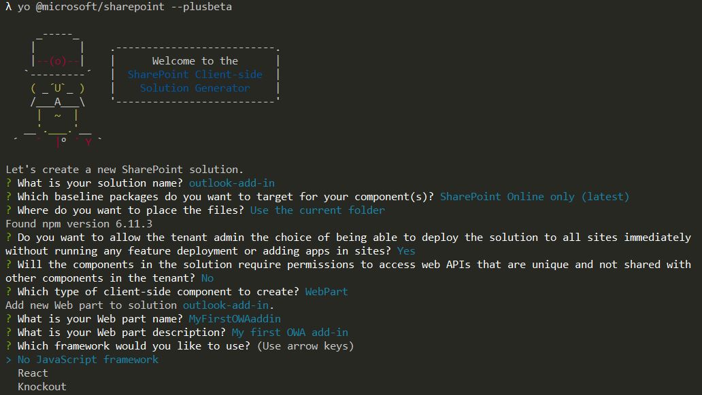
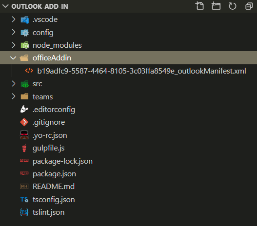
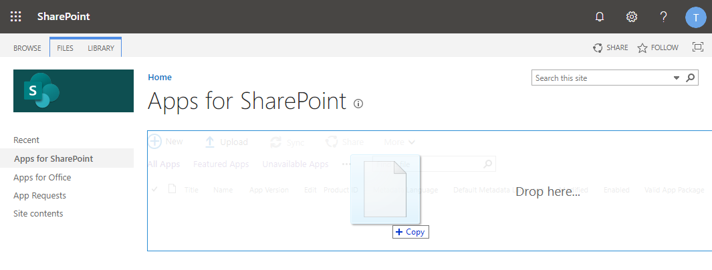
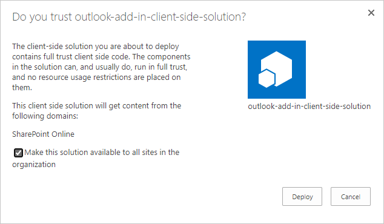
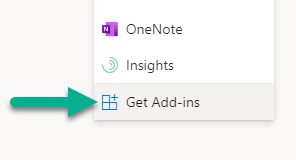
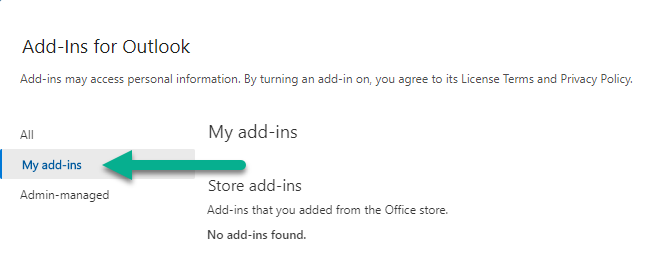
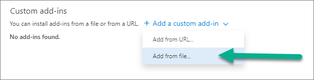
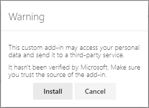

# Tutorial for creating Outlook Web Access extension using SharePoint Framework

Starting with the SharePoint Framework v1.10, you can also implement your Office add-ins using SharePoint Framework. This significantly simplifies add-in development process as SharePoint Framework web parts are automatically hosted within SharePoint without any need for external services. In preview time frame, this model is only supported for the Outlook Web Access, but will be extended across all Office web and desktop clients.

* [Build your first web part](build-a-hello-world-web-part.md)
* [Connect your web part to SharePoint](connect-to-sharepoint.md)
* [Deploy your client-side web part to a SharePoint page](provision-sp-assets-from-package.md)

> [!IMPORTANT]
> This lab requires that you are using at least version 1.10 of the SharePoint Framework as these capabilities are not available in earlier versions.

> [!NOTE]
> This feature was introduced as a developer preview feature. In order to use features in developer preview, ensure you use the `--plusbeta` version of the library (*see [this article for reference](https://docs.microsoft.com/sharepoint/dev/spfx/try-preview-capabilities)*)

<br/>

> [!Video https://www.youtube.com/embed/QtGjTAjbIKU]

<br/>

## Create a new solution

1. Create a new project directory in your favorite location:

   ```shell
    md outlook-add-in
   ```

1. Go to the project directory:

    ```shell
    cd outlook-add-in
    ```

1. Create a new client-side web part solution by running the Yeoman SharePoint Generator:

    ```shell
    yo @microsoft/sharepoint --plusbeta
    ```

1. When prompted:

    * Accept the default **outlook-add-in** as your solution name, and then select Enter.
    * Select **SharePoint Online only (latest)**, and then select Enter.
    * Select **Use the current folder** as the location for the files.
    * Select **y** to ensure that your web part is automatically deployed tenant-wide when it's added to the tenant App Catalog.
    * Select **N** on the question if solution contains unique permissions.  
    * Select **WebPart** as the client-side component type to be created.

1. The next set of prompts asks for specific information about your web part:

    * Enter **MyFirstOWAaddin** for the web part name, and then select Enter.
    * Enter **My first Outlook add-in** as the description of the web part, and then select Enter. 
    * Accept the default **No JavaScipt web framework** option for the framework, and then select Enter to continue.

    

    At this point, Yeoman installs the required dependencies and scaffolds the solution files. Creation of the solution might take a few minutes. Yeoman scaffolds the project to include your **MyFirstOWAaddin** web part, which will act as the add-in in Outlook Web App.

1. Next, enter the following to open the web part project in Visual Studio Code:

    ```shell
    code .
    ```

Starting with the SharePoint Framework v1.10, scaffolding will also include additional **./officeAddin** folder in the solution structure, with a default manifest file for your solution to get published as a Outlook Web App add-in.

  

**officeAddin** folder contains the following file:

  * **[componentId]_outlookManifest.xml** - Default manifest definition for your solution

Manifest file contains by default definition to expose your add-in as a tool pane add-in the Outlook Web App with default values. You can modify the structure as needed based on your business requirements.

## Install Office types to your solution

In the console, enter the following to install the types for the Office JavaScript SDK from the npm:

```shell
npm install @types/office-js
```

This adds the needed intelligence for the Office JavaScript SDK types when you develop your solution in TypeScript.

## Making solution aware of the Office context

1.  Open **src\webparts\myFirstOwAaddin\MyFirstOwAaddinWebPart.ts** for the needed edits on making our solution aware of the Office context, if it's used as an Outlook Web App add-in.

1. Update the **render** method as follows. Notice how we are rendering different content dependent if the code is rendered as an Outlook Web App add-in or as a web part in SharePoint. We can detect if solution is hosted Outlook Web App by checking the `this.context.sdks.office` property.

    ```typescript
    public render(): void {

        let title: string = '';
        let subTitle: string = '';
        let contextDetail: string = '';

        if (this.context.sdks.office) {
            // We have Office context for the solution
            title = "Welcome to Office!";
            subTitle = "Extending Office with custom business extensions.";
            contextDetail = "We are in the context of following email: " + this.context.sdks.office.context.mailbox.userProfile.emailAddress;
        }
        else
        {
            // We are rendered in normal SharePoint context
            title = "Welcome to SharePoint!";
            subTitle = "Customize SharePoint experiences using Web Parts.";
            contextDetail = "We are in the context of following site: " + this.context.pageContext.web.title;
        }

        this.domElement.innerHTML = `
        <div class="${ styles.myFirstOwAaddin }">
            <div class="${ styles.container }">
            <div class="${ styles.row }">
                <div class="${ styles.column }">
                <span class="${ styles.title }">${title}</span>
                <p class="${ styles.subTitle }">${subTitle}</p>
                <p class="${ styles.description }">${contextDetail}</p>
                <p class="${ styles.description }">${escape(this.properties.description)}</p>
                <a href="https://aka.ms/spfx" class="${ styles.button }">
                    <span class="${ styles.label }">Learn more</span>
                </a>
                </div>
            </div>
            </div>
        </div>`;

    }
    ```

    > [!NOTE]
    > See more information around the Office JavaScript API capabilities from the [API Reference documentation](https://docs.microsoft.com/office/dev/add-ins/reference/javascript-api-for-office).

## Packaging and deploying your solution to SharePoint

Ensure that your console is activated in the root folder of the solution, which was created.

1. Execute the following commands to build bundle your solution. This executes a release build of your project by using a dynamic label as the host URL for your assets.

    ```shell
    gulp bundle --ship
    ```

1. Execute the following task to package your solution. This creates an updated **outlook-add-in.sppkg** package on the **sharepoint/solution** folder.

    ```shell
    gulp package-solution --ship
    ```

Next, you need to deploy the package that was generated to the tenant App Catalog.

> [!NOTE]
> If you do not have an app catalog, a SharePoint Online Admin can create one by following the instructions in this guide: [Use the App Catalog to make custom business apps available for your SharePoint Online environment](https://support.office.com/article/use-the-app-catalog-to-make-custom-business-apps-available-for-your-sharepoint-online-environment-0b6ab336-8b83-423f-a06b-bcc52861cba0).

1. Go to your tenant's SharePoint App Catalog.

1. Upload or drag and drop the **outlook-add-in.sppkg** to the App Catalog.

    

    This deploys the client-side solution package. Because this is a full trust client-side solution, SharePoint displays a dialog and asks you to trust the client-side solution to deploy.

    Notice how the **domain** list in the prompt says *SharePoint Online*. This is because the content is either served from the Office 365 CDN or from the App Catalog, depending on the tenant settings.

    Ensure that the **Make this solution available to all sites in the organization** option is selected, so that the web part can be used from the Outlook Web Access side.

    

1. Select **Deploy**.

    Notice that you can see if there's any exceptions or issues in the package by looking the **App Package Error Message** column in the App Catalog.

Now the web part is deployed and is automatically available cross the SharePoint Online sites.

> [!NOTE]
> In this tutorial case, we are using tenant wide deployment option of the SharePoint Framework solution. This will ensure that the development and usage experience is as easy as possible. You could also deploy the solution as site scope, but in that case you'd need to ensure that the solution is deployed on the SharePoint site behind of the Microsoft Teams, before you can use it.

## Install solution to Outlook Web Access

Next steps is to enable the add-in the Outlook Web Access.

1. Activate one of the existing mails in your inbox
1. Select **[...]** and choose **Get Add-ins**

   

1. Choose **My add-ins** from the left menu

    

1. Choose **Add from file...* under the **Custom add-ins**

    

1. Upload the manifest xml file from your project solution under the **officeAddin** folder
1. Click **Install** on the warning message to get your add-in available on the tenant

    

1. Close the add-in window by clicking **X** on the top-right corner
1. Activate again the context menu from ***[...]*** and choose **SPFx template** to activate the add-in in your inbox
   1. Name can be adjusted in the manifest file as needed

> [!IMPORTANT]
> Deployment process will include different steps when additional applications and desktop will be supported.
