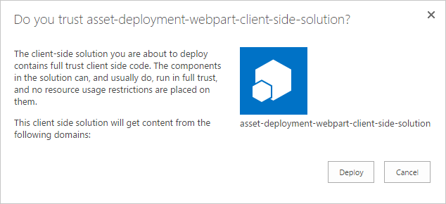
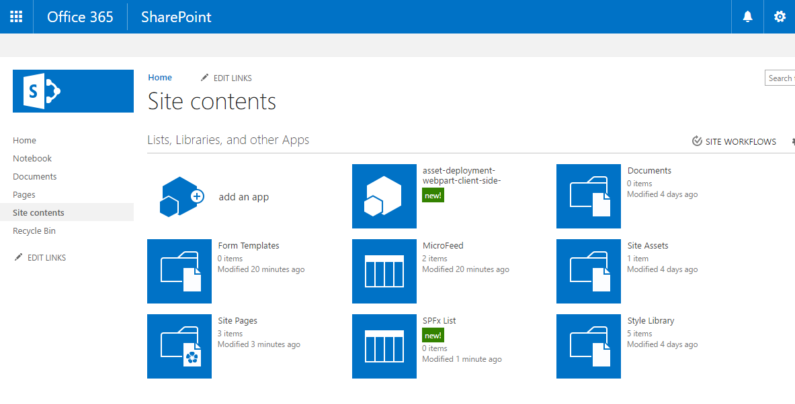
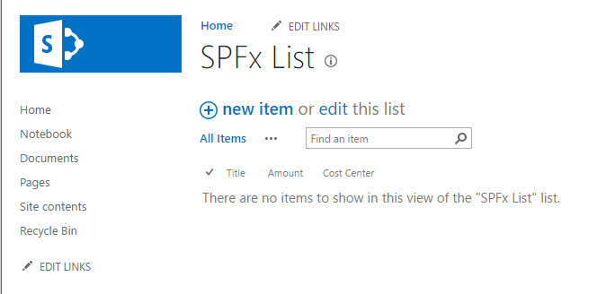
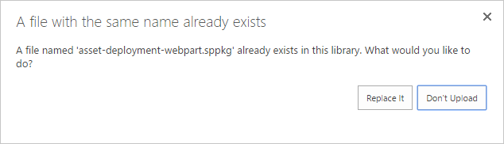
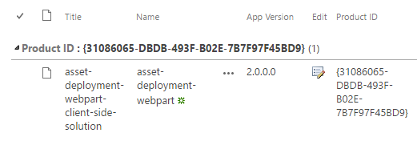
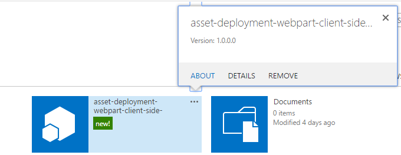
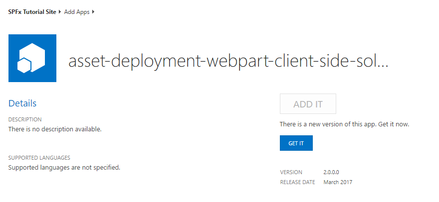
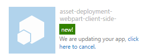
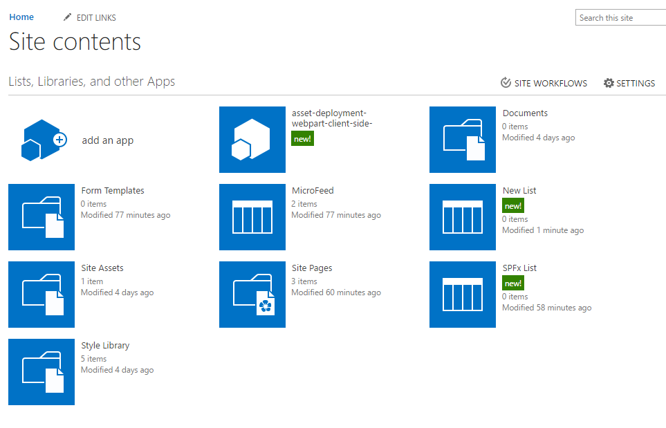

# Provisioning SharePoint assets from your SharePoint client-side web part

This article describes how to provision SharePoint assets as part of the SharePoint Framework solution. These assets are deployed to SharePoint sites when the solution is installed on it. Article also covers needed steps for introducing possible updates as part of new versions of the package. This process is exactly the same as for add-in update.

## Prerequisites
Complete the following steps before you start to understand the basic flow of creating a custom client-side web part:

* [Build your first web part](build-a-hello-world-web-part.md)
* [Connect to SharePoint](connect-to-sharepoint.md) 

## Resources
See following resources for additional details around the covered topics in this tutorial.

* [Provision SharePoint assets with your solution package](../../toolchain/provision-sharepoint-assets)
* [Sample solution - Deployment of SharePoint assets as part of SPFx package](https://github.com/SharePoint/sp-dev-fx-webparts/tree/master/samples/react-feature-framework)

## Create a new web part project

Create a new project directory in your favorite location:

```
md asset-deployment-webpart
```

Go to the project directory:

```
cd asset-deployment-webpart
```
    
Create a new client-side web part solution by running the Yeoman SharePoint Generator:

```
yo @microsoft/sharepoint
```

When prompted:

* Accept the default **asset-deployment-webpart** as your solution name and choose **Enter**.
* Select **Use the current folder** as the location for the files.

The next set of prompts will ask for specific information about your web part:

* Accept the default **No javascript web framework** option for the framework and choose **Enter** to continue.
* Type **AssetDeployment** for the web part name and choose **Enter**.
* Enter **AssetDeployment Web Part** as the description of the web part and choose **Enter**. 

At this point, Yeoman will install the required dependencies and scaffold the solution files. This might take a few minutes. Yeoman will scaffold the project to include your **jQueryWebPart** web part as well.

In the console, type the following to open the web part project in Visual Studio Code:

```
code .
```

## Create folder structure for your SharePoint assets

We'll first need to create a **assets** folder where we will place all feature framework assets used to provision SharePoint structures when package is installed.

* Create folder called **sharepoint** to the root of the solution
* Create folder called **assets** as a sub folder for the just created **sharepoint** folder

Your solution structure should be looking like in the following picture


## Create feature framework files for initial deployment
To be able to provision SharePoint assets to sites with feature framework elements, we'll need to create needed xml files to the asset folder. Supported elements for the SharePoint Framework solution packages are following:

* Fields / Site columns
* Content Types
* List instances
* List instances with custom schema

In following steps, we'll define the needed structure to be provisioned.

### Add element.xml file for SharePoint definitions
Create a new file inside the **sharepoint\assets** folder named as **elements.xml**

Copy the following xml structure into **elements.xml**.

```xml
<?xml version="1.0" encoding="utf-8"?>
<Elements xmlns="http://schemas.microsoft.com/sharepoint/">

    <Field ID="{060E50AC-E9C1-4D3C-B1F9-DE0BCAC300F6}"
            Name="SPFxAmount"
            DisplayName="Amount"
            Type="Currency"
            Decimals="2"
            Min="0"
            Required="FALSE"
            Group="SPFx Columns" />

    <Field ID="{943E7530-5E2B-4C02-8259-CCD93A9ECB18}"
            Name="SPFxCostCenter"
            DisplayName="Cost Center"
            Type="Choice"
            Required="FALSE"
            Group="SPFx Columns">
        <CHOICES>
        <CHOICE>Administration</CHOICE>
        <CHOICE>Information</CHOICE>
        <CHOICE>Facilities</CHOICE>
        <CHOICE>Operations</CHOICE>
        <CHOICE>Sales</CHOICE>
        <CHOICE>Marketing</CHOICE>
        </CHOICES>
    </Field>

    <ContentType ID="0x010042D0C1C200A14B6887742B6344675C8B" 
            Name="Cost Center" 
            Group="SPFx Content Types" 
            Description="Sample content types from web part solution">
        <FieldRefs>
            <FieldRef ID="{060E50AC-E9C1-4D3C-B1F9-DE0BCAC300F6}" /> 
            <FieldRef ID="{943E7530-5E2B-4C02-8259-CCD93A9ECB18}" />
        </FieldRefs>
    </ContentType> 

    <ListInstance 
            CustomSchema="schema.xml"
            FeatureId="00bfea71-de22-43b2-a848-c05709900100"
            Title="SPFx List" 
            Description="SPFx List"
            TemplateType="100"
            Url="Lists/SPFxList">
    </ListInstance>

</Elements>
```

Things to note about the pasted xml structure:
* We are provisioning two fields, content type and a list instance with custom schema to the site
* Definitions are using standard Feature Framework schema, which is well known for SharePoint developers
* Custom fields are being referenced in the introduced content type
* We use **CustomSchema** attribute in the **ListInstance** element to define provisioning time schema.xml file for the list. This way list is still based on out-of-the-box list template (Normal custom list '100' in this case), but we can define alternative provisioning definition during initial provisioning.

> More details on the used schema structures can be found from [Feature Framework documentation](https://msdn.microsoft.com/en-us/library/office/ms460318(v=office.14).aspx) at MSDN.

### Add schema.xml file for defining list structure
In previous step we referenced **schema.xml** file in the **CustomSchema** attribute of the **ListInstance** element, so we'll need to include that in our package. 

Create a new file inside the **sharepoint\assets** folder named as **schema.xml**

Copy the following xml structure into **schema.xml**.

```xml
<List xmlns:ows="Microsoft SharePoint" Title="Basic List" EnableContentTypes="TRUE" FolderCreation="FALSE" Direction="$Resources:Direction;" Url="Lists/Basic List" BaseType="0" xmlns="http://schemas.microsoft.com/sharepoint/">
  <MetaData>
    <ContentTypes>
      <ContentTypeRef ID="0x010042D0C1C200A14B6887742B6344675C8B" />
    </ContentTypes>
    <Fields></Fields>
    <Views>
      <View BaseViewID="1" Type="HTML" WebPartZoneID="Main" DisplayName="$Resources:core,objectiv_schema_mwsidcamlidC24;" DefaultView="TRUE" MobileView="TRUE" MobileDefaultView="TRUE" SetupPath="pages\viewpage.aspx" ImageUrl="/_layouts/images/generic.png" Url="AllItems.aspx">
        <XslLink Default="TRUE">main.xsl</XslLink>
        <JSLink>clienttemplates.js</JSLink>
        <RowLimit Paged="TRUE">30</RowLimit>
        <Toolbar Type="Standard" />
        <ViewFields>
          <FieldRef Name="LinkTitle"></FieldRef>
          <FieldRef Name="SPFxAmount"></FieldRef>
          <FieldRef Name="SPFxCostCenter"></FieldRef>
        </ViewFields>
        <Query>
          <OrderBy>
            <FieldRef Name="ID" />
          </OrderBy>
        </Query>
      </View>
    </Views>
    <Forms>
      <Form Type="DisplayForm" Url="DispForm.aspx" SetupPath="pages\form.aspx" WebPartZoneID="Main" />
      <Form Type="EditForm" Url="EditForm.aspx" SetupPath="pages\form.aspx" WebPartZoneID="Main" />
      <Form Type="NewForm" Url="NewForm.aspx" SetupPath="pages\form.aspx" WebPartZoneID="Main" />
    </Forms>
  </MetaData>
</List>
```

Things to note in the included xml structure:
* Custom content type deployed using **elements.xml** file is referenced in the **ContentTypeRef** element
* Custom fields called **SPFxAmount** and **SPFxCostCenter** are being referenced in the **FieldRef** element

> More details on the used schema structures can be found from [Uderstanding Schema.xml Files](https://msdn.microsoft.com/en-us/library/office/ms459356(v=office.14).aspx) article at MSDN.

## Ensure that definitions are taken into use in build pipeline
Now we have created the needed structures for provisioning SharePoint assets automatically from the solution when it's deployed. Next step is to ensure that we package these xml files as part of the solution file.

Open **package-solution.json** from the config folder.
The **package-solution.json** file defines the package metadata as shown in the following code:

```json
{
  "solution": {
    "name": "asset-deployment-webpart-client-side-solution",
    "id": "31086065-dbdb-493f-b02e-7b7f97f45bd9",
    "version": "1.0.0.0"
  },
  "paths": {
    "zippedPackage": "solution/asset-deployment-webpart.sppkg"
  }
}
```

To ensure that our newly added Feature Framework files are taken into account while solution is being packaged, we'll need to include a Feature Framework feature definition for the solution package. Let's include a JSON definition for needed feature inside of the solution structure as demonstrated in below code.

```json
{
  "solution": {
    "name": "asset-deployment-webpart-client-side-solution",
    "id": "31086065-dbdb-493f-b02e-7b7f97f45bd9",
    "version": "1.0.0.0",
    "features": [{
      "title": "asset-deployment-webpart-client-side-solution",
      "description": "asset-deployment-webpart-client-side-solution",
      "id": "523fe887-ced5-4036-b564-8dad5c6c6e24",
      "version": "1.0.0.0",
      "assets": {        
        "elementManifests": [
          "elements.xml"
        ],
        "elementFiles":[
          "schema.xml"
        ]
      }
    }]
  },
  "paths": {
    "zippedPackage": "solution/asset-deployment-webpart.sppkg"
  }
}

```

Things to note in the added json definitions:
* You can technically have multiple features in the package since **features** is a collection, which is not however recommended
* **elements.xml** is referenced under elementManifests, so that it's packaged properly for the actual feature xml structure as element manifest file
* You can have multiple element.xml files in the definition and they would be executed in the order they are mentioned in the JSON definition. Typically you should avoid usage of multiple element.xml since it adds unnecessary complexity. You can define all needed assets in single element.xml file

## Deploy and test asset provisioning
Now you are ready to deploy the solution to SharePoint. Since in this case we are provisioning assets directly to the SharePoint sites when the solution is installed, you cannot test the capability in local or in on-line workbench.

In the console window, enter the following command to package your client-side solution that contains the web part, so that we get the basic structure ready for packaging:

```
gulp bundle
```
Next execute following command, so that the solution package is created:

```
gulp package-solution
```
The command will create the package in the `sharepoint/solution` folder:

```
asset-deployment-webpart.sppkg
```
Before testing the package in the SharePoint, let's quickly have a look on the default structures created for the package around the defined feature framework elements. Move back to Visual Studio Code side and expand `sharepoint/solution/debug` folder, which contains the raw xml structures to be included in the actual **sppkg** package.


Next you need to deploy the package that was generated to the App Catalog.

Go to your site's App Catalog.

Upload or drag and drop the asset-deployment-webpart.sppkg located in the `sharepoint/solution` folder  to the App Catalog. SharePoint will display a dialog and ask you to trust the client-side solution to deploy.



> Note. SharePoint validates the published package when it's deployed and you only see the trust dialog, if package is valid for deployment. You can also see the status around this validation from the 'Valid App Package' column in the app catalog.

Go to the site where you want to test SharePoint asset provisioning. This could be any site collection in the tenant where you deployed this solution package. 

Chose the gears icon on the topi nav bar on teh right and choose **Add an app** to go to your Apps page.

In the **Search** box, enter **deployment** and choose **Enter** to filter your apps. 


Choose the **asset-deployment-webpart-client-side-solution** app to install the app on the site. When installation is completed, refresh the page by pressing **F5**.



Notice how the custom **SPFx List** has been also provisioned to site as part of the solution package deployment.

Click **SPFx List** to move to the list



Notice how the custom fields **Amount** and **Cost Center** are visible automatically in the default view of the list. 

## Define upgrade actions for new version
Whenever you build a new version of your SharePoint Framework solution, you might have some required changes on the provisioned SharePoint assets. You can take advantage of the Feature Framework upgrade action support when a new version of the package is being deployed. 

SharePoint Framework solutions do support following Feature Framework upgrade action definitions
* ApplyElementManifest
* AddContentTypeField

> You can read more details around the Feature Framework upgrade action definitions from [SharePoint add-ins update process](https://msdn.microsoft.com/en-us/library/office/fp179904.aspx) article at MSDN.

### Add new element.xml file for the new version
Move back to your solution in the Visual Studio code.

Create a new file inside the **sharepoint\assets** folder named as **elements-v2.xml**

Copy the following xml structure into **elements-v2.xml**, which defines a new SharePoint list to be provisioned with a title of **New List**.

```xml
<?xml version="1.0" encoding="utf-8"?>
<Elements xmlns="http://schemas.microsoft.com/sharepoint/">

    <ListInstance 
            FeatureId="00bfea71-de22-43b2-a848-c05709900100"
            Title="New List" 
            Description="New list provisioned from v2"
            TemplateType="100"
            Url="Lists/NewList">
    </ListInstance>

</Elements>
```
We also need a definition for actual Feature Framework upgrade actions, so create a new file inside the **sharepoint\assets** folder named as **upgrade-actions-v2.xml**

Copy the following xml structure into **elements-v2.xml**. Notice that the feature guid reference in the path refers to the automatically created folder under  `sharepoint/solution/debug` folder and has to be updated based on your solution. This guid is also matching on the guid of the feature, which we defined in the **package-solution.json** file.

```xml
<ApplyElementManifests>
      <ElementManifest Location="523fe887-ced5-4036-b564-8dad5c6c6e24\elements-v2.xml" />
</ApplyElementManifests>

```

### Deploy new version to SharePoint

Next we'll need to update both solution version and the feature version responsible of the asset provisioning. 

> Solution version will indicate for the SharePoint that there's a new version of the SharePoint Framework solution available. Feature version increase will ensure that the upgrade actions will be executed accordingly when the solution package is upgraded in the existing site(s).

Open **package-solution.json** from the config folder and update version values for both solution and feature to "2.0.0.0". We will also need to include **elements-v2.xml** under the elementManifest section and also to include upgradeActions element with a pointer to just created **upgrade-actions-v2.xml** file. 

Here's a complete **package-solution.json** file with needed changes. Notice that identifiers for your solution could be slightly different, so concentrate on adding only the missign pieces.

```json
{
  "solution": {
    "name": "asset-deployment-webpart-client-side-solution",
    "id": "31086065-dbdb-493f-b02e-7b7f97f45bd9",
    "version": "2.0.0.0",
    "features": [{
        "title": "asset-deployment-webpart-client-side-solution",
        "description": "asset-deployment-webpart-client-side-solution",
        "id": "523fe887-ced5-4036-b564-8dad5c6c6e24",
        "version": "2.0.0.0",
        "assets": {
          "elementManifests": [
            "elements.xml",
            "elements-v2.xml"
          ],
          "elementFiles": [
            "schema.xml"
          ],
          "upgradeActions":[
            "upgrade-actions-v2.xml"
        ]
        }
      }]
  },
  "paths": {
    "zippedPackage": "solution/asset-deployment-webpart.sppkg"
  }
}
```
> Notice that we also included the **elements-v2.xml** under the elementManifest section. This will ensure that when you install this package to a clean site as a version 2.0, end result will match with the upgraded packages.

In the console window, enter the following command to re-package your client-side solution that contains the web part, so that we get the basic structure ready for packaging:

```
gulp bundle
```
Next execute following command, so that the solution package is created:

```
gulp package-solution
```
The command will create new version of the solution package to the `sharepoint/solution` folder. Notice that you can easily confirm from `sharepoint/solution/debug` folder that updated xml files are included in the solution package

Next you need to deploy the new version that was generated to the App Catalog.

Go to your tenant's App Catalog.

Upload or drag and drop the asset-deployment-webpart.sppkg located in the `sharepoint/solution` folder  to the App Catalog. SharePoint will request you to confirm overriding the existing version.



Click **Replace It** to updated latest version to App catalog.

Notice that the App Version column for the **asset-deployment-webpart-client-side-solution** is now updated to be "2.0.0.0".



### Update existing instance in the site
Now that the package has been updated in the App Catalog, we can move to the actual SharePoint content site and perform the upgrade for the existing instance.

Move to site where you deployed first version of the SharePoint Framework solution

Chose **About** from the context menu of the **asset-deployment-webpart-client-side-solution** solution



This will present the current details around installed SharePoint Framework solution. This page also now shows a text as '*There is a new version of this app. Get it now*' to indicate that there's a new version available.



Click **GET IT** button to start update process for the package.



Update can take a while, but when the add-in status is moved to normal again, you can click **F5** to refresh the site contents page to confirm that new list has been successfully provisioned as part of the update process.



Now we have successfully upgrade this instance to the latest version. This Feature Framework option for SharePoint asset provisioning is pretty much the same as it is for the SharePoint add-in model. Key difference however is that the assets are being provisioned directly to normal SharePoint site, since there's no concept called app / add-in web with SharePoint Framework solutions. 