# Provision SharePoint assets from your SharePoint client-side web part

SharePoint assets can be provisioned as part of the SharePoint Framework solution, and are deployed to SharePoint sites when the solution is installed on it.

Before you start, complete the procedures in the following articles to ensure that you understand the basic flow of creating a custom client-side web part:

- [Build your first web part](build-a-hello-world-web-part.md)
- [Connect your web part to SharePoint](connect-to-sharepoint.md)

You can also follow these steps by watching this video on the SharePoint PnP YouTube Channel:

> [!Video https://www.youtube.com/embed/_oHjmahz4B8]

## Create a new web part project

1. Create a new project directory in your favorite location:

    ```console
    md asset-deployment-webpart
    ```

1. Go to the project directory:

    ```console
    cd asset-deployment-webpart
    ```

1. Create a new client-side web part solution by running the Yeoman SharePoint Generator:

    ```console
    yo @microsoft/sharepoint
    ```

1. When prompted, enter the following values (*select the default option for all prompts omitted below*):

- **What is your solution name?**: asset-deployment-webpart
- **Which type of client-side component to create?**: WebPart
- **What is your Web part name?**: AssetDeployment
- **Which framework would you like to use?**: No JavaScipt web framework

    At this point, Yeoman installs the required dependencies and scaffolds the solution files. This might take a few minutes. Yeoman scaffolds the project to include your **AssetDeployment** web part as well.

1. Next, execute the following to open the web part project in Visual Studio Code:

    ```console
    code .
    ```

## Create folder structure for your SharePoint assets

We first need to create an **assets** folder where we place all feature framework assets used to provision SharePoint structures when a package is installed.

1. Create a folder called **sharepoint** to the root of the solution.
1. Create a folder called **assets** as a subfolder for the created **sharepoint** folder.

    Your solution structure should look like the following picture:

    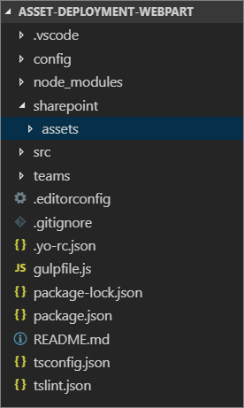

## Create feature framework files for initial deployment

To provision SharePoint assets to sites with feature framework elements, we need to create needed XML files to the asset folder. Supported elements for the SharePoint Framework solution packages are following:

- Fields / site columns
- Content types
- List instances
- List instances with custom schema

### Add an element.xml file for SharePoint definitions

In the following steps, we define the needed structure to be provisioned.

1. Create a new file **elements.xml** in the **sharepoint\assets** folder.
1. Copy the following XML structure into **elements.xml**.

    ```xml
    <?xml version="1.0" encoding="utf-8"?>
    <Elements xmlns="http://schemas.microsoft.com/sharepoint/">

        <Field ID="{060E50AC-E9C1-4D3C-B1F9-DE0BCAC300F6}"
                Name="SPFxAmount"
                DisplayName="Amount"
                Type="Currency"
                Decimals="2"
                Min="0"
                Required="FALSE"
                Group="SPFx Columns" />

        <Field ID="{943E7530-5E2B-4C02-8259-CCD93A9ECB18}"
                Name="SPFxCostCenter"
                DisplayName="Cost Center"
                Type="Choice"
                Required="FALSE"
                Group="SPFx Columns">
            <CHOICES>
            <CHOICE>Administration</CHOICE>
            <CHOICE>Information</CHOICE>
            <CHOICE>Facilities</CHOICE>
            <CHOICE>Operations</CHOICE>
            <CHOICE>Sales</CHOICE>
            <CHOICE>Marketing</CHOICE>
            </CHOICES>
        </Field>

        <ContentType ID="0x010042D0C1C200A14B6887742B6344675C8B"
                Name="Cost Center"
                Group="SPFx Content Types"
                Description="Sample content types from web part solution">
            <FieldRefs>
                <FieldRef ID="{060E50AC-E9C1-4D3C-B1F9-DE0BCAC300F6}" />
                <FieldRef ID="{943E7530-5E2B-4C02-8259-CCD93A9ECB18}" />
            </FieldRefs>
        </ContentType>

        <ListInstance
                CustomSchema="schema.xml"
                FeatureId="00bfea71-de22-43b2-a848-c05709900100"
                Title="SPFx List"
                Description="SPFx List"
                TemplateType="100"
                Url="Lists/SPFxList">
        </ListInstance>

    </Elements>
    ```

There are a few things to take note of from this XML:

- We're provisioning two fields to the site, a content type and a list instance with custom schema.
- Definitions use standard Feature Framework schema, which is well known to SharePoint developers.
- Custom fields are being referenced in the introduced content type.
- We use the `CustomSchema` attribute in the `ListInstance` element to define a provisioning time **schema.xml** file for the list. This way the list is still based on the out-of-the-box list template (normal custom list '100' in this case), but we can define an alternative provisioning definition during initial provisioning.
- When provisioning list instances using Features, you must provide the ID of the Feature associated with the particular list definition. Using the `FeatureId` attribute you're supposed to provide the ID of the Feature, which contains the List Definition. As an example: if you’re provisioning an instance of a custom list the FeatureId attribute should be set to `{00bfea71-de22-43b2-a848-c05709900100}`.

For more detail on the Feature element manifest schema, see: [Using Features in SharePoint Foundation](https://msdn.microsoft.com/library/office/ms460318(v=office.14).aspx).

### Add a schema.xml file for defining list structure

In the previous step, we referenced the **schema.xml** file in the `CustomSchema` attribute of the `ListInstance` element, so we need to include that file in our package.

1. Create a new file **schema.xml** in the **sharepoint\assets** folder.
1. Copy the following XML structure into **schema.xml**.

    ```xml
    <List xmlns:ows="Microsoft SharePoint" Title="Basic List" EnableContentTypes="TRUE" FolderCreation="FALSE" Direction="$Resources:Direction;" Url="Lists/Basic List" BaseType="0" xmlns="http://schemas.microsoft.com/sharepoint/">
      <MetaData>
        <ContentTypes>
          <ContentTypeRef ID="0x010042D0C1C200A14B6887742B6344675C8B" />
        </ContentTypes>
        <Fields></Fields>
        <Views>
          <View BaseViewID="1" Type="HTML" WebPartZoneID="Main" DisplayName="$Resources:core,objectiv_schema_mwsidcamlidC24;" DefaultView="TRUE" MobileView="TRUE" MobileDefaultView="TRUE" SetupPath="pages\viewpage.aspx" ImageUrl="/_layouts/images/generic.png" Url="AllItems.aspx">
            <XslLink Default="TRUE">main.xsl</XslLink>
            <JSLink>clienttemplates.js</JSLink>
            <RowLimit Paged="TRUE">30</RowLimit>
            <Toolbar Type="Standard" />
            <ViewFields>
              <FieldRef Name="LinkTitle"></FieldRef>
              <FieldRef Name="SPFxAmount"></FieldRef>
              <FieldRef Name="SPFxCostCenter"></FieldRef>
            </ViewFields>
            <Query>
              <OrderBy>
                <FieldRef Name="ID" />
              </OrderBy>
            </Query>
          </View>
        </Views>
        <Forms>
          <Form Type="DisplayForm" Url="DispForm.aspx" SetupPath="pages\form.aspx" WebPartZoneID="Main" />
          <Form Type="EditForm" Url="EditForm.aspx" SetupPath="pages\form.aspx" WebPartZoneID="Main" />
          <Form Type="NewForm" Url="NewForm.aspx" SetupPath="pages\form.aspx" WebPartZoneID="Main" />
        </Forms>
      </MetaData>
    </List>
    ```

There are a few things to take note of from this XML:

- The custom content type deployed by using the **elements.xml** file is referenced in the `ContentTypeRef` element.
- Custom fields called `SPFxAmount` and `SPFxCostCenter` are referenced in the `FieldRef` element.

For more information about the **Schema.xml** schema, see: [Understanding Schema.xml Files](https://msdn.microsoft.com/library/office/ms459356(v=office.14).aspx).

## Ensure that definitions are taken into use in build pipeline

At this point, we've created the files for provisioning SharePoint assets using the Feature schema from the solution when it's deployed. The next step is to include them in the SharePoint package **\*.sppkg** file.

1. Open **package-solution.json** from the config folder.

    The **package-solution.json** file defines the package metadata as shown in the following code:

1. Ensure the new Feature Framework files included in the SharePoint Package. 

    Include a Feature Framework feature definition for the solution package. Include a JSON definition for the needed feature in the solution structure as demonstrated in the following code:

    ```json
    {
      "$schema": "https://developer.microsoft.com/json-schemas/spfx-build/package-solution.schema.json",
      "solution": {
        //...
        "version": "1.0.0.0",
        "includeClientSideAssets": true,
        "isDomainIsolated": false,
        // >>> START
        //     add the following to the package-solution.json file
        "features": [{
          "title": "asset-deployment-webpart-client-side-solution",
          "description": "asset-deployment-webpart-client-side-solution",
          "id": "00000000-0000-0000-0000-000000000000",     // <-- Update new GUID
          "version": "1.0.0.0",
          "assets": {
            "elementManifests": [
              "elements.xml"
            ],
            "elementFiles":[
              "schema.xml"
            ]
          }
        }]
        // <<< END
      },
      "paths": {
        "zippedPackage": "solution/asset-deployment-webpart.sppkg"
      }
    }
    ```

There are a few things to take note of from this XML:

- Make sure you define a **unique GUID** for the `id` property in the `feature` property.
- You can technically have multiple features in the package because the `features` property is an array. However, this isn't recommended.
- **elements.xml** is referenced under `elementManifests` so that it's properly packaged for the feature definition as an element manifest file.
- You can have multiple **element.xml** files in the definition, and they would be executed in the order they're mentioned in the JSON definition. Typically, you should avoid using multiple **element.xml** files because this adds unnecessary complexity. You can define all needed assets in a single **element.xml** file.

## Deploy and test asset provisioning

Now you're ready to deploy the solution to SharePoint. Because we're provisioning assets directly to the SharePoint sites when the solution is installed, you can't test the capability in a local or online Workbench.

1. In the console, execute the following command to package your client-side solution that contains the web part to get the basic structure ready for packaging:

    ```console
    gulp bundle
    ```

1. Execute the following command to create the solution package:

    ```console
    gulp package-solution
    ```

    The command creates the **asset-deployment-webpart.sppkg** package in the **sharepoint/solution** folder.

1. Before testing the package in SharePoint, let's quickly have a look on the default structures created for the package around the defined feature framework elements.

    Move back to the Visual Studio Code side and expand the **sharepoint/solution/debug** folder, which contains the raw XML structures to be included in the actual **\*.sppkg** package.

    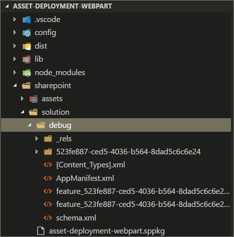

1. Deploy the package that was generated to the app catalog.

    In the browser, navigate to your tenant's app catalog.

1. Upload or drag and drop the **asset-deployment-webpart.sppkg** located in the **sharepoint/solution** folder to the app catalog. SharePoint displays a dialog and asks you to trust the client-side solution to deploy.

    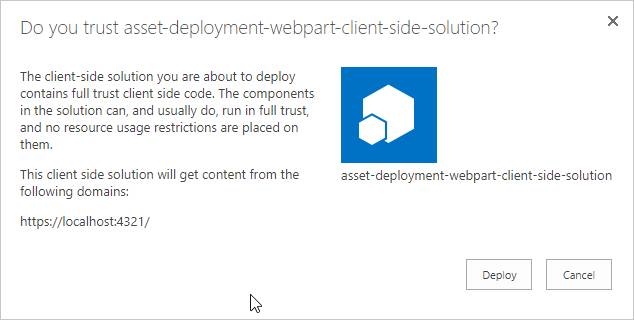

    > [!NOTE]
    > SharePoint validates the published package when it's deployed. You only see the trust dialog if the package is valid for deployment. You can also see the status around this validation from the **Valid App Package** column in the app catalog.

1. Go to the site where you want to test the SharePoint asset provisioning. This could be any site collection in the tenant where you deployed this solution package.
1. Select the gear icon on the top nav bar on the right, and then select **Add an app** to go to your Apps page.
1. In the **Search** box, enter **deployment**, and then select <kbd>ENTER</kbd> to filter your apps.

    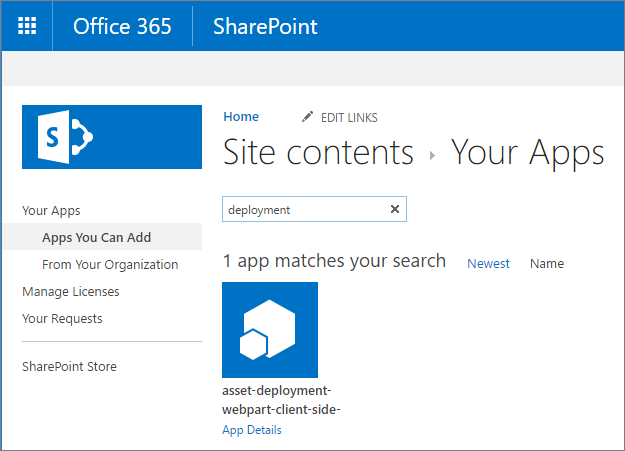

1. Select the **asset-deployment-webpart-client-side-solution** app to install the app on the site. When installation is completed, refresh the page by selecting **F5**. Notice how the custom **SPFx List** has been provisioned to site as part of the solution package deployment.

    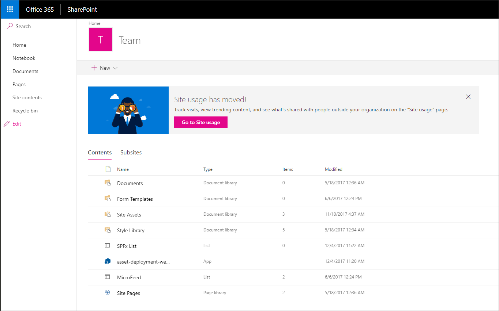

1. Select **SPFx List** to move to the list. Notice how the custom fields **Amount** and **Cost Center** are visible automatically in the default view of the list.

    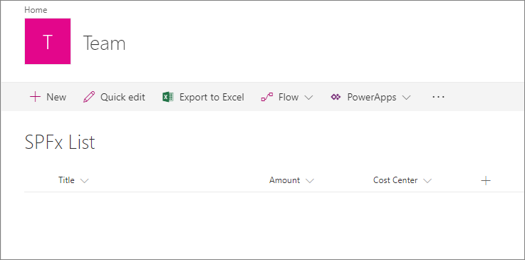

## Define upgrade actions for new version

Whenever you build a new version of your SharePoint Framework solution, you might have some required changes on the provisioned SharePoint assets. You can take advantage of the Feature Framework upgrade action support when a new version of the package is being deployed.

SharePoint Framework solutions do support the following Feature Framework upgrade action definitions:

- ApplyElementManifest
- AddContentTypeField

For more information on the Feature Framework upgrade action definitions, see: [SharePoint Add-ins update process](../../../sp-add-ins/sharepoint-add-ins-update-process.md).

### Add a new element.xml file for the new version

1. Go back to your solution in Visual Studio Code.
1. Create a new file **elements-v2.xml** in the **sharepoint\assets** folder.
1. Copy the following XML structure into **elements-v2.xml**, which defines a new SharePoint list to be provisioned with a title of **New List**.

    ```xml
    <?xml version="1.0" encoding="utf-8"?>
    <Elements xmlns="http://schemas.microsoft.com/sharepoint/">
      <ListInstance
        FeatureId="00bfea71-de22-43b2-a848-c05709900100"
        Title="New List"
        Description="New list provisioned from v2"
        TemplateType="100"
        Url="Lists/NewList">
      </ListInstance>
    </Elements>
    ```

> [!IMPORTANT]
> Don't change the GUID in this XML. This points to the GUID where the list type is defined.

1. We also need a definition for actual Feature Framework upgrade actions, so create a new file **upgrade-actions-v2.xml** in the **sharepoint\assets** folder.
1. Copy the following XML structure into **upgrade-actions-v2.xml**. Notice that the feature GUID reference in the path refers to the automatically created folder under the **sharepoint/solution/debug** folder and has to be updated based on your solution. This GUID also matches the GUID of the feature, which we defined in the **package-solution.json** file.

    ```xml
    <ApplyElementManifests>
      <ElementManifest Location="{feature-guid}\elements-v2.xml" />
    </ApplyElementManifests>
    ```

> [!IMPORTANT]
> The `{feature-guid}` should match the GUID of the feature you added to the **package-solution.json** file.

### Deploy the new version to SharePoint

Next, we need to update both the solution version and the feature version responsible for the asset provisioning.

> [!IMPORTANT]
> The solution version indicates for SharePoint that there's a new version of the SharePoint Framework solution available. The feature version ensures that the upgrade actions are executed accordingly when the solution package is upgraded in the existing site(s).

1. Open **package-solution.json** from the config folder and update the version values for both the solution and the feature to `2.0.0.0`.
1. We also need to include **elements-v2.xml** under the elementManifest section, and need to include the upgradeActions element with a pointer to the created **upgrade-actions-v2.xml** file.

    Here's the complete **package-solution.json** file with needed changes. Notice that identifiers for your solution could be slightly different, so concentrate on adding only the missing pieces.

    ```json
    {
      "$schema": "https://developer.microsoft.com/json-schemas/spfx-build/package-solution.schema.json",
      "solution": {
        //...
        "version": "2.0.0.0",
        "includeClientSideAssets": true,
        "isDomainIsolated": false,
        "features": [{
          "title": "asset-deployment-webpart-client-side-solution",
          "description": "asset-deployment-webpart-client-side-solution",
          "id": "{feature-guid}",
          "version": "2.0.0.0",
          "assets": {
            "elementManifests": [
              "elements.xml",
              "elements-v2.xml"
            ],
            "elementFiles":[
              "schema.xml"
            ],
            "upgradeActions":[
              "upgrade-actions-v2.xml"
            ]
          }
        }]
        //...
      }
    }
    ```

    > [!IMPORTANT]
    > Notice that we also included the **elements-v2.xml** under the elementManifest section. This ensures that when you install this package to a clean site as a version 2.0, the end result will match the upgraded packages.

1. In the console window, execute the following command to repackage your client-side solution that contains the web part so that we get the basic structure ready for packaging:

    ```console
    gulp bundle
    ```

1. Execute the following command to create the solution package:

    ```console
    gulp package-solution
    ```

    The command creates a new version of the solution package in the **sharepoint/solution** folder. Notice that you can easily confirm from the **sharepoint/solution/debug** folder that the updated XML files are included in the solution package.

1. Next you need to deploy the new version that was generated to the app catalog. Go to your tenant's app catalog.
1. Upload or drag and drop the **asset-deployment-webpart.sppkg** located in the **sharepoint/solution** folder to the app catalog. SharePoint requests that you confirm overriding the existing version.

    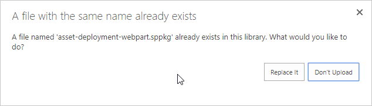

1. Select **Replace It** to update the latest version to the app catalog.
1. Select **Deploy** to trust the latest version.

    Notice that the **App Version** column for the **asset-deployment-webpart-client-side-solution** is now updated to be **2.0.0.0**.

    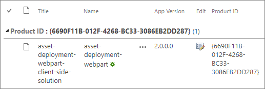

### Update an existing instance in the site

With the package been updated in the app catalog, we can move to the SharePoint content site and do the upgrade for the existing instance.

1. Go to the site where you deployed the first version of the SharePoint Framework solution.
1. Go to the **Site Contents** page.
1. Select **Details** from the context menu of the **asset-deployment-webpart-client-side-solution** solution.

    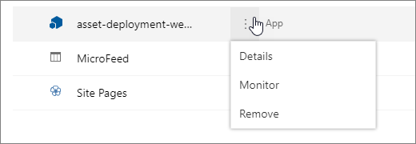

    This presents the current details around the installed SharePoint Framework solution. This page also now shows the text as **There is a new version of this app. Get it now** to indicate that there's a new version available.

    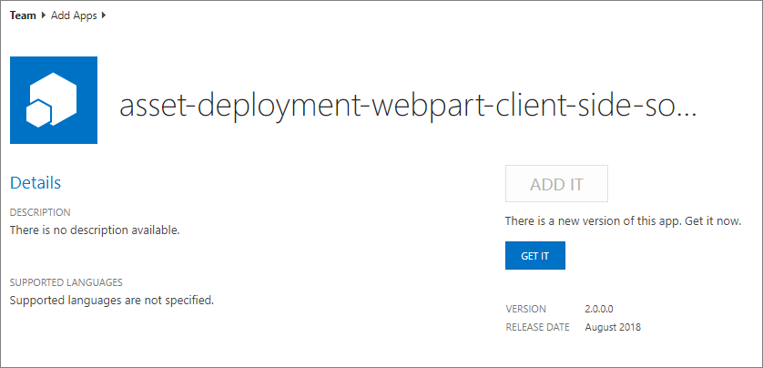

1. Select the **GET IT** button to start the update process for the package.

    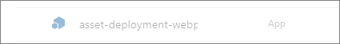

    If you move to the classic experience, you can see more details on the actual upgrade action being applied for the SharePoint Framework solution.

    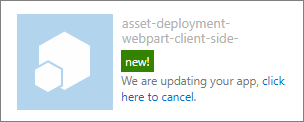

    > [!NOTE]
    > Because the SharePoint Framework uses the same app infrastructure as SharePoint Add-ins, the status for the upgrade indicates that the update can happen for an add-in or an app.

    The update can take a while, but when the solution status changes to normal again, refresh the site contents page to confirm that a new list called **New List** has been successfully provisioned as part of the update process.

    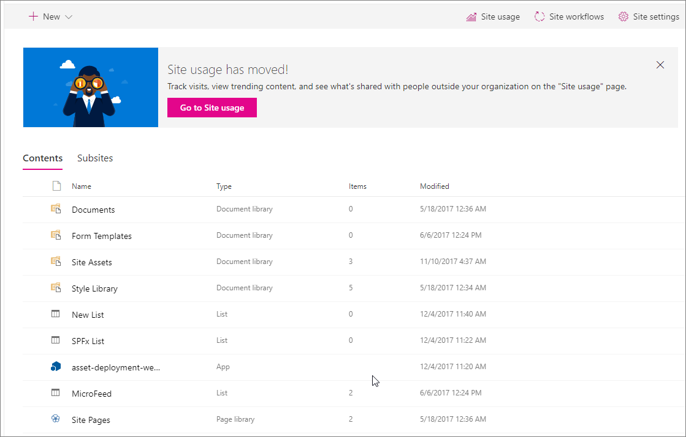

    Now we've successfully upgraded this instance to the latest version. This Feature Framework option for SharePoint asset provisioning similar to the SharePoint Add-in model. The key difference is that the assets are being provisioned directly to a normal SharePoint site, because there's no concept called app or add-in web with SharePoint Framework solutions.

## See also

- [Provision SharePoint assets with your solution package](../../toolchain/provision-sharepoint-assets.md)
- [Sample solution - Deployment of SharePoint assets as part of SPFx package](https://github.com/SharePoint/sp-dev-fx-webparts/tree/master/samples/react-feature-framework)
