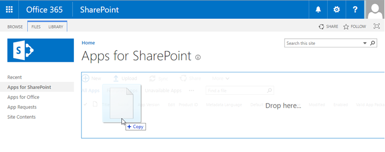
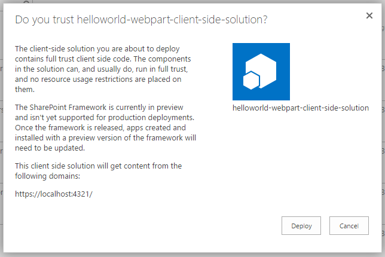
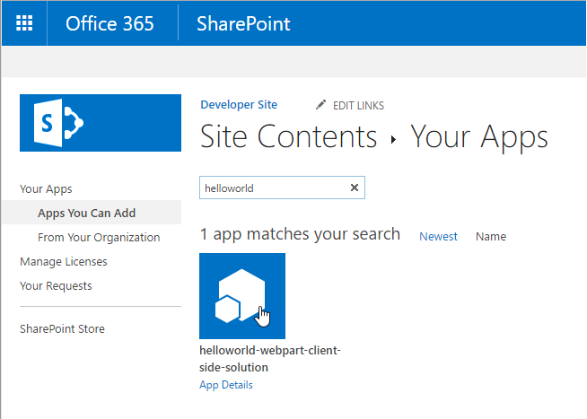
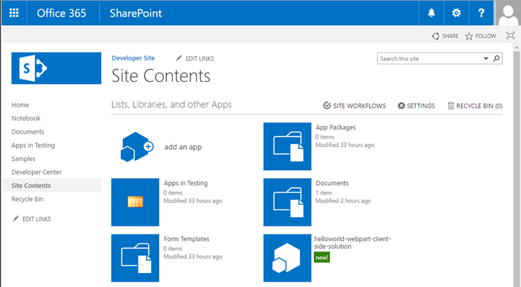
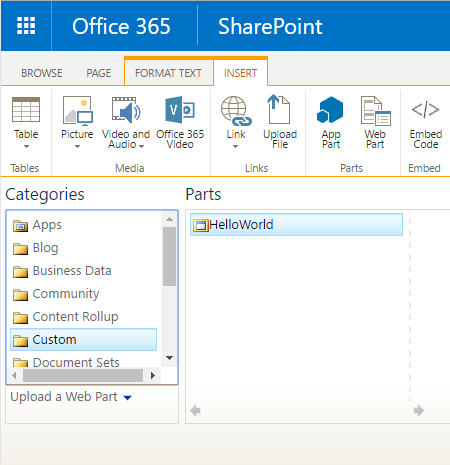
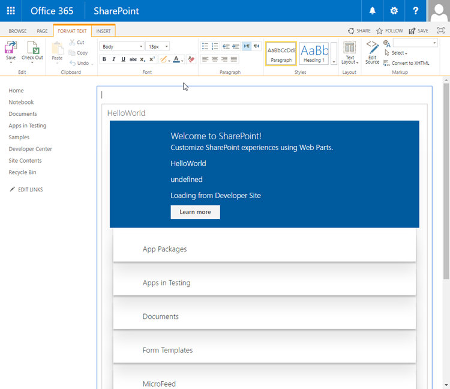
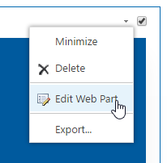
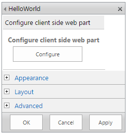
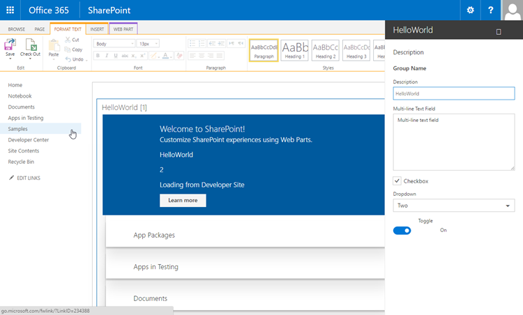

# Deploy your client-side web part to a classic SharePoint page (Hello world part 3)

>**Note:** The SharePoint Framework is currently in preview and is subject to change. SharePoint Framework client-side web parts are not currently supported for use in production environments.

In this article you will learn how to deploy your client-side web part to SharePoint and see it working on a classic SharePoint server-side page. This article continues with the hello world web part built in the previous article [Connect your client-side web part to SharePoint](./connect-to-sharepoint).

Be sure you have completed the procedures in the following articles before you start:

* [Build your first SharePoint client-side web part](./build-a-hello-world-web-part)
* [Connect your client-side web part to SharePoint](./connect-to-sharepoint)

>**Note:** You can find recorded video of this tutorial from [SharePoint PnP YouTube Channel](https://www.youtube.com/watch?v=G9JB1HuNs7Q&list=PLR9nK3mnD-OXvSWvS2zglCzz4iplhVrKq).

## Package the HelloWorld web part

In the console window, go to the web part project directory created in [Build your first SharePoint client-side web part](./build-a-hello-world-web-part).

```
cd helloworld-webpart
```

If `gulp serve` is still running, stop it from running by choosing `Ctrl+C`

Unlike in the workbench, in order to use client-side web parts on classic SharePoint server-side pages, you need to deploy and register the web part with SharePoint. First you need to package the web part.

Open the **HelloWorldWebPart** web part project in Visual Studio Code, or your preferred IDE.

Open **package-solution.json** from the **config** folder.

The **package-solution.json** file defines the package metadata as shown in the following code:

```json
{
	"solution": {
	"name": "helloworld-webpart-client-side-solution",
	"id": "ed83e452-2286-4ea0-8f98-c79d257acea5",
	"version": "1.0.0.0"
	},
	"paths": {
	"zippedPackage": "helloworld-webpart.spapp"
	}
}
```

In the console window, enter the following command to package your client-side solution that contains the web part:

```
gulp package-solution
```

The command will create the package in the `sharepoint` folder:

```
helloworld-webpart.spapp
```

### Package contents

The package uses SharePoint Feature to package your web part. By default, the gulp task creates the following:

* A feature for your web part.
* A .webpart file for your web part, which is an XML file that describes the Web Part.

You can view the raw package contents in the **sharepoint** folder. 

The contents are then packaged into an **.spapp** file. The package format is very similar to a SharePoint add-ins package and uses Microsoft Open Packaging Conventions to package your solution. 

The JavaScript files, CSS and other assets are not packaged and you will have to deploy them to an external location such as a CDN. In order to test the web part during development, you can load all the assets from your local computer. 

## Deploy the HelloWorld package to app catalog

Next you need to deploy the package that was generated to the App Catalog.

Go to your site's App Catalog.

Upload or drag and drop the **helloworld-webpart.spapp** to the App Catalog.

 

This will deploy the client-side solution package. Since this is a full trust client-side solution, SharePoint will display a dialog and ask you to trust the client-side solution to deploy.

 
	
Choose **Deploy**

## Install the client-side solution on your site

Go to your developer site collection.

Choose the gears icon on the top nav bar on the right and choose **Add an app** to go to your Apps page.

In the **Search** box, enter **helloworld** and choose **Enter** to filter your apps.
	
 
	
Choose the **helloworld-webpart-client-side-solution** app to install the app on the site.
	
 

The client-side solution and the web part are installed on your developer site.

The **Site Contents** page will show you the installation status of your client-side solution. Make sure the installation is complete before going to the next step.

## Preview the web part in a classic SharePoint page

Now that you have deployed and installed the client-side solution, add the web part to a classic SharePoint page. Remember that resources such as JavaScripts, and CSS, are available from the local computer.

Open the **<your-webpart-guid>.manifest.json** from the **\dist** folder.
	
Notice that the **internalModuleBaseUrls** property in the **loaderConfig** entry still refers to your local computer:

```json
"internalModuleBaseUrls": [
	"http://`your-local-machine-name`:4321/"
]
```

Before adding the web part to a SharePoint server-side page, run the local server.
	
In the console window that has the **helloworld-webpart** project directory, run the gulp task to start serving from localhost:
	
```
gulp serve --nobrowser
```

>**Note:** `--nobrowser` will not automatically launch the Web Part Workbench.

## Add the HelloWorld web part to classic page

In your browser go to your site collection.
	
In the next steps, create a classic page, and go to the **SitePages** library in your site.
	
Choose the gears icon in the top nav bar on the right and choose **Site Contents**.
	
Choose the **SitePages** library icon to go to the **SitePages** library.
	
Choose **New** to create a classic SharePoint page.
	
Enter **HelloWorld** as the page name.
	
Choose the **Create** button to create the web part page. SharePoint will create your page.
	
In the ribbon, choose **Insert -> Web Part** to open the Web Part Gallery.
	
In the Web Part Gallery, choose the category **Custom**.
	
>**Note:** During preview, client-side web parts will be available under the **Custom** category in the web part gallery. 

You should see your Hello World web part.


	
Select the Hello World web part and choose **Add** to add it to the page.
	
The web part assets will be loaded from the local environment. In order to load the scripts hosted on your local computer, you need to enable the browser to load unsafe scripts. Depending on the browser you are using, make sure you enable loading unsafe scripts for this session.
	
You should see the **HelloWorld** web part you built in the previous article that retrieves lists from the current site. 



## Edit web part properties

Choose the web part edit menu and choose **Edit Web Part** to open the property pane for the web part.
	


The property pane opens as a server-side web part property pane. However, you have an option to configure the properties for your client-side web part.


	
Choose the **Configure** button to reveal the new client-side property pane for your client-side web part.
	
This is the same property pane you built and previewed in the workbench.
	
Edit the **Description** property and enter **Client-side web parts are awesome!**
	


Notice that you still have the same behaviors such as a reactive pane where the web part is updated as you type.
	
Choose the **x** icon to close the client-side property pane.
	
>**Note:** You will need to choose the **x** icon several times to close the property pane. This is a known issue.
	
Choose the **Ok** button in the server-side property pane to save and close the web part property pane.
	
Since the web part is running in a classic SharePoint page, choosing **Ok** or **Apply** buttons will save the web part properties.
	
In the ribbon, choose **Save** to save the page.

## Next steps

Congratulations! You have deployed a client-side web part to a classic SharePoint page. You can continue building out your Hello World web part in the next topic, [Deploy your client-side web part source to a CDN](./deploy-web-part-to-cdn), where you will learn how to deploy and load the web part assets from a CDN instead of localhost.
