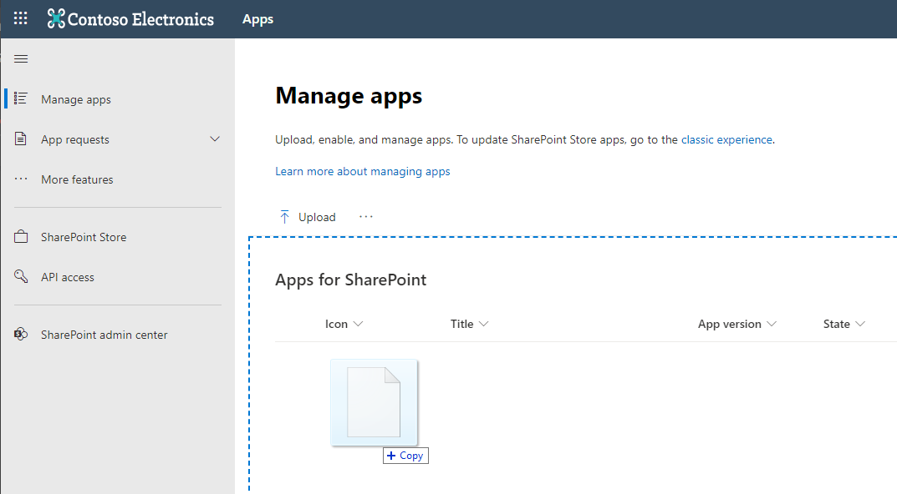
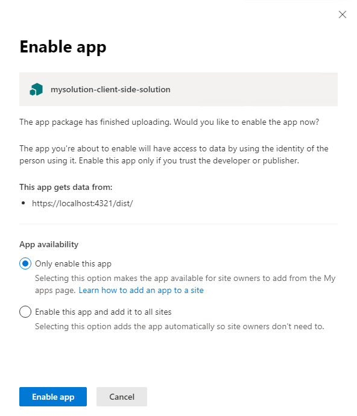
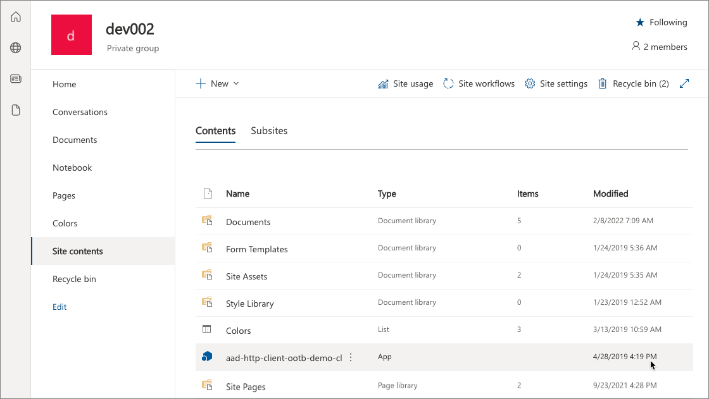
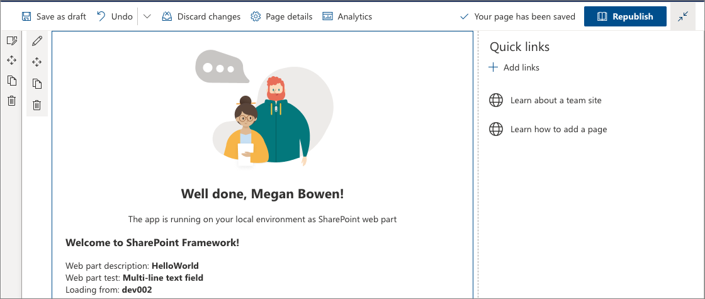
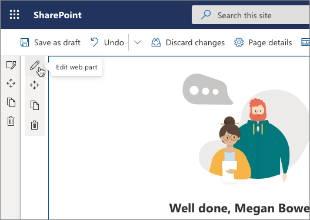

# Deploy your client-side web part to a SharePoint page (Hello World part 3)

Ensure that you've completed the procedures in the following articles before you start:

- [Build your first SharePoint client-side web part](./build-a-hello-world-web-part.md)
- [Connect your client-side web part to SharePoint](./connect-to-sharepoint.md)

You can also follow these steps by watching this video on the SharePoint PnP YouTube Channel:

> [!Video https://www.youtube.com/embed/FkFg32NSTM0]

## Package the HelloWorld web part

1. In the console window, go to the web part project directory created in [Build your first SharePoint client-side web part](./build-a-hello-world-web-part.md).

    ```console
    cd helloworld-webpart
    ```

1. If **gulp serve** is still running, stop it from running by selecting <kbd>CTRL</kbd>+<kbd>C</kbd>.

  Unlike in the Workbench, to use client-side web parts on modern SharePoint server-side pages, you need to deploy and register the web part with SharePoint. First you need to package the web part.

1. Open the **HelloWorldWebPart** web part solution in Visual Studio Code, or your preferred IDE.
1. Open **package-solution.json** from the **config** folder.

    The **package-solution.json** file defines the package metadata as shown in the following code:

    ```json
    {
    "$schema": "https://developer.microsoft.com/json-schemas/spfx-build/package-solution.schema.json",
    "solution": {
        "name": "mysolution-client-side-solution",
        "id": "ee1a495d-c7bb-499b-bd71-728aaeb79cd2",
        "version": "1.0.0.0",
        "includeClientSideAssets": true,
        "skipFeatureDeployment": true,
        "isDomainIsolated": false,
        "developer": {
        "name": "",
        "websiteUrl": "",
        "privacyUrl": "",
        "termsOfUseUrl": "",
        "mpnId": "Undefined-1.14.0"
        },
        "metadata": {
        "shortDescription": {
            "default": "mysolution description"
        },
        "longDescription": {
            "default": "mysolution description"
        },
        "screenshotPaths": [],
        "videoUrl": "",
        "categories": []
        },
        "features": [
        {
            "title": "mysolution Feature",
            "description": "The feature that activates elements of the mysolution solution.",
            "id": "d72e47b2-d5a2-479f-9f9a-85e1e7472dee",
            "version": "1.0.0.0"
        }
        ]
    },
    "paths": {
        "zippedPackage": "solution/mysolution.sppkg"
    }
    }
    ```
1. In the console window, enter the following command to bundle your client-side solution:

    ```console
    gulp bundle
    ```
1. In the console window, enter the following command to package your client-side solution that contains the web part:

    ```console
    gulp package-solution
    ```

    The command creates the following package: **./sharepoint/solution/helloworld-webpart.sppkg**.

### Package contents

The package uses SharePoint Feature to package your web part. By default, the gulp task creates a feature for your web part.

You can view the raw package contents in the **./sharepoint/solution/debug** folder.

The contents are then packaged into an **.sppkg** file. The package format is similar to a SharePoint add-ins package and uses Microsoft Open Packaging Conventions to package your solution.

The JavaScript files, CSS, and other assets are packaged in the package when the `--ship` option is used. In this tutorial, however, we'll first test deployment and capabilities by hosting JavaScript files from localhost. Automated packaging and hosting option is explained in the next tutorial.

> [!NOTE]
> Starting from the SharePoint Framework v1.4, static assets are by default packaged inside of the sppkg package. When a package is deployed in the app catalog, the assets are automatically hosted either from Office 365 CDN (if enabled) or from an app catalog URL. You can control this behavior with the `includeClientSideAssets` setting in the **package-solution.json** file.

## Deploy the HelloWorld package to app catalog

Next, you need to deploy the package that was generated to the app catalog.


> [!NOTE]
> If you do not have an app catalog, a SharePoint Online Admin can create one by following the instructions in this guide: [Use the App Catalog to make custom business apps available for your SharePoint Online environment](https://support.office.com/article/use-the-app-catalog-to-make-custom-business-apps-available-for-your-sharepoint-online-environment-0b6ab336-8b83-423f-a06b-bcc52861cba0).

1. Go to your site's app catalog.
1. If you see classic experience in the app catalog, choose to move the new experience by clicking **Try the new Manage Apps page** in the header

    

2. Upload or drag and drop the **helloworld-webpart.sppkg** to the app catalog.

    

    This deploys the client-side solution package. Because this is a full trust client-side solution, SharePoint displays a dialog and asks you to trust the client-side solution to deploy.

    

3. Select **Deploy**.

Notice that you can see if there's any exceptions or issues in the package by looking the **App Package Error Message** column in the app catalog.

## Install the client-side solution on your site

1. Go to your developer site collection or site collection that you want to use for testing
1. Select the gears icon on the top nav bar on the right, and then select **Add an app** to go to your Apps page.
1. In the **Search** box, enter **helloworld**, and select <kbd>ENTER</kbd> to filter your apps.

    

1. Select the **helloworld-webpart-client-side-solution** app to install the app on the site.

    

    The client-side solution and the web part are installed on your developer site. 


The **Site Contents** page shows you the installation status of your client-side solution. Make sure the installation is complete before going to the next step.

## Preview the web part on a SharePoint page

Now that you've deployed and installed the client-side solution, add the web part to a SharePoint page. Remember that resources such as JavaScript and CSS are available from the local computer, so rendering of the web parts will fail unless your localhost is running.

1. Open the **{{your-webpart-guid}}.manifest.json** from the **dist** folder.

    Notice that the `internalModuleBaseUrls` property in the `loaderConfig` entry still refers to your local computer:

    ```json
    "internalModuleBaseUrls": [
      "https://localhost:4321/dist/"
    ],
    ```

1. *Before* adding the web part to a SharePoint server-side page, run the local server.
1. In the console window that has the **helloworld-webpart** project directory, run the gulp task to start serving from localhost:

    ```json
    gulp serve --nobrowser
    ```

    > [!NOTE]
    > `--nobrowser` will not automatically launch the SharePoint workbench as that's not needed in this case as we will host the web part in SharePoint page.

## Add the HelloWorld web part to modern page

1. In your browser, go to your site where the solution was installed.
1. Select the gears icon in the top nav bar on the right, and then select **Add a page**.
1. Edit the page.
1. Open the web part picker and select your **HelloWorld** web part.

    > [!NOTE]
    > Screenshots are from a site which is using modern experience.

The web part assets are loaded from the local environment. To load the scripts hosted on your local computer, you need to enable the browser to load unsafe scripts. Depending on the browser, you're using, make sure you enable loading unsafe scripts for this session.

You should see the **HelloWorld** web part you built in the previous article that retrieves lists from the current site.



## Edit web part properties

1. Select the **Configure element** icon (pen) in the web part to open the property pane for the web part.

    

    This is the same property pane you built and previewed in the Workbench.

1. Edit the **Description** property, and enter **Client-side web parts are awesome!**

    

1. Notice that you still have the same behaviors such as a reactive pane where the web part is updated as you type.
1. Select the **x** icon to close the client-side property pane.
1. On the toolbar, select **Save and close** to save the page.

## Next steps

**Congratulations!** You've deployed a client-side web part to a modern SharePoint page.

You can continue building out your Hello World web part in the next topic [Hosting client-side web part from Office 365 CDN](./hosting-webpart-from-office-365-cdn.md), where you'll learn how to deploy and load the web part assets from an Office 365 CDN instead of localhost, which means that you're preparing this solution for shipping or using it in production environment.
