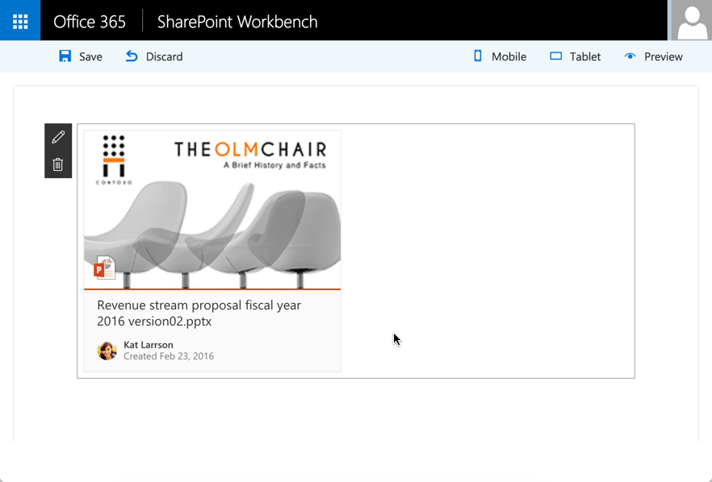

# Use Office UI Fabric React components in your SharePoint client-side web part

>**Note:** The SharePoint Framework is currently in preview and is subject to change. SharePoint Framework client-side web parts are not supported for use in production environments.

This article describes how to build a simple web part that uses the DocumentCard component of [Office UI Fabric](https://github.com/OfficeDev/office-ui-fabric-react). Office UI Fabric React is the front-end framework for building experiences for Office and Office 365. Fabric React includes a robust collection of responsive, mobile-first components that make it easy for you to create web experiences using the Office Design Language.

>**Note:** Office UI Fabric React components are in *a pre-v1 state*. For information about the v1 release and roadmap, see [Roadmap](https://github.com/OfficeDev/office-ui-fabric-react/blob/master/ghdocs/ROADMAP.md) in the Office UI Fabric React repo in GitHub. 

The following image shows a DocumentCard component created with Office UI Fabric React.




## Create a new web part project

Create a new project directory in your favorite location:

```
md documentcardexample-webpart
```
    
Got to the project directory:

```
cd documentcardexample-webpart
```

Create a new web part by running the Yeoman SharePoint generator:

```
yo @microsoft/sharepoint
```
    
When prompted:

* Accept the default **documentcardexample-webpart** as your solution name and choose **Enter**.
* Select **Use the current folder** as the location for the files.
* Use **DocumentCardExample** for your web part name and choose **Enter**.
* Accept the default **DocumentCardExample description** and choose **Enter**.
* Select **React** as the framework and choose **Enter**.

At this point, Yeoman will install the required dependencies and scaffold the solution files. This might take a few minutes. Yeoman will scaffold the project to include your DocumentCardExample web part as well.
	
When the scaffold is complete, in the console, type the following to open the web part project in Visual Studio Code:

```
code .
```
	
You now have a web part project with the React framework.

Open **DocumentCardExampleWebPart.ts** from the **src\webparts\documentCardExample** folder. 

As you can see, the `render` method creates a react element and renders it in the web part DOM.

```ts
public render(mode: DisplayMode, data?: IWebPartData): void {
	const element: React.ReactElement<IDocumentCardProps> = React.createElement(DocumentCard, {
		description: this.properties.description
	});

ReactDom.render(element, this.domElement);
}
```
	
Open **DocumentCardExample.tsx** from the **src\webparts\documentCardExample\components** folder. 
	
This is the main react component that Yeoman added to your project that renders in the web part DOM.

```ts
export default class DocumentCardExample extends React.Component<IDocumentCardProps, {}> {
public render(): JSX.Element {
	return (
		<div className={styles.documentcard}>
			<div className={styles.container}>
				<div className={css('ms-Grid-row ms-bgColor-themeDark ms-fontColor-white', styles.row)}>
					<div className='ms-Grid-col ms-u-lg10 ms-u-xl8 ms-u-xlPush2 ms-u-lgPush1'>
						<span className='ms-font-xl ms-fontColor-white'>
							Welcome to SharePoint!
						</span>
						<p className='ms-font-l ms-fontColor-white'>
							Customize SharePoint experiences using Web Parts.
						</p>
						<p className='ms-font-l ms-fontColor-white'>
							{this.props.description}
						</p>
						<a
							className={css('ms-Button', styles.button)}
							href='https://github.com/SharePoint/sp-dev-docs/wiki'
						>
							<span className='ms-Button-label'>Learn more</span>
						</a>
					</div>
				</div>
			</div>
		</div>
		);
	}
}
```

## Add an Office UI Fabric component

To use Office UI Fabric components, you need to install the npm package.

In the console window, type the following to install the Office UI Fabric component npm package:

```
npm i office-ui-fabric-react --save
```

>**Note:** If you're using Windows, you might get the following exception during this installation: "Error: EPERM: operation not permitted,...". To solve the issue, reopen your console application as an administrator. Open the context menu (right-click) and choose **Run as administrator**. 

## Add the DocumentCard component

After you install the Office UI Fabric React components, you can add the component to your web part. 

Open **DocumentCardExample.tsx** from the **src\webparts\components\documentCardExample** folder. 

Add the following `import` statement to to the top of the file to import fabric react components that we want to use.

```ts
import {
	DocumentCard,
	DocumentCardPreview,
	DocumentCardTitle,
	DocumentCardActivity,
	IDocumentCardPreviewProps
} from 'office-ui-fabric-react/lib/DocumentCard';
```

Delete the current `render` method and add the following updated `render` method:

```ts
public render() {
	let previewProps: IDocumentCardPreviewProps = {
	previewImages: [
		{
		previewImageSrc: require('document-preview.png'),
		iconSrc: require('icon-ppt.png'),
		width: 318,
		height: 196,
		accentColor: '#ce4b1f'
		}
	],
	};

	return (
		<DocumentCard onClickHref='http://bing.com'>
		<DocumentCardPreview { ...previewProps } />
		<DocumentCardTitle title='Revenue stream proposal fiscal year 2016 version02.pptx'/>
		<DocumentCardActivity
			activity='Created Feb 23, 2016'
			people={
			[
				{ name: 'Kat Larrson', profileImageSrc: require('avatar-kat.png') }
			]
			}
		/>
		</DocumentCard>
	);
}
```

Save the file.

In this code, the DocumentCard component includes some extra sections:

* DocumentCardPreview
* DocumentCardTitle
* DocumentCardActivity

The `previewProps` property includes some properties of the DocumentCardPreview.

Notice the use of relative path with a `require` statement to load images. Currently, you need to use the webpack public path plugin and input the file's relative path from your source file or folder to the `lib` folder. This should be the same as your current working source location.
	
Open **DocumentCardExampleWebPart.ts** from the **src\webparts\documentCardExample** folder. 
	
Add the following code at the top of the file to require the webpack public path plugin.
	
```ts
require('set-webpack-public-path!');
```
	
Save the file.

## Copy the image assets

Copy the following images to your **src\webparts\documentCardExample** folder:

* [avatar-kat.png](https://github.com/SharePoint/sp-dev-docs/blob/master/assets/avatar-kat.png)
* [icon-ppt.png](https://github.com/SharePoint/sp-dev-docs/tree/master/assets/icon-ppt.png)
* [document-preview.png](https://github.com/SharePoint/sp-dev-docs/tree/master/assets/document-preview.png)

## Preview the web part in workbench

In the console, type the following to preview your web part in workbench:
	
```
gulp serve
```
	
In the toolbox, select your `DocumentCardExample` web part to add:
	


