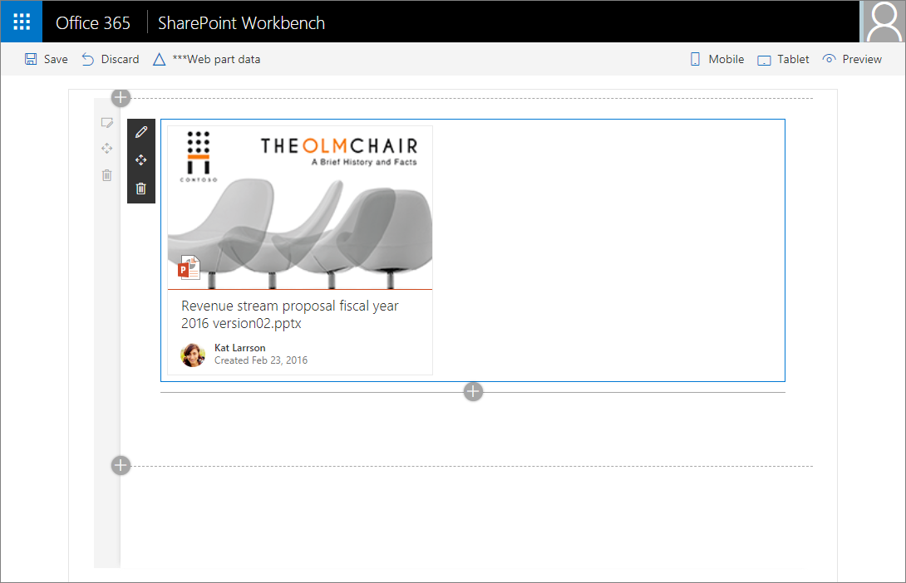

# Use Office UI Fabric React components in your SharePoint client-side web part

> **Important:** You must upgrade existing projects to use @microsoft/sp-build-web@1.0.1 or later to use Office UI Fabric React. Easiest way to achieve this is to ensure that you have latest package by running `npm install -g @microsoft/generator-sharepoint` in your console before completing this tutorial. 

This article describes how to build a simple web part that uses the DocumentCard component of [Office UI Fabric React](https://github.com/OfficeDev/office-ui-fabric-react). Office UI Fabric React is the front-end framework for building experiences for Office and Office 365. Fabric React includes a robust collection of responsive, mobile-first components that make it easy for you to create web experiences using the Office Design Language.

The following image shows a DocumentCard component created with Office UI Fabric React.



You can also follow these steps by watching the video on the [SharePoint PnP YouTube Channel](https://www.youtube.com/watch?v=1N6kNvLxyg4&list=PLR9nK3mnD-OXvSWvS2zglCzz4iplhVrKq). 

<a href="https://www.youtube.com/watch?v=1N6kNvLxyg4&list=PLR9nK3mnD-OXvSWvS2zglCzz4iplhVrKq">

</a>


## Creating a new Web Part project

Make sure you're using the latest version of . Run `yo` and follow the prompts to create a skeleton project,.

Create a new project directory in your favorite location:

```
md documentcardexample-webpart
```
    
Go to the project directory:

```
cd documentcardexample-webpart
```

Make sure you have the latest version of `@microsoft/generator-sharepoint` installed and create a new web part by running the Yeoman SharePoint generator:

```
yo @microsoft/sharepoint
```
    
When prompted:

* Accept the default **documentcardexample-webpart** as your solution name and choose **Enter**.
* Choose **SharePoint Online only (latest)**, and press **Enter**.
* Select **Use the current folder** for where to place the files.
* Choose **N** to require the extension to be installed on each site explicitly when it's being used. 
* Choose **WebPart** as the client-side component type to be created. 

The next set of prompts will ask for specific information about your web part:

* Use **DocumentCardExample** for your web part name and choose **Enter**.
* Accept the default **DocumentCardExample description** and choose **Enter**.
* Select **React** as the framework and choose **Enter**.

At this point, Yeoman will install the required dependencies and scaffold the solution files. This might take a few minutes. Yeoman will scaffold the project to include your DocumentCardExample web part as well.
	
When the scaffold is complete, in the console, type the following to open the web part project in Visual Studio Code:

```
code .
```
	
You now have a web part project with the React framework.

Open **DocumentCardExampleWebPart.ts** from the **src\webparts\documentCardExample** folder. 

As you can see, the `render` method creates a react element and renders it in the web part DOM.

```ts
  public render(): void {
    const element: React.ReactElement<IDocumentCardExampleProps > = React.createElement(
      DocumentCardExample,
      {
        description: this.properties.description
      }
    );
```
	
Open **DocumentCardExample.tsx** from the **src\webparts\documentCardExample\components** folder. 
	
This is the main react component that Yeoman added to your project that renders in the web part DOM.

```ts
export default class DocumentCardExample extends React.Component<IDocumentCardExampleProps, void> {
  public render(): React.ReactElement<IDocumentCardExampleProps> {
    return (
      <div className={styles.helloWorld}>
        <div className={styles.container}>
          <div className={`ms-Grid-row ms-bgColor-themeDark ms-fontColor-white ${styles.row}`}>
            <div className="ms-Grid-col ms-u-lg10 ms-u-xl8 ms-u-xlPush2 ms-u-lgPush1">
              <span className="ms-font-xl ms-fontColor-white">Welcome to SharePoint!</span>
              <p className="ms-font-l ms-fontColor-white">Customize SharePoint experiences using Web Parts.</p>
              <p className="ms-font-l ms-fontColor-white">{escape(this.props.description)}</p>
              <a href="https://aka.ms/spfx" className={styles.button}>
                <span className={styles.label}>Learn more</span>
              </a>
            </div>
          </div>
        </div>
      </div>
    );
  }
}
```

### Add an Office UI Fabric component

The *new modern experiences* in SharePoint use Office UI Fabric and Office UI Fabric React as the default front-end framework for building the new experiences. As a result, SharePoint Framework ships with a default version of Office UI Fabric and Fabric React which matches the version available in SharePoint. This ensures the web part you are building uses the right version of the Fabric styles and components when deployed to SharePoint. 

Since we chose React as our framework when creating the solution, the generator installed the right version of Office UI Fabric React as well. You can directly import the Fabric components in your react components without any additional work. 

>**Note:** With the initial release of the SharePoint Framework, it is recommended to use the Office UI Fabric and Fabric React that ships with the generator. It is not recommended to update the Office UI Fabric and Fabric React packages independently as it might conflict with the already available version in SharePoint and as a result your web part may fail to function as expected.

Open **DocumentCardExample.tsx** from the **src\webparts\documentCardExample\components** folder. 

Add the following `import` statement to to the top of the file to import fabric react components that we want to use.

```ts
import {
	DocumentCard,
	DocumentCardPreview,
	DocumentCardTitle,
	DocumentCardActivity,
	IDocumentCardPreviewProps
} from 'office-ui-fabric-react/lib/DocumentCard';
```

Delete the current `render` method and add the following updated `render` method:

```ts
  public render(): JSX.Element {
    const previewProps: IDocumentCardPreviewProps = {
      previewImages: [
        {
          previewImageSrc: String(require('./document-preview.png')),
          iconSrc: String(require('./icon-ppt.png')),
          width: 318,
          height: 196,
          accentColor: '#ce4b1f'
        }
      ],
    };

    return (
      <DocumentCard onClickHref='http://bing.com'>
        <DocumentCardPreview { ...previewProps } />
        <DocumentCardTitle title='Revenue stream proposal fiscal year 2016 version02.pptx' />
        <DocumentCardActivity
          activity='Created Feb 23, 2016'
          people={
            [
              { name: 'Kat Larrson', profileImageSrc: String(require('./avatar-kat.png')) }
            ]
          }
        />
      </DocumentCard>
    );
  }
```
Save the file.

In this code, the DocumentCard component includes some extra sections:

* DocumentCardPreview
* DocumentCardTitle
* DocumentCardActivity

The `previewProps` property includes some properties of the DocumentCardPreview.

Notice the use of relative path with a `require` statement to load images. Currently, you need to perform small configuration in the gulpfile.js to enable these images to get processed properly by webpack.
	
Open **gulpfile.js** from the **root** folder. 
	
Add the following code just above the `build.initialize(gulp);` code line.
	
```js
build.configureWebpack.mergeConfig({  
    additionalConfiguration: (generatedConfiguration) => {
        if (build.getConfig().production) {
            var basePath = build.writeManifests.taskConfig.cdnBasePath;
            if (!basePath.endsWith('/')) {
                basePath += '/';
            }
            generatedConfiguration.output.publicPath = basePath;
        }
        else {
            generatedConfiguration.output.publicPath = "/dist/";
        }
        return generatedConfiguration;
    }
});
```
	
Save the file.

Your full **gulpfile.js** file should look as follows.

```js
'use strict';

const gulp = require('gulp');
const build = require('@microsoft/sp-build-web');

build.configureWebpack.mergeConfig({  
    additionalConfiguration: (generatedConfiguration) => {
        if (build.getConfig().production) {
            var basePath = build.writeManifests.taskConfig.cdnBasePath;
            if (!basePath.endsWith('/')) {
                basePath += '/';
            }
            generatedConfiguration.output.publicPath = basePath;
        }
        else {
            generatedConfiguration.output.publicPath = "/dist/";
        }
        return generatedConfiguration;
    }
});

build.initialize(gulp);

```

### Copy the image assets

Copy the following images to your **src\webparts\documentCardExample\components** folder:

* [avatar-kat.png](https://github.com/SharePoint/sp-dev-docs/blob/master/assets/avatar-kat.png)
* [icon-ppt.png](https://github.com/SharePoint/sp-dev-docs/tree/master/assets/icon-ppt.png)
* [document-preview.png](https://github.com/SharePoint/sp-dev-docs/tree/master/assets/document-preview.png)

### Preview the web part in workbench

In the console, type the following to preview your web part in workbench:
	
```
gulp serve
```
	
In the toolbox, select your `DocumentCardExample` web part to add:
	

