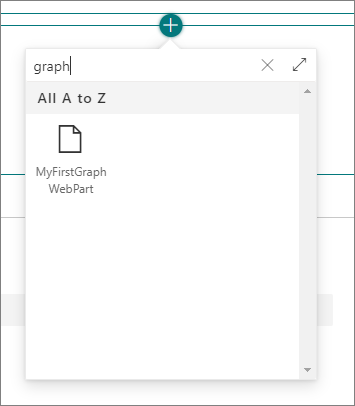
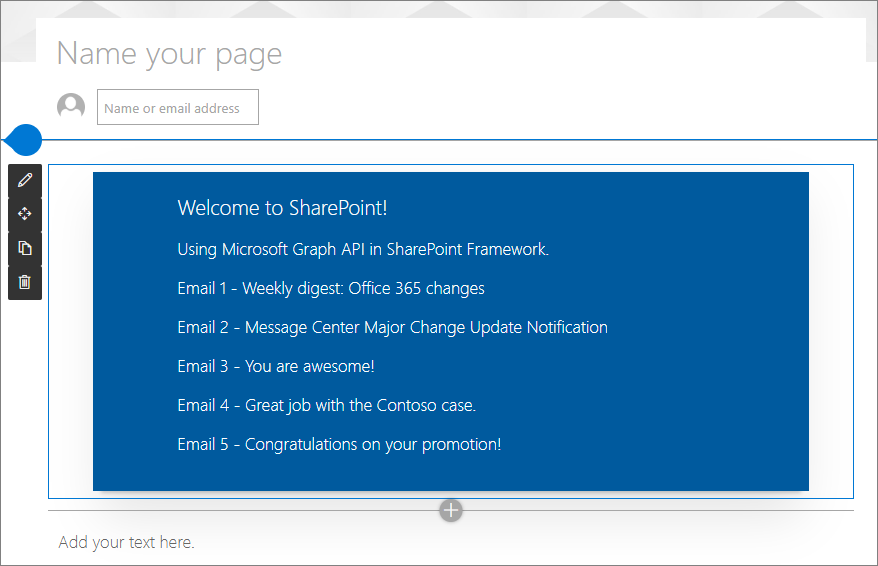

# Use Microsoft Graph in your solution

Microsoft Graph provides a unified programmability model that you can use to build apps for organizations and consumers that interact with the data of millions of users. You can easily access Microsoft Graph also from SharePoint Framework solutions.

Before you start, complete the procedures in the following articles to ensure that you understand the basic flow of creating a custom client-side web part:

- [Build your first web part](build-a-hello-world-web-part.md)
- [Connect your web part to SharePoint](connect-to-sharepoint.md)
- [Deploy your client-side web part to a SharePoint page](provision-sp-assets-from-package.md)


You can also follow these steps by watching this video on the Microsoft 365 Platform Communtiy (PnP) YouTube Channel:

> [!Video https://www.youtube.com/embed/tHzbh5JoC-A]

## Create a SharePoint Framework project for Microsoft Graph usage

1. Create a new project directory in your favorite location:

    ```console
    md graph-apis
    ```

1. Go to the project directory:

    ```console
    cd graph-apis
    ```

1. Create a new project by running the Yeoman SharePoint Generator from within the new directory you created:

    ```console
    yo @microsoft/sharepoint
    ```

    The Yeoman SharePoint Generator will prompt you with a series of questions. For all questions, accept the default options except for the following questions:

    - **Do you want to allow the tenant admin the choice of being able to deploy the solution to all sites immediately without running any feature deployment or adding apps in sites?**: Yes
    - **Which type of client-side component to create?**: WebPart
    - **Which framework would you like to use?**: No JavaScript framework

    At this point, Yeoman installs the required dependencies and scaffolds the solution files. Creation of the solution might take a few minutes. Yeoman scaffolds the project to include your **MyFirstGraphWebPart** web part as well.

1. Next, enter the following to open the web part project in Visual Studio Code:

    ```console
    code .
    ```

## Including Microsoft Graph types for easier TypeScript development

1. In the console, enter the following to install Microsoft Graph type declarations to improve development experience

    ```console
    npm install @microsoft/microsoft-graph-types
    ```

## Updating solution manifest with the needed Microsoft Graph permissions requests

By using SharePoint Framework, you don't need to explicitly create Azure Active Directory applications to manage your permissions for your solutions. Instead, you can request the needed permissions in your solution package, and Microsoft 365 tenant administrator can then grant the requested permissions in general for all solutions or for this specific solution (isolated solution).

> [!NOTE]
> Tenant administrators can also manage the API permissions using PowerShell cmdlets, so there's no  requirement to have the permissions included in the solution package.

In this case, we'll include the solution-specific permissions in the package.

1. Open **./config/package-solution.json** file.
1. Update the solution section to include permission grant request as shown in the following code section by using `webApiPermissionRequests` element. In this case, we'll access user's emails, so we have requested permissions for the `Mail.Read` scope.

    ```json
    {
      "$schema": "https://developer.microsoft.com/json-schemas/spfx-build/package-solution.schema.json",
      "solution": {
        //...

        "webApiPermissionRequests": [
          {
            "resource": "Microsoft Graph",
            "scope": "Mail.Read"
          }
        ]

        //...
      }
    }
    ```

## Update code to call Microsoft Graph

In this case, we'll modify the code to use Microsoft Graph to get access on the current user's last five emails.

1. Open **./src/webparts/helloWorld/MyFirstGraphWebPartWebPart.ts**.
1. Add the following `import` statements after the existing `import` statements at the top fo the file:

    ```typescript
    import { MSGraphClient } from '@microsoft/sp-http';
    import * as MicrosoftGraph from '@microsoft/microsoft-graph-types';
    ```

1. Update the `render()` method as follows. Notice how we're using the `MSGraphClient` object for the Microsoft Graph calls. This object abstracts the access token handling, so that as a developer, you can concentrate on your business logic.

    ```typescript
    public render(): void {
      this.context.msGraphClientFactory
      .getClient('3')
      .then((client: MSGraphClient): void => {
        // get information about the current user from the Microsoft Graph
        client
        .api('/me/messages')
        .top(5)
        .orderby("receivedDateTime desc")
        .get((error, messages: any, rawResponse?: any) => {

          this.domElement.innerHTML = `
          <div class="${ styles.myFirstGraphWebPart}">
          <div class="${ styles.container}">
            <div class="${ styles.row}">
              <div class="${ styles.column}">
                <span class="${ styles.title}">Welcome to SharePoint!</span>
                <p class="${ styles.subTitle}">Use Microsoft Graph in SharePoint Framework.</p>
                <div id="spListContainer" />
              </div>
            </div>
          </div>
          </div>`;

          // List the latest emails based on what we got from the Graph
          this._renderEmailList(messages.value);

        });
      });
    }
    ```

1. Include also following helper function to render the email content immediately after the existing `render()` method. Notice how we're using the `MicrosoftGraph.Message` types to give us better development experience as accessing the API response data.

    ```typescript
    private _renderEmailList(messages: MicrosoftGraph.Message[]): void {
      let html: string = '';
      for (let index = 0; index < messages.length; index++) {
        html += `<p class="${styles.description}">Email ${index + 1} - ${escape(messages[index].subject)}</p>`;
      }

      // Add the emails to the placeholder
      const listContainer: Element = this.domElement.querySelector('#spListContainer');
      listContainer.innerHTML = html;
    }
    ```

## Package and deploying your web part to SharePoint

1. Execute the following commands to build bundle your solution. This executes a release build of your project by using a dynamic label as the host URL for your assets.

    ```console
    gulp bundle --ship
    ```

1. Execute the following task to package your solution. This creates an updated **graph-apis.sppkg** package on the **sharepoint/solution** folder.

    ```console
    gulp package-solution --ship
    ```

Next, you need to deploy the package that was generated to the tenant App Catalog.

> [!NOTE]
> If you don't have an app catalog, a SharePoint Online Admin can create one by following the instructions in this guide: [Use the App Catalog to make custom business apps available for your SharePoint Online environment](https://support.office.com/article/use-the-app-catalog-to-make-custom-business-apps-available-for-your-sharepoint-online-environment-0b6ab336-8b83-423f-a06b-bcc52861cba0).

1. Go to your tenant's SharePoint App Catalog.
1. Upload or drag and drop the **graph-apis.sppkg** into the App Catalog.

    

    This deploys the client-side solution package. Because this is a full trust client-side solution, SharePoint displays a dialog and asks you to trust the client-side solution to deploy.

    Notice how the **domain** list in the prompt says **SharePoint Online**. This is because the content is either served from the Office 365 CDN or from the App Catalog, depending on the tenant settings.

    Ensure that the **Make this solution available to all sites in the organization** option is selected, so that the web part can be used easily across the tenant.

    Notice the request to go to **API Management Page to approved pending permissions** and the list of required permissions, in this case being `Mail.Read` for Microsoft Graph.

    

1. Select **Deploy**.

    Notice that you can see if there's any exceptions or issues in the package by looking the **App Package Error Message** column in the App Catalog.

Now the web part is deployed and is automatically available cross the SharePoint Online sites, it's however important to realize that the web part *won't* work properly until the requested permissions have been approved.

## Approve the requested Microsoft Graph permissions

1. Move to the SharePoint tenant administrative UIs located at **https://{{tenant}}-admin.sharepoint.com**.
1. Move to **Advanced > API management** in the left menu option to see the currently pending permission requests. Notice that the request for **Mail.Read** permission for Microsoft Graph is pending for approval.

    

1. Select the pending permission row and choose **Approve or reject** from the toolbar

    

1. Review the requested permission in the left panel and choose **Approve**

    

> [!IMPORTANT]
> The account used for granting the requested permissions will need to be a tenant administrator. The SharePoint administrator permission isn't sufficient as the operation is actually performed on the tenant's associated Azure Active Directory tenant.

At this point, the requested permissions needed for the web part have been approved and we can test the functionality.

## Use web part in SharePoint

1. Go to a site where you want to test the web part. We did deploy web part using the tenant scoped deployment option, so it will be available on any site.
1. Create a new modern page to the site or edit existing page.
1. Use search term **Graph** in the web part picker to find your web part:

    

1. Choose **MyFirstGraphWebPart** from the list and notice how the web part renders the latest five emails from the current user using information from the Microsoft Graph API

    

## See also

- [Use the MSGraphClient to connect to Microsoft Graph](/sharepoint/dev/spfx/use-msgraph)
- [Consume the Microsoft Graph in the SharePoint Framework](/sharepoint/dev/spfx/use-aad-tutorial)
- [Graph Explorer](https://developer.microsoft.com/graph/graph-explorer)
- [Get started with Microsoft Graph and JavaScript](https://developer.microsoft.com/graph/get-started/javascript)
