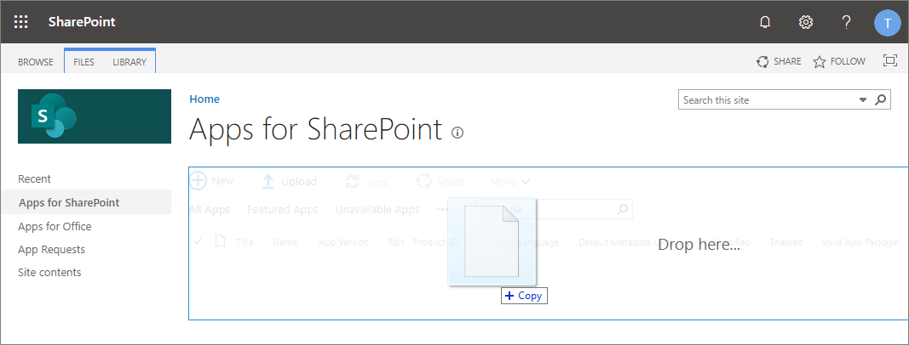

# Building Microsoft Teams tab using SharePoint Framework - Tutorial

Starting with the SharePoint Framework v1.8, you can also implement your Microsoft Teams tabs using SharePoint Framework. This significantly simplifies Teams tab development process as SharePoint Framework web parts are automatically hosted within SharePoint without any need for external services.

Before you start, complete the procedures in the following articles to ensure that you understand the basic flow of creating a custom client-side web part:

* [Build your first web part](build-a-hello-world-web-part.md)
* [Connect your web part to SharePoint](connect-to-sharepoint.md)
* [Deploy your client-side web part to a SharePoint page](provision-sp-assets-from-package.md)

> [!IMPORTANT]
> This lab requires that you are using at least version 1.8 of the SharePoint Framework as these capabilities are not available in earlier versions.  Currently, the Teams mobile clients do not support 3rd party tabs.  When this support is delivered, the tabs you create will appear automatically.

## Create a new web part project

1. Create a new project directory in your favorite location:

    ```shell
    md teams-tab-webpart
    ```

1. Go to the project directory:

    ```shell
    cd teams-tab-webpart
    ```

1. Create a new client-side web part solution by running the Yeoman SharePoint Generator:

    ```shell
    yo @microsoft/sharepoint
    ```

1. When prompted:

    * Accept the default **teams-tab-webpart** as your solution name, and then select Enter.
    * Select **SharePoint Online only (latest)**, and then select Enter.
    * Select **Use the current folder** as the location for the files.
    * Select **y** to ensure that your web part is automatically deployed tenant wide when it's added to the tenant app catalog.
    * Select **N** on the question if solution contains unique permissions.  
    * Select **WebPart** as the client-side component type to be created.

1. The next set of prompts ask for specific information about your web part:

    * Enter **MyFirstTeamsTab** for the web part name, and then select Enter.
    * Enter **My first Teams tab** as the description of the web part, and then select Enter. 
    * Accept the default **No JavaScipt web framework** option for the framework, and then select Enter to continue.

    

    At this point, Yeoman installs the required dependencies and scaffolds the solution files. This might take a few minutes. Yeoman scaffolds the project to include your **MyFirstTeamsTab** web part as well.

1. Next, enter the following to open the web part project in Visual Studio Code:

    ```shell
    code .
    ```

Starting with the SharePoint Framework v1.8, scaffolding will also include additional **./teams** folder in the solution structure, with default configuration for your web parts, so that you can get started with Teams tab development as easily as possible.

  

Teams folder contains the following two files:

  * **[componentId]_color.png** - Default small picture for a tab
  * **[componentId]_outline.png** - Default large picture for a tab

These images will be used as icons in Microsoft Teams.

## Updating the web part manifest to make it available for Microsoft Teams

Locate the manifest json file for the web part you want to make available to Teams and modify the `supportedHosts` properties to include `"TeamsTab"` as in the following example.

```json
{
  "$schema": "https://developer.microsoft.com/json-schemas/spfx/client-side-web-part-manifest.schema.json",
  "id": "8eb36405-e408-4578-8340-faf16d647d83",
  "alias": "MyFirstTeamsTab",
  "componentType": "WebPart",

  // The "*" signifies that the version should be taken from the package.json
  "version": "*",
  "manifestVersion": 2,

  // If true, the component can only be installed on sites where Custom Script is allowed.
  // Components that allow authors to embed arbitrary script code should set this to true.
  // https://support.office.com/en-us/article/Turn-scripting-capabilities-on-or-off-1f2c515f-5d7e-448a-9fd7-835da935584f
  "requiresCustomScript": false,
  "supportedHosts": ["SharePointWebPart", "TeamsTab"],

  "preconfiguredEntries": [{
    "groupId": "5c03119e-3074-46fd-976b-c60198311f70", // Other
    "group": { "default": "Other" },
    "title": { "default": "MyFirstTeamsTab" },
    "description": { "default": "MyFirstTeamsTab description" },
    "officeFabricIconFontName": "Page",
    "properties": {
      "description": "MyFirstTeamsTab"
    }
  }]
}
```

## Updating code to be aware of the Microsoft Teams context

1. Open **src\webparts\helloWorld\HelloWorldWebPart.ts** for the needed edits on making our solution aware of the Microsoft Teams context, if it's used as a tab.
1. Add the following import statement at the top of your file:

    ```typescript
    import * as microsoftTeams from '@microsoft/teams-js';
    ```

1. Add the following private variable inside the **MyFirstTeamsTabWebPart** class. We will be storing information around the Microsoft Teams context in this variable.

    ```typescript
    export default class MyFirstTeamsTabWebPart extends BaseClientSideWebPart<IMyFirstTeamsTabWebPartProps> {

    // This variable has been added
    private _teamsContext: microsoftTeams.Context;
    ```

1. Add new `onInit` method inside of the **MyFirstTeamsTabWebPart** class, just below the private variable, which we just added with following content.

    ```typescript
    protected onInit(): Promise<any> {
      let retVal: Promise<any> = Promise.resolve();
      if (this.context.microsoftTeams) {
        retVal = new Promise((resolve, reject) => {
          this.context.microsoftTeams.getContext(context => {
            this._teamsContext = context;
            resolve();
          });
        });
      }
      return retVal;
    }
    ```

1. Update the **render** method as follows. Notice how we are rendering different content dependent if the code is rendered as a tab in Microsoft Team or as a web part in SharePoint.

    ```typescript
    public render(): void {

      let title: string = '';
      let subTitle: string = '';
      let siteTabTitle: string = '';

      if (this._teamsContext) {
        // We have teams context for the web part
        title = "Welcome to Teams!";
        subTitle = "Building custom enterprise tabs for your business.";
        siteTabTitle = "We are in the context of following Team: " + this._teamsContext.teamName;
      }
      else
      {
        // We are rendered in normal SharePoint context
        title = "Welcome to SharePoint!";
        subTitle = "Customize SharePoint experiences using Web Parts.";
        siteTabTitle = "We are in the context of following site: " + this.context.pageContext.web.title;
      }

      this.domElement.innerHTML = `
        <div class="${ styles.myFirstTeamsTab }">
          <div class="${ styles.container }">
            <div class="${ styles.row }">
              <div class="${ styles.column }">
                <span class="${ styles.title }">${title}</span>
                <p class="${ styles.subTitle }">${subTitle}</p>
                <p class="${ styles.description }">${siteTabTitle}</p>
                <p class="${ styles.description }">Description property value - ${escape(this.properties.description)}</p>
                <a href="https://aka.ms/spfx" class="${ styles.button }">
                  <span class="${ styles.label }">Learn more</span>
                </a>
              </div>
            </div>
          </div>
        </div>`;
    }
    ```

    > [!NOTE]
    > You can find full description of the information available through Microsoft Teams context for Microsoft Teams tabs from the [Microsoft Teams developer documentation](https://docs.microsoft.com/en-us/microsoftteams/platform/concepts/tabs/tabs-context).

## Packaging and deploying your web part to SharePoint

Ensure that your console is activated in the root folder of the solution, which was just created.

1. Execute the following commands to build bundle your solution. This executes a release build of your project by using a dynamic label as the host URL for your assets. This URL is automatically updated based on your tenant CDN settings.

    ```shell
    gulp build
    gulp bundle --ship
    ```

1. Execute the following task to package your solution. This creates an updated **teams-tab-webpart.sppkg** package on the **sharepoint/solution** folder.

    ```shell
    gulp package-solution --ship
    ```

Next, you need to deploy the package that was generated to the tenant app catalog.

> [!NOTE]
> If you do not have an app catalog, a SharePoint Online Admin can create one by following the instructions in this guide: [Use the App Catalog to make custom business apps available for your SharePoint Online environment](https://support.office.com/en-us/article/use-the-app-catalog-to-make-custom-business-apps-available-for-your-sharepoint-online-environment-0b6ab336-8b83-423f-a06b-bcc52861cba0).

1. Go to your site's app catalog.

1. Upload or drag and drop the **teams-tab-webpart.sppkg** to the app catalog.

    

    This deploys the client-side solution package. Because this is a full trust client-side solution, SharePoint displays a dialog and asks you to trust the client-side solution to deploy.

    Notice how the **domain** list in the prompt says *SharePoint Online*. This is because the content is either served from the Office 365 CDN or from the app catalog, depending on the tenant settings.

    Ensure that the **Make this solution available to all sites in the organization** option is selected, so that the web part can be used from the Microsoft Teams side.

     

1. Select **Deploy**.

    Notice that you can see if there's any exceptions or issues in the package by looking the **App Package Error Message** column in the app catalog.

Now the web part is deployed and is automatically available cross the SharePoint Online sites.

> [!NOTE]
> In this tutorial case, we are using tenant wide deployment option of the SharePoint Framework solution. This will ensure that the development and usage experience is as easy as possible. You could also deploy the solution as site scope, but in that case you'd need to ensure that the solution is deployed on the SharePoint site behind of the Microsoft Teams, before you can use it.

## Making the web part available in Microsoft Teams

In order to make your web part available in Microsoft Teams you will have synchronize your solution with teams. 

1. Create a Microsoft Teams app manifest file by following the instructions detailed here: [Create Microsoft Teams manifest manually for a web part and deploy it to Microsoft Teams](../guidance/creating-team-manifest-manually-for-webpart.md).
1. Create a Microsoft Teams app package by zipping the contents of the **./teams** folder. Make sure to zip just the contents and not the folder itself. This ZIP archive should contain 3 files at the root: two images & the **manifest.json**.
1. Move to a channel in a team. In the below picture we have activated **General** channel in **Team**

    

1. Select `+` to add a new tab on the channel
1. In the **Add a tab** dialog, scroll to the bottom of the list and select **More Apps**
1. Select the **Upload a custom app** > **Upload for ...** from the list of app categories:
1. Select the Microsoft Teams application ZIP file previously created. This is the file that contains the **manifest.json** and two image files.

    After a moment, the application will appear next to your tenant name.

    > You may need to refresh the page for the app to appear if you are using the browser Microsoft Teams client.

1. Select your custom tab called **MyFirstTeamTab** in the list

    

Your custom tab has been added on the Microsoft Teams channel and you can see how the code is reacting that it's in Microsoft Teams context. Theme of the web part is by default coming from the underlying SharePoint site.


## See also

* [The Microsoft Teams developer platform](https://docs.microsoft.com/en-us/microsoftteams/platform/overview)
