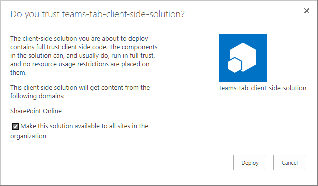

# Building Microsoft Teams tab using SharePoint Framework - Tutorial

Starting with the SharePoint Framework v1.7, you can also implement your Microsoft Teams tabs using SharePoint Framework. This significantly simplifies  Teams tab development process as  SharePoint Framework web parts are automatically hosted within SharePoint without any need for external services.

> [!IMPORTANT]
> This feature is currently in preview and is subject to change. It is not currently supported for use in production environments. Your feedback and input around this capability is welcome using the [SharePoint Dev Docs issue list](https://github.com/SharePoint/sp-dev-docs/issues).

Before you start, complete the procedures in the following articles to ensure that you understand the basic flow of creating a custom client-side web part:

* [Build your first web part](build-a-hello-world-web-part.md)
* [Connect your web part to SharePoint](connect-to-sharepoint.md)
* [Deploy your client-side web part to a SharePoint page](provision-sp-assets-from-package.md)

> [!IMPORTANT]
> This lab requires that you are using plusbeta version of the SharePoint Framework 1.7 as the capabilities are not yet ready for production usage. You can install latest SharePoint Framwork version to your development machine by using following command: `npm install -g @microsoft/generator-sharepoint`. Capability is ONLY available in targeted release tenants.

You can also follow these steps by watching this video on the SharePoint PnP YouTube Channel:

<br/>

> [!Video https://www.youtube.com/embed/4kSRmetB4vA]

<br/>

## Create a new web part project

1. Create a new project directory in your favorite location:

  ```
  md teams-tab-webpart
  ```

2. Go to the project directory:

  ```
  cd teams-tab-webpart
  ```
    
3. Create a new client-side web part solution by running the Yeoman SharePoint Generator. Notice that we are using the `plusbeta` switch as the capability in still in **preview**:

  ```
  yo @microsoft/sharepoint --plusbeta
  ```

4. When prompted:

  * Accept the default **teams-tab-webpart** as your solution name, and then select Enter.
  * Select **SharePoint Online only (latest)**, and then select Enter.
  * Select **Use the current folder** as the location for the files.
  * Select **y** to ensure that your web part is automatically deployed tenant wide when it's added to the tenant app catalog.
  * Select **N** on the question if solution contains unique permissions.  
  * Select **WebPart** as the client-side component type to be created.

5. The next set of prompts ask for specific information about your web part:

  * Enter **MyFirstTeamsTab** for the web part name, and then select Enter.
  * Enter **My first Teams tab** as the description of the web part, and then select Enter. 
  * Accept the default **No JavaScipt web framework** option for the framework, and then select Enter to continue.

  

  At this point, Yeoman installs the required dependencies and scaffolds the solution files. This might take a few minutes. Yeoman scaffolds the project to include your **MyFirstTeamsTab** web part as well.

6. Next, enter the following to open the web part project in Visual Studio Code:

    ```
    code .
    ```
Starting with the SharePoint Framework v1.7, scaffolding will also include additional **Teams** folder in the solution structure, with default configuration for your web parts, so that you can get started with Teams tab development as easily as possible.

  

Teams folder contains following three files:

- **manifest.json** - Manifest file for the Teams applications
- **tab20x20.png** - Default small picture for a tab
- **tab96x96.png** - Default large picture for a tab

**manifest.json** file was automatically updated with the entries which you provided in the Yeoman questions. Let's open this file and see most important elements in it for exposing the web part in the Teams.

- `"packageName"`- Scaffolding updated this value based on the web part title you provided.
- `"icons"`- This is a section which you would update for your custom images.
- `"configurationUrl"` - This is the URL automatically updated to match unique web part ID of the web part, which you just created.

> [!NOTE]
> You find more detailed description of the Microsoft Teams manifest file options and content from the [Microsoft Teams developer documentation](https://docs.microsoft.com/en-us/microsoftteams/platform/resources/schema/manifest-schema).

## Updating code to be aware of the Microsoft Teams context

1. Open **src\webparts\helloWorld\HelloWorldWebPart.ts** for the needed edits on making our solution aware of the Microsoft Teams context, if it's used as a tab.

1. Add the following private variable inside the **MyFirstTeamsTabWebPart** class. We will be storing information around the Microsoft Teams context in this variable.

    ```typescript
      export default class MyFirstTeamsTabWebPart extends BaseClientSideWebPart<IMyFirstTeamsTabWebPartProps> {

      // This variable has been added
      private _teamsContext: microsoftTeams.Context;
    ```

1. Add new `onInit` method inside of the **MyFirstTeamsTabWebPart** class, just below the private variable, which we just added with following content.

    ```typescript
      protected onInit(): Promise<any> {
        let retVal: Promise<any> = Promise.resolve();
        if (this.context.microsoftTeams) {
          retVal = new Promise((resolve, reject) => {
            this.context.microsoftTeams.getContext(context => {
              this._teamsContext = context;
              resolve();
            });
          });
        }
        return retVal;
      }
    ```

1. Update the **render** method as follows. Notice how we are rendering different content dependent if the code is rendered as a tab in Microsoft Team or as a web part in SharePoint.

    ```typescript
    public render(): void {

      let title: string = '';
      let subTitle: string = '';
      let siteTabTitle: string = '';

      if (this._teamsContext) {
        // We have teams context for the web part
        title = "Welcome to Teams!";
        subTitle = "Building custom enterprise tabs for your business.";
        siteTabTitle = "We are in the context of following Team: " + this._teamsContext.teamName;
      }
      else
      {
        // We are rendered in normal SharePoint context
        title = "Welcome to SharePoint!";
        subTitle = "Customize SharePoint experiences using Web Parts.";
        siteTabTitle = "We are in the context of following site: " + this.context.pageContext.web.title;
      }

      this.domElement.innerHTML = `
        <div class="${ styles.myFirstTeamsTab }">
          <div class="${ styles.container }">
            <div class="${ styles.row }">
              <div class="${ styles.column }">
                <span class="${ styles.title }">${title}</span>
                <p class="${ styles.subTitle }">${subTitle}</p>
                <p class="${ styles.description }">${siteTabTitle}</p>
                <p class="${ styles.description }">Description property value - ${escape(this.properties.description)}</p>
                <a href="https://aka.ms/spfx" class="${ styles.button }">
                  <span class="${ styles.label }">Learn more</span>
                </a>
              </div>
            </div>
          </div>
        </div>`;
    }
    ```

    > [!NOTE]
    > You can find full description of the information available through Microsoft Teams context for Microsoft Teams tabs from the [Microsoft Teams developer documentation](https://docs.microsoft.com/en-us/microsoftteams/platform/concepts/tabs/tabs-context).

## Packaging and deploying your web part to SharePoint

Ensure that your console is activated in the root folder of the solution, which was just created.

1. Execute the following task to bundle your solution. This executes a release build of your project by using a dynamic label as the host URL for your assets. This URL is automatically updated based on your tenant CDN settings.

  ```
  gulp bundle --ship
  ```

2. Execute the following task to package your solution. This creates an updated **teams-tab-webpart.sppkg** package on the **sharepoint/solution** folder.

  ```
  gulp package-solution --ship
  ```

Next, you need to deploy the package that was generated to the tenant app catalog.

> [!NOTE]
> If you do not have an app catalog, a SharePoint Online Admin can create one by following the instructions in this guide: [Use the App Catalog to make custom business apps available for your SharePoint Online environment](https://support.office.com/en-us/article/use-the-app-catalog-to-make-custom-business-apps-available-for-your-sharepoint-online-environment-0b6ab336-8b83-423f-a06b-bcc52861cba0).

1. Go to your site's app catalog.

1. Upload or drag and drop the **teams-tab-webpart.sppkg** to the app catalog.

  

  This deploys the client-side solution package. Because this is a full trust client-side solution, SharePoint displays a dialog and asks you to trust the client-side solution to deploy.

  Notice how the **domain** list in the prompt says *SharePoint Online*. This is because the content is either served from the Office 365 CDN or from the app catalog, depending on the tenant settings.

  Ensure that the **Make this solution available to all sites in the organization** option is checked, so that the web part can be used from the Microsoft Teams side.

   

3. Select **Deploy**.

  Notice that you can see if there's any exceptions or issues in the package by looking the *App Package Error Message* column in the app catalog.

Now the web part is deployed and is automatically available cross the SharePoint Online sites.

> [!NOTE]
> In this tutorial case, we are using tenant wide deployment option of the SharePoint Framework solution. This will ensure that the development and usage experience is as easy as possible. You could also deploy the solution as site scope, but in that case you'd need to ensure that the solution is deployed on the SharePoint site behind of the Microsoft Teams, before you can use it.

## Packaging and deploying your web part as a Microsoft Teams tab

As part of the Developer Preview of SharePoint Framework Teams Tabs, you will need to explicitly deploy the Microsoft Teams app to a Team in Microsoft Team. Your tenant will also need to support **Side loading of external apps** for the Microsoft Teams, so that you can deploy the app to a specific Team and use it.

Following setting must be performed only **once** in a tenant to enable side-loading of the apps in Microsoft Teams.

Move to the Microsoft 365 admin center by selecting **Admin** from the app launcher.


Choose **Settings** and **Services & add-ins** from the left menu

Select **Microsoft Teams** from the list of services you want to manage


Extend the **Apps** section under Tenant-wide settings


Ensure that **Allow sideloading of external apps** setting is enabled


Click **Save**.

> [!NOTE]
> This setting has to be done only once in a tenant which you are using. More content on preparing your Office 365 tenant for Microsoft Teams development from the [Microsoft Teams developer documentation](https://docs.microsoft.com/en-us/microsoftteams/platform/get-started/get-started-tenant#turn-on-microsoft-teams-for-your-organization).

Now we have confirmed that the side-loading is enabled, and we can package our Microsoft Teams application to get our SharePoint Framework tab visible in the Microsoft Teams.

- Move to the **Teams** folder under your previously created solution using File Explorer.

- Create a zip file which contains the **manifest.json** file and the image files in the root of the zip file. You can for example call the Zip file as a **MyFirstSPFxTab.zip**. Notice that you will need to ensure that manifest.json and images are in the *root of the zip file* or deployment will not work.

    

- Move to your Microsoft Teams instance by selecting **Teams** in the app launcher.

    

- Choose a Team which you want to use for testing the capability and select **Manage team** from the `...` menu.

    

- Move to **Apps** tab

- Choose **Upload a custom app** from the bottom right corner

> [!NOTE]
> If this setting is not available, side loading is not enabled in the tenant which you are using. Double check the settings from the tenant admin UIs.

- Upload **MyFirstSPFxTab.zip** from the **Teams** folder under your newly created solution and ensure that it's properly visible in the list of Apps. Notice how the custom image is visible with the description of the solution.

    

- Move to a channel in the Team where you just uploaded the solution. In below picture we have activated **General** channel in **Team**

    

- Click `+` to add a new tab on the channel

- Click your custom Tab called **MyFirstTeamTab** in the list

    

- Notice how you can parametrize the tab instance based on the exposed properties. Click **Save**

    

Your custom tab has been added on the Microsoft Teams channel and you can see how the code is reacting that it's in Microsoft Teams context. Theme of the web part is by default coming from the underlaying SharePoint site.


> [!NOTE]
> In the first preview version, there is an issue around the default fonts used in the Microsoft Teams Tabs. This will be fixed after the initial preview release and we do not recommend applying workaround until that happens.

> [!NOTE]
> If you find an issue in the documentation or in the SharePoint Framework, report that to SharePoint engineering by using the [issue list at the sp-dev-docs repository](https://github.com/SharePoint/sp-dev-docs/issues). Thanks for your input in advance.

## See also

- [The Microsoft Teams developer platform](https://docs.microsoft.com/en-us/microsoftteams/platform/overview)
