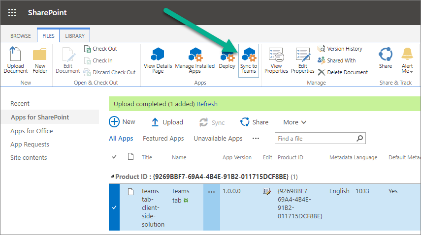
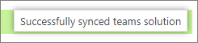
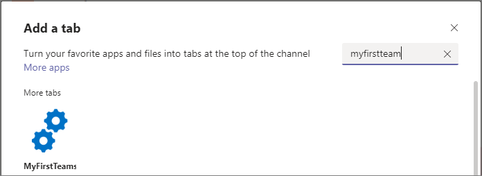

# Build Microsoft Teams tab using SharePoint Framework - Tutorial

Starting with the SharePoint Framework v1.8, you can implement your Microsoft Teams tabs using SharePoint Framework. Using SharePoint Framework significantly simplifies Teams tab development process as Teams tabs can be automatically hosted within SharePoint without any need for external services.

Before you start, complete the procedures in the following articles to ensure that you understand the basic flow of creating a custom client-side web part:

- [Build your first web part](build-a-hello-world-web-part.md)
- [Connect your web part to SharePoint](connect-to-sharepoint.md)
- [Deploy your client-side web part to a SharePoint page](provision-sp-assets-from-package.md)

> [!IMPORTANT]
> This tutorials requires that you are using the SharePoint Framework v1.10 or higher as some capabilities and framework properties are not available in earlier versions.

You can also follow these steps by watching this video on the Microsoft 365 Platform Communtiy (PnP) YouTube Channel:

> [!Video https://www.youtube.com/embed/JoTAC2i-XeU]

## Create a Microsoft Teams tab project

1. Create a new project directory in your favorite location:

    ```console
    md teams-tab
    ```

1. Go to the project directory:

    ```console
    cd teams-tab
    ```

1. Create a new project by running the Yeoman SharePoint Generator from within the new directory you created:

    ```console
    yo @microsoft/sharepoint
    ```

    The Yeoman SharePoint Generator will prompt you with a series of questions. For all questions, accept the default options except for the following questions:

    - **Do you want to allow the tenant admin the choice of being able to deploy the solution to all sites immediately without running any feature deployment or adding apps in sites?**: Yes
    - **Which type of client-side component to create?**: WebPart
    - **What is your Web part name?**: MyFirstTeamsTab
    - **What is your Web part description?**: My first Teams tab

    At this point, Yeoman installs the required dependencies and scaffolds the solution files. Creation of the solution might take a few minutes. Yeoman scaffolds the project to include your **MyFirstTeamsTab** web part as well.

1. Next, enter the following to open the web part project in Visual Studio Code:

    ```console
    code .
    ```

SharePoint Framework v1.8 and later projects will include the **./teams** folder in the solution structure:

  

Teams folder contains the following two files:

- **[componentId]_color.png**: Default small picture for a tab
- **[componentId]_outline.png**: Default large picture for a tab

These images will be used as icons in Microsoft Teams. You can replace them with custom images, but you'll need to use the same name for ensuring them to get packaged properly with the solution deployment.

## Update the web part manifest to make it available for Microsoft Teams

Locate the **./src/webparts/\*\*/manifest.json** file for the web part you want to make available to Teams and modify the `supportedHosts` properties to include `"TeamsTab"` as in the following example.

```json
{
  "$schema": "https://developer.microsoft.com/json-schemas/spfx/client-side-web-part-manifest.schema.json",

  //...

  "supportedHosts": ["SharePointWebPart", "TeamsTab"],

  //...

}
```

> [!NOTE]
> Starting in SharePoint Framework v1.10, you can expose SharePoint Framework web parts as personal Microsoft Teams apps. This can be controlled by including `"TeamsPersonalApp"` in the `supportedHosts` value.
>
> Personal tabs do not have a configuration option, and so web parts added to Teams as personal apps will not expose the web part property pane. If you need to configure the web part in this situation you'll have to implement it within the web part UI.

## Update code to be aware of the Microsoft Teams context

1. Open **./src/webparts/helloWorld/MyFirstTeamsTabWebPart.ts** for the needed edits to make the solution aware of the Microsoft Teams context, if it's used as a tab.
1. Update the `render()` method as follows.

    Notice how we're rendering different content dependent if the code is rendered as a tab in Microsoft Team or as a web part in SharePoint. We can detect if solution is hosted by Microsoft Teams by checking the `this.context.sdks.microsoftTeams` property.

    ```typescript
    public render(): void {

      let title: string = '';
      let subTitle: string = '';
      let siteTabTitle: string = '';

      if (this.context.sdks.microsoftTeams) {
        // We have teams context for the web part
        title = "Welcome to Teams!";
        subTitle = "Building custom enterprise tabs for your business.";
        siteTabTitle = "We are in the context of following Team: " + this.context.sdks.microsoftTeams.context.teamName;
      }
      else
      {
        // We are rendered in normal SharePoint context
        title = "Welcome to SharePoint!";
        subTitle = "Customize SharePoint experiences using Web Parts.";
        siteTabTitle = "We are in the context of following site: " + this.context.pageContext.web.title;
      }

      this.domElement.innerHTML = `
        <div class="${ styles.myFirstTeamsTab }">
          <div class="${ styles.container }">
            <div class="${ styles.row }">
              <div class="${ styles.column }">
                <span class="${ styles.title }">${title}</span>
                <p class="${ styles.subTitle }">${subTitle}</p>
                <p class="${ styles.description }">${siteTabTitle}</p>
                <p class="${ styles.description }">Description property value - ${escape(this.properties.description)}</p>
                <a href="https://aka.ms/spfx" class="${ styles.button }">
                  <span class="${ styles.label }">Learn more</span>
                </a>
              </div>
            </div>
          </div>
        </div>`;
    }
    ```

    > [!NOTE]
    > For a full description of the information available through Microsoft Teams context for Microsoft Teams tabs, see: [Microsoft Teams developer documentation](/microsoftteams/platform/concepts/tabs/tabs-context).

## Package and deploy your web part to SharePoint

Ensure that your console is activated in the root folder of the solution where was created.

1. Execute the following commands to build bundle your solution. This executes a release build of your project by using a dynamic label as the host URL for your assets.

    ```console
    gulp bundle --ship
    ```

1. Execute the following task to package your solution. This creates an updated **teams-tab-webpart.sppkg** package on the **sharepoint/solution** folder.

    ```console
    gulp package-solution --ship
    ```

1. Next, you need to deploy the package that was generated to the tenant App Catalog.

    Go to your tenant's SharePoint App Catalog.

1. Upload or drag and drop the **teams-tab-webpart.sppkg** to the App Catalog.

    

    This deploys the client-side solution package. Because this is a full trust client-side solution, SharePoint displays a dialog and asks you to trust the client-side solution to deploy.

    Notice how the **domain** list in the prompt includes **SharePoint Online**. This is because the content is either served from the Microsoft 365 CDN or from the App Catalog, depending on the tenant settings.

    Ensure that the **Make this solution available to all sites in the organization** option is selected, so that the web part can be used from the Microsoft Teams side.

    

1. Select **Deploy**.

    Notice that you can see if there's any exceptions or issues in the package by looking the **App Package Error Message** column in the App Catalog.

At this point, the web part is deployed and is automatically available cross the SharePoint Online sites.

> [!NOTE]
> In this tutorial, we're using tenant wide deployment option of the SharePoint Framework solution. This will ensure that the development and usage experience is as easy as possible.
>
> You could also deploy the solution as site scope, but in that case you'd need to ensure that the solution is deployed on the SharePoint site behind of the Microsoft Teams before you can use it.

## Make the web part available in Microsoft Teams

To make your web part available in Microsoft Teams, you'll have synchronize your solution with teams.

> [!NOTE]
> In this tutorial, we're using the automatic deployment option for the solution from the SharePoint app catalog. For more information, see: [Deployment options for SharePoint Framework solutions for Microsoft Teams](../../deployment-spfx-teams-solutions.md).

1. Select the **teams-tab-client-side-solution** package in the SharePoint tenant App Catalog and select the **Sync to Teams** button at in the ribbon in the **Files** tab.

   

1. Confirm that you can see the status message on the top-right corner.

    

    > [!IMPORTANT]
    > If the synchronization isn't successful, please ensure that you have deleted possible previous version from the Microsoft Team App Catalog. This is the most common reason why the synchronization would fail as existing solution is not overridden currently.

1. Move to the Microsoft Teams side and check the App Catalog status by selecting **Apps** from the left navigation

    

1. Wait until your tenant-specific apps selection is visible:

    

    > [!NOTE]
    > This can take a few minutes due to caching.

1. Confirm that you can see **MyFirstTeamsTab** app in the catalog:

    

    > [!NOTE]
    > This can take a few minutes due to caching.

1. Move to a channel in a team where you want to test the solution. In the below picture, we have activated **General** channel in **Team**:

    

1. Select **+** to add a new tab on the channel.
1. Select your custom tab called **MyFirstTeamTab** in the list. You can use the search capability if needed to find your custom tab:

    

1. Select **Add** to confirm the tab to be selected.
1. Select **Save** to confirm the tab to be installed on the channel:

    

Your custom tab has been added on the Microsoft Teams channel and you can see how the code is reacting that it's in Microsoft Teams context. Theme of the web part is by default coming from the underlying SharePoint site.


> [!NOTE]
> You can control the initial configuration option visibility from the web part manifest by setting `canUpdateConfiguration` property as `false`. By default this setting is `true` which is taken into account when the Teams manifest is automatically created as part of the *Sync* process.

## Update your app package

When you make changes to your app and create a new package, you might find an error when selecting **Sync to Teams**.

A notification **Failed to sync solution to teams** might appear on the top right of your page.

If this happens follow these steps to delete your app from Microsoft Teams, and then try to sync it again:

1. Open Microsoft Teams.
1. When viewing your team channel, click + to **Add a tab**.
1. Select the **More apps** link at the top.
1. Find your app in the list, and click on the **...** menu.
1. Select **Delete** to remove the app from Microsoft Teams.

You can now sync your new version to Microsoft Teams.

## See also

- [The Microsoft Teams developer platform](/microsoftteams/platform/overview)
