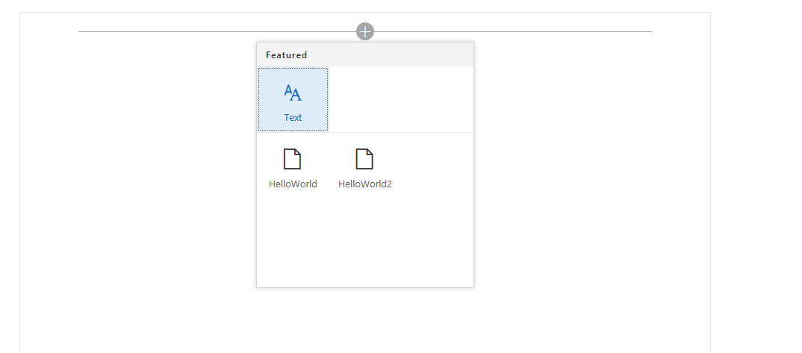
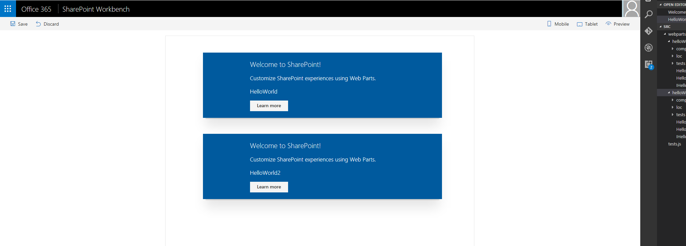
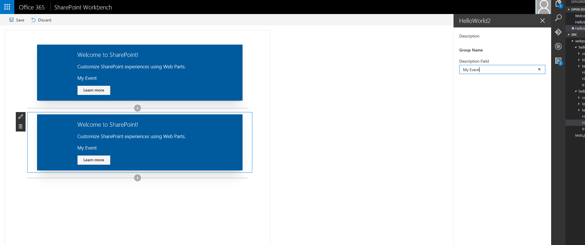

# Web part to web part communication

This tutorial provides a simplistic example of how web part can be made to communicate with each other.

>> Please note, this is a preliminary test implemenation of web part to web part communication. The purpose is to gather feedback and requirements.

## Prerequisites
Go through the following tutorial again and create a **React** based **HelloWorld** web part in **webpart-to-webpart-communication** folder.

* [Build your first web part](build-a-hello-world-web-part.md)

## Create a second web part in the same project

Just like the first web part, run yo again in the root folder, go through the prompts and add a second web part called **HelloWorld2**.

## Run gulp serve

Make sure you have the `gulp serve` command running. If it is not already running, go to the **webpart-to-webpart-communication** project directory and run it using the following commands.

```
cd webpart-to-webpart-communication
gulp serve
```

In the workbench toolbox you should see the following web parts **HelloWorld** and **HelloWorld2**.




## Setup the workbench

Add one instance each of the two web parts to the workbench



## Define the event type

Switch to Visual Studio Code and go to **src\webparts\helloWorld\HelloWorldWebPart.ts**.

Define the following interface models just above the **HelloWorldWebPart** class:

```ts
interface IMyEvent {
  value: string
}
```

## Subscribe for events

Add the **IWebPartEvent** to the imports from **'@microsoft/sp-webpart-base'**

Add the following code in **HelloWorld** class above the **render** method.

```ts
  protected onInit(): Promise<void> {
    this.context.eventAggregator.subscribeByEventName<IMyEvent>('helloWorld2WebPartEvent:onDescriptionChange', this.context.instanceId, this._eventCallback.bind(this));
    return super.onInit();
  }

  private _eventCallback(eventName: string, eventObject: IWebPartEvent<IMyEvent>): void {
    this.properties.description = eventObject.data.value;
    this.render();
  }
```

## Raise events from the other web part

Switch to Visual Studio Code and go to **src\webparts\helloWorld2\HelloWorld2WebPart.ts**.

Define the following interface models just above the **HelloWorld2WebPart** class:

```ts
interface IMyEvent {
  value: string
}
```

Add the following code at the end of the **HelloWorld2** class.

```ts
  protected onPropertyPaneFieldChanged(propertyPath: string, oldValue: any, newValue: any): void {
    if (propertyPath === 'description') {
      this.context.eventAggregator.raiseEvent<IMyEvent>(
        'helloWorld2WebPartEvent:onDescriptionChange',
        {
          data: { value: this.properties.description},
          sourceId: this.context.instanceId,
          targetId: 'HelloWorld'
        });
    }

    super.onPropertyPaneFieldChanged(propertyPath, oldValue, newValue);
  }
```

## Test web part to web part communication

At this point, you are all set to test web part to web part communication.

* Click on the configure button on the **HelloWorld2WebPart** in the workbench.
* Type "My Event" in the PropertyPane
* Notice how these characters show up in the description field of both the web parts.



## Final code state

In case you have trouble, just copy and paste the code below

### HelloWorldWebPart.ts

```ts
import * as React from 'react';
import * as ReactDom from 'react-dom';
import { Version } from '@microsoft/sp-core-library';
import {
  BaseClientSideWebPart,
  IPropertyPaneConfiguration,
  PropertyPaneTextField,
  IWebPartEvent
} from '@microsoft/sp-webpart-base';

import * as strings from 'helloWorldStrings';
import HelloWorld from './components/HelloWorld';
import { IHelloWorldProps } from './components/IHelloWorldProps';
import { IHelloWorldWebPartProps } from './IHelloWorldWebPartProps';

interface IMyEvent {
  value: string
}

export default class HelloWorldWebPart extends BaseClientSideWebPart<IHelloWorldWebPartProps> {

  protected onInit(): Promise<void> {
    this.context.eventAggregator.subscribeByEventName<IMyEvent>('helloWorld2WebPartEvent:onDescriptionChange', this.context.instanceId, this._eventCallback.bind(this));
    return super.onInit();
  }

  private _eventCallback(eventName: string, eventObject: IWebPartEvent<IMyEvent>): void {
    this.properties.description = eventObject.data.value;
    this.render();
  }

  public render(): void {
    const element: React.ReactElement<IHelloWorldProps > = React.createElement(
      HelloWorld,
      {
        description: this.properties.description
      }
    );

    ReactDom.render(element, this.domElement);
  }

  protected get dataVersion(): Version {
    return Version.parse('1.0');
  }

  protected getPropertyPaneConfiguration(): IPropertyPaneConfiguration {
    return {
      pages: [
        {
          header: {
            description: strings.PropertyPaneDescription
          },
          groups: [
            {
              groupName: strings.BasicGroupName,
              groupFields: [
                PropertyPaneTextField('description', {
                  label: strings.DescriptionFieldLabel
                })
              ]
            }
          ]
        }
      ]
    };
  }
}
```

### HellowWorld2WebPart.ts

```ts
import * as React from 'react';
import * as ReactDom from 'react-dom';
import { Version } from '@microsoft/sp-core-library';
import {
  BaseClientSideWebPart,
  IPropertyPaneConfiguration,
  PropertyPaneTextField
} from '@microsoft/sp-webpart-base';

import * as strings from 'helloWorld2Strings';
import HelloWorld2 from './components/HelloWorld2';
import { IHelloWorld2Props } from './components/IHelloWorld2Props';
import { IHelloWorld2WebPartProps } from './IHelloWorld2WebPartProps';

interface IMyEvent {
  value: string
}

export default class HelloWorld2WebPart extends BaseClientSideWebPart<IHelloWorld2WebPartProps> {

  public render(): void {
    const element: React.ReactElement<IHelloWorld2Props > = React.createElement(
      HelloWorld2,
      {
        description: this.properties.description
      }
    );

    ReactDom.render(element, this.domElement);
  }

  protected get dataVersion(): Version {
    return Version.parse('1.0');
  }

  protected getPropertyPaneConfiguration(): IPropertyPaneConfiguration {
    return {
      pages: [
        {
          header: {
            description: strings.PropertyPaneDescription
          },
          groups: [
            {
              groupName: strings.BasicGroupName,
              groupFields: [
                PropertyPaneTextField('description', {
                  label: strings.DescriptionFieldLabel
                })
              ]
            }
          ]
        }
      ]
    };
  }

  protected onPropertyPaneFieldChanged(propertyPath: string, oldValue: any, newValue: any): void {
    if (propertyPath === 'description') {
      this.context.eventAggregator.raiseEvent<IMyEvent>(
        'helloWorld2WebPartEvent:onDescriptionChange',
        {
          data: { value: this.properties.description},
          sourceId: this.context.instanceId,
          targetId: 'HelloWorld'
        });
    }

    super.onPropertyPaneFieldChanged(propertyPath, oldValue, newValue);
  }
}
```
