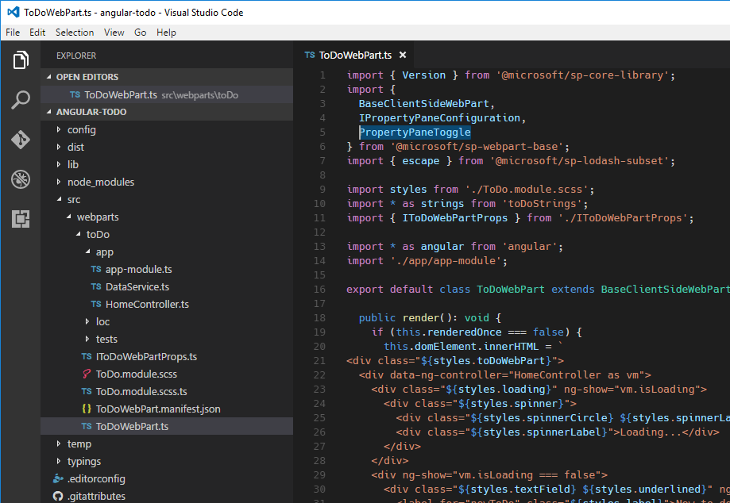

# Build SharePoint Framework client-side web parts with AngularJS

If you are familiar with AngularJS, you can also use this extremely popular framework to build client-side web parts. Thanks to its modularity, it can be used for anything ranging from complex multi-view Single Page Applications to smaller components such as web parts. Many organizations have been using AngularJS for building SharePoint solutions in the past. This article shows how to use AngularJS to build a SharePoint Framework client-side web part and have it styled using [Office UI Fabric](http://dev.office.com/fabric). During this tutorial you will build a simple web part that manages to do items.


The source of the working web part is available on GitHub at [https://github.com/SharePoint/sp-dev-fx-webparts/tree/master/samples/angular-todo](https://github.com/SharePoint/sp-dev-fx-webparts/tree/master/samples/angular-todo).

> [!NOTE] 
> Before following the steps in this article, be sure to [set up your development environment](../../set-up-your-development-environment.md) for building SharePoint Framework solutions.

## Create new project

Start by creating a new folder for your project

```sh
md angular-todo
```

Navigate to the project folder:

```sh
cd angular-todo
```

In the project folder run the SharePoint Framework Yeoman generator to scaffold a new SharePoint Framework project:

```sh
yo @microsoft/sharepoint
```

When prompted, define values as follows:
- **angular-todo** as your solution name
- **Use the current folder** for the location to place the files
- **No JavaScript web framework** as the starting point to build the web part
- **To do** as your web part name
- **Simple management of to do tasks** as your web part description


Once the scaffolding completes, lock down the version of the project dependencies by running the following command:

```sh
npm shrinkwrap
```

Next, open your project folder in your code editor. In this tutorial, you will use Visual Studio Code.


## Add AngularJS

In this tutorial you will load AngularJS from CDN. To do that, in the code editor, open the **config/config.json** file and in the **externals** property add the following lines:

```json
"angular": {
  "path": "https://cdnjs.cloudflare.com/ajax/libs/angular.js/1.6.6/angular.min.js",
  "globalName": "angular"
}
```


## Add AngularJS typings for TypeScript

Because you will be referencing AngularJS in your web part's code, you also need AngularJS typings for TypeScript. To install them run in the command line:

```sh
npm install @types/angular --save-dev
```

## Implement AngularJS application

With all prerequisites in place you can start implementing the sample AngularJS application. Because it will consist of a few files, create a separate folder for it called **app**.


### Implement to do data service

In the newly created **app** folder, create a new file called **DataService.ts**. In the file paste the following code:

```ts
export interface ITodo {
  id: number;
  title: string;
  done: boolean;
}

export interface IDataService {
  getTodos(hideFinishedTasks: boolean): angular.IPromise<ITodo[]>;
  addTodo(todo: string): angular.IPromise<{}>;
  deleteTodo(todo: ITodo): angular.IPromise<{}>;
  setTodoStatus(todo: ITodo, done: boolean): angular.IPromise<{}>;
}

export default class DataService implements IDataService {
  public static $inject: string[] = ['$q'];

  private items: ITodo[] = [
    {
      id: 1,
      title: 'Prepare demo Web Part',
      done: true
    },
    {
      id: 2,
      title: 'Show demo',
      done: false
    },
    {
      id: 3,
      title: 'Share code',
      done: false
    }
  ];
  private nextId: number = 4;

  constructor(private $q: angular.IQService) {
  }

  public getTodos(hideFinishedTasks: boolean): angular.IPromise<ITodo[]> {
    const deferred: angular.IDeferred<ITodo[]> = this.$q.defer();

    const todos: ITodo[] = [];
    for (let i: number = 0; i < this.items.length; i++) {
      if (hideFinishedTasks && this.items[i].done) {
        continue;
      }

      todos.push(this.items[i]);
    }

    deferred.resolve(todos);

    return deferred.promise;
  }

  public addTodo(todo: string): angular.IPromise<{}> {
    const deferred: angular.IDeferred<{}> = this.$q.defer();

    this.items.push({
      id: this.nextId++,
      title: todo,
      done: false
    });

    deferred.resolve();

    return deferred.promise;
  }

  public deleteTodo(todo: ITodo): angular.IPromise<{}> {
    const deferred: angular.IDeferred<{}> = this.$q.defer();

    let pos: number = -1;
    for (let i: number = 0; i < this.items.length; i++) {
      if (this.items[i].id === todo.id) {
        pos = i;
        break;
      }
    }

    if (pos > -1) {
      this.items.splice(pos, 1);
      deferred.resolve();
    }
    else {
      deferred.reject();
    }

    return deferred.promise;
  }

  public setTodoStatus(todo: ITodo, done: boolean): angular.IPromise<{}> {
    const deferred: angular.IDeferred<{}> = this.$q.defer();

    for (let i: number = 0; i < this.items.length; i++) {
      if (this.items[i].id === todo.id) {
        this.items[i].done = done;
      }
    }

    deferred.resolve();

    return deferred.promise;
  }
}
```


In the previous code snippet you implement three types: the **ITodo** interface which represents a to do item in your application, the **IDataService** interface which defines the signature of the data service and the **DataService** class which is responsible for retrieving and manipulating to do items. The data service implements simple methods for adding and modifying to do items. Even though the operations are instantaneous, for consistency each CRUD function returns a promise.

In this tutorial to do items are stored in memory. You could however easily extend the solution to store items in a SharePoint List and use the data service to communicate with SharePoint using its REST API.

### Implement the controller

Next, implement the controller that will facilitate communication between the view and the data service. In the **app** folder create a new file named **HomeController.ts** and paste the following code:

```ts
import { IDataService, ITodo } from './DataService';

export default class HomeController {
  public isLoading: boolean = false;
  public newItem: string = null;
  public newToDoActive: boolean = false;
  public todoCollection: any[] = [];
  private hideFinishedTasks: boolean = false;

  public static $inject: string[] = ['DataService', '$window', '$rootScope'];

  constructor(private dataService: IDataService, private $window: angular.IWindowService, private $rootScope: angular.IRootScopeService) {
    const vm: HomeController = this;
    this.init();
  }

  private init(hideFinishedTasks?: boolean): void {
    this.hideFinishedTasks = hideFinishedTasks;
    this.loadTodos();
  }

  private loadTodos(): void {
    const vm: HomeController = this;
    this.isLoading = true;
    this.dataService.getTodos(vm.hideFinishedTasks)
      .then((todos: ITodo[]): void => {
        vm.todoCollection = todos;
      })
      .finally((): void => {
        vm.isLoading = false;
      });
  }

  public todoKeyDown($event: any): void {
    if ($event.keyCode === 13 && this.newItem.length > 0) {
      $event.preventDefault();

      this.todoCollection.unshift({ id: -1, title: this.newItem, done: false });
      const vm: HomeController = this;

      this.dataService.addTodo(this.newItem)
        .then((): void => {
          this.newItem = null;
          this.dataService.getTodos(vm.hideFinishedTasks)
            .then((todos: any[]): void => {
              this.todoCollection = todos;
            });
        });
    }
  }

  public deleteTodo(todo: ITodo): void {
    if (this.$window.confirm('Are you sure you want to delete this todo item?')) {
      let index: number = -1;
      for (let i: number = 0; i < this.todoCollection.length; i++) {
        if (this.todoCollection[i].id === todo.id) {
          index = i;
          break;
        }
      }

      if (index > -1) {
        this.todoCollection.splice(index, 1);
      }

      const vm: HomeController = this;

      this.dataService.deleteTodo(todo)
        .then((): void => {
          this.dataService.getTodos(vm.hideFinishedTasks)
            .then((todos: any[]): void => {
              this.todoCollection = todos;
            });
        });
    }
  }

  public completeTodo(todo: ITodo): void {
    todo.done = true;

    const vm: HomeController = this;

    this.dataService.setTodoStatus(todo, true)
      .then((): void => {
        this.dataService.getTodos(vm.hideFinishedTasks)
          .then((todos: any[]): void => {
            this.todoCollection = todos;
          });
      });
  }

  public undoTodo(todo: ITodo): void {
    todo.done = false;

    const vm: HomeController = this;

    this.dataService.setTodoStatus(todo, false)
      .then((): void => {
        this.dataService.getTodos(vm.hideFinishedTasks)
          .then((todos: any[]): void => {
            this.todoCollection = todos;
          });
      });
  }
}
```


You start by loading the previously implemented data service. The controller needs it in order to get the list of items and modify items as requested by the user. Using AngularJS's dependency injection the service is injected into the controller. The controller implements a number of functions that are exposed to the view model and will be called from the template. Using these functions users will be able to add new items, mark items as finished, to do, or delete items.

### Implement the main module

With the data service and the controller ready, define the main module of your application and register the data service and controller with it. In the **app** folder create a new file called **app-module.ts** and paste the following contents:

```ts
import * as angular from 'angular';
import HomeController from './HomeController';
import DataService from './DataService';

const todoapp: angular.IModule = angular.module('todoapp', []);

todoapp
  .controller('HomeController', HomeController)
  .service('DataService', DataService);
```


You start by referencing AngularJS and by loading previously implemented controller and data service. Next, you define the module for your application. Finally, you register the controller and data service with your application.

Now you've built an AngularJS application for your web part. In the following steps you will register the AngularJS application with the web part and make it configurable using web part properties.

## Register AngularJS application with web part

Next step is to add AngularJS application to the web part. In the code editor open the **ToDoWebPart.ts** file.

Just before the class declaration, add the following lines:

```ts
import * as angular from 'angular';
import './app/app-module';
```


This allows us to load a reference to AngularJS and your application, both of which you need to bootstrap your AngularJS application.

Change the web part's **render** function to:

```ts
public render(): void {
  if (this.renderedOnce === false) {
    this.domElement.innerHTML = `
<div class="${styles.toDo}">
  <div data-ng-controller="HomeController as vm">
    <div class="${styles.loading}" ng-show="vm.isLoading">
      <div class="${styles.spinner}">
        <div class="${styles.spinnerCircle} ${styles.spinnerLarge}"></div>
        <div class="${styles.spinnerLabel}">Loading...</div>
      </div>
    </div>
    <div ng-show="vm.isLoading === false">
      <div class="${styles.textField} ${styles.underlined}" ng-class="{'${styles.isActive}': vm.newToDoActive}">
        <label for="newToDo" class="${styles.label}">New to do:</label>
        <input type="text" label="New to do:" id="newToDo" value="" class="${styles.field}" aria-invalid="false" ng-model="vm.newItem" ng-keydown="vm.todoKeyDown($event)" ng-focus="vm.newToDoActive = true" ng-blur="vm.newToDoActive = false">
      </div>
    </div>
    <div class="list" ng-show="vm.isLoading === false">
      <div class="listSurface">
        <div class="listPage">
          <div class="listCell" ng-repeat="todo in vm.todoCollection" uif-item="todo" ng-class="{'${styles.done}': todo.done}">
            <div class="${styles.listItem}">
              <span class="${styles.listItemPrimaryText}">{{todo.title}}</span>
              <div class="${styles.listItemActions}">
                <div class="${styles.listItemAction}" ng-click="vm.completeTodo(todo)" ng-show="todo.done === false">
                  <i class="${styles.icon} ${styles.iconCheckMark}"></i>
                </div>
                <div class="${styles.listItemAction}" ng-click="vm.undoTodo(todo)" ng-show="todo.done">
                  <i class="${styles.icon} ${styles.iconUndo}"></i>
                </div>
                <div class="${styles.listItemAction}" ng-click="vm.deleteTodo(todo)">
                  <i class="${styles.icon} ${styles.iconRecycleBin}"></i>
                </div>
              </div>
            </div>
          </div>
        </div>
      </div>
    </div>
  </div>
</div>`;

    angular.bootstrap(this.domElement, ['todoapp']);
  }
}
```


The code first assigns the template of your application directly to the web part's DOM element. On the root element you specify the name of the controller that will handle events and data binding in the template. Then, you bootstrap your application using the **todoapp** name you used previously when declaring the main module. Using the **renderedOnce** web part property you ensure that your AngularJS application is bootstrapped only once. Without it, if you changed one of the web part's properties, the **render** function would be invoked again bootstrapping the AngularJS application again, which would lead to an error.

You also need to implement CSS styles that you are using the template. In the code editor open the **ToDo.module.scss** file and replace its contents with:

```css
.toDo {
  .loading {
    margin: 0 auto;
    width: 6em;

    .spinner {
      display: inline-block;
      margin: 10px 0;

      @-webkit-keyframes spinnerSpin {
        0% {
          -webkit-transform:rotate(0);
          transform:rotate(0);
        }
        100% {
          -webkit-transform:rotate(360deg);
          transform:rotate(360deg);
        }
      }
      @keyframes spinnerSpin {
        0% {
          -webkit-transform:rotate(0);
          transform:rotate(0);
        }
        100% {
          -webkit-transform:rotate(360deg);
          transform:rotate(360deg);
        }
      }

      .spinnerCircle {
        margin: auto;
        box-sizing: border-box;
        border-radius: 50%;
        width: 100%;
        height: 100%;
        border: 1.5px solid #c7e0f4;
        border-top-color: #0078d7;
        -webkit-animation: spinnerSpin 1.3s infinite cubic-bezier(.53, .21, .29, .67);
        animation: spinnerSpin 1.3s infinite cubic-bezier(.53, .21, .29, .67);

        &.spinnerLarge {
          width: 28px;
          height: 28px;
        }
      }

      .spinnerLabel {
        color: #0078d7;
        margin-top: 10px;
        text-align: center;
      }
    }
  }

  .label {
    font-family: "Segoe UI WestEuropean", "Segoe UI", -apple-system, BlinkMacSystemFont, Roboto, "Helvetica Neue", sans-serif;
    -webkit-font-smoothing: antialiased;
    font-size: 14px;
    font-weight: 400;
    box-sizing: border-box;
    margin: 0;
    padding: 0;
    box-shadow: none;
    color: #333333;
    box-sizing: border-box;
    display: block;
    padding: 5px 0
  }

  .textField {
    font-family: "Segoe UI WestEuropean", "Segoe UI", -apple-system, BlinkMacSystemFont, Roboto, "Helvetica Neue", sans-serif;
    -webkit-font-smoothing: antialiased;
    box-sizing: border-box;
    margin: 0;
    padding: 0;
    box-shadow: none;
    color: #333333;
    font-size: 14px;
    font-weight: 400;
    margin-bottom: 8px;

    &.underlined {
      border-bottom: 1px solid #c8c8c8;
      display: table;
      width: 100%;

      &:hover {
        border-color: #767676;
      }

      &.isActive, &:active {
        border-color: #0078d7;
      }

      .field {
        border: 0;
        display: table-cell;
        padding-top: 8px;
        padding-bottom: 3px
      }
    }

    .label {
      padding-right: 0;
      padding-left: 12px;
      margin-right: 8px;
      font-size: 14px;
      display: table-cell;
      vertical-align: top;
      padding-top: 9px;
      height: 32px;
      width: 1%;
      white-space: nowrap;
      font-weight: 400;
    }

    .field {
      text-align: left;
      float: left;
      box-sizing: border-box;
      margin: 0;
      padding: 0;
      box-shadow: none;
      font-family: "Segoe UI WestEuropean", "Segoe UI", -apple-system, BlinkMacSystemFont, Roboto, "Helvetica Neue", sans-serif;
      -webkit-font-smoothing: antialiased;
      border: 1px solid #c8c8c8;
      border-radius: 0;
      font-weight: 400;
      font-size: 14px;
      color: #333333;
      height: 32px;
      padding: 0 12px 0 12px;
      width: 100%;
      outline: 0;
      text-overflow: ellipsis;
    }

    .field:hover {
      border-color: #767676;
    }
  }

  .listItem {
    font-family: "Segoe UI WestEuropean", "Segoe UI", -apple-system, BlinkMacSystemFont, Roboto, "Helvetica Neue", sans-serif;
    -webkit-font-smoothing: antialiased;
    font-size: 14px;
    font-weight: 400;
    box-sizing: border-box;
    margin: 0;
    padding: 0;
    box-shadow: none;
    padding: 9px 28px 3px;
    position: relative;
    display: block;

    &::before {
      display: table;
      content: "";
      line-height: 0;
    }

    &::after {
      display: table;
      content: "";
      line-height: 0;
      clear: both;
    }

    .listItemPrimaryText {
      font-family: "Segoe UI WestEuropean", "Segoe UI", -apple-system, BlinkMacSystemFont, Roboto, "Helvetica Neue", sans-serif;
      -webkit-font-smoothing: antialiased;
      font-size: 21px;
      font-weight: 100;
      padding-right: 80px;
      position: relative;
      top: -4px;
      overflow: hidden;
      text-overflow: ellipsis;
      white-space: nowrap;
      display: block;
    }

    .listItemActions {
      max-width: 80px;
      position: absolute;
      right: 30px;
      text-align: right;
      top: 10px;

      .listItemAction {
        color: #a6a6a6;
        display: inline-block;
        font-size: 15px;
        position: relative;
        text-align: center;
        top: 3px;
        cursor: pointer;
        height: 16px;
        width: 16px;

        &:hover {
          color: #666666;
          outline: 1px solid transparent;
        }

        .icon {
          vertical-align: top;
        }
      }
    }
  }

  .done {
    text-decoration: line-through;
  }

  .icon {
    -moz-osx-font-smoothing: grayscale;
    -webkit-font-smoothing: antialiased;
    display: inline-block;
    font-family: FabricMDL2Icons;
    font-style: normal;
    font-weight: 400;
    speak: none;

    &.iconCheckMark::before {
      content: "\E73E";
    }

    &.iconUndo::before {
      content: "\E7A7";
    }

    &.iconRecycleBin::before {
      content: "\EF87";
    }
  }
}
```


Run the following command to confirm that everything is working as expected:

```sh
gulp serve
```

In the browser you should see your To do web part showing to do items.


## Make web part configurable

At this point the To do web part shows a fixed list of to do items. Next, you will extend it with a configuration option to allow users to choose whether they want to see items that are marked as done or not.

### Add property in the web part manifest

Start by adding configuration property in the web part manifest. In the code editor open the **ToDoWebPart.manifest.json** file. In the **preconfiguredEntries** section, navigate to the **properties** array and replace the existing **description** property with the following line:

```json
"hideFinishedTasks": false
```


### Update the signature of the web part properties interface

Next, update the signature of the web part properties interface.

In the code editor open the **ToDoWebPart.ts** file and update the `IToDoWebPartProps` interface to the following:

```ts
export interface IToDoWebPartProps {
  hideFinishedTasks: boolean;
}
```


### Add the property to the web part property pane

To allow users to configure the value of your newly added property, you have to expose it through the web part property pane.

In the code editor open the **ToDoWebPart.ts** file. In the first `import` statement replace  `PropertyPaneTextField` with `PropertyPaneToggle`:

```ts
import {
  BaseClientSideWebPart,
  IPropertyPaneConfiguration,
  PropertyPaneToggle
} from '@microsoft/sp-webpart-base';
```



Change the implementation of the `propertyPaneSettings` function to:

```ts
protected getPropertyPaneConfiguration(): IPropertyPaneConfiguration {
  return {
    pages: [
      {
        header: {
          description: strings.PropertyPaneDescription
        },
        groups: [
          {
            groupName: strings.ViewGroupName,
            groupFields: [
              PropertyPaneToggle('hideFinishedTasks', {
                label: strings.HideFinishedTasksFieldLabel
              })
            ]
          }
        ]
      }
    ]
  };
}
```

To fix the missing string references you first need to change the signature of your strings. In the code editor open the **loc/mystrings.d.ts** file and change its contents to:

```ts
declare interface IToDoWebPartStrings {
  PropertyPaneDescription: string;
  BasicGroupName: string;
  HideFinishedTasksFieldLabel: string;
}

declare module 'ToDoWebPartStrings' {
  const strings: IToDoWebPartStrings;
  export = strings;
}
```


Next, you need to provide the actual values for the newly defined strings. In the code editor open the **loc/en-us.js** file and change its contents to:

```js
define([], function() {
  return {
    "PropertyPaneDescription": "Manage configuration of the To do web part",
    "ViewGroupName": "View",
    "HideFinishedTasksFieldLabel": "Hide finished tasks"
  }
});
```


Run the following command to confirm that everything is working as expected:

```sh
gulp serve
```

In the web part property pane you should see a toggle button for your newly defined property.


At this point clicking the toggle button doesn't have any effect on your web part as it hasn't been connected to AngularJS. You will do that in the next step.

### Make the AngularJS application configurable using web part properties

In the previous step you defined a web part property that allows users to choose whether to show completed tasks or not. Next you will pass the value selected by the user into the AngularJS application so that it can load items accordingly.

#### Broadcast AngularJS event on web part property change

In the code editor open the **ToDoWebPart.ts** file. Right before web part's constructor add the following line:

```ts
private $injector: angular.auto.IInjectorService;
```


Next, change the web part's **render** function to the following:

```ts
public render(): void {
  if (this.renderedOnce === false) {
    this.domElement.innerHTML = `
<div class="${styles.toDo}">
  <div data-ng-controller="HomeController as vm">
    <div class="${styles.loading}" ng-show="vm.isLoading">
      <div class="${styles.spinner}">
        <div class="${styles.spinnerCircle} ${styles.spinnerLarge}"></div>
        <div class="${styles.spinnerLabel}">Loading...</div>
      </div>
    </div>
    <div ng-show="vm.isLoading === false">
      <div class="${styles.textField} ${styles.underlined}" ng-class="{'${styles.isActive}': vm.newToDoActive}">
        <label for="newToDo" class="${styles.label}">New to do:</label>
        <input type="text" label="New to do:" id="newToDo" value="" class="${styles.field}" aria-invalid="false" ng-model="vm.newItem" ng-keydown="vm.todoKeyDown($event)" ng-focus="vm.newToDoActive = true" ng-blur="vm.newToDoActive = false">
      </div>
    </div>
    <div class="list" ng-show="vm.isLoading === false">
      <div class="listSurface">
        <div class="listPage">
          <div class="listCell" ng-repeat="todo in vm.todoCollection" uif-item="todo" ng-class="{'${styles.done}': todo.done}">
            <div class="${styles.listItem}">
              <span class="${styles.listItemPrimaryText}">{{todo.title}}</span>
              <div class="${styles.listItemActions}">
                <div class="${styles.listItemAction}" ng-click="vm.completeTodo(todo)" ng-show="todo.done === false">
                  <i class="${styles.icon} ${styles.iconCheckMark}"></i>
                </div>
                <div class="${styles.listItemAction}" ng-click="vm.undoTodo(todo)" ng-show="todo.done">
                  <i class="${styles.icon} ${styles.iconUndo}"></i>
                </div>
                <div class="${styles.listItemAction}" ng-click="vm.deleteTodo(todo)">
                  <i class="${styles.icon} ${styles.iconRecycleBin}"></i>
                </div>
              </div>
            </div>
          </div>
        </div>
      </div>
    </div>
  </div>
</div>`;

    this.$injector = angular.bootstrap(this.domElement, ['todoapp']);
  }

  this.$injector.get('$rootScope').$broadcast('configurationChanged', {
    hideFinishedTasks: this.properties.hideFinishedTasks
  });
}
```

In the above code sample, every time the web part property is changed, it will broadcast an AngularJS event to which the AngularJS application will subscribe it. When event is received by the AngularJS application, it will then handle that accordingly.

#### Subscribe to web part property change event in AngularJS

In the code editor open the **app/HomeController.ts** file. Extend the constructor as follows:

```ts
constructor(private dataService: IDataService, private $window: angular.IWindowService, private $rootScope: angular.IRootScopeService) {
  const vm: HomeController = this;
  this.init();

  $rootScope.$on('configurationChanged', (event: angular.IAngularEvent, args: { hideFinishedTasks: boolean }): void => {
    vm.init(args.hideFinishedTasks);
  });
}
```


To verify that the AngularJS application is working as expected and correctly responds to property changed, in the command line run:

```sh
gulp serve
```

If you toggle the value of the **Hide finished tasks** property, web part should show or hide finished tasks accordingly.


