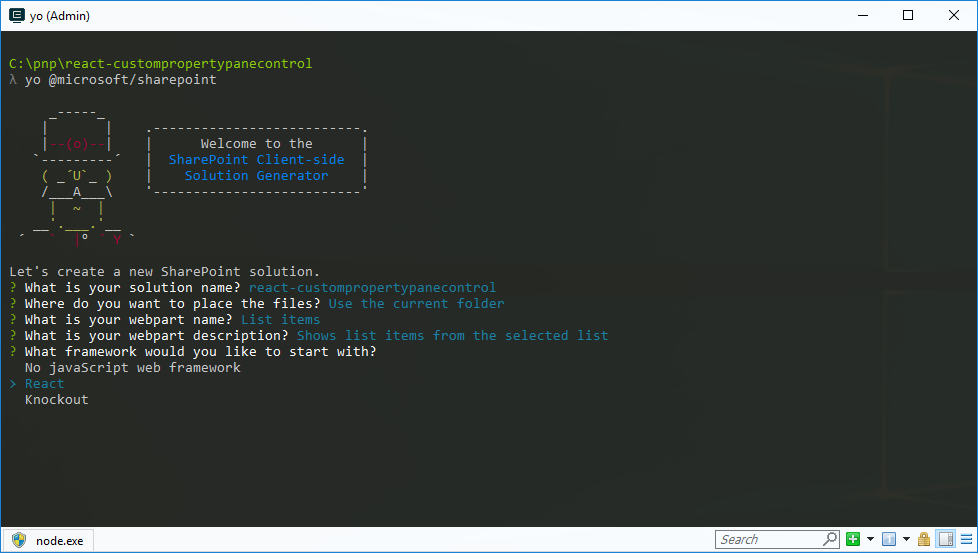
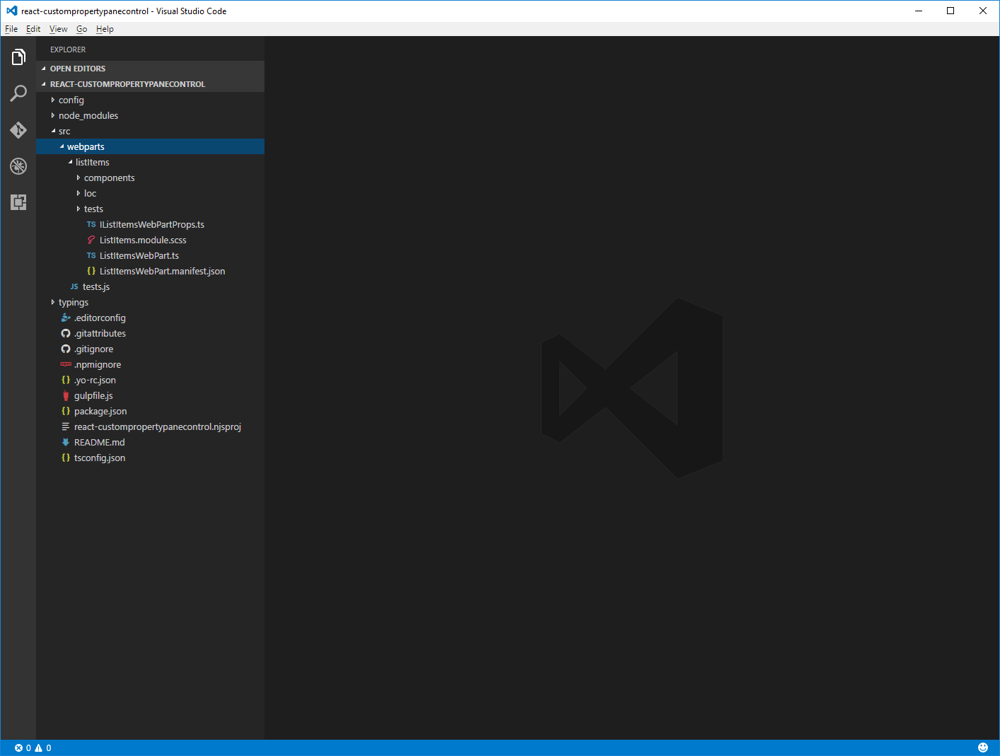
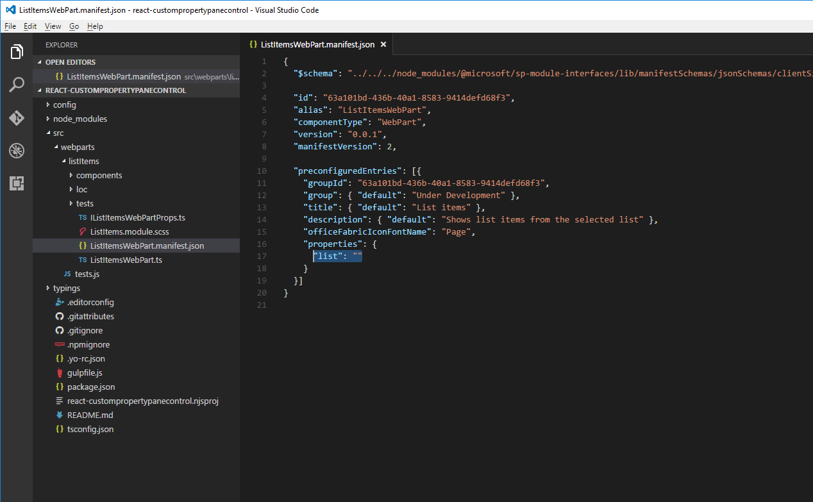
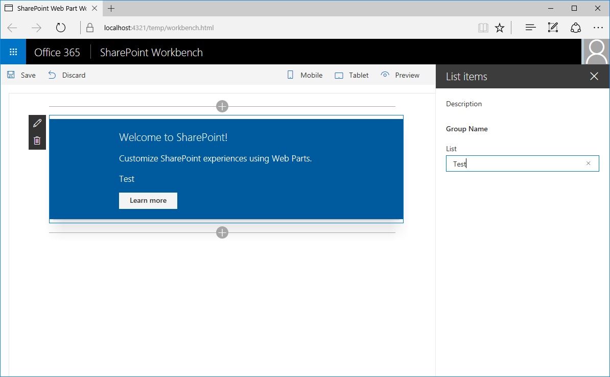
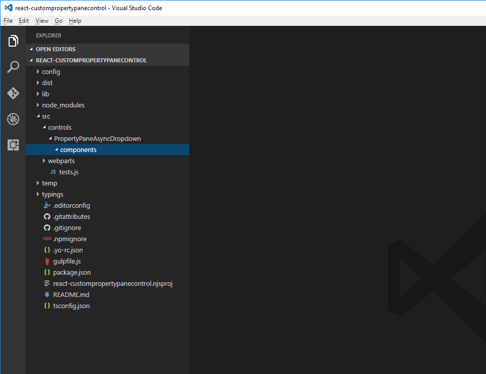
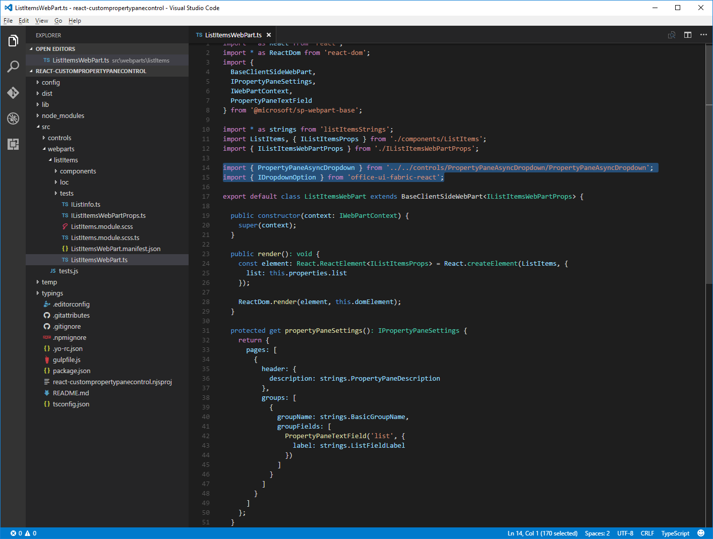
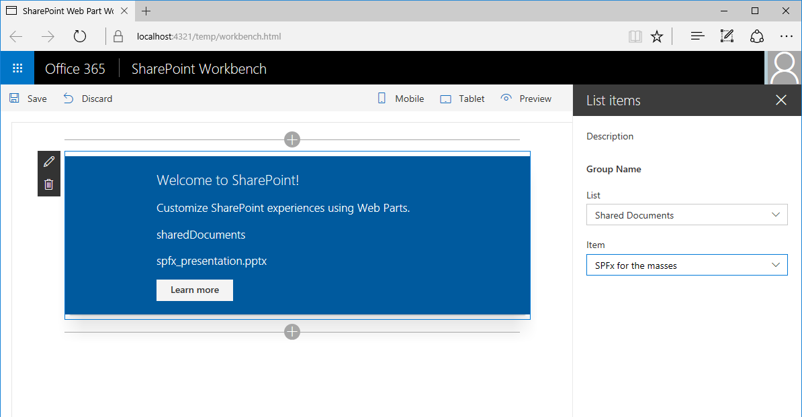

# Build custom property pane controls

> **Note:** The SharePoint Framework is currently in preview and is subject to change. SharePoint Framework client-side web parts are not currently supported for use in production environments.

The SharePoint Framework offers you a number of standard controls to be used for configuring web part properties in the property pane. If your web part requires a specific user interface for its configuration, beyond what is available in the SharePoint Framework, you can build a custom property pane control and use it in your web part. Custom property pane controls allow you to provide your users with an intuitive and rich interface for configuring how the web part should work. In this article you will learn how to build a custom property pane control that is a custom dropdown control that loads its data asynchronously from an external service without blocking the user interface in the web part.


The source of the working web part is available on GitHub at [https://github.com/SharePoint/sp-dev-fx-webparts/tree/master/samples/react-custompropertypanecontrols](https://github.com/SharePoint/sp-dev-fx-webparts/tree/master/samples/react-custompropertypanecontrols).

> **Note:** Before following the steps in this article, be sure to [set up your development environment](../../set-up-your-development-environment) for building SharePoint Framework solutions.

## Create new project

Start by creating a new folder for your project.

```sh
md react-custompropertypanecontrol
```

Go to the project folder.

```sh
cd react-custompropertypanecontrol
```

In the project folder run the SharePoint Framework Yeoman generator to scaffold a new SharePoint Framework project.

```sh
yo @microsoft/sharepoint
```

When prompted, enter the following values:

- **react-custompropertypanecontrol** as your solution name
- **Use the current folder** for the location to place the files
- **List items** as your web part name
- **Shows list items from the selected list** as your web part description
- **React** as the starting point to build the web part



Once the scaffolding completes, open your project folder in your code editor. This article uses Visual Studio Code in the steps and screenshots but you can use any editor you prefer.



## Define web part property for storing the selected list

The Web part you are building will show list items from the selected SharePoint list. Users will be able to select a list in the web part properties. To store the selected list create a new web part property named **list**.

In the code editor open the **src/webparts/listItems/ListItemsWebPartManifest.json** file. Replace the default **description** property with a new property named `list`.



Next, open the **src/webparts/listItems/IListItemsWebPartProps.ts** file and replace its contents with:

```ts
export interface IListItemsWebPartProps {
  list: string;
}
```

In the **src/webparts/listItems/ListItemsWebPart.ts** file, change the **render** method to:

```ts
export default class ListItemsWebPart extends BaseClientSideWebPart<IListItemsWebPartProps> {
  // ...
  public render(): void {
    const element: React.ReactElement<IListItemsProps> = React.createElement(ListItems, {
      list: this.properties.list
    });

    ReactDom.render(element, this.domElement);
  }
  // ...
}
```

Update the **propertyPaneSettings** getter to:

```ts
export default class ListItemsWebPart extends BaseClientSideWebPart<IListItemsWebPartProps> {
  // ...
  protected get propertyPaneSettings(): IPropertyPaneSettings {
    return {
      pages: [
        {
          header: {
            description: strings.PropertyPaneDescription
          },
          groups: [
            {
              groupName: strings.BasicGroupName,
              groupFields: [
                PropertyPaneTextField('list', {
                  label: strings.ListFieldLabel
                })
              ]
            }
          ]
        }
      ]
    };
  }
  // ...
}
```

In the **src/webparts/listItems/loc/mystrings.d.ts** file change the **IListItemsStrings** interface to:

```ts
declare interface IListItemsStrings {
  PropertyPaneDescription: string;
  BasicGroupName: string;
  ListFieldLabel: string;
}
```

In the **src/webparts/listItems/loc/en-us.js** file add the missing definition for the **ListFieldLabel** string.

```js
define([], function() {
  return {
    "PropertyPaneDescription": "Description",
    "BasicGroupName": "Group Name",
    "ListFieldLabel": "List"
  }
});
```

In the **src/webparts/listItems/components/ListItems.tsx** file change the contents of the **render** method to:

```tsx
export default class ListItems extends React.Component<IListItemsProps, {}> {
  public render(): JSX.Element {
    return (
      <div className={styles.listItems}>
        <div className={styles.container}>
          <div className={css('ms-Grid-row ms-bgColor-themeDark ms-fontColor-white', styles.row)}>
            <div className='ms-Grid-col ms-u-lg10 ms-u-xl8 ms-u-xlPush2 ms-u-lgPush1'>
              <span className='ms-font-xl ms-fontColor-white'>
                Welcome to SharePoint!
              </span>
              <p className='ms-font-l ms-fontColor-white'>
                Customize SharePoint experiences using web parts.
              </p>
              <p className='ms-font-l ms-fontColor-white'>
                {this.props.list}
              </p>
              <a
                className={css('ms-Button', styles.button)}
                href='https://github.com/SharePoint/sp-dev-docs/wiki'
              >
                <span className='ms-Button-label'>Learn more</span>
              </a>
            </div>
          </div>
        </div>
      </div>
    );
  }
}
```

Run the following command to verify that the project is running:

```sh
gulp serve
```

In the web browser, add the **List items** web part to the canvas and open its properties. Verify that the value set for the **List** property is displayed in the web part body.



## Create asynchronous dropdown property pane control

The SharePoint Framework offers you a standard dropdown control that allows users to select a specific value. The dropdown control is built in a way that requires all its values to be known upfront. If you want to load the values dynamically or you're loading values asynchronously from an external service and you don't want to block the whole web part, building a custom dropdown control is a viable option.

When creating a custom property pane control that uses React in the SharePoint Framework, the control consists of a class that registers the control with the web part, and a React component that renders the dropdown and manages its data.

> **Note:** In drop 6 of the SharePoint Framework there is a bug in the Office UI Fabric React Dropdown component that causes the control built in this article to work incorrectly. A temporary workaround is to edit the **node_modules/@microsoft/office-ui-fabric-react-bundle/dist/office-ui-fabric-react.bundle.js** file and change line **12027** from:
> 
> ```js
> isDisabled: this.props.isDisabled !== undefined ? this.props.isDisabled : this.props.disabled
> ```
>
> to:
> 
> ```js
> isDisabled: newProps.isDisabled !== undefined ? newProps.isDisabled : newProps.disabled
> ```

### Add asynchronous dropdown property pane control React component

#### Create components folder

In the project **src** folder, create a hierarchy of three new folders so that your folder structure appears as **src/controls/PropertyPaneAsyncDropdown/components**.



#### Define asynchronous dropdown React component properties

In the **src/controls/PropertyPaneAsyncDropdown/components** folder create a new file named **IAsyncDropdownProps.ts** and enter the following code:

```ts
import { IDropdownOption } from 'office-ui-fabric-react';

export interface IAsyncDropdownProps {
  label: string;
  loadOptions: () => Promise<IDropdownOption[]>;
  onChanged: (option: IDropdownOption, index?: number) => void;
  selectedKey: string | number;
  disabled: boolean;
  stateKey: string;
}
```

The **IAsyncDropdownProps** class defines properties that can be set on the React component used by the custom property pane control. The **label** property specifies the label for the dropdown control. The function associated with the **loadOptions** delegate is called by the control to load the available options. The function associated with the **onChanged** delegate is called after the user selected an option in the dropdown. The **selectedKey** property specifies the selected value which can be a string or a number. The **disabled** property specifies if the dropdown control is disabled or not. The **stateKey** property is used to force the React component to re-render.

#### Define asynchronous dropdown React component stateKey

In the **src/controls/PropertyPaneAsyncDropdown/components** folder create new file named **IAsyncDropdownState.ts** and enter the following code:

```ts
import { IDropdownOption } from 'office-ui-fabric-react';

export interface IAsyncDropdownState {
  loading: boolean;
  options: IDropdownOption[];
  error: string;
}
```

The **IAsyncDropdownState** interface describes the state of the React component. The **loading** property determines if the component is loading its options at the given moment. The **options** property contains all available options. If an error occurred it will be assigned to the **error** property from where it will be communicated to the user.

#### Define the asynchronous dropdown React component

In the **src/controls/PropertyPaneAsyncDropdown/components** folder create a new file named **AsyncDropdown.tsx** and enter the following code:

```tsx
import * as React from 'react';
import { Dropdown, Spinner } from 'office-ui-fabric-react';
import { IAsyncDropdownProps } from './IAsyncDropdownProps';
import { IAsyncDropdownState } from './IAsyncDropdownState';
import { IDropdownOption } from 'office-ui-fabric-react';

export default class AsyncDropdown extends React.Component<IAsyncDropdownProps, IAsyncDropdownState> {
  constructor(props: IAsyncDropdownProps, state: IAsyncDropdownState) {
    super(props);

    this.state = {
      loading: false,
      options: undefined,
      error: undefined
    };
  }

  public componentDidMount(): void {
    this.loadOptions();
  }

  public componentDidUpdate(prevProps: IAsyncDropdownProps, prevState: IAsyncDropdownState): void {
    if (this.props.disabled !== prevProps.disabled ||
      this.props.stateKey !== prevProps.stateKey) {
      this.loadOptions();
    }
  }

  private loadOptions(): void {
    this.setState({
      loading: true,
      error: undefined,
      options: undefined
    });

    this.props.loadOptions()
      .then((options: IDropdownOption[]): void => {
        this.setState({
          loading: false,
          error: undefined,
          options: options
        });
      }, (error: any): void => {
        this.setState((prevState: IAsyncDropdownState, props: IAsyncDropdownProps): IAsyncDropdownState => {
          prevState.loading = false;
          prevState.error = error;
          return prevState;
        });
      });
  }

  public render(): JSX.Element {
    const loading: JSX.Element = this.state.loading ? <div><Spinner label={'Loading options...'} /></div> : <div />;
    const error: JSX.Element = this.state.error !== undefined ? <div className={'ms-TextField-errorMessage ms-u-slideDownIn20'}>Error while loading items: {this.state.error}</div> : <div />;

    return (
      <div>
        <Dropdown label={this.props.label}
          isDisabled={this.props.disabled || this.state.loading || this.state.error !== undefined}
          onChanged={this.props.onChanged}
          selectedKey={this.props.selectedKey}
          options={this.state.options} />
        {loading}
        {error}
      </div>
    );
  }
}
```

The **AsyncDropdown** class represents the React component used to render the asynchronous dropdown property pane control. When the component first loads, the **componentDidMount** method, or its **disabled** or **stateKey** properties will change, and it will load the available options by calling the **loadOptions** method passed through the properties. Once the options are loaded the component updates its state showing the available options. The dropdown itself is rendered using the [Office UI Fabric React dropdown component](http://dev.office.com/fabric#/components/dropdown). When the component is loading the available options it displays a spinner using the [Office UI Fabric React spinner component](http://dev.office.com/fabric#/components/spinner).

### Add asynchronous dropdown property pane control

The next step is to define the custom property pane control. This control is used inside the web part when defining properties in the property pane and renders using the previously defined React component.

#### Define asynchronous dropdown property pane control properties

A custom property pane control has two sets of properties. The first set of properties are exposed publicly and are used to define the web part property inside the web part. These properties are component-specific properties, such as the label displayed next to the control, minimum and maximum values for a spinner, or available options for a dropdown. When defining a custom property pane control, the type describing these properties must be passed as the **TProperties** type when implementing the **IPropertyPaneField<TProperties>** interface.

The second set of properties are private properties used internally inside the custom property pane control. These properties have to adhere to the SharePoint Framework APIs for the custom control to render correctly. These properties must implement the **IPropertyPaneCustomFieldProps** interface from the **@microsoft/sp-client-preview** package.

##### Define the public properties for the asynchronous dropdown property pane control

In the **src/controls/PropertyPaneAsyncDropdown** folder create a new file named **IPropertyPaneAsyncDropdownProps.ts** and enter the following code:

```ts
import { IDropdownOption } from 'office-ui-fabric-react';

export interface IPropertyPaneAsyncDropdownProps {
  label: string;
  loadOptions: () => Promise<IDropdownOption[]>;
  onPropertyChange: (propertyPath: string, newValue: any) => void;
  selectedKey: string | number;
  disabled?: boolean;
}
```

The **label** property defines the label displayed next to the dropdown. The **loadOptions** delegate defines the method that is called to load the available dropdown options. The **onPropertyChange** delegate defines a method that is called when the user selects a value in the dropdown. The **selectedKey** property returns the selected dropdown value. The **disabled** property specifies whether the control is disabled or not.

##### Define the internal properties for the asynchronous dropdown property pane control

In the **src/controls/PropertyPaneAsyncDropdown** folder create a new file named **IPropertyPaneAsyncDropdownInternalProps.ts** and enter the following code:

```ts
import { IPropertyPaneCustomFieldProps } from '@microsoft/sp-client-preview';
import { IPropertyPaneAsyncDropdownProps } from './IPropertyPaneAsyncDropdownProps';

export interface IPropertyPaneAsyncDropdownInternalProps extends IPropertyPaneAsyncDropdownProps, IPropertyPaneCustomFieldProps {
}
```

While the **IPropertyPaneAsyncDropdownInternalProps** interface doesn't define any new properties, it combines the properties from the previously defined **IPropertyPaneAsyncDropdownProps** interface and the standard SharePoint Framework **IPropertyPaneCustomFieldProps** interface which is required for a custom control to run correctly.

#### Define the asynchronous dropdown property pane control

In the **src/controls/PropertyPaneAsyncDropdown** folder create a new file named **PropertyPaneAsyncDropdown.ts** and enter the following code:

```ts
import * as React from 'react';
import * as ReactDom from 'react-dom';
import {
  IPropertyPaneField,
  IPropertyPaneFieldType
} from '@microsoft/sp-client-preview';
import { IDropdownOption } from 'office-ui-fabric-react';
import { IPropertyPaneAsyncDropdownProps } from './IPropertyPaneAsyncDropdownProps';
import { IPropertyPaneAsyncDropdownInternalProps } from './IPropertyPaneAsyncDropdownInternalProps';
import AsyncDropdown from './components/AsyncDropdown';
import { IAsyncDropdownProps } from './components/IAsyncDropdownProps';

export class PropertyPaneAsyncDropdown implements IPropertyPaneField<IPropertyPaneAsyncDropdownProps> {
  public type: IPropertyPaneFieldType = IPropertyPaneFieldType.Custom;
  public targetProperty: string;
  public properties: IPropertyPaneAsyncDropdownInternalProps;
  private elem: HTMLElement;

  constructor(targetProperty: string, properties: IPropertyPaneAsyncDropdownProps) {
    this.targetProperty = targetProperty;
    this.properties = {
      label: properties.label,
      loadOptions: properties.loadOptions,
      onPropertyChange: properties.onPropertyChange,
      selectedKey: properties.selectedKey,
      disabled: properties.disabled,
      onRender: this.onRender.bind(this)
    };
  }

  public render(): void {
    if (!this.elem) {
      return;
    }

    this.onRender(this.elem);
  }

  private onRender(elem: HTMLElement): void {
    if (!this.elem) {
      this.elem = elem;
    }

    const element: React.ReactElement<IAsyncDropdownProps> = React.createElement(AsyncDropdown, {
      label: this.properties.label,
      loadOptions: this.properties.loadOptions,
      onChanged: this.onChanged.bind(this),
      selectedKey: this.properties.selectedKey,
      disabled: this.properties.disabled,
      // required to allow the component to be re-rendered by calling this.render() externally
      stateKey: new Date().toString()
    });
    ReactDom.render(element, elem);
  }

  private onChanged(option: IDropdownOption, index?: number): void {
    this.properties.onPropertyChange(this.targetProperty, option.key);
  }
}
```

The **PropertyPaneAsyncDropdown** class implements the standard SharePoint Framework **IPropertyPaneField** interface using the **IPropertyPaneAsyncDropdownProps** interface as a contract for its public properties that can be set from inside the web part. The class contains the following three public properties defined by the **IPropertyPaneField** interface:

 * **type**: Must be set to **IPropertyPaneFieldType.Custom** for a custom property pane control.
 * **targetProperty**: Used to specify the name of the web part property to be used with the control.
 * **properties**: Used to define control-specific properties.

Notice how the **properties** property is of the internal **IPropertyPaneAsyncDropdownInternalProps** type rather than the public **IPropertyPaneAsyncDropdownProps** interface implemented by the class. This is on purpose so that the **properties** property can define the **onRender** method required by the SharePoint Framework. If the **onRender** method was a part of the public **IPropertyPaneAsyncDropdownProps** interface then, when using the asynchronous dropdown control in the web part, you would be required to assign a value to it inside the web part, which isn't desirable.

The **PropertyPaneAsyncDropdown** class defines a public **render** method which can be used to repaint the control. This is useful in situations such as when you have cascading dropdowns where the value set in one determines the options available in another. By calling the **render** method after selecting an item, you can have the dependent dropdown load available options. For this to work you have to make React detect that the control has changed. This is done by setting the value of the **stateKey** to the current date. Using this trick, every time the **onRender** method is called, the component will not only be re-rendered but it will also update its available options.

## Use the asynchronous dropdown property pane control in the web part

With the asynchronous dropdown property pane control ready, the next step is to use it inside the web part allowing users to select a list.

### Add list info interface

To pass information about available lists around in a consistent manner, define an interface that will represent information about a list. In the **src/webparts/listItems** folder create a new file named **IListInfo.ts** and enter the following code:

```ts
export interface IListInfo {
  Id: string;
  Title: string;
}
```

### Use the asynchronous dropdown property pane control to render the list web part property

#### Reference required types

In the top section of the **src/webparts/listItems/ListItemsWebPart.ts** file import the previously created **PropertyPaneAsyncDropdown** class by adding:

```ts
import { PropertyPaneAsyncDropdown } from '../../controls/PropertyPaneAsyncDropdown/PropertyPaneAsyncDropdown';
```

Then after that code, add a reference to the **IDropdownOption** interface and two helpers functions required to work with web part properties.

```ts
import { IDropdownOption } from 'office-ui-fabric-react';
import { update, get } from '@microsoft/sp-lodash-subset';
```



#### Add method to load available lists

In the **ListItemsWebPart** class add a method to load available lists. In this article you will use mock data but you could also call the SharePoint REST API to retrieve the list of available lists from the current web. To simulate loading options from an external service the method uses a two second delay.

```ts
export default class ListItemsWebPart extends BaseClientSideWebPart<IListItemsWebPartProps> {
  // ...
  private loadLists(): Promise<IDropdownOption[]> {
    return new Promise<IDropdownOption[]>((resolve: (options: IDropdownOption[]) => void, reject: (error: any) => void) => {
      setTimeout(() => {
        resolve([{
          key: 'sharedDocuments',
          text: 'Shared Documents'
        },
          {
            key: 'myDocuments',
            text: 'My Documents'
          }]);
      }, 2000);
    });
  }
}
```

#### Add method to handle the change of the value in the dropdown

In the **ListItemsWebPart** class add a new method named **onListChange**.

```ts
export default class ListItemsWebPart extends BaseClientSideWebPart<IListItemsWebPartProps> {
  // ...
  private onListChange(propertyPath: string, newValue: any): void {
    const oldValue: any = get(this.properties, propertyPath);
    // store new value in web part properties
    update(this.properties, propertyPath, (): any => { return newValue; });
    // refresh web part
    this.onPropertyPaneFieldChanged(propertyPath, oldValue, newValue);
  }
}
```

After selecting a list in the list dropdown, the selected value should be persisted in web part properties and the web part should be re-rendered to reflect the selected property.

#### Render the list web part property using the asynchronous dropdown property pane control 

In the **ListItemsWebPart** class change the **propertyPaneSettings** getter to use the asynchronous dropdown property pane control to render the **list** web part property.

```ts
export default class ListItemsWebPart extends BaseClientSideWebPart<IListItemsWebPartProps> {
  // ...
  protected get propertyPaneSettings(): IPropertyPaneSettings {
    return {
      pages: [
        {
          header: {
            description: strings.PropertyPaneDescription
          },
          groups: [
            {
              groupName: strings.BasicGroupName,
              groupFields: [
                new PropertyPaneAsyncDropdown('list', {
                  label: strings.ListFieldLabel,
                  loadOptions: this.loadLists.bind(this),
                  onPropertyChange: this.onListChange.bind(this),
                  selectedKey: this.properties.list
                })
              ]
            }
          ]
        }
      ]
    };
  }
  // ...
}
```

At this point you should be able to select a list using the newly created asynchronous dropdown property pane control. To verify that the control is working as expected, open the command-line and run:

```sh
gulp serve
```


## Implement cascading dropdowns using the asynchronous dropdown property pane control

When building SharePoint Framework web parts you might need to implement a configuration where the available options depend on another option chosen previously. A common example is to first let users choose a list and from that list select a list item. The list of available items would depend on the selected list. Here is how to implement such scenario using the asynchronous dropdown property pane control implemented in previous steps.

### Add item web part property

In the code editor open the **src/webparts/listItems/ListItemsWebPart.manifest.json** file. To the **properties** section add a new property named **item** so that it appears as follows:

```ts
// ...
"properties": {
   "list: "",
   "item": ""
   }
// ...
```


Change the code in the **src/webparts/listItems/IListItemsWebPartProps.ts** file to:

```ts
export interface IListItemsWebPartProps {
  list: string;
  item: string;
}
```

In the **src/webparts/listItems/ListItemsWebPart.ts** file, change the code of the **render** method to:

```ts
export default class ListItemsWebPart extends BaseClientSideWebPart<IListItemsWebPartProps> {
  // ...
  public render(): void {
    const element: React.ReactElement<IListItemsProps> = React.createElement(ListItems, {
      list: this.properties.list,
      item: this.properties.item
    });

    ReactDom.render(element, this.domElement);
  }
  // ...
}
```

In the **src/webparts/listItems/loc/mystrings.d.ts** file change the **IListItemsStrings** interface to

```ts
declare interface IListItemsStrings {
  PropertyPaneDescription: string;
  BasicGroupName: string;
  ListFieldLabel: string;
  ItemFieldLabel: string;
}
```

In the **src/webparts/listItems/loc/en-us.js** file add the missing definition for the **ListFieldLabel** string.

```js
define([], function() {
  return {
    "PropertyPaneDescription": "Description",
    "BasicGroupName": "Group Name",
    "ListFieldLabel": "List",
    "ItemFieldLabel": "Item"
  }
});
```

### Render the value of the item web part property

In the **src/webparts/listItems/components/ListItems.tsx** file change the **render** method to:

```tsx
export default class ListItems extends React.Component<IListItemsProps, {}> {
  public render(): JSX.Element {
    return (
      <div className={styles.listItems}>
        <div className={styles.container}>
          <div className={css('ms-Grid-row ms-bgColor-themeDark ms-fontColor-white', styles.row)}>
            <div className='ms-Grid-col ms-u-lg10 ms-u-xl8 ms-u-xlPush2 ms-u-lgPush1'>
              <span className='ms-font-xl ms-fontColor-white'>
                Welcome to SharePoint!
              </span>
              <p className='ms-font-l ms-fontColor-white'>
                Customize SharePoint experiences using web parts.
              </p>
              <p className='ms-font-l ms-fontColor-white'>
                {this.props.list}
              </p>
              <p className='ms-font-l ms-fontColor-white'>
                {this.props.item}
              </p>
              <a
                className={css('ms-Button', styles.button)}
                href='https://github.com/SharePoint/sp-dev-docs/wiki'
              >
                <span className='ms-Button-label'>Learn more</span>
              </a>
            </div>
          </div>
        </div>
      </div>
    );
  }
}
```

### Add method to load list items

In the **src/webparts/listItems/ListItemsWebPart.ts** file, in the **ListItemsWebPart** class add a new method to load available list items from the selected list. Like the method for loading available lists, you will use mock data.

```ts
export default class ListItemsWebPart extends BaseClientSideWebPart<IListItemsWebPartProps> {
  // ...
  private loadItems(): Promise<IDropdownOption[]> {
    if (!this.properties.list) {
      // resolve to empty options since no list has been selected
      return Promise.resolve();
    }

    const wp: ListItemsWebPart = this;

    return new Promise<IDropdownOption[]>((resolve: (options: IDropdownOption[]) => void, reject: (error: any) => void) => {
      setTimeout(() => {
        const items = {
          sharedDocuments: [
            {
              key: 'spfx_presentation.pptx',
              text: 'SPFx for the masses'
            },
            {
              key: 'hello-world.spapp',
              text: 'hello-world.spapp'
            }
          ],
          myDocuments: [
            {
              key: 'isaiah_cv.docx',
              text: 'Isaiah CV'
            },
            {
              key: 'isaiah_expenses.xlsx',
              text: 'Isaiah Expenses'
            }
          ]
        };
        resolve(items[wp.properties.list]);
      }, 2000);
    });
  }
}
```

Depending on the previously selected list, the **loadItems** method returns mock list items. When no list has been selected, the method resolves the promise without any data.

### Add method to handle the selection of an item

In the **ListItemsWebPart** class add a new method named **onListItemChange**.

```ts
export default class ListItemsWebPart extends BaseClientSideWebPart<IListItemsWebPartProps> {
  // ...
  private onListItemChange(propertyPath: string, newValue: any): void {
    const oldValue: any = get(this.properties, propertyPath);
    // store new value in web part properties
    update(this.properties, propertyPath, (): any => { return newValue; });
    // refresh web part
    this.onPropertyPaneFieldChanged(propertyPath, oldValue, newValue);
  }
}
```

After selecting an item in the items dropdown, the web part should store the new value in web part properties and re-render the web part to reflect the changes in the user interface.

### Render the item web part property in the property pane

In the **ListItemsWebPart** class, add a new class property named **itemsDropdown**.

```ts
export default class ListItemsWebPart extends BaseClientSideWebPart<IListItemsWebPartProps> {
  private itemsDropDown: PropertyPaneAsyncDropdown;
  // ...
}
```

Next change the code of the **propertyPaneSettings** getter to:

```ts
export default class ListItemsWebPart extends BaseClientSideWebPart<IListItemsWebPartProps> {
  // ...
  protected get propertyPaneSettings(): IPropertyPaneSettings {
    // reference to item dropdown needed later after selecting a list
    this.itemsDropDown = new PropertyPaneAsyncDropdown('item', {
      label: strings.ItemFieldLabel,
      loadOptions: this.loadItems.bind(this),
      onPropertyChange: this.onListItemChange.bind(this),
      selectedKey: this.properties.item,
      // should be disabled if no list has been selected
      disabled: !this.properties.list
    });

    return {
      pages: [
        {
          header: {
            description: strings.PropertyPaneDescription
          },
          groups: [
            {
              groupName: strings.BasicGroupName,
              groupFields: [
                new PropertyPaneAsyncDropdown('list', {
                  label: strings.ListFieldLabel,
                  loadOptions: this.loadLists.bind(this),
                  onPropertyChange: this.onListChange.bind(this),
                  selectedKey: this.properties.list
                }),
                this.itemsDropDown
              ]
            }
          ]
        }
      ]
    };
  }
  // ...
}
```

The dropdown for the item property is initialized similarly to the dropdown for the list property. The only difference is that because after selecting a list the items dropdown has to be refreshed, an instance of the control has to be assigned to the class variable.

### Load items for the selected list

Initially when no list is selected, the items dropdown is disabled and becomes enabled after the user selects a list. After selecting a list the items dropdown also loads list items from that list. To implement this logic extend the previously defined **onListChange** method to:

```ts
export default class ListItemsWebPart extends BaseClientSideWebPart<IListItemsWebPartProps> {
  // ...
  private onListChange(propertyPath: string, newValue: any): void {
    const oldValue: any = get(this.properties, propertyPath);
    // store new value in web part properties
    update(this.properties, propertyPath, (): any => { return newValue; });
    // reset selected item
    this.properties.item = undefined;
    // store new value in web part properties
    update(this.properties, 'item', (): any => { return this.properties.item; });
    // refresh web part
    this.onPropertyPaneFieldChanged(propertyPath, oldValue, newValue);
    // reset selected values in item dropdown
    this.itemsDropDown.properties.selectedKey = this.properties.item;
    // allow to load items
    this.itemsDropDown.properties.disabled = false;
    // load items and re-render items dropdown
    this.itemsDropDown.render();
  }
  // ...
}
```

After selecting a list, the selected item is reset, persisted in web part properties, and reset in the items dropdown. The dropdown for selecting an item becomes enabled, and the dropdown is refreshed in order to load its options.

To verify that everything is working as expected in the command-line run:

```sh
gulp serve
```

After adding the web part to the page for the first time and opening its property pane, you should see both dropdowns disabled and loading their options.


After the options have been loaded, the list dropdown becomes enabled. Because no list has been selected yet, the item dropdown remains disabled.


After selecting a list in the list dropdown the item dropdown will load items available in that list.


After the available items have been loaded, the item dropdown becomes enabled.


After selecting an item in the item dropdown the web part is refreshed showing the selected item in its body.


