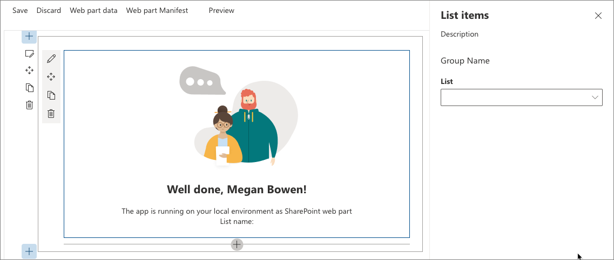
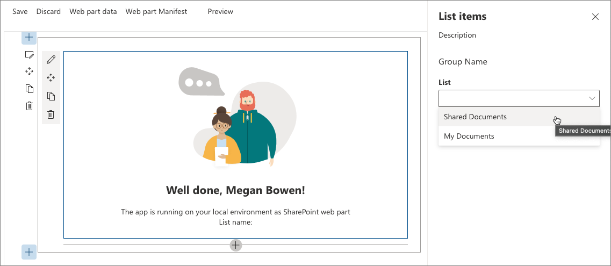
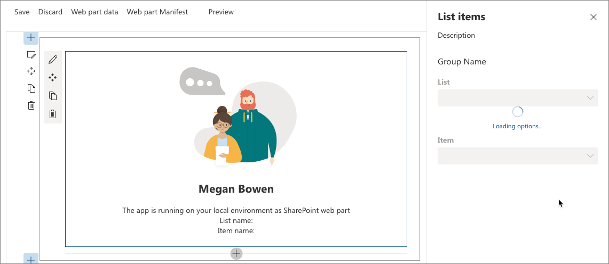
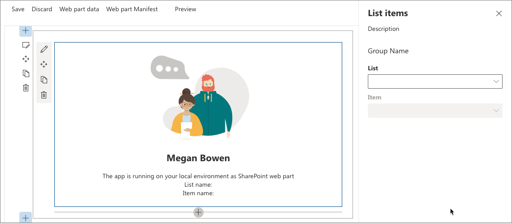
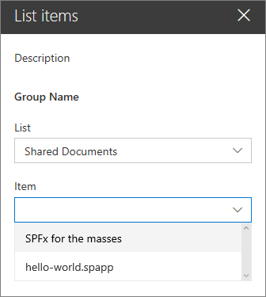

# Build custom controls for the property pane

The SharePoint Framework contains a set of standard controls for the property pane. But sometimes you need additional functionality beyond the basic controls. You might need asynchronous updates to the data on a control or a specific user interface. Build a custom control for the property pane to get the functionality you need.

In this article, you will build a custom dropdown control that loads its data asynchronously from an external service without blocking the user interface of the web part.


The source of the working web part is available on GitHub at [sp-dev-fx-webparts/samples/react-custompropertypanecontrols/](https://github.com/SharePoint/sp-dev-fx-webparts/tree/master/samples/react-custompropertypanecontrols).

> [!NOTE] 
> Before following the steps in this article, be sure to [set up your development environment](../../set-up-your-development-environment.md) for building SharePoint Framework solutions.

## Create new project

1. Start by creating a new folder for your project:

  ```sh
  md react-custompropertypanecontrol
  ```

2. Go to the project folder:

  ```sh
  cd react-custompropertypanecontrol
  ```

3. In the project folder, run the SharePoint Framework Yeoman generator to scaffold a new SharePoint Framework project:

  ```sh
  yo @microsoft/sharepoint
  ```

4. When prompted, enter the following values:

  - **react-custompropertypanecontrol** as your solution name
  - **Use the current folder** for the location to place the files
  - **List items** as your web part name
  - **Shows list items from the selected list** as your web part description
  - **React** as the starting point to build the web part

  

5. After the scaffolding completes, lock down the version of the project dependencies by running the following command:

  ```sh
  npm shrinkwrap
  ```

6. Open your project folder in your code editor. This article uses Visual Studio Code in the steps and screenshots, but you can use any editor that you prefer.

  

## Define web part property for storing the selected list

The web part you are building shows list items from the selected SharePoint list. Users are able to select a list in the web part properties. To store the selected list, create a new web part property named **listName**.

1. In the code editor, open the **src/webparts/listItems/ListItemsWebPartManifest.json** file. Replace the default **description** property with a new property named `listName`.

  

2. Open the **src/webparts/listItems/IListItemsWebPartProps.ts** file and replace its contents with:

  ```typescript
  export interface IListItemsWebPartProps {
    listName: string;
  }
  ```

3. In the **src/webparts/listItems/ListItemsWebPart.ts** file, change the **render** method to:

  ```typescript
  export default class ListItemsWebPart extends BaseClientSideWebPart<IListItemsWebPartProps> {
    // ...
    public render(): void {
      const element: React.ReactElement<IListItemsProps> = React.createElement(ListItems, {
        listName: this.properties.listName
      });

      ReactDom.render(element, this.domElement);
    }
    // ...
  }
  ```

4. Update the **getPropertyPaneConfiguration** method to:

  ```typescript
  export default class ListItemsWebPart extends BaseClientSideWebPart<IListItemsWebPartProps> {
    // ...
    protected getPropertyPaneConfiguration(): IPropertyPaneConfiguration {
      return {
        pages: [
          {
            header: {
              description: strings.PropertyPaneDescription
            },
            groups: [
              {
                groupName: strings.BasicGroupName,
                groupFields: [
                  PropertyPaneTextField('listName', {
                    label: strings.ListFieldLabel
                  })
                ]
              }
            ]
          }
        ]
      };
    }
    // ...
  }
  ```

5. In the **src/webparts/listItems/loc/mystrings.d.ts** file, change the **IListItemsWebPartStrings** interface to:

  ```typescript
  declare interface IListItemsWebPartStrings {
    PropertyPaneDescription: string;
    BasicGroupName: string;
    ListFieldLabel: string;
  }
  ```

6. In the **src/webparts/listItems/loc/en-us.js** file, add the missing definition for the **ListFieldLabel** string.

  ```js
  define([], function() {
    return {
      "PropertyPaneDescription": "Description",
      "BasicGroupName": "Group Name",
      "ListFieldLabel": "List"
    }
  });
  ```

7. In the **src/webparts/listItems/components/ListItems.tsx** file, change the contents of the **render** method to:

  ```tsx
  export default class ListItems extends React.Component<IListItemsProps, {}> {
    public render(): React.ReactElement<IListItemsProps> {
      return (
        <div className={styles.listItems}>
          <div className={styles.container}>
            <div className={`ms-Grid-row ms-bgColor-themeDark ms-fontColor-white ${styles.row}`}>
              <div className="ms-Grid-col ms-lg10 ms-xl8 ms-xlPush2 ms-lgPush1">
                <span className="ms-font-xl ms-fontColor-white">Welcome to SharePoint!</span>
                <p className="ms-font-l ms-fontColor-white">Customize SharePoint experiences using web parts.</p>
                <p className="ms-font-l ms-fontColor-white">{escape(this.props.listName)}</p>
                <a href="https://aka.ms/spfx" className={styles.button}>
                  <span className={styles.label}>Learn more</span>
                </a>
              </div>
            </div>
          </div>
        </div>
      );
    }
  }
  ```

8. Open the **src/webparts/listItems/components/IListItemsProps.ts** file, and replace its contents with:

  ```typescript
  export interface IListItemsProps {
    listName: string;
  }
  ```

9. Run the following command to verify that the project is running:

  ```sh
  gulp serve
  ```

10. In the web browser, add the **List items** web part to the canvas and open its properties. Verify that the value set for the **List** property is displayed in the web part body.

  


## Create asynchronous dropdown property pane control

The SharePoint Framework offers you a standard dropdown control that allows users to select a specific value. The dropdown control is built in a way that requires all its values to be known upfront. If you want to load the values dynamically or you're loading values asynchronously from an external service and you don't want to block the whole web part, building a custom dropdown control is a viable option.

When creating a custom property pane control that uses React in the SharePoint Framework, the control consists of a class that registers the control with the web part, and a React component that renders the dropdown and manages its data.

> [!NOTE] 
> In drop 6 of the SharePoint Framework, there is a bug in the Office UI Fabric React Dropdown component that causes the control built in this article to work incorrectly. A temporary workaround is to edit the **node_modules/@microsoft/office-ui-fabric-react-bundle/dist/office-ui-fabric-react.bundle.js** file and change line **12027** from:
> 
> ```js
> isDisabled: this.props.isDisabled !== undefined ? this.props.isDisabled : this.props.disabled
> ```
>
> to:
> 
> ```js
> isDisabled: newProps.isDisabled !== undefined ? newProps.isDisabled : newProps.disabled
> ```

### Add asynchronous dropdown property pane control React component

1. Create the components folder. In the project **src** folder, create a hierarchy of three new folders so that your folder structure appears as **src/controls/PropertyPaneAsyncDropdown/components**.

  

2. Define asynchronous dropdown React component properties. In the **src/controls/PropertyPaneAsyncDropdown/components** folder, create a new file named **IAsyncDropdownProps.ts**, and enter the following code:

  ```typescript
  import { IDropdownOption } from 'office-ui-fabric-react/lib/components/Dropdown';

  export interface IAsyncDropdownProps {
    label: string;
    loadOptions: () => Promise<IDropdownOption[]>;
    onChanged: (option: IDropdownOption, index?: number) => void;
    selectedKey: string | number;
    disabled: boolean;
    stateKey: string;
  }
  ```

  The **IAsyncDropdownProps** class defines properties that can be set on the React component used by the custom property pane control: 
  - The **label** property specifies the label for the dropdown control. 
  - The function associated with the **loadOptions** delegate is called by the control to load the available options. 
  - The function associated with the **onChanged** delegate is called after the user selects an option in the dropdown. 
  - The **selectedKey** property specifies the selected value, which can be a string or a number. 
  - The **disabled** property specifies if the dropdown control is disabled or not. 
  - The **stateKey** property is used to force the React component to re-render.

3. Define asynchronous dropdown React component interface. In the **src/controls/PropertyPaneAsyncDropdown/components** folder, create a new file named **IAsyncDropdownState.ts**, and enter the following code:

  ```typescript
  import { IDropdownOption } from 'office-ui-fabric-react/lib/components/Dropdown';

  export interface IAsyncDropdownState {
    loading: boolean;
    options: IDropdownOption[];
    error: string;
  }
  ```

  The **IAsyncDropdownState** interface describes the state of the React component:
  - The **loading** property determines if the component is loading its options at the given moment. 
  - The **options** property contains all available options. 
  - If an error occurred, it is assigned to the **error** property from where it is communicated to the user.

4. Define the asynchronous dropdown React component. In the **src/controls/PropertyPaneAsyncDropdown/components** folder, create a new file named **AsyncDropdown.tsx**, and enter the following code:

  ```typescriptx
  import * as React from 'react';
  import { Dropdown, IDropdownOption } from 'office-ui-fabric-react/lib/components/Dropdown';
  import { Spinner } from 'office-ui-fabric-react/lib/components/Spinner';
  import { IAsyncDropdownProps } from './IAsyncDropdownProps';
  import { IAsyncDropdownState } from './IAsyncDropdownState';

  export default class AsyncDropdown extends React.Component<IAsyncDropdownProps, IAsyncDropdownState> {
    private selectedKey: React.ReactText;

    constructor(props: IAsyncDropdownProps, state: IAsyncDropdownState) {
      super(props);
      this.selectedKey = props.selectedKey;

      this.state = {
        loading: false,
        options: undefined,
        error: undefined
      };
    }

    public componentDidMount(): void {
      this.loadOptions();
    }

    public componentDidUpdate(prevProps: IAsyncDropdownProps, prevState: IAsyncDropdownState): void {
      if (this.props.disabled !== prevProps.disabled ||
        this.props.stateKey !== prevProps.stateKey) {
        this.loadOptions();
      }
    }

    private loadOptions(): void {
      this.setState({
        loading: true,
        error: undefined,
        options: undefined
      });

      this.props.loadOptions()
        .then((options: IDropdownOption[]): void => {
          this.setState({
            loading: false,
            error: undefined,
            options: options
          });
        }, (error: any): void => {
          this.setState((prevState: IAsyncDropdownState, props: IAsyncDropdownProps): IAsyncDropdownState => {
            prevState.loading = false;
            prevState.error = error;
            return prevState;
          });
        });
    }

    public render(): JSX.Element {
      const loading: JSX.Element = this.state.loading ? <div><Spinner label={'Loading options...'} /></div> : <div />;
      const error: JSX.Element = this.state.error !== undefined ? <div className={'ms-TextField-errorMessage ms-u-slideDownIn20'}>Error while loading items: {this.state.error}</div> : <div />;

      return (
        <div>
          <Dropdown label={this.props.label}
            disabled={this.props.disabled || this.state.loading || this.state.error !== undefined}
            onChanged={this.onChanged.bind(this)}
            selectedKey={this.selectedKey}
            options={this.state.options} />
          {loading}
          {error}
        </div>
      );
    }

    private onChanged(option: IDropdownOption, index?: number): void {
      this.selectedKey = option.key;
      // reset previously selected options
      const options: IDropdownOption[] = this.state.options;
      options.forEach((o: IDropdownOption): void => {
        if (o.key !== option.key) {
          o.selected = false;
        }
      });
      this.setState((prevState: IAsyncDropdownState, props: IAsyncDropdownProps): IAsyncDropdownState => {
        prevState.options = options;
        return prevState;
      });
      if (this.props.onChanged) {
        this.props.onChanged(option, index);
      }
    }
  }
  ```

  The **AsyncDropdown** class represents the React component used to render the asynchronous dropdown property pane control:

  - When the component first loads, the **componentDidMount** method, or its **disabled** or **stateKey** properties, change, and it loads the available options by calling the **loadOptions** method passed through the properties. 
  - After the options are loaded, the component updates its state showing the available options. 
  - The dropdown itself is rendered by using the [Office UI Fabric React dropdown component](https://developer.microsoft.com/en-us/fabric#/components/dropdown). 
  - When the component is loading the available options, it displays a spinner by using the [Office UI Fabric React spinner component](https://developer.microsoft.com/en-us/fabric#/components/spinner).


The next step is to define the custom property pane control. This control is used inside the web part when defining properties in the property pane, and renders using the previously defined React component.

### Add asynchronous dropdown property pane control

1. Define asynchronous dropdown property pane control properties. A custom property pane control has two sets of properties. 
  
  The first set of properties are exposed publicly and are used to define the web part property inside the web part. These properties are component-specific properties, such as the label displayed next to the control, minimum and maximum values for a spinner, or available options for a dropdown. When defining a custom property pane control, the type describing these properties must be passed as the **TProperties** type when implementing the `IPropertyPaneField<TProperties>` interface.

  The second set of properties are private properties used internally inside the custom property pane control. These properties have to adhere to the SharePoint Framework APIs for the custom control to render correctly. These properties must implement the **IPropertyPaneCustomFieldProps** interface from the **@microsoft/sp-webpart-base** package.

2. Define the public properties for the asynchronous dropdown property pane control. In the **src/controls/PropertyPaneAsyncDropdown** folder, create a new file named **IPropertyPaneAsyncDropdownProps.ts**, and enter the following code:

  ```typescript
  import { IDropdownOption } from 'office-ui-fabric-react/lib/components/Dropdown';

  export interface IPropertyPaneAsyncDropdownProps {
    label: string;
    loadOptions: () => Promise<IDropdownOption[]>;
    onPropertyChange: (propertyPath: string, newValue: any) => void;
    selectedKey: string | number;
    disabled?: boolean;
  }
  ```

  In the **IPropertyPaneAsyncDropdownProps** interface:
  - The **label** property defines the label displayed next to the dropdown. 
  - The **loadOptions** delegate defines the method that is called to load the available dropdown options. 
  - The **onPropertyChange** delegate defines a method that is called when the user selects a value in the dropdown. 
  - The **selectedKey** property returns the selected dropdown value. 
  - The **disabled** property specifies whether the control is disabled or not.

3. Define the internal properties for the asynchronous dropdown property pane control. In the **src/controls/PropertyPaneAsyncDropdown** folder, create a new file named **IPropertyPaneAsyncDropdownInternalProps.ts**, and enter the following code:

  ```typescript
  import { IPropertyPaneCustomFieldProps } from '@microsoft/sp-webpart-base';
  import { IPropertyPaneAsyncDropdownProps } from './IPropertyPaneAsyncDropdownProps';

  export interface IPropertyPaneAsyncDropdownInternalProps extends IPropertyPaneAsyncDropdownProps, IPropertyPaneCustomFieldProps {
  }
  ```

  While the **IPropertyPaneAsyncDropdownInternalProps** interface doesn't define any new properties, it combines the properties from the previously defined **IPropertyPaneAsyncDropdownProps** interface and the standard SharePoint Framework **IPropertyPaneCustomFieldProps** interface, which is required for a custom control to run correctly.

4. Define the asynchronous dropdown property pane control. In the **src/controls/PropertyPaneAsyncDropdown** folder, create a new file named **PropertyPaneAsyncDropdown.ts**, and enter the following code:

  ```typescript
  import * as React from 'react';
  import * as ReactDom from 'react-dom';
  import {
    IPropertyPaneField,
    PropertyPaneFieldType
  } from '@microsoft/sp-webpart-base';
  import { IDropdownOption } from 'office-ui-fabric-react/lib/components/Dropdown';
  import { IPropertyPaneAsyncDropdownProps } from './IPropertyPaneAsyncDropdownProps';
  import { IPropertyPaneAsyncDropdownInternalProps } from './IPropertyPaneAsyncDropdownInternalProps';
  import AsyncDropdown from './components/AsyncDropdown';
  import { IAsyncDropdownProps } from './components/IAsyncDropdownProps';

  export class PropertyPaneAsyncDropdown implements IPropertyPaneField<IPropertyPaneAsyncDropdownProps> {
    public type: PropertyPaneFieldType = PropertyPaneFieldType.Custom;
    public targetProperty: string;
    public properties: IPropertyPaneAsyncDropdownInternalProps;
    private elem: HTMLElement;

    constructor(targetProperty: string, properties: IPropertyPaneAsyncDropdownProps) {
      this.targetProperty = targetProperty;
      this.properties = {
        key: properties.label,
        label: properties.label,
        loadOptions: properties.loadOptions,
        onPropertyChange: properties.onPropertyChange,
        selectedKey: properties.selectedKey,
        disabled: properties.disabled,
        onRender: this.onRender.bind(this)
      };
    }

    public render(): void {
      if (!this.elem) {
        return;
      }

      this.onRender(this.elem);
    }

    private onRender(elem: HTMLElement): void {
      if (!this.elem) {
        this.elem = elem;
      }

      const element: React.ReactElement<IAsyncDropdownProps> = React.createElement(AsyncDropdown, {
        label: this.properties.label,
        loadOptions: this.properties.loadOptions,
        onChanged: this.onChanged.bind(this),
        selectedKey: this.properties.selectedKey,
        disabled: this.properties.disabled,
        // required to allow the component to be re-rendered by calling this.render() externally
        stateKey: new Date().toString()
      });
      ReactDom.render(element, elem);
    }

    private onChanged(option: IDropdownOption, index?: number): void {
      this.properties.onPropertyChange(this.targetProperty, option.key);
    }
  }
  ```

  The **PropertyPaneAsyncDropdown** class implements the standard SharePoint Framework **IPropertyPaneField** interface by using the **IPropertyPaneAsyncDropdownProps** interface as a contract for its public properties that can be set from inside the web part. The class contains the following three public properties defined by the **IPropertyPaneField** interface:

  - **type**: Must be set to **PropertyPaneFieldType.Custom** for a custom property pane control.
  - **targetProperty**: Used to specify the name of the web part property to be used with the control.
  - **properties**: Used to define control-specific properties.

  Notice how the **properties** property is of the internal **IPropertyPaneAsyncDropdownInternalProps** type rather than the public **IPropertyPaneAsyncDropdownProps** interface implemented by the class. This is on purpose so that the **properties** property can define the **onRender** method required by the SharePoint Framework. If the **onRender** method was a part of the public **IPropertyPaneAsyncDropdownProps** interface, when using the asynchronous dropdown control in the web part, you would be required to assign a value to it inside the web part, which isn't desirable.

  The **PropertyPaneAsyncDropdown** class defines a public **render** method, which can be used to repaint the control. This is useful in situations such as when you have cascading dropdowns where the value set in one determines the options available in another. By calling the **render** method after selecting an item, you can have the dependent dropdown load available options. For this to work, you have to make React detect that the control has changed. This is done by setting the value of the **stateKey** to the current date. Using this trick, every time the **onRender** method is called, the component not only is re-rendered but also updates its available options.

## Use the asynchronous dropdown property pane control in the web part

With the asynchronous dropdown property pane control ready, the next step is to use it inside the web part, allowing users to select a list.

### Add list info interface

To pass information about available lists around in a consistent manner, define an interface that represents information about a list. In the **src/webparts/listItems** folder, create a new file named **IListInfo.ts**, and enter the following code:

```typescript
export interface IListInfo {
  Id: string;
  Title: string;
}
```

### Use the asynchronous dropdown property pane control to render the listName web part property

1. Reference required types. In the top section of the **src/webparts/listItems/ListItemsWebPart.ts** file, import the previously created **PropertyPaneAsyncDropdown** class by adding:

  ```typescript
  import { PropertyPaneAsyncDropdown } from '../../controls/PropertyPaneAsyncDropdown/PropertyPaneAsyncDropdown';
  ```

2. After that code, add a reference to the **IDropdownOption** interface and two helpers functions required to work with web part properties.

  ```typescript
  import { IDropdownOption } from 'office-ui-fabric-react/lib/components/Dropdown';
  import { update, get } from '@microsoft/sp-lodash-subset';
  ```

  <br/>

  

3. Add method to load available lists. In the **ListItemsWebPart** class, add a method to load available lists. In this article you use mock data, but you could also call the SharePoint REST API to retrieve the list of available lists from the current web. To simulate loading options from an external service, the method uses a two second delay.

  ```typescript
  export default class ListItemsWebPart extends BaseClientSideWebPart<IListItemsWebPartProps> {
    // ...
    private loadLists(): Promise<IDropdownOption[]> {
      return new Promise<IDropdownOption[]>((resolve: (options: IDropdownOption[]) => void, reject: (error: any) => void) => {
        setTimeout(() => {
          resolve([{
            key: 'sharedDocuments',
            text: 'Shared Documents'
          },
            {
              key: 'myDocuments',
              text: 'My Documents'
            }]);
        }, 2000);
      });
    }
  }
  ```

4. Add method to handle the change of the value in the dropdown. In the **ListItemsWebPart** class, add a new method named **onListChange**.

  ```typescript
  export default class ListItemsWebPart extends BaseClientSideWebPart<IListItemsWebPartProps> {
    // ...
    private onListChange(propertyPath: string, newValue: any): void {
      const oldValue: any = get(this.properties, propertyPath);
      // store new value in web part properties
      update(this.properties, propertyPath, (): any => { return newValue; });
      // refresh web part
      this.render();
    }
  }
  ```

  After selecting a list in the list dropdown, the selected value should be persisted in web part properties, and the web part should be re-rendered to reflect the selected property.

5. Render the list web part property by using the asynchronous dropdown property pane control. In the **ListItemsWebPart** class, change the **getPropertyPaneConfiguration** method to use the asynchronous dropdown property pane control to render the **listName** web part property.

  ```typescript
  export default class ListItemsWebPart extends BaseClientSideWebPart<IListItemsWebPartProps> {
    // ...
    protected getPropertyPaneConfiguration(): IPropertyPaneConfiguration {
      return {
        pages: [
          {
            header: {
              description: strings.PropertyPaneDescription
            },
            groups: [
              {
                groupName: strings.BasicGroupName,
                groupFields: [
                  new PropertyPaneAsyncDropdown('listName', {
                    label: strings.ListFieldLabel,
                    loadOptions: this.loadLists.bind(this),
                    onPropertyChange: this.onListChange.bind(this),
                    selectedKey: this.properties.listName
                  })
                ]
              }
            ]
          }
        ]
      };
    }
    // ...
  }
  ```

6. At this point, you should be able to select a list by using the newly created asynchronous dropdown property pane control. To verify that the control is working as expected, open the command-line and run:

  ```sh
  gulp serve
  ```

  <br/>

  

  <br/>

  

## Implement cascading dropdowns using the asynchronous dropdown property pane control

When building SharePoint Framework web parts, you might need to implement a configuration where the available options depend on another option chosen previously. A common example is to first let users choose a list and from that list select a list item. The list of available items would depend on the selected list. Here is how to implement such a scenario by using the asynchronous dropdown property pane control implemented in previous steps.

### Add item web part property

1. In the code editor, open the **src/webparts/listItems/ListItemsWebPart.manifest.json** file. To the **properties** section, add a new property named **item** so that it appears as follows:

  ```typescript
  // ...
  "properties": {
    "listName": "",
    "item": ""
  }
  // ...
  ```

  <br/>

  

2. Change the code in the **src/webparts/listItems/IListItemsWebPartProps.ts** file to:

  ```typescript
  export interface IListItemsWebPartProps {
    listName: string;
    item: string;
  }
  ```

3. Change the contents of the **src/webparts/listItems/components/IListItemsProps.ts** file to:

  ```typescript
  export interface IListItemsProps {
    listName: string;
    item: string;
  }
  ```

4. In the **src/webparts/listItems/ListItemsWebPart.ts** file, change the code of the **render** method to:

  ```typescript
  export default class ListItemsWebPart extends BaseClientSideWebPart<IListItemsWebPartProps> {
    // ...
    public render(): void {
      const element: React.ReactElement<IListItemsProps> = React.createElement(ListItems, {
        listName: this.properties.listName,
        item: this.properties.item
      });

      ReactDom.render(element, this.domElement);
    }
    // ...
  }
  ```

5. In the **src/webparts/listItems/loc/mystrings.d.ts** file, change the **IListItemsWebPartStrings** interface to:

  ```typescript
  declare interface IListItemsWebPartStrings {
    PropertyPaneDescription: string;
    BasicGroupName: string;
    ListFieldLabel: string;
    ItemFieldLabel: string;
  }
  ```

6. In the **src/webparts/listItems/loc/en-us.js** file, add the missing definition for the **ItemFieldLabel** string:

  ```js
  define([], function() {
    return {
      "PropertyPaneDescription": "Description",
      "BasicGroupName": "Group Name",
      "ListFieldLabel": "List",
      "ItemFieldLabel": "Item"
    }
  });
  ```

### Render the value of the item web part property

In the **src/webparts/listItems/components/ListItems.tsx** file, change the **render** method to:

```tsx
export default class ListItems extends React.Component<IListItemsProps, {}> {
  public render(): React.ReactElement<IListItemsProps> {
    return (
      <div className={styles.listItems}>
        <div className={styles.container}>
          <div className={`ms-Grid-row ms-bgColor-themeDark ms-fontColor-white ${styles.row}`}>
            <div className="ms-Grid-col ms-lg10 ms-xl8 ms-xlPush2 ms-lgPush1">
              <span className="ms-font-xl ms-fontColor-white">Welcome to SharePoint!</span>
              <p className="ms-font-l ms-fontColor-white">Customize SharePoint experiences using web parts.</p>
              <p className="ms-font-l ms-fontColor-white">{escape(this.props.listName)}</p>
              <p className="ms-font-l ms-fontColor-white">{escape(this.props.item)}</p>
              <a href="https://aka.ms/spfx" className={styles.button}>
                <span className={styles.label}>Learn more</span>
              </a>
            </div>
          </div>
        </div>
      </div>
    );
  }
}
```

### Add method to load list items

In the **src/webparts/listItems/ListItemsWebPart.ts** file, in the **ListItemsWebPart** class, add a new method to load available list items from the selected list. Like the method for loading available lists, you use mock data. Depending on the previously selected list, the **loadItems** method returns mock list items. When no list has been selected, the method resolves the promise without any data.

```typescript
export default class ListItemsWebPart extends BaseClientSideWebPart<IListItemsWebPartProps> {
  // ...
  private loadItems(): Promise<IDropdownOption[]> {
    if (!this.properties.listName) {
      // resolve to empty options since no list has been selected
      return Promise.resolve();
    }

    const wp: ListItemsWebPart = this;

    return new Promise<IDropdownOption[]>((resolve: (options: IDropdownOption[]) => void, reject: (error: any) => void) => {
      setTimeout(() => {
        const items = {
          sharedDocuments: [
            {
              key: 'spfx_presentation.pptx',
              text: 'SPFx for the masses'
            },
            {
              key: 'hello-world.spapp',
              text: 'hello-world.spapp'
            }
          ],
          myDocuments: [
            {
              key: 'isaiah_cv.docx',
              text: 'Isaiah CV'
            },
            {
              key: 'isaiah_expenses.xlsx',
              text: 'Isaiah Expenses'
            }
          ]
        };
        resolve(items[wp.properties.listName]);
      }, 2000);
    });
  }
}
```


### Add method to handle the selection of an item

In the **ListItemsWebPart** class, add a new method named **onListItemChange**. After selecting an item in the items dropdown, the web part should store the new value in web part properties and re-render the web part to reflect the changes in the user interface.

```typescript
export default class ListItemsWebPart extends BaseClientSideWebPart<IListItemsWebPartProps> {
  // ...
  private onListItemChange(propertyPath: string, newValue: any): void {
    const oldValue: any = get(this.properties, propertyPath);
    // store new value in web part properties
    update(this.properties, propertyPath, (): any => { return newValue; });
    // refresh web part
    this.render();
  }
}
```


### Render the item web part property in the property pane

1. In the **ListItemsWebPart** class, add a new class property named **itemsDropdown**:

  ```typescript
  export default class ListItemsWebPart extends BaseClientSideWebPart<IListItemsWebPartProps> {
    private itemsDropDown: PropertyPaneAsyncDropdown;
    // ...
  }
  ```

2. Change the code of the **getPropertyPaneConfiguration** method to:

  ```typescript
  export default class ListItemsWebPart extends BaseClientSideWebPart<IListItemsWebPartProps> {
    // ...
    protected getPropertyPaneConfiguration(): IPropertyPaneConfiguration {
      // reference to item dropdown needed later after selecting a list
      this.itemsDropDown = new PropertyPaneAsyncDropdown('item', {
        label: strings.ItemFieldLabel,
        loadOptions: this.loadItems.bind(this),
        onPropertyChange: this.onListItemChange.bind(this),
        selectedKey: this.properties.item,
        // should be disabled if no list has been selected
        disabled: !this.properties.listName
      });

      return {
        pages: [
          {
            header: {
              description: strings.PropertyPaneDescription
            },
            groups: [
              {
                groupName: strings.BasicGroupName,
                groupFields: [
                  new PropertyPaneAsyncDropdown('listName', {
                    label: strings.ListFieldLabel,
                    loadOptions: this.loadLists.bind(this),
                    onPropertyChange: this.onListChange.bind(this),
                    selectedKey: this.properties.listName
                  }),
                  this.itemsDropDown
                ]
              }
            ]
          }
        ]
      };
    }
    // ...
  }
  ```

  The dropdown for the item property is initialized similarly to the dropdown for the listName property. The only difference is because after selecting a list, the items dropdown has to be refreshed, an instance of the control has to be assigned to the class variable.

### Load items for the selected list

Initially when no list is selected, the items dropdown is disabled and becomes enabled after the user selects a list. After selecting a list, the items dropdown also loads list items from that list. 

1. To implement this logic, extend the previously defined **onListChange** method to:

  ```typescript
  export default class ListItemsWebPart extends BaseClientSideWebPart<IListItemsWebPartProps> {
    // ...
    private onListChange(propertyPath: string, newValue: any): void {
      const oldValue: any = get(this.properties, propertyPath);
      // store new value in web part properties
      update(this.properties, propertyPath, (): any => { return newValue; });
      // reset selected item
      this.properties.item = undefined;
      // store new value in web part properties
      update(this.properties, 'item', (): any => { return this.properties.item; });
      // refresh web part
      this.render();
      // reset selected values in item dropdown
      this.itemsDropDown.properties.selectedKey = this.properties.item;
      // allow to load items
      this.itemsDropDown.properties.disabled = false;
      // load items and re-render items dropdown
      this.itemsDropDown.render();
    }
    // ...
  }
  ```

  After selecting a list, the selected item is reset, persisted in web part properties, and reset in the items dropdown. The dropdown for selecting an item becomes enabled, and the dropdown is refreshed in order to load its options.

2. To verify that everything is working as expected, in the command-line run:

  ```sh
  gulp serve
  ```

  After adding the web part to the page for the first time and opening its property pane, you should see both dropdowns disabled and loading their options.

  

  <br/>

  After the options have been loaded, the list dropdown becomes enabled. Because no list has been selected yet, the item dropdown remains disabled.

  

   <br/>

  After selecting a list in the list dropdown the item dropdown will load items available in that list.

  

   <br/>

  After the available items have been loaded, the item dropdown becomes enabled.

  

   <br/>

  After selecting an item in the item dropdown the web part is refreshed showing the selected item in its body.

  

## See also

- [Use cascading dropdowns in web part properties](./use-cascading-dropdowns-in-web-part-properties.md)