# Connect to API secured with Azure Active Directory

When building SharePoint Framework solutions, you might need to connect to your custom API to retrieve some data or to communicate with line of business applications. Securing custom APIs with Microsoft Azure Active Directory (Azure AD) offers you many benefits and can be done in a number of ways. After you have built the API, there are several ways in which you can access it. These ways vary in complexity and each have their specific considerations. 

This article discusses the different approaches and describes the step-by-step process of building and connecting to an API secured with Azure AD.

## Secure an API with Azure AD

If you're using Office 365, securing custom APIs using Azure AD is an architectural option that you should definitely consider. First and foremost, it allows you to secure the access to the API using existing organizational credentials that are already managed through Office 365 and Azure AD. Users with an active account can seamlessly work with applications that leverage APIs secured with Azure AD. Azure AD administrators can centrally manage access to the API, the same way they manage access to all other applications registered with Azure AD.

As the API developer, using Azure AD to secure your API frees you from managing a proprietary set of user credentials and implementing a custom security layer for your API. Additionally, Azure AD supports the OAuth protocol, which allows you to connect to the API from a range of application types varying from mobile apps to client-side solutions.

When building custom APIs, there are two main ways in which you can secure your API with Azure AD. If you host the API in Microsoft Azure App Service, you can benefit from the App Service Authentication option. If you look for more hosting flexibility for your API, such as hosting it on your own infrastructure or in Docker containers, you need to secure it in code. In such cases, the implementation depends on your programming language and framework. 

In this article, when discussing this option, you will use C# and the [ASP.NET Web API](https://www.asp.net/web-api) as the framework.

### Secure the API using Azure App Service Authentication

When deploying custom APIs to Azure App Service, you can benefit from the App Service Authentication option to secure the API with Azure AD. The biggest benefit of using App Service Authentication is its simplicity: by following the configuration steps available in the Azure Portal, you can have the wizard set up the authentication configuration for you. If you choose the basic setup, the wizard creates a new Azure AD application in Azure AD associated with the current subscription. In the advanced configuration, you can choose which Azure AD application should be used to secure the access to the App Service hosting the API.


After App Service Authentication has been configured, users trying to access your API are prompted to sign in with their organizational account that belongs to the same Azure AD as the Azure AD application used to secure the API. After signing in, you are able to access the information about the current user through the `HttpContext.Current.User` property. When using Azure App Service Authentication, there is no additional configuration required in your application.

Azure App Service Authentication is a feature available only in Azure App Service. While this capability significantly simplifies implementing authentication in your API, it ties it to running inside Azure App Service. If you want to host the API with another cloud provider or inside a Docker container, you need to implement the authentication layer first.

### Secure the API using ASP.NET authentication

If you want to have the maximum flexibility with regards to where your API is hosted and how it is deployed, you should consider implementing the support for Azure AD authentication in ASP.NET. Visual Studio simplifies the implementation process significantly, and after completing the authentication setup wizard, your API requires users to sign in by using their organizational account.


During the configuration process, Visual Studio adds all the necessary references and settings to your ASP.NET Web API project, including registering a new Azure AD application to secure your API.

## Access an API secured with Azure AD from SharePoint Framework solutions

SharePoint Framework solutions are fully client-side and as such are incapable of securely storing secrets required to connect to secured APIs. To support secure communication with client-side solutions, Azure AD supports a number of mechanisms such as authentication cookies or the OAuth implicit flow.

### Access the API using ADAL JS

A commonly used approach for communicating with APIs secured with Azure AD from client-side solutions is using the [ADAL JS](https://github.com/AzureAD/azure-activedirectory-library-for-js) library. ADAL JS simplifies implementing authentication against Azure AD in client-side applications as well as retrieving access tokens for specific resources. For applications built using AngularJS, ADAL JS offers an HTTP request interceptor that automatically adds required access tokens to headers of outgoing web requests. By using this requestor, developers don't need to modify web requests to APIs secured with Azure AD and can focus on building the application instead.

#### Benefits of using ADAL JS to communicate with APIs secured with Azure AD

When using ADAL JS, client-side applications have full access to the identity information of the currently signed-in user. This is convenient for requirements such as displaying a user name or profile picture in the application. When building solutions hosted in SharePoint, developers can retrieve extended profile information by using the SharePoint API, but for standalone applications this isn't possible.

Besides facilitating authentication against Azure AD, ADAL JS is capable of retrieving access tokens to specific resources. With these access tokens, applications can securely access APIs secured with Azure AD such as [Microsoft Graph](./call-microsoft-graph-from-your-web-part.md) or other custom APIs. Before a client-side application can use ADAL JS, it has to be registered as an application in Azure AD. In the registration process, developers specify a number of parameters such as the URL where the application is hosted and the resources to which the application requires access, either by itself or on behalf of the currently signed-in user.

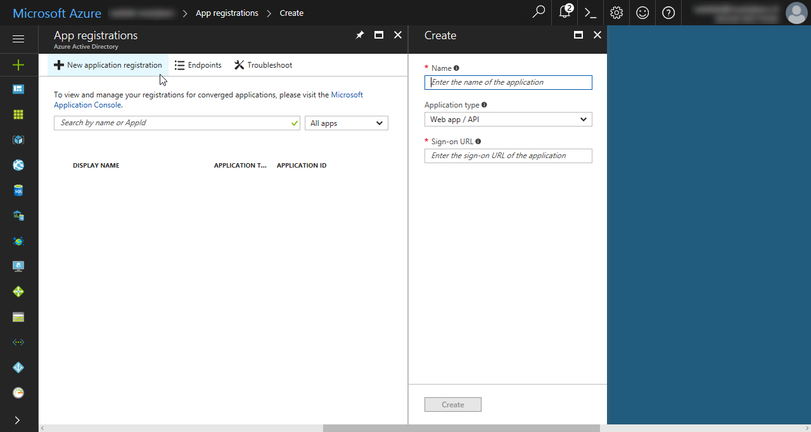

The first time the application is used, it prompts the user to grant it the necessary permissions. This is often referred to as consent flow. After it's approved, the application can then request access tokens for the specific resources and communicate with them securely.

#### Considerations when using ADAL JS to communicate with APIs secured with Azure AD

ADAL JS has been designed to be used with single-page applications. As such, by default it doesn't work correctly when used with SharePoint Framework solutions. By [applying a patch](./call-microsoft-graph-from-your-web-part.md) however, it can be successfully used in SharePoint Framework projects.

When using ADAL JS and OAuth to access APIs secured with Azure AD, the authentication flow is facilitated by Azure. Any errors are handled by the Azure sign-in page. After the user has signed-in with her organizational account, the application tries to retrieve a valid access token. All errors that occur at this stage have to be explicitly handled by the developer of the application because retrieving access tokens is non-interactive and doesn't present any UI to the user.

Every client-side application that wants to use ADAL JS needs to be registered as an Azure AD application. A part of the registration information is the URL where the application is located. Because the application is fully client-side and is not capable of securely storing a secret, the URL is a part of the contract between the application and Azure AD to establish security. This requirement is problematic for SharePoint Framework solutions because developers cannot simply know upfront all URLs where a particular web part will be used. Additionally, at this moment, Azure AD supports specifying up to 10 reply URLs, which might not be sufficient in some scenarios.

Before a client-side application can retrieve an access token to a specific resource, it needs to authenticate the user to obtain the ID token which can then be exchanged for an access token. Even though SharePoint Framework solutions are hosted in SharePoint, where users are already signed in using their organizational accounts, the authentication information for the current user isn't available to SharePoint Framework solutions. Instead, each solution must explicitly request the user to sign in. This can be done either by redirecting the user to the Azure sign-in page or by showing a pop-up window with the sign-in page. The latter is less intrusive in the case of a web part, which is one of the many elements on a page. If there are multiple SharePoint Framework client-side web parts on the page, each of them manages its state separately and requires the user to explicitly sign in to that particular web part.

Retrieving access tokens required to communicate with APIs secured with Azure AD is facilitated by hidden iframes that handle redirects to Azure AD endpoints. There is a known limitation in Microsoft Internet Explorer where obtaining access tokens in OAuth implicit flow fails, if the Azure AD sign-in endpoints and the SharePoint Online URL are not in the same security zone. If your organization is using Internet Explorer, ensure that the Azure AD endpoint and SharePoint Online URLs are configured in the same security zone. To maintain consistency, some organizations choose to push these settings to end-users using group policies.

APIs secured with Azure AD cannot be accessed anonymously. Instead they require a valid credential to be presented by the application calling them. When using the OAuth implicit flow with client-side applications, this credential is the bearer access token obtained using ADAL JS. If you have built your SharePoint Framework solution using AngularJS, ADAL JS automatically ensures that you have a valid access token for the particular resource, and adds it to all outgoing requests executed by using the AngularJS `$http` service. When using other JavaScript libraries, you have to obtain a valid access token, and if necessary refresh it, and attach it to the outgoing web requests yourself.

### Access the API by leveraging SharePoint Online authentication cookie

An alternative approach to using ADAL JS for connecting to APIs secured with Azure AD is leveraging the existing authentication cookie for seamless authentication to the custom API.

#### How it works

When you sign in with your organizational account to SharePoint Online, an authentication cookie is set in your browser. This cookie is sent with every request to SharePoint allowing to work sites and documents. To use this cookie, to connect to a custom API secured with Azure AD, you place a hidden iframe on the page pointing to a URL where the API is hosted and which is also secured with Azure AD. After the browser tries to load this URL, it gets redirected to the Azure AD sign-in page because anonymous access is not allowed. Because you are already signed in with your organization account to access SharePoint, the authentication completed automatically, redirecting you back to the original URL. At this point, your browser has the Azure AD authentication cookie for accessing the custom API secured with Azure AD.

After placing the iframe on the page, you attach an `onload` event listener to it, which is triggered after the authentication flow completed. In this event listener, you set a flag indicating that authentication completed and you can now securely call the custom API. All web requests to your custom APIs should be delayed until this flag is set or they will fail.

```typescript
// ...

export default class LatestOrdersWebPart extends BaseClientSideWebPart<ILatestOrdersWebPartProps> {
  private remotePartyLoaded: boolean = false;
  private orders: IOrder[];

  public render(): void {
    this.domElement.innerHTML = `
    <div class="${styles.latestOrders}">
      <iframe src="https://contoso.azurewebsites.net/"
          style="display:none;"></iframe>
      <div class="ms-font-xxl">Recent orders</div>
      <div class="loading"></div>
      <table class="data" style="display:none;">
        <thead>
          <tr>
            <th>ID</th>
            <th>Date</th>
            <th>Region</th>
            <th>Rep</th>
            <th>Item</th>
            <th>Units</th>
            <th>Unit cost</th>
            <th>Total</th>
          </tr>
        </thead>
        <tbody>
        </tbody>
      </table>
    </div>`;

    this.context.statusRenderer.displayLoadingIndicator(
      this.domElement.querySelector(".loading"), "orders");

    this.domElement.querySelector("iframe").addEventListener("load", (): void => {
      this.remotePartyLoaded = true;
    });

    this.executeOrDelayUntilRemotePartyLoaded((): void => {
      // retrieve and render data
    });
  }

  private executeOrDelayUntilRemotePartyLoaded(func: Function): void {
    if (this.remotePartyLoaded) {
      func();
    } else {
      setTimeout((): void => { this.executeOrDelayUntilRemotePartyLoaded(func); }, 100);
    }
  }

  // ...
}
```

When executing AJAX requests in your web parts, you have to specify that the authentication cookie should be sent cross-domain. You can enable this by setting the **credentials** property of the web request to **include**. Without this, the request is blocked in the browser and you are not able to call the API.

```typescript
// ...

export default class LatestOrdersWebPart extends BaseClientSideWebPart<ILatestOrdersWebPartProps> {
    // ...

    private retrieveAndRenderData(): void {
        this.context.httpClient.get("https://contoso.azurewebsites.net/api/orders",
        HttpClient.configurations.v1, {
          credentials: "include"
        })
        .then((response: HttpClientResponse): Promise<IOrder[]> => {
          // ...
        });
    }

    // ...
}
```

To support this method, the custom API requires some specific configurations as well. First, it requires support for receiving credentials from cross-domain calls. This is done by setting the **Access-Control-Allow-Credentials** response header to **true**.

> [!IMPORTANT] 
> When using **Access-Control-Allow-Credentials**, you are allowed to specify only one origin.

Next, it needs to specify what origin is allowed to call the API. This is configured in the **Access-Control-Allow-Origin** response header.

How these headers should be configured exactly depends on the implementation of your API. If you use an Azure Function to build the API using Node.js for example, you would set these headers on the response object:

```js
context.res = {
    body: "response",
    headers: {
        "Access-Control-Allow-Credentials" : "true",
        "Access-Control-Allow-Origin" : "https://contoso.sharepoint.com"
    }
};
```

When using ASP.NET Web API, you would install the **Microsoft.AspNet.WebApi.Cors** NuGet package, call the `config.EnableCors()` method, and use the **EnableCors** attribute to set the header values:

```cs
[EnableCors("origins": "*", "headers": "*", "methods": "*", SupportsCredentials = true)]
public string Get() {
    return "response";
}
```

#### Benefits of using the SharePoint Online authentication cookie for seamless authentication

The most important benefit for using the SharePoint Online authentication cookie to connect to custom APIs secured with Azure AD is the fact that in this approach you don't need to register an Azure AD application for every web part. This frees you from having to manage reply URLs of pages where each web part is used and doesn't have the limitation of maximum 10 reply URLs per Azure AD application.

The authentication flow is handled seamlessly, and there is no user interaction required to complete. In comparison, when using ADAL JS, each web part is based on a different Azure AD application and requires the user to explicitly sign in to it.

#### Considerations when using the SharePoint Online authentication cookie for seamless authentication

From the functional point of view, using both ADAL JS and the SharePoint Online authentication cookie allows you to connect to APIs secured with Azure AD. There are, however, a few important differences between the two approaches that you should be aware of.

When using ADAL JS, before the client-side application retrieves an access token, it retrieves the identity token for the current user. This token contains information about the current user retrieved from Azure AD such as the user name or password. When using the authentication cookie, there is no identity token. Because you're working with SharePoint, this isn't really a limitation, since you can retrieve the same information about the current user from SharePoint.

ADAL JS allows you to connect to any API secured with Azure AD. When using the authentication cookie, the API must explicitly support receiving credentials from cross-domain calls. When designing APIs, you should take this requirement into account to ensure that you are able to use these APIs in SharePoint Framework solutions.

With both ADAL JS and the SharePoint Online authentication cookie, you can access APIs secured with Azure AD. But not all APIs support use of both methods. For example, to access Microsoft Graph, you need to have a valid OAuth access token with specific Microsoft Graph permissions. You can obtain this token by using ADAL JS but not by using a SharePoint Online authentication cookie.

When using the SharePoint Online authentication cookie to access APIs secured with Azure AD, no additional authorization information is being sent along with the request. This means, that by default, every user with a valid organizational account in Azure AD associated with the API can access the API. When building the API, you must take care of authorization to ensure that all API operations are performed by users with sufficient privileges.

Custom APIs are hosted outside of SharePoint Online and can be accessed by using cross-domain web requests. By default, web browsers don't include credentials when performing cross-domain AJAX requests. To connect to these secured APIs, you have to enable sending credentials with cross-domains explicitly for each outgoing web request.

### General considerations

Both ADAL JS and the method that uses the SharePoint Online authentication cookie use iframes for communicating with Azure AD. The reason for that are the redirects that are a part of the OAuth flow, and which cannot be automatically followed by AJAX requests. Microsoft Internet Explorer uses security zones to apply security policies to websites depending on the associated zone. For the scripts to be able to access information from an iframe, the resource in the iframe and the page hosting the iframe must be located in the same security zone. To ensure correct configuration, organizations can use group policies to distribute the settings consistently to their users.

## Build an API secured with Azure AD

Securing the access to an API with Azure AD isn't complex and requires just a few steps. The exact process varies depending on the implementation of your API. If you choose to use Azure Functions, you are able to configure the security through the Azure Portal. If you built your API by using the ASP.NET Web API and want to host it somewhere else than in Azure App Service, you need to extend the Web API's code to add authentication to it. Following is a step-by-step description of how you would build and configure an API secured with Azure AD by using both Azure Functions and ASP.NET Web API.

### Build the API using an Azure Function

Building APIs using Azure Functions offers you a number of benefits. First and foremost, it significantly simplifies the development and deployment process of the API. Azure Functions offer a rich set of configuration options. The only thing that you need to take care of is the actual API code. For everything else, from authentication to supporting Cross-Origin Resource Sharing (CORS) and documenting the API, you can use the Azure Portal.

Azure Functions are hosted in Azure App Service and benefit from many capabilities available in the underlying service. On top of securing the API by using a function or admin key, you can choose to enable Azure App Service security and protect your API by using Azure AD or one of the other available authentication providers. App Service Authentication can be configured via the Azure Portal and doesn't require any changes in the API code.

Following is how you would use Azure Functions to create an API secured with Azure AD and capable of being called from a cross-domain origin in a secured way.

#### Create a new Azure Function

1. In the Azure Portal, go to your Resource Group and add a Function App.

    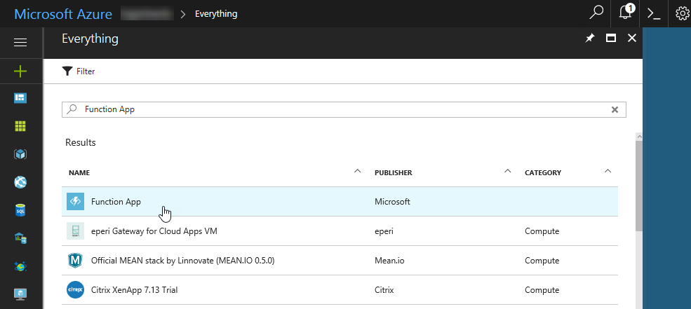

2. After the Function App has been provisioned, open the newly created Function App and add a new function by selecting the plus icon next to the Functions label.

    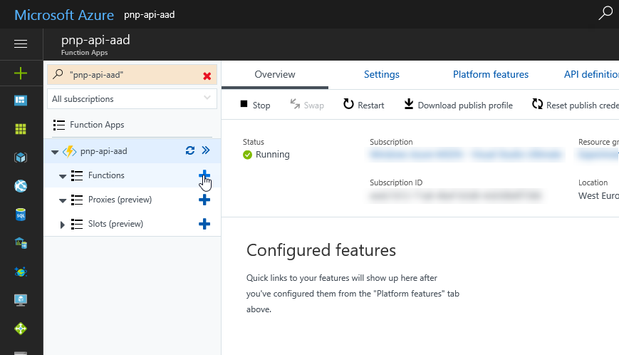

3. On the quick start screen, scroll to the **Get started on your own** section, and select the **Custom function** option.

    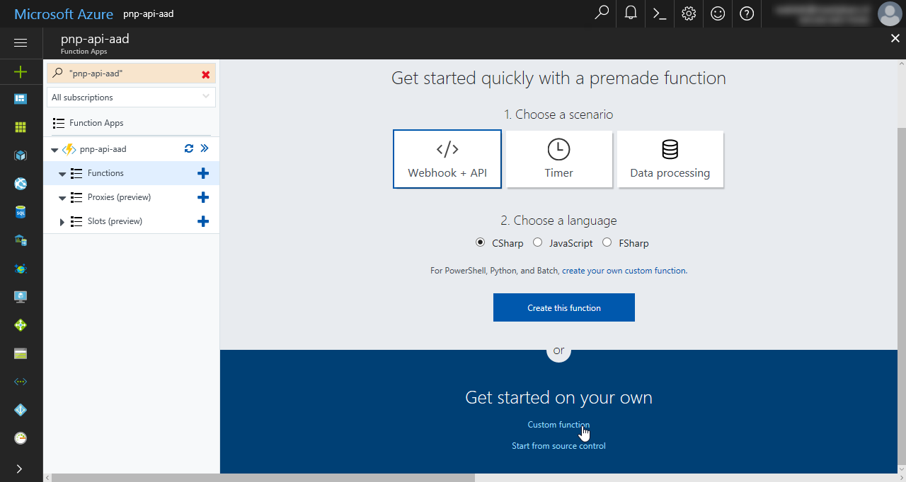

4. From the list of templates, select **HttpTrigger-JavaScript**. 

5. For the function name, enter **Orders**, and set the function authorization level to **Anonymous** because you will use Azure AD to secure access to the Azure Function. Confirm your selection by selecting **Create**.

    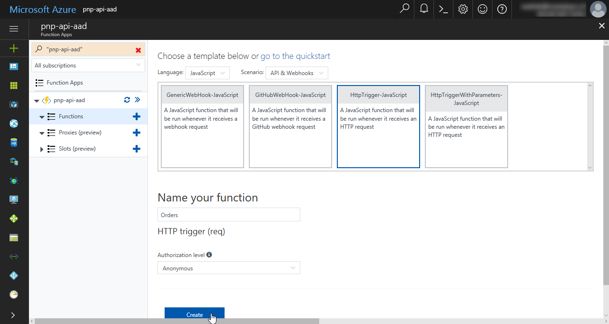

#### Implement API code

1. Replace the function's code with the following snippet:

    ```js
    module.exports = function (context, req) {
        context.res = {
            body: [
                {
                id: 1,
                orderDate: new Date(2016, 0, 6),
                region: "east",
                rep: "Jones",
                item: "Pencil",
                units: 95,
                unitCost: 1.99,
                total: 189.05
                },
                {
                id: 2,
                orderDate: new Date(2016, 0, 23),
                region: "central",
                rep: "Kivell",
                item: "Binder",
                units: 50,
                unitCost: 19.99,
                total: 999.50
                },
                {
                id: 3,
                orderDate: new Date(2016, 1, 9),
                region: "central",
                rep: "Jardine",
                item: "Pencil",
                units: 36,
                unitCost: 4.99,
                total: 179.64
                },
                {
                id: 4,
                orderDate: new Date(2016, 1, 26),
                region: "central",
                rep: "Gill",
                item: "Pen",
                units: 27,
                unitCost: 19.99,
                total: 539.73
                },
                {
                id: 5,
                orderDate: new Date(2016, 2, 15),
                region: "west",
                rep: "Sorvino",
                item: "Pencil",
                units: 56,
                unitCost: 2.99,
                total: 167.44
                }],
            headers: {
                "Access-Control-Allow-Credentials" : "true",
                "Access-Control-Allow-Origin" : "https://contoso.sharepoint.com"
            }
        };
        context.done();
    };
    ```

2. Change the URL specified in the **Access-Control-Allow-Origin** header to match the URL of your SharePoint Online tenant from which you are calling this API.

3. Save the changes to the function's code by selecting **Save**.

    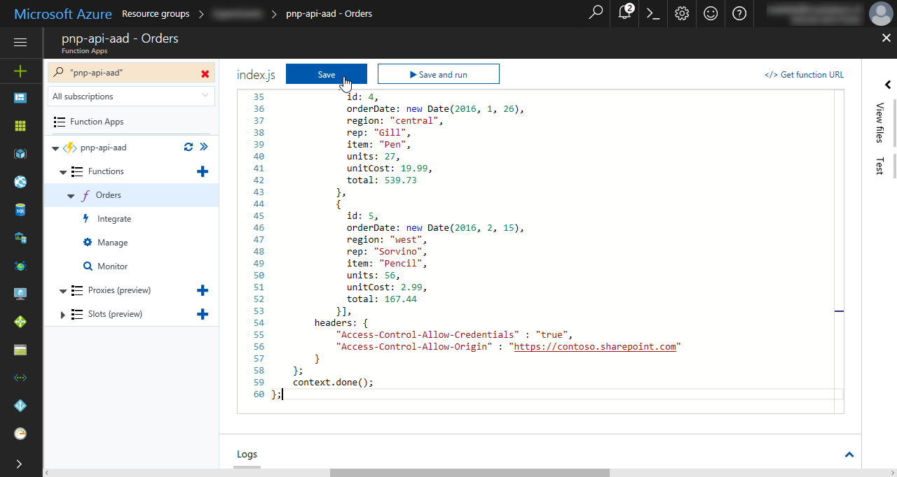

#### Change CORS settings

Azure Functions are hosted in Azure App Service, which allows you to configure its Cross-Origin Resource Sharing (CORS) settings through the Azure Portal. While this is convenient, if configured through the portal, it cannot be used in combination with the **Access-Control-Allow-Credentials** header, which is required by the API to accept authentication cookies coming from another origin. For the client-side authentication to work correctly, CORS settings of the Azure App Service must be cleared.

1. In the Function App, select your Azure Function, and navigate to the **Platform features** blade.

    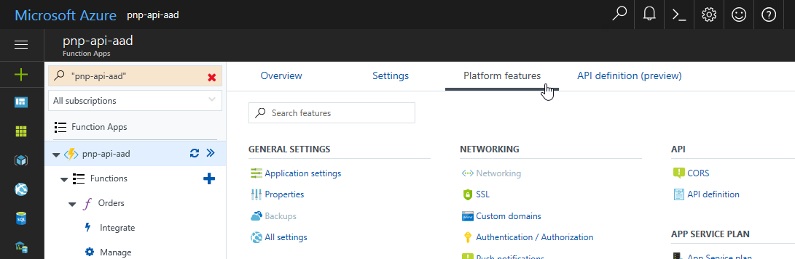

2. In the **API** section, select the **CORS** option.

    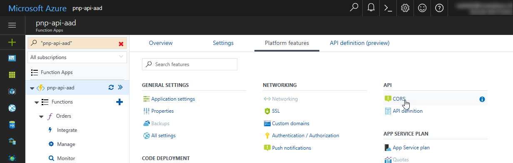

3. On the **CORS settings** blade, delete all entries so that the CORS configuration is empty.

    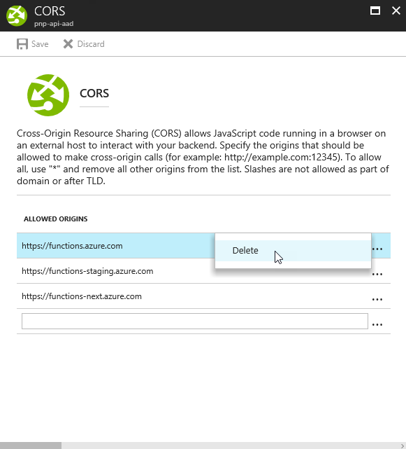

4. Confirm the deletion by selecting **Save**.

    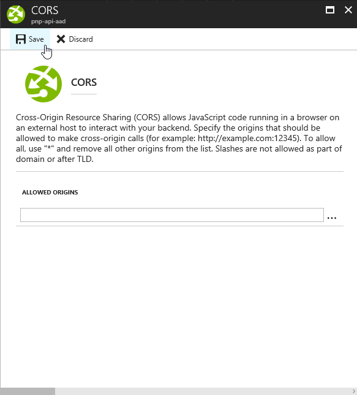

#### Enable App Service Authentication

1. In the Function App settings, go back to the **Platform features** blade. 

2. In the **Networking** section, select the **Authentication / Authorization** option.

    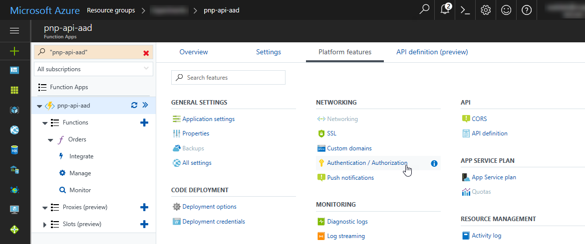

3. Enable App Service Authentication by setting the **App Service Authentication** toggle to **On**.

    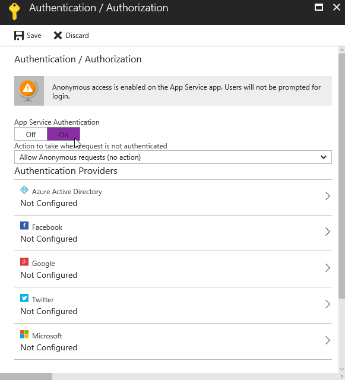

4. To disallow anonymous access to the API and force authentication using Azure AD, set the value of the **Action to take when request is not authenticated** list to **Log in with Azure Active Directory**.

    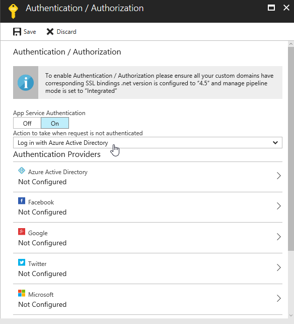

5. In the list of authentication providers, select **Azure Active Directory** to configure it.

    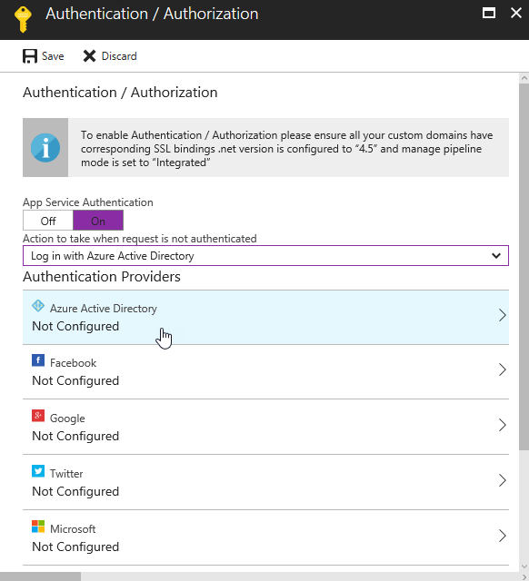

6. On the **Active Directory Authentication** blade, set the **Management mode** to **Express**, and create a new Azure AD app.

    > [!IMPORTANT] 
    > When using the Express configuration mode, the Azure Portal creates a new Azure AD application from the same directory where the Function App is located. If the Function App is hosted in a different Azure subscription with a different directory, you should use the advanced mode instead, and specify the ID of the directory and application that should be used to secure access to the API.
    >
    > When using existing Azure AD applications, configure the application to accept credentials from a single tenant only. Configuring the application as multi-tenant allows any user with a valid organization or personal account to connect to your API.
    >
    > Using an Azure AD application to secure the access to your API only accounts for authentication. When building your API, you should also authorize requests in your API's code to ensure that only users with sufficient privileges are using the API.

7. Because the app is only meant to secure access to the Azure Function, it doesn't require any additional permissions. Confirm the selection by selecting **OK**.

    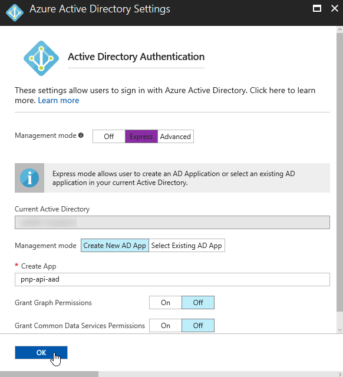

8. When the **Azure Active Directory** blade closes, back on the **Authentication / Authorization** blade, select **Save** to confirm all changes to authentication settings.

    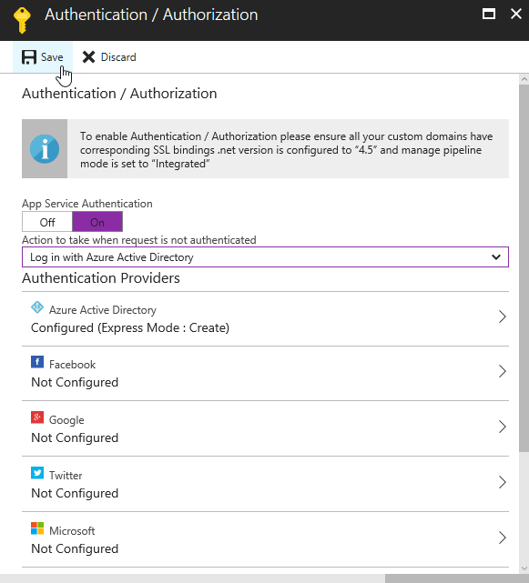

9. If you try to navigate to your API URL in a new private window, you should be prompted to sign in by using your Azure AD account.

    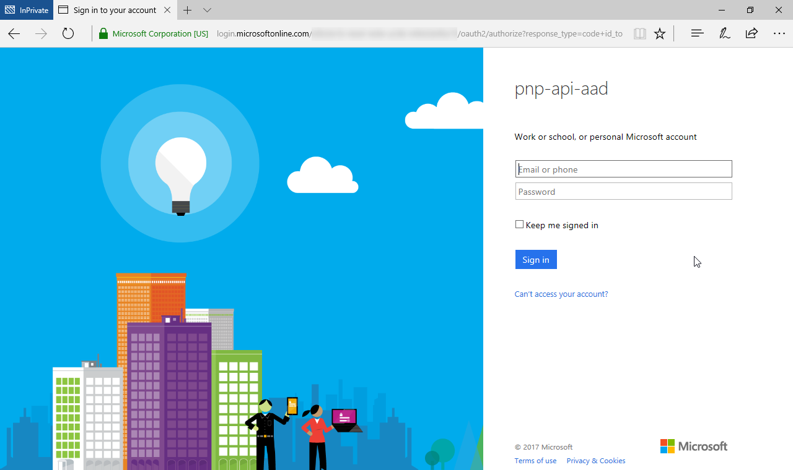

At this point, the API is ready to be called securely from a SharePoint Framework client-side web part by using the authentication cookie.

### Build the API by using ASP.NET Web API

Another way to implement the API is by using the ASP.NET Web API. Compared to using Azure Functions to build the API, the ASP.NET Web API requires significantly more work. Not only do you have to set up a complete project for it, but you also have to think about where the API will be deployed. On the other hand, using the ASP.NET Web API offers you more flexibility and allows you to deploy the API to different platforms such as Azure App Service, Docker containers, other cloud providers, or even on your infrastructure.

Following are steps to build an API using the ASP.NET Web API, deploy it to Azure App Service, and secure it by using Azure App Service Authentication. Later, you will extend the API to perform the authentication by itself so that it can be deployed to other platforms as well.

#### Create a new ASP.NET Web API project

1. In Visual Studio, on the **File** menu, select the **New / Project** option. 

2.  In the **New Project** dialog box, select the Visual C# Web templates, and from the list of available templates, select the **ASP.NET Web Application** template.

    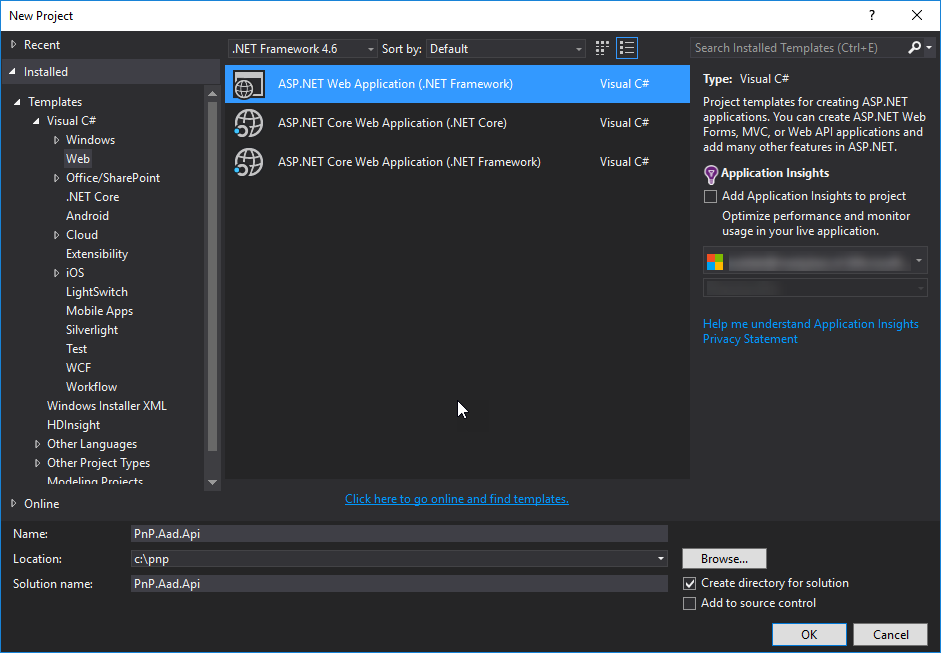

3. As the type of ASP.NET Web Application project, select **Web API**.

    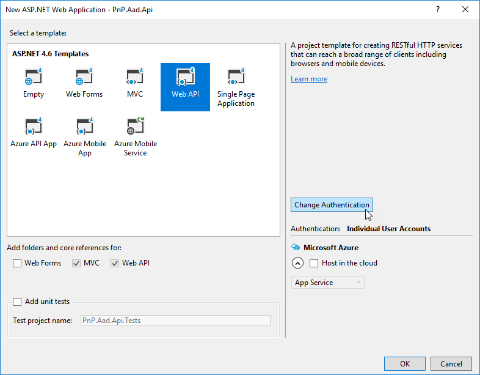

4. Because you will use Azure App Service Authentication to secure the access to the API, select the **Change Authentication** button, and then select the **No Authentication** option.

    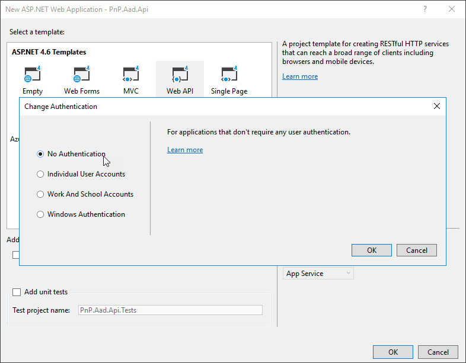

5. Confirm your choice by selecting **OK**.

6. Visual Studio allows you to easily deploy your Web API to Azure App Service. To benefit from this capability, in the **New ASP.NET Web Application** dialog box, in the **Microsoft Azure** section, select the **Host in the cloud** check box, and in the list, select the **App Service** option.

    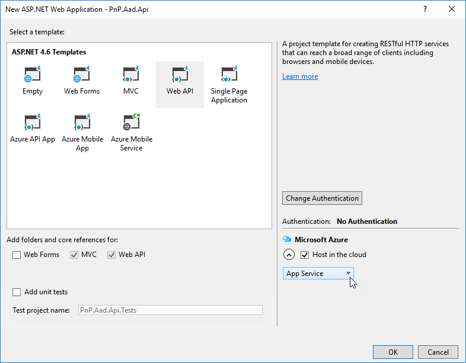

7. In the **Create App Service** dialog box, specify the name for the web app to be created, and select the Azure **Subscription**, **Resource Group**, and **App Service Plan** that you want to use for this application.

    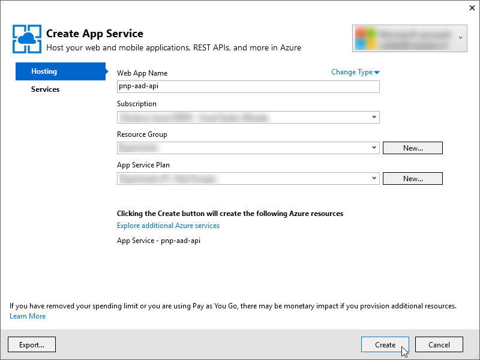

8. Confirm your choice by selecting **Create**. At this point, Visual Studio creates a new Azure Web App to host your web application.

#### Add support for CORS

By default, APIs created using the ASP.NET Web Application project template don't support CORS and cannot be called by client-applications hosted on different domains. 

1. To add support for CORS to your Web API, right-click the project, and from the context menu, select the **Manage NuGet Packages** option.

    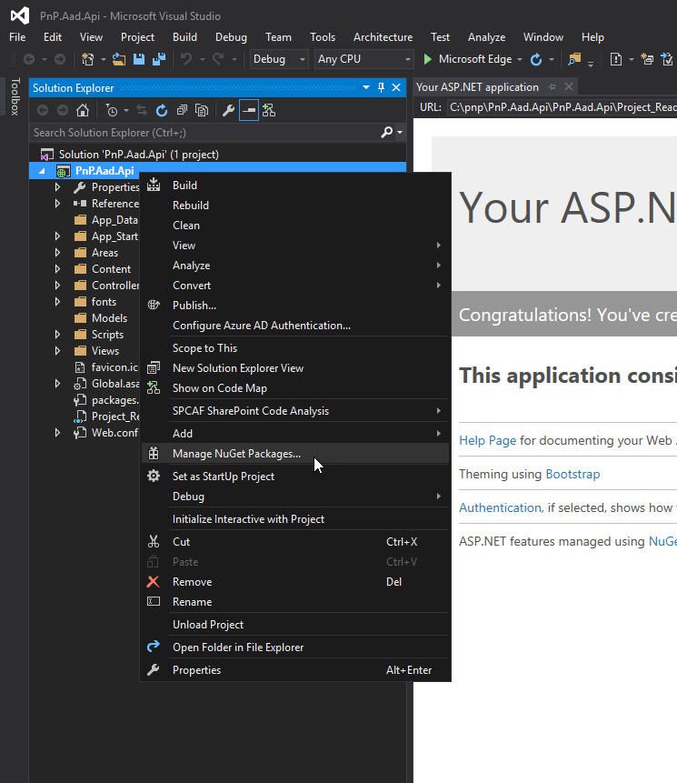

2. On the **Manage NuGet Packages** tab, search for a package named **Microsoft.AspNet.WebApi.Cors** and install it in your project.

    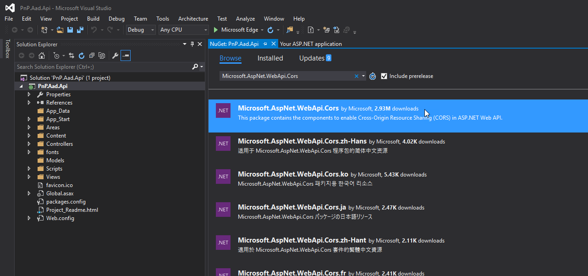


#### Add data model

In the project, define a model that represents the data returned by the API. In the **Models** folder, add a new class and name it **Order**. Paste the following code into the newly created file:

```cs
    using Newtonsoft.Json;
    using Newtonsoft.Json.Converters;
    using System;

    namespace PnP.Aad.Api.Models {
        public class Order {
            [JsonProperty(PropertyName = "id")]
            public int Id { get; set; }
            [JsonProperty(PropertyName = "orderDate")]
            public DateTime OrderDate { get; set; }
            [JsonConverter(typeof(StringEnumConverter))]
            [JsonProperty(PropertyName = "region")]
            public Region Region { get; set; }
            [JsonProperty(PropertyName = "rep")]
            public string Rep { get; set; }
            [JsonProperty(PropertyName = "item")]
            public string Item { get; set; }
            [JsonProperty(PropertyName = "units")]
            public uint Units { get; set; }
            [JsonProperty(PropertyName = "unitCost")]
            public double UnitCost { get; set; }
            [JsonProperty(PropertyName = "total")]
            public double Total { get; set; }
        }

        public enum Region {
            East,
            Central,
            West
        }
    }
```

#### Add Orders API

Add an API that returns the information about the latest orders. In the **Controllers** folder, create a new class and name it **OrdersController**. Paste the following code into the newly created file:

```cs
using PnP.Aad.Api.Models;
using System;
using System.Collections.Generic;
using System.Web.Http;

namespace PnP.Aad.Api.Controllers {
    public class OrdersController : ApiController {
        private List<Order> orders = new List<Order> {
            new Order {
                Id = 1,
                OrderDate = new DateTime(2016, 1, 6),
                Region = Region.East,
                Rep = "Jones",
                Item = "Pencil",
                Units = 95,
                UnitCost = 1.99,
                Total = 189.05
            },
            new Order {
                Id = 2,
                OrderDate = new DateTime(2016, 1, 23),
                Region = Region.Central,
                Rep = "Kivell",
                Item = "Binder",
                Units = 50,
                UnitCost = 19.99,
                Total = 999.50
            },
            new Order {
                Id = 3,
                OrderDate = new DateTime(2016, 2, 9),
                Region = Region.Central,
                Rep = "Jardine",
                Item = "Pencil",
                Units = 36,
                UnitCost = 4.99,
                Total = 179.64
            },
            new Order {
                Id = 4,
                OrderDate = new DateTime(2016, 2, 26),
                Region = Region.Central,
                Rep = "Gill",
                Item = "Pen",
                Units = 27,
                UnitCost = 19.99,
                Total = 539.73
            },
            new Order {
                Id = 5,
                OrderDate = new DateTime(2016, 3, 15),
                Region = Region.West,
                Rep = "Sorvino",
                Item = "Pencil",
                Units = 56,
                UnitCost = 2.99,
                Total = 167.44
            }
        };

        public IEnumerable<Order> Get() {
            return orders;
        }
    }
}
```

#### Extend the API with support for CORS

Even though you have installed support for CORS in your project, it's not being actively used yet. If you call the newly created Orders API from a client application hosted on another domain, you get a CORS error and the request fails. 

1. For an API to support CORS, it has to be decorated with the **EnableCors** attribute.

    ```cs
    using PnP.Aad.Api.Models;
    using System;
    using System.Collections.Generic;
    using System.Web.Http;
    using System.Web.Http.Cors;

    namespace PnP.Aad.Api.Controllers {
        public class OrdersController : ApiController {
            private List<Order> orders = new List<Order> {
                // ...
            };

            [EnableCors("*", "*", "GET", SupportsCredentials = true)]
            public IEnumerable<Order> Get() {
                return orders;
            }
        }
    }
    ```

2. Open the **.\App_Start\WebApiConfig.cs** file, and paste the following code:

    ```cs
    using System.Web.Http;

    namespace PnP.Aad.Api {
        public static class WebApiConfig {
            public static void Register(HttpConfiguration config) {
                // Web API configuration and services

                // Web API routes
                config.MapHttpAttributeRoutes();

                config.EnableCors();

                config.Routes.MapHttpRoute(
                    name: "DefaultApi",
                    routeTemplate: "api/{controller}/{id}",
                    defaults: new { id = RouteParameter.Optional }
                );
            }
        }
    }
    ```

At this point, the API is code complete and can be published to the Azure Web App.

#### Publish the API to Azure Web App

1. In Visual Studio, right-click the project, and from the context menu, select the **Publish** option.

    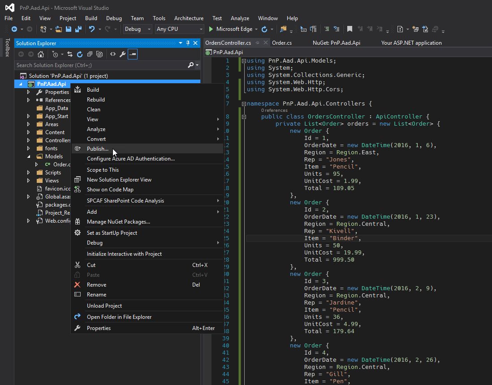

2. In the **Publish** dialog box, verify that all the information is correct, and select **Publish** to start the publishing process.

    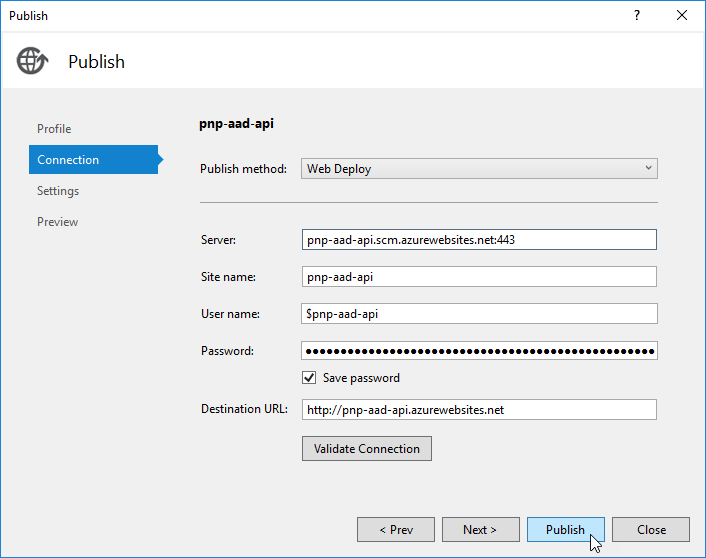

3. After the publishing process completes, navigate in your web browser to the API URL, for example, `http://pnp-aad-api.azurewebsites.net/api/orders`. At this point, the API is not secured and can be accessed by anonymous users.

    

#### Secure the API using Azure App Service

1. To secure the API using Azure AD, go to the Azure Portal and open the Web App hosting your API. 

2. From the **Settings** group, select the **Authentication / Authorization** option.

    

3. To enable authentication for your Web App, set the **App Service Authentication** toggle to **On**.

    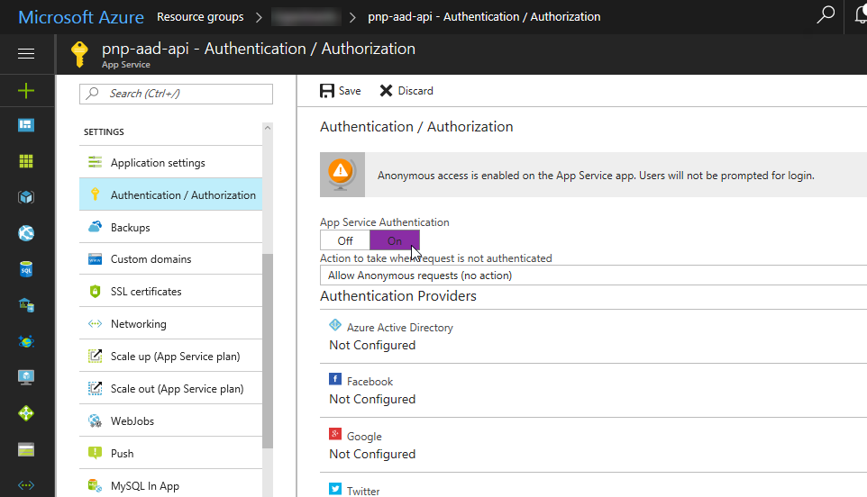

4. To disallow anonymous access to the API, in the **Action to take when request is not authenticated** listn, select the **Log in with Azure Active Directory** option.

    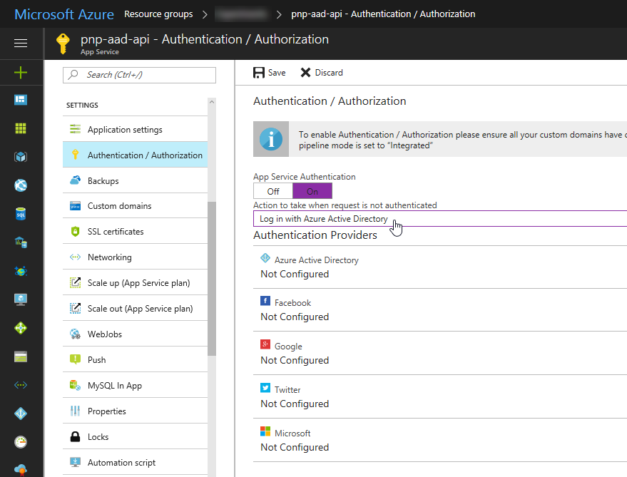

5. Configure Azure Active Directory authentication from the list of authentication providers by selecting **Azure Active Directory**.

    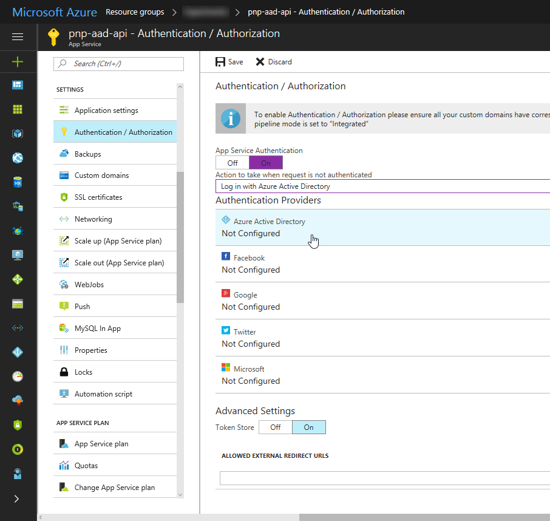

6. On the **Active Directory Authentication** blade, set the **Management mode** to **Express** and create a new Azure AD app.

    > [!IMPORTANT] 
    > When using the Express configuration mode, the Azure Portal creates a new Azure AD application from the same directory where the Function App is located. If the Function App is hosted in a different Azure subscription with a different directory, you should use the advanced mode instead, and specify the ID of the directory and application that should be used to secure access to the API.
    >
    > When using existing Azure AD applications, configure the application to accept credentials from a single tenant only. Configuring the application as multi-tenant allows any user with a valid organization or personal account to connect to your API.
    >
    > Using an Azure AD application to secure the access to your API only accounts for authentication. When building your API, you should also authorize requests in your API's code to ensure that only users with sufficient privileges are using the API.

7. Because the app is only meant to secure access to the Azure Function, it doesn't require any additional permissions. Confirm the selection by selecting **OK**.

    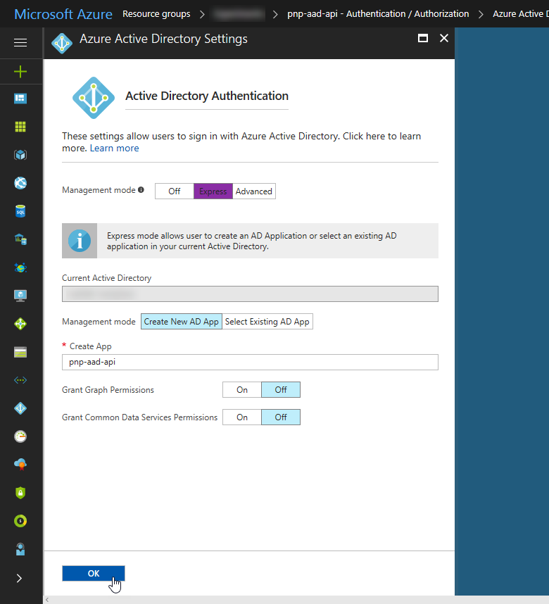

8. When the **Azure Active Directory** blade closes, back on the **Authentication / Authorization** blade, select **Save** to confirm all changes to authentication settings.

    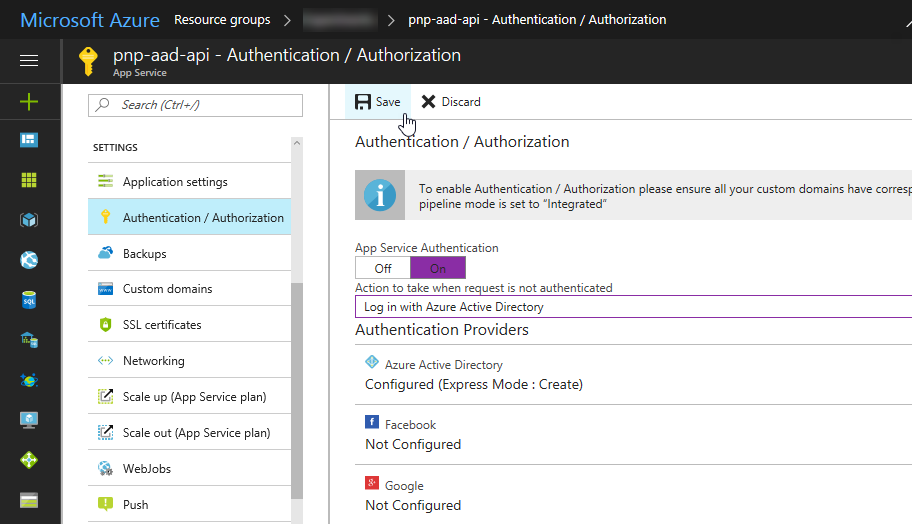

9. If you try to navigate to your API URL in a new private window, you should be prompted to sign in by using your Azure AD account.

    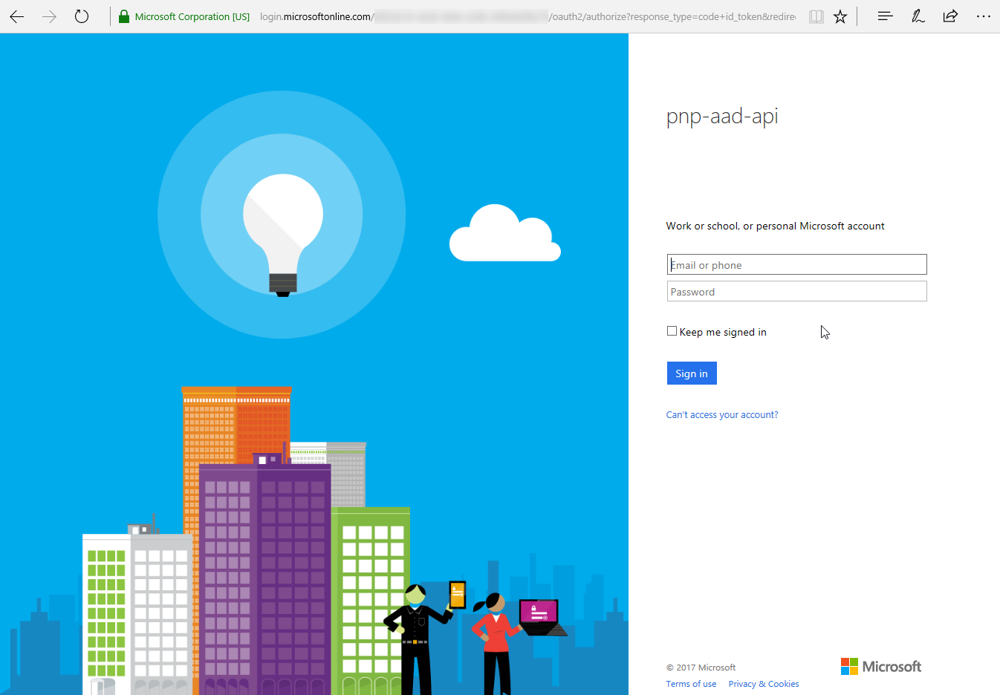

At this point, the API is ready to be called securely from a SharePoint Framework client-side web part by using the authentication cookie.

#### Secure the API using OpenID

If you want to deploy your ASP.NET Web API project to other location than Azure App Service and want it to be secured with Azure AD, you can't rely on App Service Authentication. Instead, you have to extend the web application to require its users to authenticate before they can use the API.

##### Disable anonymous access to all resources

1. Assuming you want all resources secured, open the **.\App_Start\FilterConfig.cs** file, and paste the following code:

    ```cs
    using System.Web.Mvc;

    namespace PnP.Aad.Api {
        public class FilterConfig {
            public static void RegisterGlobalFilters(GlobalFilterCollection filters) {
                filters.Add(new HandleErrorAttribute());
                filters.Add(new AuthorizeAttribute());
            }
        }
    }
    ```

2. To require authentication for all APIs, open the **.\App_Start\WebApiConfig.cs** file, and paste the following code:

    ```cs
    using System.Web.Http;

    namespace PnP.Aad.Api {
        public static class WebApiConfig {
            public static void Register(HttpConfiguration config) {
                // Web API configuration and services

                // Web API routes
                config.MapHttpAttributeRoutes();

                config.EnableCors();
                config.Filters.Add(new AuthorizeAttribute());

                config.Routes.MapHttpRoute(
                    name: "DefaultApi",
                    routeTemplate: "api/{controller}/{id}",
                    defaults: new { id = RouteParameter.Optional }
                );
            }
        }
    }
    ```

3. If you try to access either the API or any other resource in your web application, you get a 401 Unauthorized response.

    

At this point, the web application requires that all requests to its resources are authenticated, but it doesn't start the Azure AD sign-in flow. 

In the following steps, you extend the web application so that it redirects users to the Azure AD sign-in page, if they weren't previously authenticated.

##### Register Azure AD application

To secure an API with Azure AD, you need to register an Azure AD application. This application is then referenced in the web application project and used by the OWIN middleware to secure the access to your API with Azure AD.

1. If you don't have an existing Azure AD application yet, you can create one in the Azure Portal, by navigating to the **Azure Active Directory** blade.

    > [!IMPORTANT] 
    > The Azure AD application used to secure the API should be created in the same Azure Active Directory that is used by your organization to access Office 365.

    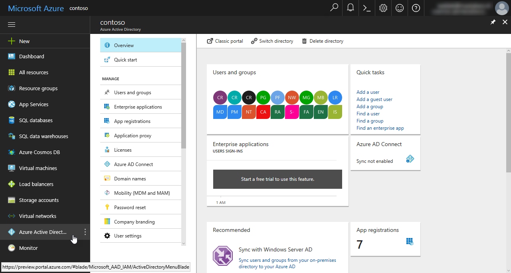

2. On the **Azure Active Directory** blade, navigate to the **App registrations** blade.

    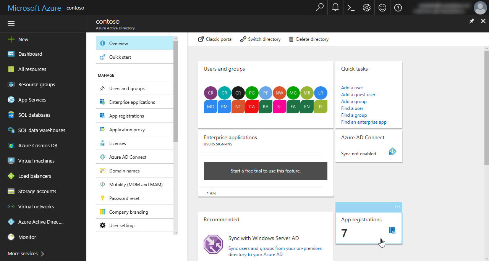

3. On the **App registrations** blade, select the **New application registration** button to register a new Azure AD application.

    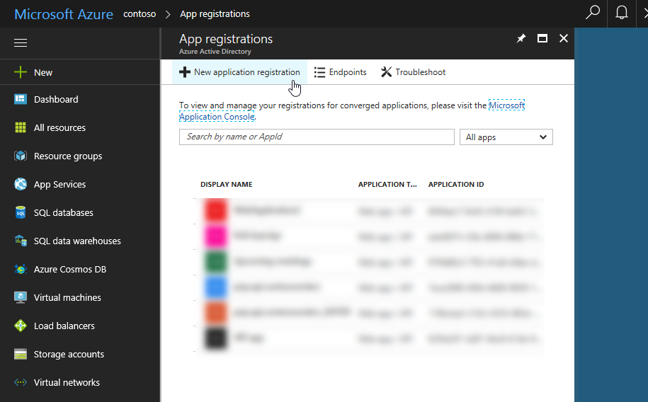

4. On the **Create** blade, provide the information about your application, and confirm the creation by selecting **Create**.

    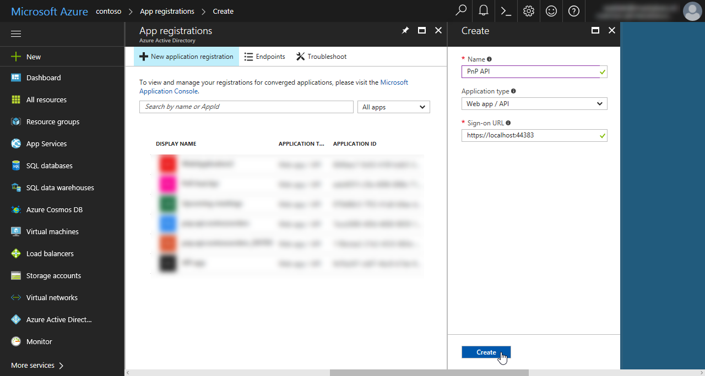

5. After the application registration is successfully created, select it in the list to view its details.

    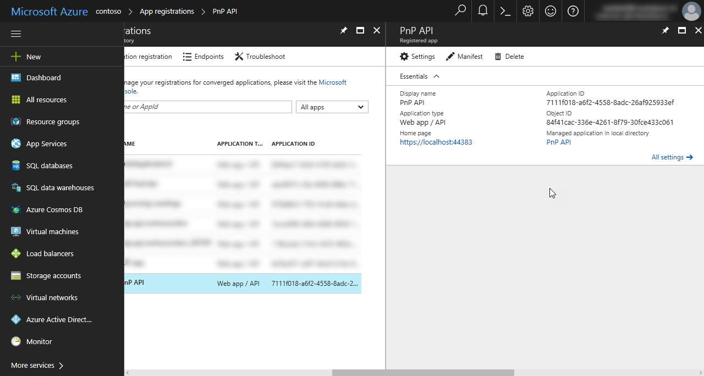

6. From the application registration information, copy the **Application ID** and store it because you will need it when you configure Azure AD authentication for your web application.

##### Redirect anonymous requests to Azure AD sign-in page

1. In Visual Studio, rightclick the project, and from the context menu, select the **Manage NuGet Packages** option. 

2. In the **Manage NuGet Packages** window, add the following packages to your project:

    - Microsoft.Owin.Host.SystemWeb
    - Microsoft.Owin.Security.Cookies
    - Microsoft.Owin.Security.OpenIdConnect

3. In the root directory of your project, add a new class named **Startup**, and paste the following code:

    ```cs
    using Owin;

    namespace PnP.Aad.Api {
        public partial class Startup
        {
            public void Configuration(IAppBuilder app)
            {
                ConfigureAuth(app);
            }
        }
    }
    ```

4. In the **App_Start** folder, create a new class named **Startup.Auth**, and paste the following code:

    ```cs
    using Microsoft.Owin.Security;
    using Microsoft.Owin.Security.Cookies;
    using Microsoft.Owin.Security.OpenIdConnect;
    using Owin;
    using System.Configuration;

    namespace PnP.Aad.Api {
        public partial class Startup {
            // For more information on configuring authentication, please visit http://go.microsoft.com/fwlink/?LinkId=301864
            public void ConfigureAuth(IAppBuilder app) {
                app.SetDefaultSignInAsAuthenticationType(CookieAuthenticationDefaults.AuthenticationType);

                app.UseCookieAuthentication(new CookieAuthenticationOptions());

                app.UseOpenIdConnectAuthentication(
                    new OpenIdConnectAuthenticationOptions {
                        ClientId = ConfigurationManager.AppSettings["ida:ClientId"],
                        Authority = $"https://login.microsoftonline.com/{(ConfigurationManager.AppSettings["ida:Tenant"])}",
                        PostLogoutRedirectUri = ConfigurationManager.AppSettings["ida:PostLogoutRedirectUri"],
                    });
            }
        }
    }
    ```

5. In Visual Studio, open the **Web.config** file, and in the **appSettings** section, add the following elements:

    ```xml
    <add key="ida:Tenant" value="contoso.onmicrosoft.com" />
    <add key="ida:ClientId" value="eeb40f1f-c5fa-4096-896b-71c77d459e21" />
    <add key="ida:PostLogoutRedirectUri" value="https://localhost:44320/" />
    ```

    - The value of the **ida:Tenant** key is the name of the Azure AD where the Azure AD app used to secure the API is defined. 
    - **ida:ClientId** specifies the ID of the Azure AD application used to secure the API. 
    - The URL specified in the **ida:PostLogoutRedirectUri** property is where Azure AD would redirect to after signing out of your application, which isn't used in this case.

This concludes the configuration process. If you start your web application, before you are able to access any of its resources, you are prompted to sign in with your Azure AD account. To ensure that only authorized users are accessing the particular API, you should implement authorization in your custom APIs. You can do that by retrieving the user name from the `RequestContext.Principal.Identity` property, and verifying it against your security matrix.

## See also

- [Call custom APIs secured with Azure Active Directory without ADAL JS (code sample)](https://github.com/SharePoint/sp-dev-fx-webparts/tree/master/samples/aad-api-spo-cookie)
